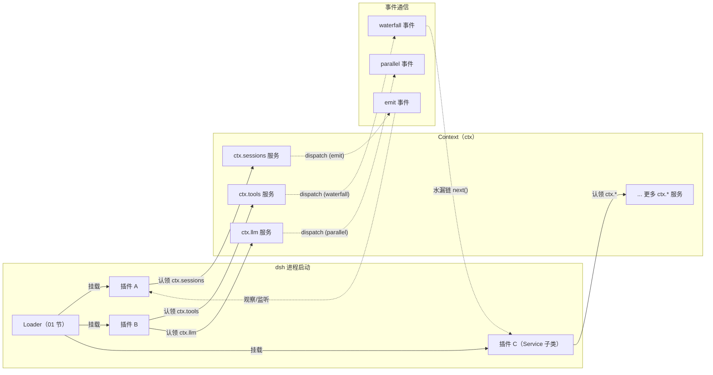
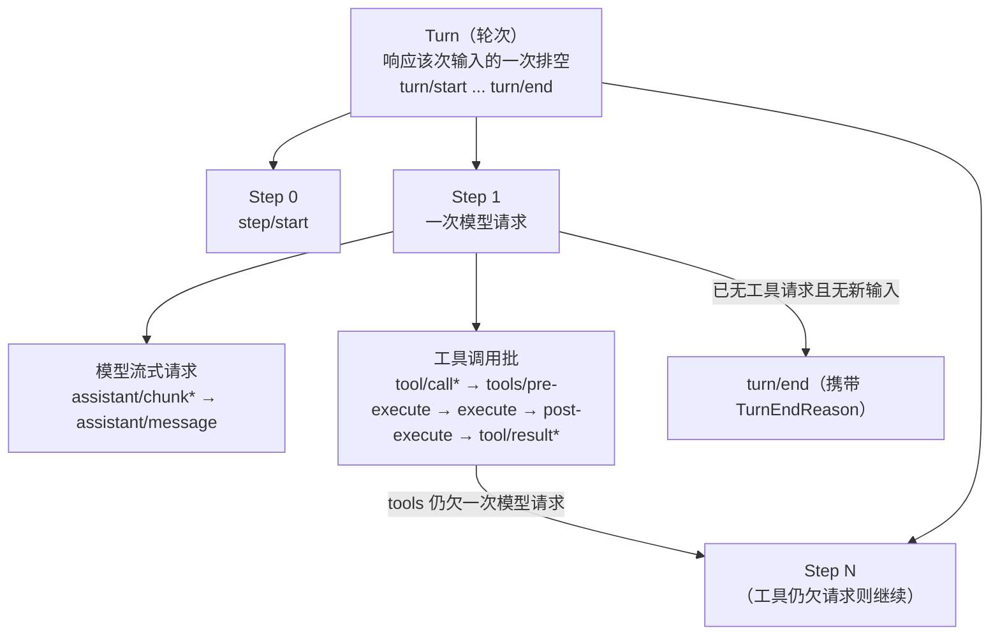
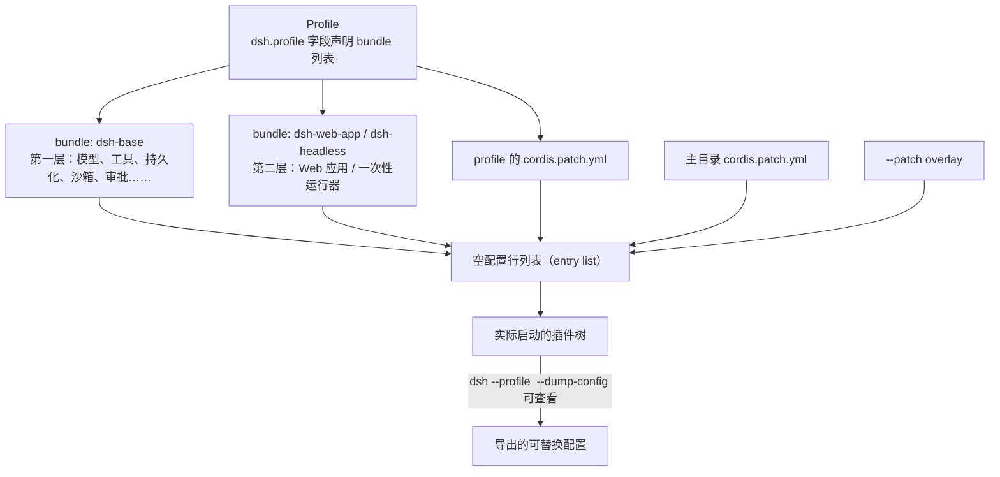

# 00 概念总览（唯一概念定义源 L0）

> 本文档是全部架构分析文档的**唯一定义源（L0）**，定义所有维度文档共用的基础概念。
> 概念纪律（Convention）：任何文档里出现的术语，都必须能追溯到 L0，或追溯到某篇维度文档的「概念约定」节。禁止在分析正文中突然自造概念。本文不介绍某个维度专属的机制细节——那些归各维度文档负责（见[概念登记表](#概念登记表)）。
>
> **阅读模式（全系列约定）**：本系列文档的每一节都遵循同一个讲述顺序——**先能力，后机制**。先用你作为 AI Agent 用户能直接感知的现象、以及你作为插件作者要动手做的事情来讲"这是什么东西、能干什么、怎么用"；然后才讲内部大概如何运作；讲机制时始终回扣"这对应外面的哪个可感知功能"。每个概念/小节按需携带三种镜头：**【你会看到】**（用户在聊天界面/CLI 上感知到的现象）、**【模型看到】**（那一刻真正进入模型请求的内容）、**【插件作者】**（想实现某功能时的最小动手路径）。直观描述是锚点不是定义：术语的正式定义以下文为准。

---

## 0. 本维度分析问题

本文不分析某个具体架构面，而是为后续 9 个维度文档提供：

1. 一套**无歧义的基础术语**，各维度文档引用时不必重复定义。
2. 一个**概念登记表**，防止并行产出文档时出现"同一概念两个定义"或"引用未定义概念"。
3. 三幅奠基性的结构图：运行模型（插件/上下文/服务/事件）、执行层次（turn/step）、配置装配（profile/bundle/patch）。

先用一段白话把整个产品说清楚，后续所有概念都是它的展开：

> **dsh 是一个"一切皆插件"的 AI 编程助手宿主。** 你在终端或网页里跟一个助手对话：你发消息，它思考、调工具（跑命令、改文件、搜网页）、给你回答——这套"读消息→思考→调工具→再思考→回答"的循环本身是一个插件；它调用的每个工具是插件；背后的模型接口、会话记录、权限审批也全是插件。正因如此：想给助手加能力（一个新工具、一种新模型、一道安全策略），你**写一个新插件挂上去**，而不需要改任何现有代码；想换掉某块能力（本地文件系统换成云端沙箱），你**换一个插件**，其余照跑。改配置甚至不用重启——插件树支持运行态热重组。

所有拓扑图均为 Mermaid，便于在支持 Mermaid 的 Markdown 阅读器中直接渲染。

---

## 1. 前置概念

本文是 L0，前置概念为空。所有概念在本节之后定义。

---

## 2. 概念约定（本文引入的术语）

本节每个词条的写法：**一段直观描述（它对应你熟悉的什么体验）→ 正式定义（工程契约）**。

### 2.1 框架底层：Cordis 插件模型

> 本节词条是**上游 Cordis 框架**（vendored 开源框架，cordiverse 生态）概念的产品化转述。框架原生词汇的完整说明、源码锚点、以及「dsh 术语 ↔ 框架术语」逐条对照，见 [00a-Cordis插件框架](00a-Cordis插件框架.md)；后续文档引用框架概念以 00a 为登记处。

**插件（Plugin）**

直观：产品中"每一个可运行的部件都是插件"——包括 Agent 循环、工具注册表、模型适配器、会话日志这些听起来像"内核"的东西。**【你会看到】**`dsh --profile headless "任务"` 和 `dsh --profile web` 是两个不同的插件组合：同一个产品内核，装了不同的插件就变成命令行一次性运行器或网页应用；改 `cordis.patch.yml` 保存后不用重启，界面行为即时变化（插件树热重组）。**【插件作者】**回答三个入门问题——*怎么运行？* 插件在启动时被 Loader 挂载进进程，也可以运行态动态挂载（自我修改能力）；*怎么注册？* 两条路：在 `cordis.yml`/patch 里加一行（声明式），或代码里 `ctx.plugin(xxx)`（编程式）；*有没有注册点？* 有，且全部可逆：`ctx.effect()`、`ctx.on()`、各注册表的 `register()`——你贡献的每样东西（工具、提示词段、监听器、后端）都从这些口子进入，卸载时自动拆除。*想实现什么功能该注册什么？* 这是各维度文档的主题：加工具→`ctx.tools`（04/05），加模型→`ctx.llm`（07），加安全策略→对应事件瀑布（08）。

正式定义：实现 Cordis `Service` 契约的对象——既可以是一个带 `inject` / `apply(ctx)` 字段的函数，也可以是一个 `Service` 子类，由 Cordis 把其生命周期挂载进当前上下文。它是 dsh 装配与扩展的最基本单位。

**上下文（Context，`ctx`）**

直观：插件世界的"电话总机"。每个能力在总机上占一个分机号（`ctx.tools`、`ctx.llm`、`ctx.sessions`），要用谁就拨号，不需要知道对面是谁实现的——所以"换供应商"不需要改使用方的代码。**【插件作者】**你写插件时拿到的第一个参数就是 `ctx`，你的一切注册和查找都通过它。

正式定义：一个服务的仓库。服务在上下文中认领一个稳定的 `ctx.<key>`（如 `ctx.tools`、`ctx.llm`、`ctx.sessions`）；其他插件通过 key 查找服务，而不是 import 具体实现。这是依赖解耦的第一层机制。

**服务（Service）**

直观：占着某个分机号的能力单元。**【你会看到】**界面上"模型下拉列表里多了一个供应商"——那就是一个新服务实现挂到了 `ctx.llm` 这个号上。

正式定义：在 `ctx` 上占有唯一 `ctx.<key>` 的能力单元。用类型声明（`@deepseek-ai/cordis` 的 `Service` 子类）或函数插件注册。服务是"能力缝（Seam，见 2.5）"三角色中 Service Definition / Service Provider 的载体。

**注入（inject）**

直观：插件的"我要等谁到位才能启动"。像装配线上的工位：零件（依赖的服务）没到就不开工。因此**书写插件列表不需要关心顺序**——顺序由依赖自动解决。

正式定义：插件在自身声明中对所需服务的**声明式依赖**。一个声明了 `inject: ['ctx.xxx']` 的插件会一直等到该服务存在后才被激活，因此加载顺序由"服务依赖"表达，而无需手工排序启动。

**事件（Typed Event）**

直观：插件之间的广播与拦截频道。**【你会看到】**审批弹窗就是一次事件拦截：模型要跑 `rm -rf` 之类的命令前，命令先经过"工具执行前"频道，审批插件在这一站把它拦下来问你。**【插件作者】**想"在某个时机做事"，十有八九就是监听一个事件——这是扩展点的最主要形态。

正式定义：服务间通信的载体。通过 TypeScript 声明合并（declaration merging）声明事件名，再用 `emit` / `waterfall` / `parallel` / `serial` 分派。

**效果（Effect）**

直观："装上去的东西一定能按相反顺序拆下来"。这是热重载、卸载、自我修改的根基——**【你会看到】**你改 `cordis.patch.yml`，dsh 不重启就把整棵插件树换掉且不留残骸，靠的就是每个注册都登记了拆除步骤。

正式定义：注册的含义——所有注册（提示词段落、工具、适配器、Provider、监听器）都通过 `ctx.effect()` 或 `ctx.on()` 安装，使重载与卸载能按可预测顺序撤销。**"注册即效果"是 dsh 的不变量：registry 的 `register()` 返回等价于"已安装的效果的 disposer"。**（详见 packages/AGENTS.md 约定）

**事件分派模式（Dispatch Modes）**

直观：一个事件该"怎么喊"。只是通知大家（emit）、像流水线一样逐站加工并可否决（waterfall）、同时通知所有人并等大家做完（parallel）、按顺序逐个做完拿结果（serial）。**【你会看到】**模型回复时界面上的打字机效果 = chunk 事件被 emit 给 UI；审批 = waterfall；关机前各插件有序收尾 = serial。

正式定义：每个事件有且仅有下述四种分派方式之一。

| 模式 | 是否等待 | 顺序 | 是否有返回值 |
|---|---|---|---|
| `emit` | 否 | 按注册顺序观察 | 无 |
| `waterfall` | 否 | 按注册顺序观察 | 有 |
| `parallel` | 是 | 全部并行 | 无 |
| `serial` | 是 | 按注册顺序 | 有 |

事件的分派模式是其公共契约的一部分（源码以 `@mode` JSDoc 标注，生成的目录会校验声明与调用点一致）。

**Waterfall 语义（Waterfall Semantics）**

直观：一条流水线。每一站可以：改一改货物再传给下一站（`next()` 前修改共享对象）、原样传递（直接 `next()`）、或者把货扣下结束流程（不调 `next()` 直接返回——否决）。**【你会看到】**"权限不足，已拒绝执行"就是流水线某站扣了货；**【模型看到】**拒绝会变成一条工具结果消息回到它下一次请求里，它知道命令没跑成、为什么。**【插件作者】**写策略插件的默认姿势：观察/修改就走 `next()`；你拥有决策权（如审批、拒绝）才允许短路。

正式定义：`ctx.waterfall` 是"环绕中间件"。监听器收到 `(...args, next)`。调用 `next()` 把（可能被包装的）结果传递给下一环；**不调用 `next()` 直接返回即短路**。值通过 `next()` 的返回值传播。协同型监听器通常修改共享对象再 `next()`；单决策事件中，短路就是设计（策略监听器拥有决策时不 `next()`，而仅标注/观察者必须 `next()`）。

**注册即效果（Registration-as-Effect，渐进不变量）**

直观：上一条"效果"的全称表述，作为全仓库的工程铁律反复出现。

正式定义：任何对 `ctx` 的贡献（服务、事件监听器、Waterfall 监听器、工具、提示词段、适配器、Provider）都是"可逆效果"；其非空贡献必须通过 `ctx.effect()` / `ctx.on()` 安装并返回 disposer。参见 L0 术语"效果"。

### 2.2 配置装配：Profile / Bundle / Patch

**Profile（配置档案）**

直观：一份"装机单"。**【你会看到】**`dsh --profile web` / `--profile headless` 就是选择今天按哪张装机单开机：同一个 dsh，装成网页版还是命令行一次性运行器。装机单存在你自己的主目录下（`~/.dsh/profiles/<名字>/`），可以复制官方模板改造出自己的形态。

正式定义：存放在 Harness 主目录（Harness home）中的**命名组合**。它列出自己叠加的 bundle 列表、持有的任何树外插件，以及用户自己的 `cordis.patch.yml`。`web` 与 `headless` 是随附模板。

**Bundle（分发包）**

直观：官方"套装"。基础套装（dsh-base：模型、工具、持久化、沙箱、审批……）人人必装；网页套装、命令行套装在它之上叠加。套装本身也允许被上层的笔改。

正式定义：Cordis 配置行与其挂载代码的一种**分发格式**。它把若干配置行装进包，上层 layer 仍可对其 patch。每个 bundle 在自己的 `package.json` 的 `dsh` 字段里声明自己：`dsh.profile` 列出某 profile 的 bundle；`dsh.bundle` 指向该 bundle 的 patch 文件。

**Patch（补丁层）**

直观：你在装机单上"划线改配置"的笔。按行的名字（id）精确找到一行，**整行替换**（不是合并字段——改哪行就把那行完整重写），或者插入新行。**【你会看到】**把默认权限从 `workspace-write` 改成 `danger-full-access`、给某个插件换个参数，就是在你自己的 patch 文件里写几行 YAML；保存即热生效。**【插件作者】**部署差异（不同机器、不同模式）永远表达为 patch 层差异，不 fork 代码。

正式定义：按行 id 精确定位配置行并**整体替换其配置**，或插入新行。它是"用配置改动现有树"的主要途径。

**图层（Layer，01 节定义）**

直观：装机时按顺序铺上来的每一层：官方套装们（按 profile 列出的顺序）→ 你的 profile 级笔改 → 主目录级笔改 → 命令行一次性覆盖。**后铺的盖先铺的**（同名行后者胜）。

正式定义：装配时按顺序应用到"空配置行列表"上的每一层来源，其顺序为：profile 列出的各 bundle → profile 自己的 `cordis.patch.yml` → 主目录级 `cordis.patch.yml` → `--patch` overlay。**上层总是覆盖下层同名行。**

> 装配细节（含 Loader 激活方式、配置行求值规则）属于 [01-组合与启动](01-组合与启动.md)。

### 2.3 运行时核心：会话 / 日志 / Agent

**会话（Session）/ 会话日志（Session Log）**

直观：一本**只许往后写、不许涂改**的流水账。你说的每句话、模型的每个回答（连打字机效果的每个片段）、每次工具调用和结果，全部按发生顺序记进去。**【你会看到】**界面上的聊天记录、断线后重开还能接着聊、从某个历史节点"另存为一个分支"（fork）、导出 transcript——全部是从这本账**当场计算（投影）**出来的，不是另一份存储；账本本身还能写盘（JSONL/SQLite）持久化。**【模型看到】**它每次开口前读到的"聊天历史"，也是从这本账派生的——所以模型看到的和你看到的永远同源，不会有两份对不上的记录。

正式定义：一次 agent 交互的内存态模型，本质是一条**只追加（append-only）的 typed 事件日志**（`SessionEvent[]`）。会话日志是 agent 的全部交互历史的**唯一事实来源**；模型的聊天历史由它**派生**而来，从不单独存储。

**会话事件（SessionEvent）**

直观：流水账里的一行。

正式定义：日志中的一条记录。一个 proper discriminated union：`{ type, seq, time, data }`。`seq` 为该会话日志内单调自增的位置（`seq = log.length`），`time` 为 Unix epoch 毫秒。消息类事件（`user/message`、`assistant/message`、`tool/result`）额外带 `sourceEventSeqs`（引用的来源事件 seq 列表）与 `surfaceOp`（如何进入有序表面，见 [03-数据平面](03-数据平面.md)）。

**Turn（轮次）**

直观：**你发一条消息后，agent 连续干活直到停下回答你的那一整段时间**——中间它可能自己连着调了十几次工具，但那都属于同一轮。**【你会看到】**界面上你的这条消息到它的最终回答之间的一切活动（思考卡片、工具卡片）都属于一个 turn；你点"停止"，停掉的是当前这个 turn。

正式定义：一次输入排空（drain of admitted input）。在首个输入被认领**之前**开启，在"不再欠任何工作"时关闭。一个 turn 结束于 `turn/end`（携带 `TurnEndReason`）。一轮可能永不产生任何 step。

**Step（步骤）**

直观：一轮里面的**单次"模型思考 + 它发起的那批工具执行"**。模型不是想好全部再干活，而是"想一步、干一步、看着结果再想下一步"。**【你会看到】**界面上每一张思考卡片+紧随的工具卡片，大约就是一个 step；一轮长任务就是十几个 step 连成串。

正式定义：**一次模型请求加其引发的所有工具执行**。一个 turn 包含零到多个 step。`step/start`/`step/end` 是它的持久化边界事件。

> 为什么 turn 里套 step：一次用户消息可能驱动多轮"发起工具调用→继续生成→继续调用→停"的连发，直到模型不再请求工具。外层 turn 定义"响应哪条输入"，内层 step 定义"每次模型调用做了什么"。

**Agent**

直观：**你在界面上看到的那个"正在跟你对话的助手"在代码里的把手**。发送按钮、停止按钮、状态灯（转圈/空闲）、模型切换——UI 的一切操作都拧在这个把手上；插件想跟"某一个特定助手"打交道（比如只给某个子 agent 装限制）也通过它。

正式定义：对运行中 agent 的公共句柄。它暴露 `id`（与 `session` 共享同一 `SessionId`）、`options`（provider/model/maxTokens）、`session`（它所驱动、以日志为事实来源的活会话）、`inbox`（待处理消息投影）、`status`（`idle`/`running`）、`ctx`（agent 作用域上下文）。UI、hook、编排器都只面向这个接口编程，不依赖具体循环实现。

**Agent 循环（Agent Loop）**

直观：让助手"读消息→思考→调工具→看结果→再思考→回答"转起来的**发动机**。关键在于：这台发动机本身也是一个插件——理论上可以整台更换（换成别的循环实现），而所有工具、UI、策略插件照常工作。**【插件作者】**因此铁律：扩展插件依赖 `Agent` 接口（`dsh-agent`），绝不依赖循环实现包。

正式定义：实现 `Agent` 公开契约的**唯一具体驱动者**（`ctx.agentLoop`，包 `dsh-agent-loop`）。它认领输入、开 turn、装请求、流式调模型、派发工具调用、把每个模型可见事实追加回日志。因其可替换，扩展插件只依赖 `Agent`（`dsh-agent`），从不依赖循环实现。

**收件箱（Inbox）**

直观：**agent 的待办消息队列**。你发给它的话先躺在里面，等它来取。**【你会看到】**agent 忙着干活时你发的消息会排队，它做完手上的事就来处理；你还能中途"插话"（转向），插话会在它下一步思考前被读到。队列分两条：下一条普通消息（开新轮）和下一步就要读的插话/注入。

正式定义：每个 agent 拥有的**两条有序待处理消息列表**，是投递词汇表。`next-turn`（下一轮普通消息）与 `next-step`（下一步注入/转向）。`followup()` 投普通轮次消息并唤醒驱动；`steer()` 投最近的 step；`inject()` 排队模型可见上下文但不唤醒驱动。认领（claim）时取全部 `next-step` 输入 + （在轮次边界处）一条 `next-turn` 消息。

### 2.4 作用域

**作用域（Scope）**

直观：**每个助手一间自己的工作间**。装在公共大厅的（全局注册）人人可用；装进某间屋子的（scoped 注册）只有这间屋子的主人可见——给它单独限权、换人格、装专属工具都靠这个。**【你会看到】**"这个子 agent 只能用只读工具"就是 scoped 工具限制的效果。

正式定义：按 agent 进行注册分割的单位：一项贡献（工具、提示词段、变量、限制、监听器）要么是**全局**（对每个 agent 可见），要么是 **scoped**（属于恰好一个 scope key）。只有两层、扁平：scoped 注册不下沉到子 agent。

**agent 上下文（agent.ctx）**

直观：某间工作间的门牌+钥匙。经它做的注册兼具"该屋可见"与"该屋拆掉时一并拆除"两种属性。

正式定义：某 agent 的 scoped 上下文。经它做的注册兼具"该作用域可见"与"该作用域生命周期"两种属性；其上监听的监听器参与该 agent 的 scope 过滤分发。它是 `Agent` 暴露的 `ctx` 字段。

**ScopeKey**

直观：工作间的房间号——就是助手本人（活 Agent 对象）。

正式定义：一个不透明、按对象身份比较的 scope key。dsh 的约定是**活 Agent 对象本身就是自己的 scope key**。

> scope 的 dispatch carrier、`Scoped<T>` 匹配、shadowing、restriction 细节：见 [04-扩展机制](04-扩展机制.md)。

### 2.5 能力缝（Seam）

**能力缝（Seam）**

直观：整机上的**标准可换插槽**——就像电源、显卡各有统一插槽规格，换一个型号整机照跑。dsh 里 bash 执行器、文件系统、模型适配器、子 agent 后端都是插槽。**【你会看到】**最直观的杠杆：把"本地文件系统"插槽换成 E2B 云沙箱实现，Bash 工具、持久终端、LSP 全部跟着搬进云端 Linux 环境，工具层一行代码不改。**【插件作者】**加一个全新能力的完整姿势是设计一个新插槽，且**三个角色一起交付**：Service Definition（插槽规格+分机号）、Service Provider（插上去的具体实现）、Consumer（使用该能力的角色，通常是模型可见的工具）。只做一个角色不叫"加了一个能力"。

正式定义：一个**可替换能力**，包含三个角色：

- **Service Definition（服务定义）**：定义该能力接口的 Cordis `Service`。是一个抽象类或具体注册表（如 `ShellExecutor`），**绝不是 TypeScript `interface`**。它拥有自己的 `ctx.<key>` 与词表类型。
- **Service Provider（服务提供者）**：实现该接口的一个或多个后端。
- **Consumer（消费者）**：注入并使用该服务的角色，通常是模型面向工具。

能力缝是"完整能力"本身，任何单角色都不是"缝"。保留该词仅指完整的能力三元组；单角色用其角色名（Service Definition / Provider / Consumer）称呼。典型示例 `packages/shell`：`dsh-shell`（定义）、`dsh-bash-local` / `dsh-bash-sandbox`（Provider）、`dsh-tool-bash`（Consumer）。

> 各能力缝的具体实例清单与依赖方向：见 [05-能力清单](05-能力清单.md)。

### 2.6 派生与持久化

**派生（Derivation / `deriveMessages()`）**

直观：模型每次开口前看到的"聊天记录"是**当场从流水账算出来的**，不是另存的一份。压缩掉的历史段会从计算结果里消失，但账本里原文还在——所以你（人类）翻旧账仍能看到全文，模型看到的是压缩后的。**"模型看见的每一样东西，都能从账本重建"**——这是整个产品的持久化铁律。

正式定义：从会话日志投影出模型可见的历史消息。`deriveMessages()` 沿"有序表面"折叠每个节点恰好一次（缓存），返回谓项共享、全部深冻结的 `Message[]`。派生是只读纯函数投影；模型历史**永远从日志派生，不单独存储**。**模型可见 ⟺ 已入日志**（Model-visible ⟺ logged）：任何到达模型请求的东西必须能从日志重建，这是 dsh 的持久化不变量的核心（运行时不变量会断言它）。

**持久化缝（Persistence Seam）**

直观：把流水账**写盘**的插座：JSONL（每会话一个文件）或 SQLite（一个库）两种实现可换。**【你会看到】**程序崩了重开，对话原样恢复——靠的是账本落了盘，且崩溃时写到一半的那轮会被"补一个结束标记"而不是丢掉。

正式定义：让事件日志变为**持久**的抽象服务（`ctx.sessionPersistence`）。它定义 locate/create/append/load/inspect/list 等，复用同一套 `SessionEvent` 词表（**没有并行的持久化事件类型**）。JSONL 与 SQLite 是两个可互换后端。flush 检查点、崩溃恢复、`SessionHeader` 细节属于 [03-数据平面](03-数据平面.md)。

**Branded ID（品牌化 ID）**

直观：给不同种类的编号戴上**不同颜色的手环**。`SessionId` 和 `CallId` 运行时都是普通字符串，但类型系统不许你把一个当另一个用——传错地方编译不过。

正式定义：跨包传递的 ID 是"品牌化"（branded）字符串：在类型层不可互换（`SessionId` 不能当作 `CallId` 用），但在运行/比较/日志/JSON 行为上就是普通字符串。构造走每类型工厂。核心两个 ID：`CallId`（关联工具调用与其结果）与 `SessionId`（活 agent 与持久会话的共享身份）。其他 capability 包也品牌自己的 ID（如 `JobId`）。`Branded<B>` 原语来自零依赖工具包 `dsh-brand`。

**声明合并（Declaration Merging，04 节细化）**

直观：**插件给核心词表"添词"的官方通道**——新事件类型、新内容块、新结束原因，都不用改核心包的源码，用 TypeScript 的声明合并往词表里添即可。

正式定义：扩展包通过 `declare module` 给宿主包的 `*Map` 接口追加成员，从而让核心包的类型继续闭合并重编译。这是"插件扩展事件词表/内容块词表/结束原因词表"的机制。

**`…Map → 派生联合` 模式（04 节细化）**

直观：全仓库可扩展类型的**统一形态**：一张"标签→变体"的表（Map），联合类型由表自动派生。插件往表里添一行，联合类型就多一个成员。

正式定义：几乎所有可扩展和类型都遵循同一形态：一个以判别标签为 key 的接口（`…Map`），再用 `keyof` 派生出联合类型；插件用声明合并追加变体。六个经典 map：`ContentBlockMap`、`MessageSourceMap`、`FinishReasonMap`、`TurnTriggerMap`、`TurnEndReasonMap`、`SessionEventMap`。

### 2.7 本概念登记表

概念登记表声明"术语→定义所在文档"。本文已定义者在此；后续维度文档新增者，由其「概念约定」节登记，并在下表补一行。**"直观对照"列给出该术语对应的用户可感知概念——它是阅读锚点，不是定义。**

| 概念 | 定义所在 | 一句话 | 直观对照（用户可感知） |
|---|---|---|---|
| 插件 | 本文 §2.1 | Cordis 装配/扩展的基本可挂载单元 | 产品的一切部件；加功能=挂新插件，不用改现有代码 |
| 上下文 / ctx | 本文 §2.1 | 服务的仓库；稳定 `ctx.<key>` 认领 | 插件世界的电话总机，按分机号找能力 |
| 服务 | 本文 §2.1 | 占有 `ctx.<key>` 的能力单元 | 占着分机号的能力单元（如"模型下拉里多了个供应商"） |
| 注入 / inject | 本文 §2.1 | 声明式服务依赖，决定激活顺序 | "我要等谁到位才开工"，插件书写无需排序 |
| 事件 / Typed Event | 本文 §2.1 | 服务间通信载体 | 广播/拦截频道；审批弹窗就是一次拦截 |
| 效果 / Effect | 本文 §2.1 | 可逆注册；`register()` 返回 disposer | 装得上就拆得下——热重载/自我修改的根基 |
| 事件分派模式 | 本文 §2.1 | emit/waterfall/parallel/serial | 一个事件"怎么喊"：通知/流水线/并发等待/顺序执行 |
| Waterfall 语义 | 本文 §2.1 | `next()` 委托；不调用即短路 | 流水线：改货再传、原样传、或扣货否决 |
| Profile | 本文 §2.2 | Harness home 中命名的 bundle 组合 | 装机单：`--profile web/headless` 选形态 |
| Bundle | 本文 §2.2 | 配置行+代码的分发格式 | 官方套装（基础套装/网页套装/命令行套装） |
| Patch | 本文 §2.2 | 按行 id 整体替换或插入的补丁层 | 你在装机单上的笔：改配置不用改代码 |
| 图层 / Layer | 本文 §2.2 | 装配顺序中应用到空行列表的一层来源，上层覆盖下层 | 一层层往上铺的配置来源；后铺的盖先铺的 |
| 会话 / Session | 本文 §2.3 | 只追加 typed 事件日志（唯一事实来源） | 只许往后写的流水账；聊天记录/恢复/分支都从它投影 |
| 会话事件 / SessionEvent | 本文 §2.3 | type/seq/time/data 判别联合记录 | 流水账里的一行 |
| Turn | 本文 §2.3 | 响应该次输入的一次排空 | 你发一条消息后 agent 连续干活的整段时间 |
| Step | 本文 §2.3 | 一次模型请求 + 其工具执行 | 其中一次"模型思考+调工具"的往返 |
| Agent | 本文 §2.3 | 运行中 agent 的公共句柄 | 界面上那个助手在代码里的把手（发送/停止/状态都拧它） |
| Agent 循环 | 本文 §2.3 | Agent 契约的唯一具体驱动者 | 发动机；本身也是插件可整台换 |
| 收件箱 / Inbox | 本文 §2.3 | next-turn/next-step 两条悬置消息列表 | agent 的待办队列；忙时你的消息排队、插话插队 |
| 作用域 / Scope | 本文 §2.4 | 按 agent 单层分割的注册单元 | 每个助手一间工作间；给它单独限权/换人格 |
| agent.ctx | 本文 §2.4 | agent 的 scoped 上下文 | 该工作间的门牌+钥匙 |
| ScopeKey | 本文 §2.4 | 不透明、按对象身份比较的 scope key | 房间号=助手本人 |
| 能力缝 / Seam | 本文 §2.5 | Service Definition/Provider/Consumer 三元组 | 标准可换插槽；换本地 FS 为云沙箱，Bash/终端/LSP 跟着搬 |
| 派生 / deriveMessages | 本文 §2.6 | 从日志投影模型的可见历史 | 模型读的聊天记录是当场算出来的，不是另一份 |
| 持久化缝 | 本文 §2.6 | 让日志持久的抽象服务 + 后端 | 把流水账写盘的插座（JSONL/SQLite）；崩溃重开对话还在 |
| Branded ID | 本文 §2.6 | 跨包不透明、类型不可互换的字符串 ID | 不同编号戴不同颜色手环，传错编译不过 |
| 声明合并 | 本文 §2.6 / 04 细化 | 扩展 `*Map` 的 TypeScript 机制 | 插件给核心词表"添词"的官方通道 |
| `…Map → 派生联合` | 本文 §2.6 / 04 细化 | 可扩展和类型的统一模式 | "标签→变体"表；添一行=多一个成员 |

---

## 3. 分析正文：三幅奠基图

### 3.1 运行模型：插件、上下文、服务、事件

先说这张图回答的用户问题：**"我看到的这个助手产品，运行起来到底是一堆什么东西？"** 答案：一台由插件拼成的机器——启动时 Loader 按装机单把插件们挂进进程；每个插件在"总机"（ctx）上认领自己的分机号；插件之间通过事件频道通话。你界面上的一切功能，都长在这张图的某个节点上。



### 3.2 执行层次：turn 套 step，step 套工具

先说这张图回答的用户问题：**"我发一条消息之后、看到最终回答之前，助手内部的时间是怎么组织的？"** 外层是 turn（响应你这条消息的整段工作时间），内层是 step（它每次"想一下+调一批工具"），最里层是单次工具调用穿过执行管线。你在界面上点"停止"，砍的是 turn；你看到的一连串工具卡片，是 step 里的工具批。注意：图中 turn 下的三个 step 画成并列子节点只表示"同属一轮"，实际执行是**顺序推进**的（见 02 §3.2）。



### 3.3 配置装配：profile → bundle → patch

先说这张图回答的用户问题：**"我想改这个产品的行为（默认权限、装哪些工具、用什么模型），去哪改？"** 答案：改配置，不改代码。层从下往上铺：官方套装（bundle）打底 → 你的 profile 级笔改 → 主目录级笔改 → 命令行一次性覆盖。`dsh --profile <名字> --dump-config` 能打印你这台机器**实际启动的完整插件树**，树上任何一行都可以被你自己的笔改替换。



### 3.4 会话日志 → 派生历史 → 模型

先说这张图回答的用户问题：**"我看到的聊天记录、模型'记得'的上下文、存到硬盘上的会话文件，是三份东西吗？"** 答案：**只有一份**——只追加的事件日志。界面聊天记录是它的投影，模型上下文是它的另一个投影，持久化插件在后台把它刷进 JSONL/SQLite。这保证了"模型看见的"和"你看见的"永远同源。

```mermaid
sequenceDiagram
    participant Loop as Agent Loop（02 节）
    participant Log as 会话日志（append-only）
    participant S as Session.deriveMessages()
    participant Model as ctx.llm 模型请求

    Loop->>Log: append(user/message)
    Loop->>Log: append(assistant/chunk*)
    Loop->>Log: append(assistant/message)
    Loop->>Log: append(tool/call*)
    Loop->>Log: append(tool/result*)
    Note over Log,S: 持久化缝在后台把日志刷入 JSONL/SQLite（03 节）
    S->>Log: 沿有序表面折叠（surfaceOp）
    S-->>Loop: Message[]（派生历史，深冻结）
    Loop->>Model: 请求头 + 派生消息（重建自日志）
```

---

## 4. 交叉引用

| 目标文档 | 关系 |
|---|---|
| [00a-Cordis插件框架](00a-Cordis插件框架.md) | 框架层说明书：Cordis 术语登记处 + dsh↔框架概念对照表 |
| [01-组合与启动](01-组合与启动.md) | 深化 Loader、配置行、图层、插件树装配 |
| [02-核心执行循环](02-核心执行循环.md) | 深化 Agent 循环、请求装配、工具管线、事件序 |
| [03-数据平面](03-数据平面.md) | 深化 surface/投影/重放/fork/resume/持久化细节 |
| [04-扩展机制](04-扩展机制.md) | 深化声明合并、Scoped dispatch、阴影、restriction |
| [05-能力清单](05-能力清单.md) | 枚举全部能力缝实例与依赖方向 |
| [06-进程与边界](06-进程与边界.md) | 深化子进程缝、沙箱缝、传输、worker/host/client |
| [07-LLM接入层](07-LLM接入层.md) | 深化 adapter、StreamChunk、请求头、重试 |
| [08-安全与治理](08-安全与治理.md) | 深化审批缝、权限、凭据、guard、策略 |
| [09-工程质量](09-工程质量.md) | 深化测试层级、类型门、扫描与 doc-sync |

---

## 5. 合规自查

- [x] 本文无前置概念（L0 为空）。
- [x] 每个术语都在本概念登记表登记或留给对应维度文档登记。
- [x] 术语首次出现带定义处；再次使用不带括号。
- [x] 正文未引入任何未登记术语（直观对照列与三镜头描述是阅读锚点，不是新概念登记）。
- [x] 图覆盖：运行模型、执行层次、配置装配、日志→派生→模型。
- [x] 每节遵循"先能力后机制"模式：直观描述在前，正式定义/机制在后并回扣可感知功能。
