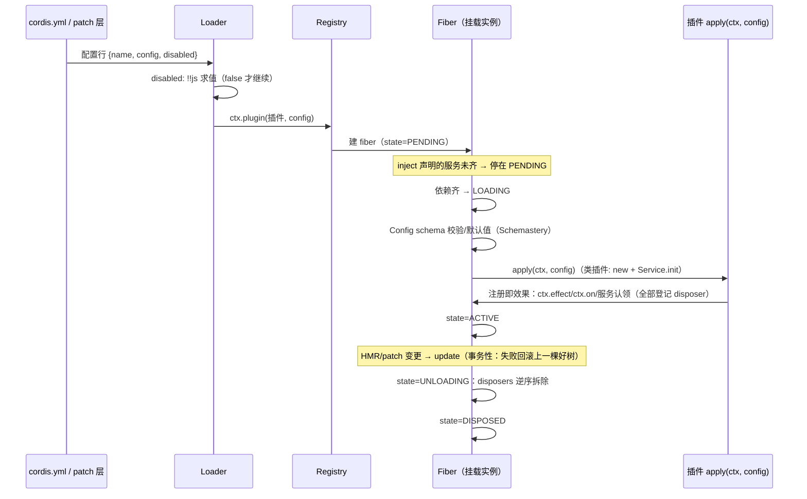

# 00a Cordis 插件框架（框架层说明书）

> 本文档介绍 dsh 脚下借用的**上游插件框架 Cordis**：它是什么、从哪来、核心概念与基本功能，并给出「架构分析系列术语 ↔ Cordis 框架术语」的对照表。后续维度文档引用框架概念时，以本文为登记处，写法："（框架概念：见 00a §2.x）"。dsh 自身术语的唯一定义源仍是 [00-概念总览](00-概念总览.md)；本文不改变 L0 的登记纪律，只补充框架层的词源。
>
> **阅读模式**：本文沿用全系列"先能力后机制"的约定，但三镜头按框架语境适配——**【你会看到】**指"dsh 产品里你能感知到的现象，归因到框架层的哪件事"；**【插件作者】**指直接使用 Cordis API 的时刻（dsh 插件作者多数间接使用它：你写的 `apply(ctx, config)` / `ctx.on()` / `super(ctx, 'fs')` 都是 Cordis 的调用面）；**【模型看到】**基本不适用（框架不接触模型，那是 02/03/07 的地盘）。

## 0. 本文档解决什么问题

1. **回答"这个插件系统是自研还是现成的"**：Cordis 是一个**已存在的开源框架**（上游 `cordiverse/cordis`，作者 Shigma——聊天机器人框架 Koishi 的作者），dsh 没有发明它，而是把它的源码**钉版本拷进仓库**（vendoring）并打了补丁。
2. **给出框架原生词汇的正式说明**：Context、Plugin、Fiber、Registry、Service、Events 四分派、Effect、Loader、Include 这些词是 Cordis 的，00 §2.1 那组词条是它们的产品化转述。
3. **给出对照表**（§5）：后续文档讲到某个概念时，能查清"这是框架给的还是 dsh 建的"，两套词汇一一对应。
4. **给出一个可运行的最小真实样例**（§3）：注册→生效→注销完整跑通，代码与真实输出都在文档里。

## 1. 框架是什么、从哪来

**定位**：Cordis 自述为 "Meta-Framework for Modern JavaScript Applications"——一个 TypeScript 应用插件框架，提供"插件挂载进共享上下文、以服务认领与类型化事件协作、注册即可逆"的一整套运行时。它是从 Koishi 聊天机器人生态泛化出的通用底座，MIT 协议。

**生态与来源**（`vendor/README.md` manifest，全部 vendored 进本仓库）：

| 本仓库目录 | 上游包名 | 角色 |
|---|---|---|
| `vendor/cordis` | `cordis` 4.0.0-rc.7（commit `56b3d4f7`） | 框架核心：Context/Fiber/Registry/Events/Service |
| `vendor/loader` | `@cordisjs/plugin-loader` | 读 `cordis.yml` 配置行、按注入激活插件 |
| `vendor/include` | `@cordisjs/plugin-include` | 配置包含与 **patch 叠加算法** |
| `vendor/group` | `@cordisjs/plugin-group` | 按 isolate 域成组装载插件 |
| `vendor/hmr` | `@cordisjs/plugin-hmr` | 热重载（模块与配置） |
| `vendor/timer` / `vendor/logger-console` | 同名官方插件 | 定时器 / 控制台日志 |
| `vendor/schemastery` | `schemastery`（Shigma） | 类型驱动的配置 schema 校验 |
| `vendor/cosmokit` | `cosmokit`（Shigma） | 零依赖工具库 |

> **【你会看到】**为什么一个 AI 助手仓库里有一套聊天机器人生态的框架？因为它解决的正是 dsh 最核心的需求：**"一切皆插件、改配置不重启、换零件不动整机"**——这三种能力框架原生就有，dsh 站在它上面只建产品层（agent 循环、会话日志、能力缝）。

**Vendoring 的三件事**（详见 vendor/README.md，共 18 条本地修改，此处列代表性四条）：

1. **钉版本拷源码**，不走 npm 依赖——"让 harness 完全拥有自己的框架层（可审计、可打补丁、版本钉死）"；
2. **改名**：全部 rescope 到 `@deepseek-ai` 命名空间（`cordis` → `@deepseek-ai/cordis`），发布 harness 时连带发布框架层，且不抢占上游包名；本地发布版本独立演进（如 4.0.1）；
3. **本地补丁**：fiber 生命周期加固（堵重入销毁漏洞）、Loader/Include **事务性配置重装**（失败的配置变更回滚到上一棵好树——dsh "改 patch 文件写错了也不崩"的体验来源）、`disabled: !!js` 插值、`applyEntryPatches` 导出并修复"后插入行无法被同列表 patch 命中"的上游 bug、上游 [cordis#41](https://github.com/cordiverse/cordis/pull/41) 懒配置解析的移植；
4. **同步流程**：升级 = 拷上游 `src/` → 重放补丁 → 更新 manifest → `pnpm run test && pnpm run build`。

## 2. 核心概念（框架原生词汇，先直观后正式）

以下词条按"Cordis 怎么说 → 在 dsh 里的体现"组织。源码锚点指向 `vendor/cordis/src/`。

### 2.1 上下文（Context）

直观：**插件世界的电话总机 + 生命周期账本**。每个插件拿到一个 ctx；读属性（找服务）、挂监听、注册效果都经过它。

正式：一个**运行时代理**——普通属性读取走服务解析器（`ReflectService`），`extend()` / `isolate()` / `intercept()` 创建子上下文而不改父级（[context.ts:42-146](../../vendor/cordis/src/context.ts)）。内置成员：`ctx.root`（根上下文）、`ctx.events`（事件总线）、`ctx.registry`（插件注册表）、`ctx.logger`（日志）。dsh 体现：00 §2.1 的"上下文/ctx"即此物；dsh 的 agent 作用域上下文（`agent.ctx`）是 `extend` 出来的子上下文家族。

### 2.2 插件（Plugin）

直观：**可挂载的功能单元，三种写法任选**：一个函数、一个类、或一个带 `apply` 方法的对象。

正式：联合类型 `Plugin.Function | Plugin.Constructor | Plugin.Object`（[registry.ts:92-134](../../vendor/cordis/src/registry.ts)）。共享元数据 `Plugin.Base`：`name`（诊断用显示名）、`Config`（standard-schema 校验器，插件启动前应用）、`inject`（所需服务声明）、`provide`（对外提供的服务名）、`intercept`（声明消费谁的拦截配置）。dsh 体现：所有 `packages/*/*` 插件包导出的都是这三种形态之一；你熟悉的 `apply(ctx, config)` + schemastery `Config` 写法就是 `Plugin.Function` + `Base.Config`。

### 2.3 纤维（Fiber）

直观：**插件一次挂载的运行时实例**——挂载是有状态的：等依赖、启动、运行、卸载各是阶段。同一个插件可以挂多次（多个 fiber）。

正式：`class Fiber`，六态生命周期 `FiberState`：`PENDING → LOADING → ACTIVE`，失败入 `FAILED`，卸载走 `UNLOADING → DISPOSED`（[fiber.ts:147-184](../../vendor/cordis/src/fiber.ts)）。`Plugin.Runtime.fibers` 记录同一插件回调的全部活 fiber。dsh 体现：`dsh --dump-config` 打印的每一行激活后就是一个 fiber；dsh 本地补丁 #6 加固的正是 fiber 的重入销毁边界。

### 2.4 注册表（Registry）

直观：**"谁被挂载了"的户口本**。

正式：`ctx.registry`（`RegistryService`），方法混入 ctx：`ctx.plugin(plugin, config)` 挂载一个插件（返回 fiber）；`ctx.inject(deps, callback)` 挂一个"带依赖的轻量回调"，依赖齐了才执行（[registry.ts:195-316](../../vendor/cordis/src/registry.ts)）。dsh 体现：dsh 很少直接调 `ctx.inject`，但 boot 的 `assertEntriesLoaded/Activated`（01 §3）检查的就是"每个启用行都有 fiber 且激活"。

### 2.5 服务（Service）

直观：**在总机上认领一个分机号的能力单元**。构造即注册，随拥有它的 fiber 卸载自动注销。

正式：抽象基类，子类构造函数调 `super(ctx, name)`（默认取静态 `provide` 字段），内部走 `ctx.reflect.provide(name, this, check)`（[service.ts:11-59](../../vendor/cordis/src/service.ts)）。静态符号：`Service.init`（类插件构造后运行的方法）、`Service.invoke`（让服务实例可调用，如 `ctx.logger(name)`）、`Service.resolveConfig`（拦截配置合并）。dsh 体现：`dsh-fs` 的 `abstract class FileSystem extends Service { constructor(ctx) { super(ctx, 'fs') } }` 是标准写法——00 §2.5 "Service Definition 绝不是 interface，是抽象类"的出处就在框架这一层。

### 2.6 注入（inject 声明）

直观：**插件的"我要等谁到位才开工"**。

正式：`Plugin.Base.inject`，形如 `['llm']` 或对象映射（`Inject` 类型，[registry.ts:19-37](../../vendor/cordis/src/registry.ts)）；声明了注入的 fiber 在依赖服务全部可用前停在 `PENDING`。dsh 体现：**书写插件列表无需关心顺序**（00 §2.1）；`headless-runner` 行的 `inject: [headlessStartup]`。

### 2.7 隔离域（isolate）

直观：**给某个服务名单开一部总机**。在隔离域之下，同名服务可以另有一个实现而不影响外面。

正式：`ctx.isolate(name, label?)` 创建子上下文，把 `name` 的解析换到新 label；**传同一个 label 的两次 isolate 加入同一域**（[context.ts:121-125](../../vendor/cordis/src/context.ts)）。dsh 体现：agent preset 用 `cordis:group` 行给"一个 provider 和它的 consumers"共同指定 isolate 域（04 的预设机制）；一个会话内挂的服务对其他会话/宿主不可见。

### 2.8 拦截配置（intercept）

直观：**沿上下文祖先链逐层给某个服务的配置"加料"**。

正式：`ctx.intercept(name, config)`——在该上下文之下启动的插件，其 `name` 服务的解析配置 = 祖先 intercept 逐层合并（靠近根的先应用；`Service[symbols.resolveConfig]`，[service.ts:86-102](../../vendor/cordis/src/service.ts)）。dsh 体现：组合层之外的一条配置通道，preset/组合可用来给服务实例注入额外默认值。

### 2.9 类型化事件（Events）与四种分派

直观：**插件之间的广播与拦截频道**，事件名进 TypeScript 类型系统。

正式：`interface Events` 通过 declaration merging 扩展（插件 `declare module` 加事件名）；分派方法 `ctx.emit / ctx.parallel / ctx.serial / ctx.waterfall`，监听 `ctx.on / ctx.once`（可选 `prepend` 提前），返回退订函数（[events.ts:44-106, 329](../../vendor/cordis/src/events.ts)）。每种事件**有且只有一种**分派模式，是公共契约。dsh 体现：00 §2.1 的事件/分派模式/waterfall 词条直接源自这里；02 的八个拦截点全是 `waterfall`/`serial` 事件。

### 2.10 效果（Effect）

直观：**装得上就拆得下**——每次注册返回拆除器，fiber 卸载时逆序执行。

正式：`ctx.effect()` 接受 `Disposable | AsyncDisposable | Generator`（generator 会在 yield 点拆分装/卸两段），`EffectMeta` 暴露诊断树（[fiber.ts:74-96](../../vendor/cordis/src/fiber.ts)）；`ctx.on()` 的退订函数同义。dsh 体现：00 §2.1 "注册即效果"不变量；AGENTS.md 的"registrations are effects"约定就是把框架能力当工程纪律用。

### 2.11 配置与 Schemastery

直观：**插件配置的"海关"**——每个插件声明 schema，配置进门前先校验+填默认值。

正式：`Plugin.Base.Config` 是 standard-schema 校验器；`resolveConfig(runtime, config)` 在 fiber 启动前应用（[fiber.ts:50](../../vendor/cordis/src/fiber.ts)）。vendored 的 `schemastery` 是 dsh 各插件 `Config` 导出的实际实现（`z.object({...})` 写法）。dsh 体现：所有插件 README 的 Config 表、"误配 fail-loud 在 load 时"的行为。

### 2.12 加载器（Loader）

直观：**把 `cordis.yml` 变成活插件树的那只手**。

正式：`@cordisjs/plugin-loader`——解析配置行（entry：`{ name, config?, disabled? }`）、为每行建 fiber、处理 bare/relative 模块解析。**`!!js` 方言**：entry 的 `config` 在声明注入激活后、针对该插件 ctx 求值；`disabled` 在每次挂载决策时针对 loader ctx 求值（本地补丁 #18/#15）。dsh 体现：01 整篇讲的装配执行器；`dsh --dump-config` 的行就是 loader 的词汇。

### 2.13 包含与补丁（Include）

直观：**配置的"分层叠加器"**——把若干份 patch 按序应用到一份行列表上。

正式：`@cordisjs/plugin-include`。patch 条目（`PatchOptions`）按 id **整体替换**目标行 config 或 `insert` 新行；`applyEntryPatches(data, patches, warn)` 是纯函数导出（本地补丁 #11），`entryListSchema` 是 `!!js` 方言的 schema。dsh 体现：**01 的核心机制**——bundle → profile patch → home patch → `--patch` 的叠加就是"一个 include 层上的多份 patch 列表"；`composeEntries`/`renderConfigDump` 直接调用这个纯函数保证"打印即所挂"。

### 2.14 组（Group）、热重载（HMR）与其他官方插件

直观：**成组装载与热替换**。

正式：`@cordisjs/plugin-group` 按一个 isolate 域同时装载一组插件（dsh preset 的组行）；`@cordisjs/plugin-hmr` 监视模块与配置文件、事务性重组（dsh 补丁 #9/#12：精确路径监视、串行化子树变更、失败广播 `hmr/config-update-failed`）；`timer` 给插件 effect 作用域的定时器；`logger-console` 控制台日志渲染。dsh 体现：headless 关掉模块级 HMR 但保留 launcher 的 patch 监视（01）；"改配置不重启"的整条链路。

## 3. 真实样例：注册 → 生效 → 注销（可运行）

> **【插件作者】**本节是全文档最重要的一节：一个最小但**完整真实**的插件，从注册到注销的每一行都能在本仓库跑起来。源码在 [`samples/hello-plugin/`](samples/hello-plugin/)（4 个文件约 90 行），通过 tsconfig `paths` 直接解析 vendored 框架源码，不需要 `pnpm install` 整个 monorepo。**下面的输出不是示意，是实际运行的结果。**

### 3.1 样例代码

**`greeter.ts`——插件本体**（一次用上 §2 的五个概念：声明合并、Config schema、Service、事件、效果）：

```ts
import { Service } from '@deepseek-ai/cordis'
import type { Context } from '@deepseek-ai/cordis'
import z from '@deepseek-ai/schemastery'

// ① 声明合并：把自定义事件与服务键焊进框架类型（不改框架源码一个字）
declare module '@deepseek-ai/cordis' {
  interface Events {
    'greeter/hello'(who: string): void
  }
  interface Context {
    greeter: Greeter
  }
}

export const name = 'greeter'

// ② 插件配置：Schemastery schema 校验 + 默认值（进 apply 之前已完成）
export interface Config {
  greeting?: string
}
export const Config: z<Config> = z.object({
  greeting: z.string().default('你好'),
})

// ③ Service 子类：super(ctx, 'greeter') 构造即认领 ctx 键，随 fiber 卸载自动注销
export class Greeter extends Service {
  constructor(ctx: Context, private readonly config: Config) {
    super(ctx, 'greeter')
  }
  greet(who: string): string {
    return `${this.config.greeting}, ${who}!`
  }
}

// ④ 插件主体（函数形态）：一切注册经 ctx.on / ctx.effect，各返回拆除器
export function apply(ctx: Context, config: Config): void {
  const greeter = new Greeter(ctx, config)

  // 注册即效果 1：类型化事件监听（on 返回退订函数）
  ctx.on('greeter/hello', (who) => {
    console.log(`  [greeter] 事件到达 greeter/hello(${who}) → ${greeter.greet(who)}`)
  })

  // 注册即效果 2：任意可逆资源——返回清理函数，fiber 卸载时逆序执行
  const handle = setInterval(() => {}, 2 ** 30)
  ctx.effect(() => () => {
    clearInterval(handle)
    console.log('  [greeter] 效果拆除：定时器已清理')
  })
}
```

**`consumer.ts`——依赖方插件**（演示 inject）：

```ts
import type { Context } from '@deepseek-ai/cordis'

export const name = 'greeter-consumer'
export const inject = ['greeter']          // ← 声明依赖，等 ctx.greeter 出现才激活

export function apply(ctx: Context): void {
  console.log(`  [consumer] 激活：ctx.greeter 已就绪 → ${ctx.greeter.greet('consumer')}`)
}
```

**`run.ts`——宿主**（注册→生效→注销三幕）：

```ts
import { Context } from '@deepseek-ai/cordis'
import * as greeter from './greeter.ts'
import * as consumer from './consumer.ts'

const state = (f: { state: number }) =>
  (['PENDING', 'LOADING', 'ACTIVE', 'FAILED', 'DISPOSED', 'UNLOADING'] as const)[f.state]

const ctx = new Context()

console.log('1) 注册：先挂"有依赖的一方"（顺序故意写反，演示 inject 等待）')
const consumerFiber = ctx.plugin(consumer, {})
console.log(`   consumer fiber 已创建，state=${state(consumerFiber)} —— 在等 greeter 服务出现`)

console.log('2) 生效：挂上 greeter（配置先过 Schemastery 校验，缺省字段补默认值）')
const greeterFiber = await ctx.plugin(greeter, { greeting: '早上好' })
await consumerFiber
console.log(`   greeter state=${state(greeterFiber)}, consumer state=${state(consumerFiber)}`)
console.log(`   服务调用 ctx.greeter.greet('世界') → ${ctx.greeter.greet('世界')}`)
console.log('   派发事件 ctx.emit("greeter/hello", "Fiber")')
ctx.emit('greeter/hello', 'Fiber')

console.log('3) 注销：dispose greeter fiber，效果按注册逆序拆除')
await greeterFiber.dispose()
console.log(`   greeter state=${state(greeterFiber)} —— ctx.greeter 已注销，consumer 回到 ${state(consumerFiber)}`)
if (consumerFiber.state !== 4) {
  await consumerFiber.dispose()
  console.log(`   consumer state=${state(consumerFiber)} —— 全部拆除，进程可干净退出`)
}
```

（`tsconfig.json` 只做一件事：把 `@deepseek-ai/cordis` 等三个包名映射到 `vendor/*/src`，见 [samples/hello-plugin/tsconfig.json](samples/hello-plugin/tsconfig.json)。）

### 3.2 运行与真实输出

在 `samples/hello-plugin/` 目录执行 `npx tsx run.ts`：

```text
1) 注册：先挂"有依赖的一方"（顺序故意写反，演示 inject 等待）
   consumer fiber 已创建，state=PENDING —— 在等 greeter 服务出现
2) 生效：挂上 greeter（配置先过 Schemastery 校验，缺省字段补默认值）
  [consumer] 激活：ctx.greeter 已就绪 → 早上好, consumer!
   greeter state=ACTIVE, consumer state=ACTIVE
   服务调用 ctx.greeter.greet('世界') → 早上好, 世界!
   派发事件 ctx.emit("greeter/hello", "Fiber")
  [greeter] 事件到达 greeter/hello(Fiber) → 早上好, Fiber!
3) 注销：dispose greeter fiber，效果按注册逆序拆除
  [greeter] 效果拆除：定时器已清理
   greeter state=DISPOSED —— ctx.greeter 已注销，consumer 回到 PENDING
   consumer state=DISPOSED —— 全部拆除，进程可干净退出
```

### 3.3 输出逐行对回概念

| 输出现象 | 对应概念 |
|---|---|
| consumer 挂载后停在 `PENDING` | **inject 等待**（§2.6）：依赖未齐，fiber 不激活；挂载顺序故意写反也没关系 |
| greeter 挂上后 consumer 立即"激活"打印 | **服务就绪驱动激活**（§2.4/§2.5）：`ctx.greeter` 认领成功的那一刻，依赖方被唤醒 |
| `greet('世界')` 返回"早上好，世界！" | **Config schema**（§2.11）：`{ greeting: '早上好' }` 通过校验进入 `apply`；不传则取默认 `'你好'` |
| `ctx.emit` 一行后监听器收到 | **类型化事件**（§2.9）：`'greeter/hello'` 经声明合并进 `Events`，`ctx.on` 返回的退订函数同时是效果 |
| dispose 后打印"定时器已清理" | **注册即效果**（§2.10）：`ctx.effect` 的清理函数在卸载时执行；那个巨大的 `setInterval` 被拆掉，进程才能干净退出 |
| `ctx.greeter` 消失、consumer **回到 PENDING** | **依赖是活的**：服务注销不是静态注册表操作，框架会把依赖它的 fiber 拉回等待态——这正是 dsh 热重载/插件替换不留残骸的机制本源 |

### 3.4 与 dsh 产品插件的对照

这个样例与 `packages/guard/repeat-tool-reminder`（产品里最小的真实插件之一）逐点同构：同样是 `name` + `interface Config` + `Config: z<Config>` + `apply(ctx, config)`；同样用 `ctx.on` 挂瀑布监听并靠注册即效果随插件卸载拆除。差别只在监听的事件（`greeter/hello` vs `tools/post-execute`）和配置项。

把 `run.ts` 里的 `ctx.plugin(greeter, { greeting: '早上好' })` 换成**配置行注册**，就是 01 篇的世界：

```yaml
# cordis.yml（或任一 patch 层里的 insert 行）
- name: './greeter.ts'        # bare 包名或相对路径
  config:
    greeting: 早上好
```

Loader（§2.12）为这一行建 fiber、走**完全相同**的 PENDING→校验→apply 流程；Include 的 patch（§2.13）还能在后续层按 id 改写或禁用它。dsh 的 bundle/profile/patch 组合层（00 §2.2、01 全篇）就是把这两节框架能力组织成了产品形态。

## 4. 一次挂载的生命周期

> **【插件作者】**你写完插件到它跑起来（以及被换掉）的全过程，都是框架在驱动：



## 5. dsh 术语 ↔ Cordis 概念对照表（后续文档引用的登记处）

左列是架构分析系列（00 及各维度文档）使用的术语；中列是框架原生概念；"关系"说明对齐方式。

| 架构分析术语 | Cordis 原生概念 | 关系 |
|---|---|---|
| 插件（00 §2.1） | `Plugin`（Function/Constructor/Object 三形态，§2.2） | 同物直引 |
| 上下文 / ctx（00 §2.1） | `Context`（代理 + 服务解析，§2.1） | 同物直引 |
| 服务（00 §2.1） | `Service` 基类（`super(ctx, name)` 认领，§2.5） | 同物直引 |
| 注入 / inject（00 §2.1） | `Plugin.Base.inject` / `ctx.inject()`（§2.6） | 同物直引 |
| 事件 / 分派模式（00 §2.1） | `Events` 声明合并 + emit/waterfall/parallel/serial（§2.9） | 同物直引 |
| Waterfall 语义（00 §2.1） | `ctx.waterfall` 环绕中间件（§2.9） | 同物直引 |
| 效果 / 注册即效果（00 §2.1） | `ctx.effect()` + Fiber disposers（§2.10） | 框架机制被 dsh 升格为工程不变量 |
| 配置行（01 §2） | Loader entry `{name, config, disabled}`（§2.12） | 同物直引 |
| Patch / 图层叠加（00 §2.2、01） | Include `PatchOptions` + `applyEntryPatches`（§2.13） | 同算法；dsh 把它组织成 bundle/profile/--patch 产品层 |
| `!!js` 求值规则 | Loader/Include 方言（config 注入后求值、disabled 挂载时求值） | 语义为框架所有；disabled 插值与懒解析是 dsh 补丁 |
| isolate 域 / 组行（04 预设） | `ctx.isolate` + Group 插件（§2.7、§2.14） | 框架机制；dsh preset 用它做每会话能力隔离 |
| agent 作用域 / agent.ctx（00 §2.4） | 子上下文（`extend` 家族）+ `Context.filter` 监听过滤 | **dsh 自建**（`packages/core/scope` 的 `scopeTarget`/ScopedLayers），建在框架的子上下文与事件过滤钩子之上 |
| 声明合并 / `…Map→派生联合`（00 §2.6） | `declare module` 类型合并（框架用于 Events，§2.9） | 框架用法；dsh 把同一 TS 机制推广到 SessionEventMap 等词表 |
| **无 Cordis 对应（dsh 自建）**：能力缝三角色、SessionEventMap、turn/step、Agent/收件箱、驱动者、派生 deriveMessages、持久化缝、Branded ID、审批/沙箱/凭据…… | — | 产品层概念，定义只在 00 及各维度文档 |

**一句话切分**：凡关于"插件怎么挂、怎么互相找、怎么通信、怎么拆"——是 Cordis；凡关于"Agent 怎么跑、日志怎么记、模型看到什么、权限怎么管"——是 dsh 自建。

## 6. 引用规范

1. 后续文档（含未来新增篇目）引用框架概念时标注"（框架概念：见 00a §2.x）"，框架术语不进 00 的登记表——那是 dsh 术语表，本文是框架术语的登记处。
2. 涉及"同一概念两套叫法"时以 §5 对照表为准：例如正文写"配置行"（dsh 叙述）时，其框架词源是 Loader entry。
3. 涉及本地补丁行为（事务性重装、disabled 插值、insert 即时索引）时，引用 `vendor/README.md` 的编号条目作为"这是 dsh 对框架的修改"的证据。

## 7. 合规自查

- [x] 本文只登记框架层术语（§2 十四目 + §5 对照），不改变 00 的 L0 登记纪律。
- [x] 每个"正式定义"附 vendored 源码锚点（`vendor/cordis/src/*` 行号）；上游来源、版本、commit 以 `vendor/README.md` manifest 为准。
- [x] 遵循"先能力后机制"：每个词条直观在前；三镜头按框架语境适配（【模型看到】在本文不适用，已在引言声明）。
- [x] §3 提供可运行的最小真实样例（`samples/hello-plugin/`，`npx tsx run.ts`），输出为实际运行结果而非示意。
- [x] §5 对照表覆盖 00 §2.1 全部词条及 01/04 的框架相关术语；dsh 自建概念明确标注"无 Cordis 对应"。
- [x] 本文件属于 `架构分析/` 维度文档，不参与 `docs/` 的 doc-sync 与 verify-doc-budgets 门禁。
