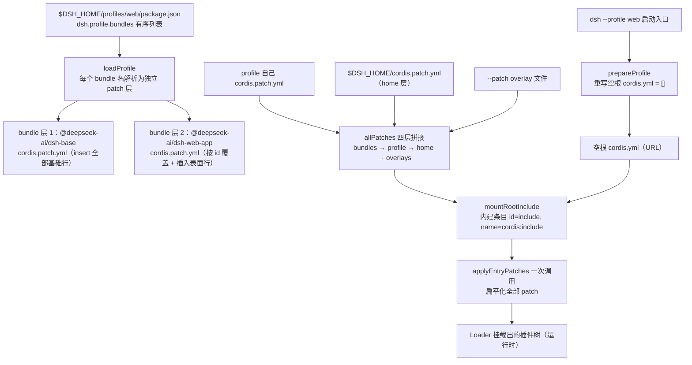
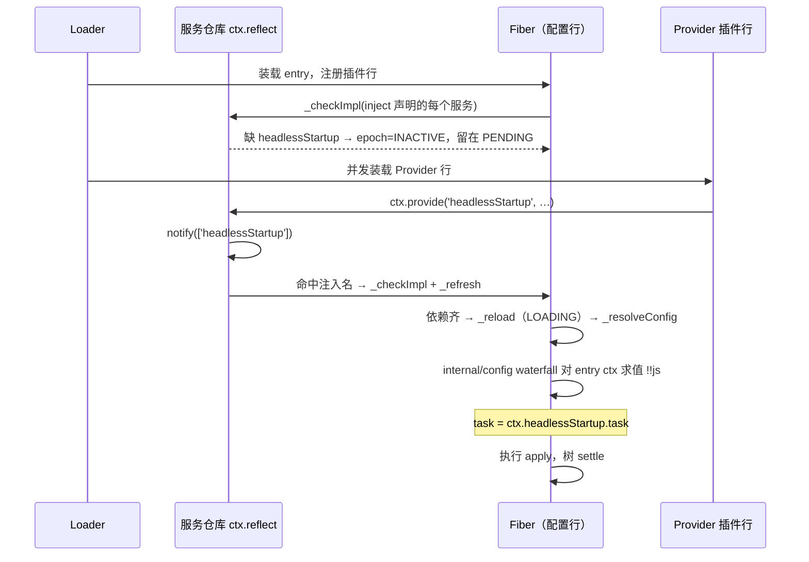
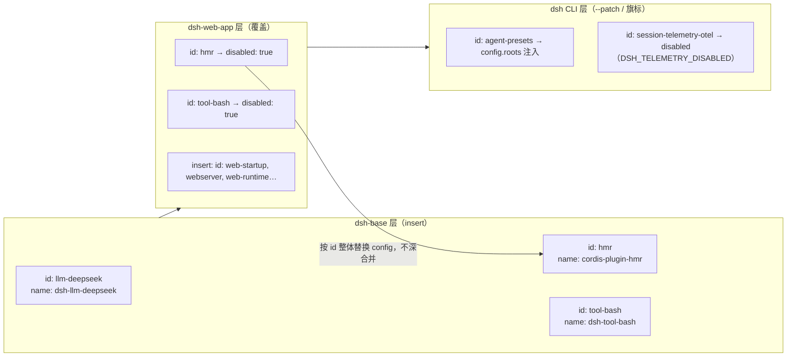
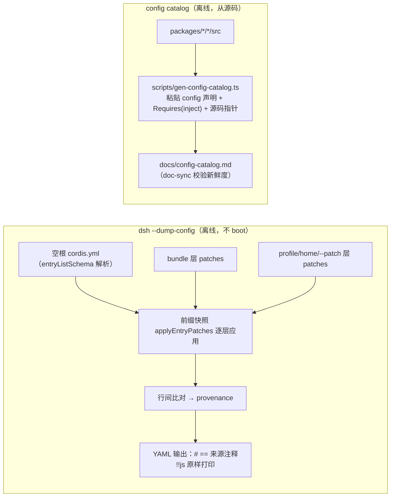
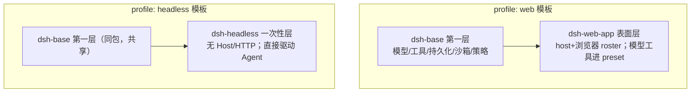
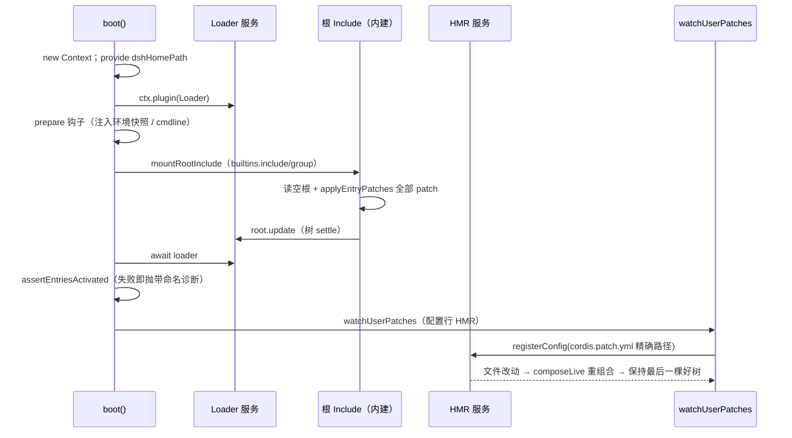

# 01 组合与启动

> 本维度回答"一个 `dsh` 进程如何从配置变成一棵运行中的插件树"：profile/bundle/patch 的四层叠加如何落地、Loader 如何按服务注入决定激活顺序、`!!js` 表达式在何时对谁求值、`dsh --profile web --dump-config` 的输出到底是什么。证据来自 `docs/architecture.md`、`docs/cordis-primer.md`、`packages/boot/app-boot/`（源码与 README）、`vendor/loader`/`vendor/include`/`vendor/cordis`、`packages/bundle/*` 的 manifest 与补丁层、`apps/cli/` 的启动与转储入口。
>
> **阅读模式**：每节先讲"你能感知到什么、想实现某功能该怎么做"（【你会看到】/【模型看到】/【插件作者】三镜头），再讲内部如何运作；机制描述始终回扣外部可感知的功能。

## 0. 本维度分析问题

先用用户视角把本维度的领地说清楚。**你与 dsh 的第一次接触——敲下启动命令的那一刻——以及之后每次"改几行配置、产品行为就变"的体验，全部发生在本维度**：

- `dsh --profile web` 打开的是网页应用，`dsh --profile headless "run the tests"` 是一条命令跑完任务就退出的运行器——**选 profile 就是选产品形态**：同一个内核，装配不同的插件树就是不同的产品。
- `dsh --profile <name> --dump-config` 在终端打印这台机器实际启动的完整插件树，每行带来源注释——**你的配置装配出了什么，一眼可查**。
- 在自己的 `cordis.patch.yml` 里改几行保存，长驻表面不重启就热生效；改坏了也不会拆掉当前能跑的树。
- 启动失败不会带病运行：报错点名失败的行与仍未解析的服务名，整棵树回滚后进程退出。

**你作为插件作者在本维度的动手入口**：想发布一组插件→写一个 bundle（用 `cordis.patch.yml` 以 `insert` 铺行）；想造自己的形态→复制模板 profile 到主目录下，改它的 bundle 列表与 patch；想弄清配置表达式何时求值（`!!js` 能引用哪些服务）、插件按什么顺序激活、误配置如何被点名——分别见 §3.2 与 §3.6。

本文回答下列问题：

1. profile → bundle → patch 的图层叠加顺序如何在代码里落地，`dsh --profile <name>` 的入口把哪些来源叠到同一个空根上？
2. Loader 装载配置行时，为什么"行顺序不带加载语义"——注入如何决定激活顺序，缺服务的行处于什么状态？
3. 配置行如何被上层 patch 整体替换、`insert` 如何插入新行，被插入的行能否再被更上层的 patch 命中？
4. `dsh --profile web --dump-config` 输出意味着什么——它不启动进程，凭什么声称等于实际启动的树？
5. `dsh-base` / `dsh-web-app` / `dsh-headless` 三个随附 bundle 各承担什么角色，为什么 web 与 headless 都以 base 为第一层？
6. 配置 catalog 如何生成，它从源码的哪条线上取得"每个可装载包的 config 声明 + inject 清单"？
7. boot() 如何收口启动窗口：等待树 settle、失败即回滚+抛错、用户 patch 层热更新（HMR）如何被挂起？

## 1. 前置概念

以下概念全部来自 L0 唯一定义源 [00-概念总览](00-概念总览.md)，本文直接引用，不做新定义：

- 插件（定义：见 00 §2.1）
- 上下文 / ctx（定义：见 00 §2.1）
- 服务（定义：见 00 §2.1）
- 注入 / inject（定义：见 00 §2.1）
- 事件（定义：见 00 §2.1）——本文出现 `internal/config`、`internal/plugin`、`internal/update`、`hmr/config-update-failed` 均属 Cordis 框架内的类型化事件
- 效果 / Effect（定义：见 00 §2.1）
- Profile（定义：见 00 §2.2）
- Bundle（定义：见 00 §2.2）
- Patch（定义：见 00 §2.2）
- 图层 / Layer（定义：见 00 §2.2，其顺序规则由本文 §2「图层层级/叠加顺序」落地）
- Agent（定义：见 00 §2.3）——仅 §3.5 提到一次性运行器驱动 Agent 时引用
- $DSH_HOME（Harness home，定义来源：00 §2.2 Profile 的存放处，实现于 `@deepseek-ai/dsh-home-paths`，见 packages/README.md:59 的 `util` 组说明）

## 2. 概念约定

本文只新登记以下 5 个概念，其余术语一律回 §1 / 00。每个词条先一句直观白话，再给正式定义。

- **Loader（加载器）**：直观——把你装机单上的每一行真正搬进进程的"装配工头"：启动时读配置、解表达式、按依赖挂插件都是它在干活，§3.6 的启动断言验收的就是它的产出。正式定义：装配执行器——读 cordis.yml、解析 `!!js` 表达式、按注入激活插件。实现是 vendored 的 `@deepseek-ai/cordis-plugin-loader` 服务类（vendor/loader/src/index.ts:65），由 `boot()` 在启动时挂入根上下文（packages/boot/app-boot/src/index.ts:771）。
- **配置行（config row）**：直观——装机单上的一行；patch 能"按名字精确改某一行"，靠的就是每行有 id。正式定义：cordis.yml 里带 id 的条目（plugin 行与 service 行）。行内可含 `name`/`config`/`disabled`/`inject`/`group` 等字段（vendor/loader/src/config/entry.ts:9-22）；`EntryOptions.id` 缺失时由树自动赋随机 id（vendor/loader/src/config/tree.ts:66-73）。
- **图层层级/叠加顺序**：直观——装机时按顺序铺上来的每一层，后铺的盖先铺的；你自己的笔永远铺在官方套装之上。正式定义：bundle→profile patch→home patch→`--patch` 的 apply 顺序，即 `docs/architecture.md:27` 及 L0 00 §2.2 声明的"上层总是覆盖下层同名行"。机械实现见 apps/cli/src/profile-boot.ts:122-129（`allPatches`）。
- **插件树**：直观——按你的装机单装配出来、正在运行的那台机器；`--dump-config` 打印的就是它的装箱单。正式定义：运行中由 loader 装配的插件集合及其依赖关系。`docs/architecture.md:17` 称"A running `dsh` is a plugin tree composed at boot from ordered layers"；树的持有对象是 `EntryTree`/`EntryGroup`（vendor/loader/src/config/tree.ts:6-33）。
- **可替换性（swappability）**：直观——树上任何一行都能被你自己的笔整体换掉、关掉，或在旁边加一行新插件——换行为永远不用改代码。正式定义：树内任何行为都可被上层 patch 整体替换，或 disabled、或用 `insert` 补充新行——`docs/architecture.md:35` 的原话是"Any row it prints can be replaced by a patch of your own"。

## 3. 分析正文

### 3.1 profile → bundle → patch：空根配置上的四层叠加

> **【你会看到】** `dsh --profile web` 与 `dsh --profile headless` 开出来的是两个不同的产品形态，但它们共享同一份"基础套装"；而你在自己目录里写的几行 patch 永远是最后铺上去的一层，官方套装的同名行压不过它——"改默认行为"只需要在你自己的文件里重写那一行。
> **【插件作者】** 想发布一组插件 = 写一个 bundle：`package.json` 的 `dsh.bundle` 指向一个 patch 文件，patch 用 `insert` 把行铺进树。想理解"为什么配置行的书写顺序不重要、我的行何时被激活"——那是 §3.2 的注入机制，不是本节的叠加顺序；本节只管"每一层从哪来、谁盖谁"。

`dsh --profile <name>` 的启动根不是一份抄好的完整配置，而是一个**刻意保持为空**的 `cordis.yml`——内容就是 `[]`（apps/cli/src/profile-boot.ts:60-64）。每次启动 `prepareProfile` 都会重写这个空文件：因为 vendored loader 的树写回（插件自卸时持久化当前树）可能把组合出的行烤进这个文件，不重写就会在下次启动把每个 bundle 的 insert 重复一次（apps/cli/src/profile-boot.ts:85-95）。该文件存在的唯一理由是给 loader 一个真实的 include 根来锚定 `baseUrl` 到 profile 目录。

真正的内容由四层 patch 提供（图 1）：`loadProfile` 把 `package.json` 的 `dsh.profile.bundles` 逐个解析成 bundle 层（packages/boot/app-boot/src/profile.ts:371-403），每层是一个独立 patch 文件（`loadOverlayPatches`）；然后叠 profile 自己的 `cordis.patch.yml`、主目录级 `$DSH_HOME/cordis.patch.yml`（apps/cli/src/profile-boot.ts:147）、`--patch` overlay（:148）。顺序即 `docs/architecture.md:27` 与 00 §2.2 的事实。（用户体感：四层从下往上铺——官方套装们按 profile 列出的顺序打底、你的 profile 级笔改、主目录级笔改、命令行一次性覆盖；同名行后者胜，所以你自己的笔永远优先于官方套装。）

`boot()` 把这些 patch 一次性交给根 include 条目：`ctx.loader.builtins.include = Include`、`ctx.loader.builtins.group = Group`，创建 id 固定为 `include`、name 为 `cordis:include` 的内建条目（packages/boot/app-boot/src/index.ts:486-529）。Include 读取空根后，对"基础配置 + 所有 patch 的扁平化列表"只调**一次** `applyEntryPatches`（vendor/include/src/index.ts:315-321），再把结果整树交给 Loader 挂载（vendor/loader/src/config/group.ts:59-106）。"同一份算法同时被 boot 与转储使用"这一不变量详见 §3.4。

一次叠加规则：**上层覆盖下层同名行，覆盖的是行的整个 `config`**。这一点既是 `applyEntryPatches` 的实现语义（vendor/include/src/index.ts:118-124，见 §3.3），也是 dsh-base 补丁层头注释的自述（packages/bundle/base/cordis.patch.yml:1-13），app-boot README 的措辞是"an id-targeted patch replaces the named entry's whole config (restate unchanged fields)"（packages/boot/app-boot/README.md:43）。

### 3.2 Loader 装配：inject 决定激活顺序，配置延后求值

> **【你会看到】** 两个直接体感。（1）启动不是"按配置文件从上到下逐行启动"：插件谁先激活由**它依赖的服务是否就位**决定，配置里行的先后只是排版——你永远不需要给插件排序。（2）同一份基础套装在 Windows 上自动禁用 bash 工具链、启用 PowerShell 工具链，在其他平台相反——`disabled: !!js` 按平台二选一，不用按平台手工换配置。
> **【插件作者】** 三个动手要点。（1）想让配置行的参数来自运行期服务：行里声明 `inject: [服务名]`，`config` 写 `!!js ctx.<服务名>.<字段>`——求值发生在该服务激活之后（本节的"配置延后求值"）；（2）导出形状是硬约定：服务包默认导出其 Service 类，函数插件具名导出 `name`/`inject`/`Config`/`apply` 且**无默认导出**——混用两种形态会让 loader 丢掉函数插件的注入命名空间；（3）插错 `inject` 名不会静默跳过：行停在 PENDING，启动断言点名（§3.6）。

Loader 对每个插件行做个 `Entry`，并把行选项并入 fiber 的注入声明：`internal/plugin` 事件里 `Inject.resolve(fiber.entry.options.inject, fiber.inject)`（vendor/loader/src/index.ts:117-123），随后每个 fiber 用 `Inject.resolve(plugin.inject)` 建出（vendor/cordis/src/registry.ts:316-336）。

激活顺序不是行顺序，而是**服务可用性**：fiber 构造后对自己的每个注入名做 `_checkImpl`，然后 `_refresh` 算状态——只要任一声明服务缺席，fiber 的 epoch 就是 `INACTIVE`，状态停在 `PENDING`（vendor/cordis/src/fiber.ts:611-623）。服务是"认领出来的"：Provider 激活时执行 `ctx.provide(name, value, check?)`，经 `reflect.provide` 注册进服务仓库；仓库 `notify([name])` 会扫所有 fiber，凡注入名里含该服务的都重新 `_checkImpl` 再 `_refresh`（vendor/cordis/src/reflect.ts:277-336）。依赖齐了，fiber 进入 `_setEpoch → _reload`，开始真正的 `apply`。图 2 就是这个 negotiate 过程。

配置求值被推迟到注入激活之后：`_reload` 里 `config = _resolveConfig(this._config)`（vendor/cordis/src/fiber.ts:646-673），`internal/config` 是一个 waterfall 事件，loader 的全局监听器对每条非"树承运者"（Group/Include）的行把整个 config 当场 `interpolate`——`new Function('ctx','expr', 'with(ctx){eval(expr)}')` 在**该行的 entry 上下文**里求值（vendor/loader/src/config/utils.ts:4-9、vendor/loader/src/config/index.ts:92-101）。因此 `!!js` 表达式可以引用该行自己注入的服务，例如 headless 的 runner 行 `config: { task: !!js ctx.headlessStartup.task }` 配 `inject: [headlessStartup]`（packages/bundle/headless/cordis.patch.yml:30-35），web 的 webserver 行 `host: !!js ctx.webStartup.host ?? '127.0.0.1'` 配 `inject: [webStartup]`（packages/bundle/web-app/cordis.patch.yml:115-120）。`headlessStartup` 由 `apply()` 里 `ctx.provide(HEADLESS_STARTUP_SERVICE, …)` 在解析出任务后发布（packages/bundle/headless/src/startup.ts:49-56），Web 的 `webRuntime` 同理（cordis.patch.yml:130-136）。（用户体感：`dsh --profile headless "任务"` 里你敲的任务文本，就是在 headless 启动插件解析完任务、发布服务之后才被填进运行器配置行的——命令行参数就这样流进插件。）

`disabled: !!js` 是唯一"每次装载决策都对 loader 上下文求值"的字段（vendor/loader/src/config/entry.ts:100-112；vendor/README.md:50 的本地修改记录第 18 条），行内保留原始表达式节点以便写回。dsh-base 借此按平台二选一挂 shell：`bash-sandbox`/`tool-bash` 断言 `process.platform === 'win32'` 时 disabled，`pwsh-sandbox`/`tool-pwsh` 相反（packages/bundle/base/cordis.patch.yml:178-216）。（用户体感：Windows 装机自动用 PowerShell 工具链、其他平台自动用 bash——同一份 base 套装，无需手工挑选。）

因此 base 补丁层的这句话是精确的：**行顺序不带加载语义（激活由服务可用性驱动），行分组只是为了读者**（packages/bundle/base/cordis.patch.yml:12-13）。（用户体感：装机单里行的先后只是排版——你从不需要"把 Provider 排在 Consumer 前面"，声明 `inject` 等它就行。）

装配层对"插件的导出形状"有两个硬性约定：服务包默认导出其 Service 类，函数插件具名导出 `name`/`inject`/`Config`/`apply` 且无默认导出——混用两种形态会让 loader 丢掉函数插件的注入命名空间（packages/AGENTS.md:5 及 postmortem 0001）。可选服务用 `ctx.get(name)` 读全局服务仓库，declare 的注入保留给 `ctx.<name>` 属性代理，因为代理是拓扑敏感的（packages/AGENTS.md:6、vendor/cordis/src/reflect.ts:144-160）。这两条决定了"树内每一行以何种形态贡献服务"是组合契约的一部分，而不是装载时的运气。

### 3.3 Patch 语义：按 id 整体替换与 insert

> **【你会看到】** 你的一切配置改动都长成两种 YAML 形态：**改已有行为** = 按 id 找到那行、把整行完整重写（不是只写要改的字段——没抄的字段会丢）；**加新东西** = `insert` 插入新行。官方正是用同一机制在共享 base 之上做出 web 形态：整批"关掉"模型面向工具（disable 不是删除——下一次组合它还在），插入网页表面行。
> **【插件作者】** patch 能命中嵌套行（group 行被递归索引）；你 `insert` 的行立刻进入 id 索引，**同一份 patch 列表里更靠后的层还能继续改它**——"base insert、web 覆盖、CLI 再补全"的层层接力靠的就是这一点。

`applyEntryPatches` 是"补丁算法"的唯一实现，同时服务 mount 与离线组合，因此不会漂移（vendor/README.md:43 本地修改第 11 条）。四个要点：

1. **脱离源数据**：先 `structuredClone`，再建 `id → entry` 索引，且 `buildMap` 递归进 group 行（vendor/include/src/index.ts:63-75、110-124）——因此可覆盖嵌套行。
2. **整体替换 config**：非 insert patch 把除 `id`/`insert`/`name` 外的每个键直接 `target[key] = value`（vendor/include/src/index.ts:121-124），不做深合并。（用户体感：改一行配置必须把整行完整重写——只写想改的字段，没抄的字段会丢。）web-app 层因此必须"restates every key it owns"（packages/bundle/web-app/cordis.patch.yml:4-8）；app-boot 的 Known Limitations 也点名了这一点（packages/boot/app-boot/README.md:60）。
3. **`name` 一致性守卫**：patch 带 `name` 且与目标行不符时跳过并告警（vendor/include/src/index.ts:116-119），防止误伤同名 id。
4. **insert**：`insert` 把整组行追加进列表；随后 `buildMap(insert)` 立刻索引这些新增行，使**同一份 patch 列表里更靠后的 patch 也能命中刚插入的行**（vendor/include/src/index.ts:80-103）——这正是"空根 + 每 bundle 一层"组合之所以行得通的机制，本地修改第 11 条专门为此而生。

图 3 展示一个实际例子：base 层 insert `llm-deepseek` 行，headless 层按 id 把它们 disable（`disabled: true`，packages/bundle/headless/cordis.patch.yml:14-15 对 `hmr` 行），Web 层把 base 的模型面向工具整批 disabled（packages/bundle/web-app/cordis.patch.yml:276-409），并 insert 出 `agent-presets` 行再由 CLI 层按 id 补全 `roots`（apps/cli/src/profile-boot.ts:159-167）。被 disable 的行不是被删除——共享的 base 层必须保持"下一次组合它还在"（web-app/cordis.patch.yml:283-285）。

### 3.4 `--dump-config`：不启动进程的离线组合兼配置 catalog

> **【你会看到】** `dsh --profile <name> --dump-config` 是"装机预演"：不启动进程，打印这台机器实际会挂载的完整插件树，逐行带来源注释（`# == <来源>, patched by <层>`），`!!js` 表达式原样打印、不求值。怀疑"我的 patch 到底生没生效/这行是谁加的"，跑它一眼便知；`--dump-default-config` 是不带用户层的变体。
> **【插件作者】** 两条离线参照配对使用：`--dump-config` 答"本次启动实际装配了什么"，`docs/config-catalog.md` 答"哪些包可装载、每个包能配什么、注入哪些服务"——写新包配置查后者，调试组合跑前者；两者都从源码/同一补丁算法派生，永不漂移。

`dsh --profile web --dump-config`（`--dump-default-config` 为不带用户层的变体）走独立模式：`parseDshArgs` 要求 dump 不带 app 参数（apps/cli/src/args.ts:83-103），`bin.ts` 动态 import 并直接 `runDumpConfig` 后退出、不经过 `boot()`（apps/cli/src/bin.ts:45-49）。

`runDumpConfig` 复原与启动完全相同的四层来源（dump-config.ts:30-52）：每个 bundle 作为一层（label 为包名）、再叠 profile 的 `cordis.patch.yml`、home 层、各 `--patch` 文件。核心在 `renderConfigDump`（packages/boot/app-boot/src/index.ts:379-473）：

- 用 Include 自己的 `entryListSchema` 解析同一个空根 `cordis.yml`（:391-399）——`!!js` 标量经该方言读回为表达式节点（vendor/include/src/index.ts:9-23）；
- 对每层做前缀快照：`snapshot_k = applyEntryPatches(base, layers[0..k].flatMap)`，即 boot 对同样前缀所调用的同一次算法（:411-419，注释 :349-356 明确"the same single call boot() makes"）；
- 逐行比对相邻快照产出 provenance（:433-440），`groupedDump` 把来源相同的连续行用 `# == <来源>, patched by <层>` 注释聚合输出（:445-473），且 `!!js` 表达式**原样打印、不求值**（:356）。

所以转储 = 同一调用实际会挂载的那份配置，逐行可读、可被任何 patch 命中。这也兑现了 `docs/architecture.md:30-35` 的承诺："Any row it prints can be replaced by a patch of your own。"（用户体感：dump 输出的任何一行，都是你下一行 patch 的合法目标——看到即改到。）

配置 catalog 是另一条离线管道：`docs/config-catalog.md` 由 `scripts/gen-config-catalog.ts` 生成（gen-config-catalog.ts:1-8），为每个可装载的 harness 包粘出 `apply()`/Service 构造器收到的**逐字 config 声明**、`Requires:`（该包 `inject` 的服务键）与源码位置（docs/config-catalog.md:6-10、脚本 :56-80 的 `CatalogEntry.inject` 字段），并把运行时 schemastery 模式与粘贴的声明互相校验（:8）。它和 `--dump-config` 合成"部署轴"的完整参照：前者答"哪些包可装载、每个包能配什么"，后者答"本次启动实际装配了什么"。二者都从源码/同一补丁算法派生，永不漂移。

### 3.5 dsh-base / dsh-web-app / dsh-headless 分工

> **【你会看到】** `--profile web` 与 `--profile headless` 是同一内核的两种形态：前者是网页应用（服务器、浏览器表面、按会话组合的 agent 预设），后者一条命令驱动 Agent 跑完任务、打印持久化结果后退出（无 Host/HTTP/浏览器）。两者都以 dsh-base 打底——模型、工具、持久化、沙箱、审批人人共享；首次使用模板会自动初始化到你的主目录，复制改造即得自己的形态。
> **【插件作者】** 想出自己的形态：在 `$DSH_HOME/profiles/<名字>/` 放自己的 `package.json`（`dsh.profile.bundles` 列 bundle）与 `cordis.patch.yml`。bundle 名按双锚解析（dsh 安装目录优先、profile 目录其次）；恰好等于安装自带元组的列表被规范回模板、其余视为你自持。

随附模板只有两个 web／headless，bundle 元组由 `PROFILE_TEMPLATES` 声明，首次使用时自动初始化（packages/boot/app-boot/src/profile.ts:113-117）：
- `web` = `base → web-app`；
- `headless` = `base → headless`。

`dsh-base` 自称"every profile's first patch layer"（packages/bundle/base/package.json:3）。它用一次 insert 铺满"共享核心"：timer/hmr、llm 缝与 DeepSeek 适配器、session 持久化、sandbox+审批策略、settings/credentials、工具注册表、system-prompt（persona 留空，由各表面层填）、subagent/workflow 后端（packages/bundle/base/cordis.patch.yml:15-451）。它刻意**只放跨模式共享且值中立的行**——因 patch 是整体替换，模式相关的值放在 base 会让同一行被两个 bundle 抢（packages/bundle/base/cordis.patch.yml:5-10）。（用户体感：官方基础套装里找不到"网页监听地址""任务文本"这类形态相关的值——它们都在各表面层，所以同一份 base 能给两种形态打底。）

`dsh-web-app` 加"浏览器表面"（`package.json:3` 描述）：host 半——webserver、api gateway、web-runtime、client roster；然后把 base 里模型面向的工具与后端整批 `disabled`，挪进 per-session 的 agent preset（packages/bundle/web-app/cordis.patch.yml:276-424）。`dsh-headless` 则相反，加"一次性运行器"：无 Host/HTTP/浏览器，插入 `code-runtime` 与 `headless-startup`/`headless-runner`（packages/bundle/headless/cordis.patch.yml:22-35），运行器创建 Agent 直接跑并打印持久化结果（对应 00 §2.3 的 Agent 句柄）。

安装期还有一个细节：`loadProfile` 用双锚（dsh 安装目录优先、profile 目录其次）解析每个 bundle 名，把"恰好等于安装自带元组"的列表规范回模板、其余视为用户自持（packages/boot/app-boot/src/profile.ts:337-355、:371-403）。CLI 端 `web` 是 `--profile web` 的硬编码别名（apps/cli/src/args.ts:156-169），`dsh --profile headless "run the tests"` 则是单次任务形态（apps/cli/src/args.ts:67）。

### 3.6 boot() 生命周期、失败语义与用户 patch 热更新

> **【你会看到】** 启动的两个承诺。（1）**失败即回滚**：误配置不会带病运行——报错带上失败行的原始栈、或列出 PENDING 行仍在等待的服务名（插错 `inject` 名的行被直接点名），半棵树释放后进程退出。（2）**热生效**：长驻表面里改你自己的 `cordis.patch.yml` 保存即重组合插件树，不用重启；改坏时保留最后一棵好树继续跑、广播失败。
> **【插件作者】** 配置表达式可用的全局值由 boot 提供：`ctx.provide('dshHomePath', dshHomePath)` 让 `root: !!js dshHomePath('sessions')` 这类写法成立。调试配置问题的第一现场是 `assertEntriesActivated` 的输出；用户 patch 层由 HMR 挂起、经 `composeLive` 事务性重组合，你的编辑永远顶不走 bundle 层与 overlay。

`boot()`（packages/boot/app-boot/src/index.ts:757-802）是启动窗口的统一收口：新建根 `Context` → 设 `ctx.baseUrl` 为配置目录 → `ctx.provide('dshHomePath', dshHomePath)` 让配置表达式可用（如 `root: !!js dshHomePath('sessions')`，packages/bundle/base/cordis.patch.yml:101）→ `ctx.plugin(Loader)` → 宿主 `prepare` 钩子（launcher 借此注入环境快照与 cmdline，apps/cli/src/profile-boot.ts:248-259）→ `mountRootInclude` → `await ctx.loader.await()` 等树 settle → `assertEntriesActivated` 审计。任何失败都会先 `ctx.fiber.dispose()` 释放半棵树，再抛带 `binName` 标签的错误（:786-801）。

`assertEntriesActivated`（index.ts:692-725）把"settle 后仍不激活"翻译成启动拒绝：已失败的行带上原始 throw 栈，PENDING 的行列出仍未解析的服务名——即"误配置要大声失败"（packages/AGENTS.md:"Misconfiguration fails loud"）：一个插错 `inject` 名的行会被点名。（用户体感：启动失败的报错直接告诉你"哪一行还在等哪个服务"——插错 `inject` 名的第一现场就在这里。）树外的未处理拒绝由 `installFailLoud`（index.ts:609-649）接住转为单行诊断 + `exit(1)`，避免竞态下别的条目失败时丢诊断。

长驻表面还让用户 patch 层**活**：`watchUserPatches`（index.ts:232-265）把 profile 与 home 两个 `cordis.patch.yml` 的精确路径注册给 HMR 的 `registerConfig`，每次增删改都通过调用方传入的 `composeLive` 事务性重组合（apps/cli/src/profile-boot.ts:240-259）——bundle 层在下、用户层在中间、overlay 在上，用户编辑永远顶不走它们；重组合失败保留最后一棵好树并把 `hmr/config-update-failed` 广播（app-boot/README.md:45）。（用户体感：长驻表面里改你自己的 patch 文件，保存即重组生效；写坏了也不拆当前树——界面继续可用，失败被广播。）

## 4. 交叉引用

| 目标文档 | 关系 |
|---|---|
| [00-概念总览](00-概念总览.md) | §1/§2 全部术语的定义源；Profile/Bundle/Patch/图层 直接引用其 §2.2 |
| [02-核心执行循环](02-核心执行循环.md) | 树装配完成后，Agent 循环对 00 §2.3 术语的执行；本文件不涉及 |
| [03-数据平面](03-数据平面.md) | session 持久化行（base 层的 `session-persistence-jsonl`）在此装配，运行细节见 03 |
| [04-扩展机制](04-扩展机制.md) | 树内插件如何经作用域/事件扩展；本文件只讲装配 |
| [05-能力清单](05-能力清单.md) | base 层茂密的能力缝行（llm/shell/fs/subagent…）的完整清单与依赖方向 |
| [docs/architecture.md](docs/architecture.md) | "Profiles and bundles" 章节是 §3.1/§3.4 的上游叙述（composition mechanics in app-boot） |
| [docs/cordis-primer.md](docs/cordis-primer.md) | "Loader Configuration" 章节是 `!!js`/注入激活的上游叙述 |
| [docs/config-catalog.md](docs/config-catalog.md) | §3.4 的下游产物（deployment 轴参照） |

## 5. 合规自查

- [x] §1 每个前置概念都标注 `见 00 §2.x`；本文只新增 §2 允许的 5 个概念，其余术语（如 `ctx.provide`、`applyEntryPatches`、`EntryTree`）均为代码标识符而非新术语。
- [x] §1/§2 之外正文未自造新概念；`isolate`、realm、preset 等仅作为既有配置键/包名事实引用，未做新定义。
- [x] 图层顺序、可替换性、`!!js` 求值时机等所有结论均带 `file:line` 或文档章节出处，且来自本文档标注的源码与 README。
- [x] 图覆盖：装配顺序（§3.1）、注入激活序列（§3.2）、patch 覆盖语义（§3.3）、dump/catalog 双管道（§3.4）、三 bundle 分工（§3.5）、boot 序列（§3.6），共 6 幅。
- [x] 任务要求覆盖点全部落到正文小节的证据链：装配顺序（§3.1）、Loader 按注入决定顺序（§3.2）、patch 整体替换（§3.3）、`--dump-config` 含义（§3.4）、三 bundle 分工（§3.5）、config catalog 生成（§3.4）。
- [x] 每个分析小节遵循"先能力后机制"模式：开头三镜头锚点（【你会看到】/【模型看到】/【插件作者】按需选用），机制描述以"（用户体感：……）"回扣；三镜头与直观描述是阅读锚点，不是新概念登记。
