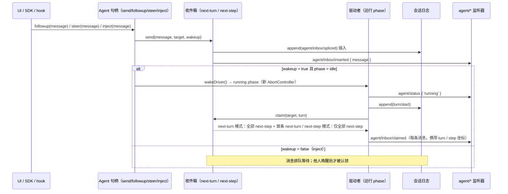
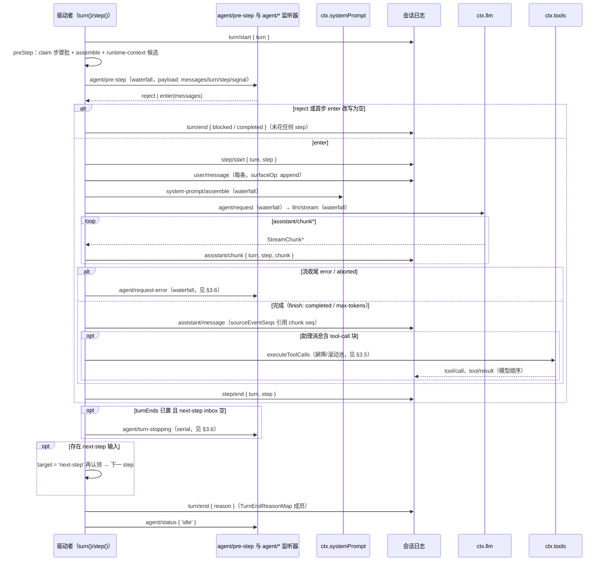
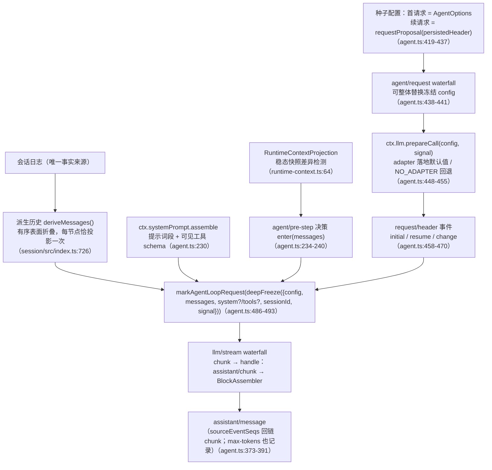
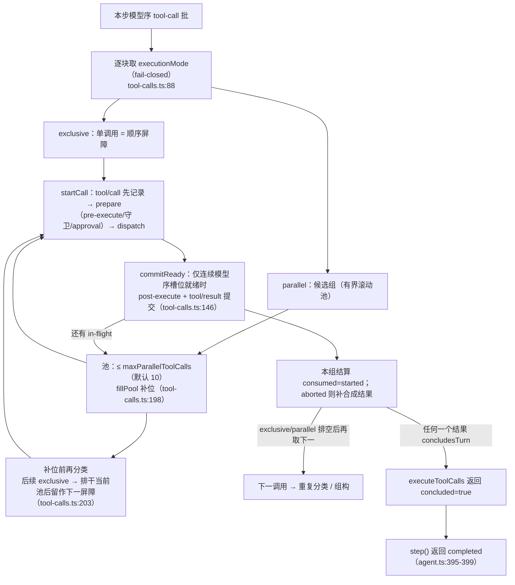
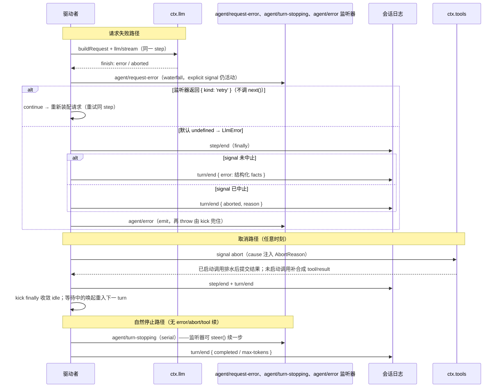

# 02 核心执行循环

> 本维度把 Agent 循环的运行期主干拆开：输入端如何进入收件箱、如何被认领为一个步骤的消息批次，turn 与 step 如何开闭，一次模型请求如何装配与流出，工具调用如何穿过执行管线与调度器落回日志，以及 turn 在何种条件下停止、如何从失败与取消中恢复。全部术语以 [00-概念总览](00-概念总览.md) 为准，本文不重定义已登记概念；新引入的概念一律登记在第 2 节。证据以 `packages/core/agent-loop`、`packages/core/agent`、`packages/core/tools`、`packages/core/session` 的源码行号，以及 [docs/architecture.md](../docs/architecture.md#turn-flow)、[docs/agent-lifecycle.md](../docs/agent-lifecycle.md)、[docs/tool-execution-pipeline.md](../docs/tool-execution-pipeline.md) 为准。
>
> **阅读模式**：每节先讲"你能感知到什么、想实现某功能该怎么做"（【你会看到】/【模型看到】/【插件作者】三镜头），再讲内部如何运作；机制描述始终回扣外部可感知的功能。

## 0. 本维度分析问题

先用用户视角把本维度的领地说清楚。**你作为使用者每天经历、但从未看到内部的一切，几乎都发生在本维度**：

- 你发一条消息，助手开始"转圈"——转圈的背后是本维度讲的驱动者被唤醒、开启一个 turn。
- 你看到模型一边思考一边调工具、工具卡片一张张弹出——每个"思考+一批工具"是一个 step，卡片们在 §3.4/§3.5 的管线与调度器里流动。
- 你在它干活时插一句话，几秒后它的行为变了——那是 §3.1 的收件箱与认领机制。
- 弹出"是否允许执行此命令"的审批框、点了拒绝后模型绕道走——§3.4 的 pre-execute 与审批缝。
- 你点"停止"，界面立刻安静下来但已跑的工具会收尾——§3.6 的取消排水。
- 换了模型下拉、或上下文快满时它自动压缩后继续——§3.3 的请求装配与 §3.6 的失败恢复。

**你作为插件作者要动手的入口也大多在这里**：想拦截/改写进入模型的内容（`agent/pre-step`）、想换模型或参数（`agent/request`）、想做权限策略（`tools/pre-execute`）、想改写工具结果或附加上下文（`tools/post-execute`）、想让轮次停不下来或停得下来（`agent/turn-stopping`）——每个"想在某时机做事"的诉求，对应本维度的一个事件。

本文回答下列问题，按每条输入→turn→step→请求→工具→关闭的顺序组织：

1. **输入如何进入并唤醒驱动**：`followup() / steer() / inject()` 三条投递路径各自落在收件箱哪个列表、哪一条是唤醒输入；驱动何时以何种原因启动。
2. **turn 与 step 的开闭**：turn 的 `turn/start` 在什么点打开、`turn/end` 携带什么原因关闭；step 由哪两个事件成对包围；一次输入如何在一个 turn 里串起连发步骤。
3. **agent/pre-step 决策语义**：收件箱认领后，waterfall 链如何"拒绝"或"进入（enter）"一个步骤；拒绝或改写为空时日志里留下什么。
4. **请求装配**：系统提示词、工具 schema、派生历史与调用配置如何组合成一次冻结的模型请求，`request/header` 何时写入。
5. **工具执行管线**：单次调用的 `tools/pre-execute → 守卫 → tools/execute → tools/post-execute → finalizeContent → tools/result` 各阶段职责，以及 approval 与 deny 分支。
6. **工具批调度**：`parallel` / `exclusive` 两种执行模式如何形成屏障与有界滚动池，结果如何按模型顺序提交。
7. **停止、失败与取消**：`agent/turn-stopping` 的终检语义、`agent/request-error` 的重试契约、取消时已启动调用的排水与未启动调用的合成结果。

概念层面的运行模型、装配与事件分派已由 [00-概念总览](00-概念总览.md) §3 给出；本文只深化"驱动端"的行为。持久化细节（surfaceOp、flush、重放、fork）在 [03-数据平面](03-数据平面.md)，LLM adapter 与流载荷在 [07-LLM接入层](07-LLM接入层.md)。

## 1. 前置概念

- **Agent**（定义：见 00 §2.3）：运行中 agent 的公共句柄。它是本维度全部 `agent/*` 事件的主语，也是监听器唯一面向的接口。
- **Agent 循环（Agent Loop）**（定义：见 00 §2.3）：实现 `Agent` 公开契约的唯一具体驱动者，包 `dsh-agent-loop`。第 3 节分析的正是它的实现类 `ReactLoopAgent`（[packages/core/agent-loop/src/agent.ts](../../packages/core/agent-loop/src/agent.ts:64)）。
- **会话（Session）**（定义：见 00 §2.3）：只追加的 typed 事件日志，驱动者每一次模型可见写入都先落到它。
- **会话日志（Session Log）**（定义：见 00 §2.3）：一个会话的 `SessionEvent[]`，是模型聊天历史的派生来源，从不单独存储。
- **会话事件（SessionEvent）**（定义：见 00 §2.3）：`{ type, seq, time, data }` 判别联合。本文出现的事件名（`turn/*`、`step/*`、`user/message`、`assistant/*`、`tool/*`、`request/header`、`request/context`、`agent/inbox/spliced`）均指这些持久化记录。
- **Turn（轮次）**（定义：见 00 §2.3）：一次输入排空；驱动者在首个输入认领前开 turn，不再欠工作即关 turn，结束于 `turn/end`（携带 TurnEndReason，见 [docs/glossary.md](../docs/glossary.md#turn)）。
- **Step（步骤）**（定义：见 00 §2.3）：一次模型请求加其引发的所有工具执行；一个 turn 含零到多个 step（见 [docs/glossary.md](../docs/glossary.md#step)）。
- **收件箱（Inbox）**（定义：见 00 §2.3）：每个 agent 的两条有序待处理消息列表；`followup()` 投普通轮次消息并唤醒，`steer()` 投最近 step，`inject()` 排队模型可见上下文但不唤醒。
- **效果（Effect）**（定义：见 00 §2.1）：注册即效果；驱动者、调度器与工具注册全部经 `ctx.effect()` / `ctx.on()` 安装并返回 disposer。
- **事件（Typed Event）**（定义：见 00 §2.1）与 **事件分派模式**（定义：见 00 §2.1）：`agent/pre-step`、`agent/request`、`tools/*` 是 waterfall；`agent/turn-stopping` 是 serial；`agent/status` 等是 emit。
- **Waterfall 语义**（定义：见 00 §2.1）：监听器经 `next()` 委托，不调 `next()` 即短路；pre-step 与 request-error 的策略监听器正是靠短路拥有决策。
- **派生（Derivation / `deriveMessages()`）**（定义：见 00 §2.6）：从会话日志沿有序表面折叠出模型可见历史；模型历史永远从日志派生。**模型可见 ⟺ 已入日志**（定义：见 00 §2.6）约束了哪些输入必须走日志通道。
- **上下文（Context，`ctx`）**（定义：见 00 §2.1）与 **服务（Service）**（定义：见 00 §2.1）：驱动者经 `ctx.systemPrompt`、`ctx.llm`、`ctx.tools`、`ctx.agents` 组合能力。
- **作用域（Scope）**（定义：见 00 §2.4）与 **agent.ctx**（定义：见 00 §2.4）：活 Agent 对象自身是 scope key，驱动者的所有分发都带该 agent 的 scope carrier。
- **能力缝（Seam）**（定义：见 00 §2.5）：`ctx.llm` 与 `ctx.tools` 都是独立能力缝；本维度描述的是 Consumer（驱动者）如何调用它们，而非各 Provider 的实现。
- **Branded ID**（定义：见 00 §2.6）：`CallId` 关联 `tool/call` 与 `tool/result`，`MessageId` 标识收件箱里每一条悬置消息。
- **`…Map → 派生联合`**（定义：见 00 §2.6 / 04 细化）：`TurnEndReasonMap` 是本维度直接消费的闭合案例；`SessionEventMap`、`FinishReasonMap` 同型。

## 2. 概念约定

本文在 L0 之上只登记以下六个概念；其余术语一律引用第 1 节。未出现于登记表的新词不得进入第 3 节正文。每个词条先直观后正式。

### 2.1 驱动者（driver）

直观：**发动机里真正转的那根轴**——你界面上看到的"助手正在工作"状态灯，就是它在转。它单调地执行"取消息→开轮→调模型→跑工具→关轮"，直到没有悬置工作才停。

正式定义：在 `ctx.agents.withInitiator()` 内运行、每轮输入端到端实现的 Agent 循环内部执行体。实现类是 `ReactLoopAgent`；`wakeDriver()` 在 phase 为 `idle` 时把 phase 置为 `running` 并 `withInitiator(this, () => this.kick())`（[agent.ts:172-193](../../packages/core/agent-loop/src/agent.ts:172)、[agent.ts:192](../../packages/core/agent-loop/src/agent.ts:192)，见 00 §2.3 Agent 循环）。`kick()` 是驱动者的主循环：单调执行 turn，直到没有悬置工作；异常在驱动边界被兜住，收敛后 `setPhase(idle)` 并在有等待唤起时重入（[agent.ts:210-223](../../packages/core/agent-loop/src/agent.ts:210)）。`kick()` 退出后 `whenIdle()` 达成。

### 2.2 收件箱认领（claim）

直观：**助手从待办队列里"取走"该处理的消息**。关键体感区别：取走 ≠ 回答——一条消息被取走后如果整批被拒（见 §3.2），它在界面上显示"已接收"，但助手从未真正读过它、也不会回复它。

正式定义：从收件箱取走"下一步输入 + 一条排队消息"的过程，`Inbox.claim(target, turn)`（[packages/core/agent/src/inbox.ts:71](../../packages/core/agent/src/inbox.ts:71)）。认领对 `next-step` 取**全部**，对 `next-turn` 仅在 `target === 'next-turn'` 时额外取**一条**；认领通过纯删除的 `agent/inbox/spliced` 记录，不发布 discarded，而由驱动者随后对每条消息单独发布 `agent/inbox/claimed`（inbox.ts:76）。认领的删除意味着被认领但被拒绝的消息**不是**被丢弃——它既不是 discarded，也不重发 user/message（见 §3.2）。

### 2.3 步骤批（claimed batch / entered messages）

直观：**这一次"思考"要一并读进来的那组消息**——可能是一整批工具结果、外加你插的一句话。

正式定义：被一个 `agent/pre-step` 决策收进一个步骤的消息集合。驱动者在 `preStep()` 里用 `claim()` 的结果作为 payload 的 `messages`（[agent.ts:229](../../packages/core/agent-loop/src/agent.ts:229)）；waterfall 最终决策 `enter { messages }` 里的数组就是**进入的消息（entered messages）**，它们在 `step/start` 后被逐条 append 为 `user/message`（[agent.ts:282-284](../../packages/core/agent-loop/src/agent.ts:282)）。决策改写为空或拒绝时，该批被"消费"但不成 step（见 §3.2）。

### 2.4 请求装配（request assembly）

直观：**给模型打包一份"这次要读什么"**：身份说明（system prompt）+ 聊天历史（从日志派生）+ 本次可用的工具清单 + 调用参数（用哪个模型、上限多少）。打包完的请求被**冻结**——路上谁也改不了内容，只允许换配置。

正式定义：把"系统提示词、从日志派生的历史、工具 schema、调用配置"组合成一次模型请求的过程。它不修改日志数据，只组装 + 派生 + 冻结请求对象，并把请求配置快照为 `request/header` 写入日志（见 §3.3、`buildRequest`，[agent.ts:407-495](../../packages/core/agent-loop/src/agent.ts:407)）。

### 2.5 执行模式（execution mode）

直观：**哪些工具能同时跑**。可以并发执行的（读文件、搜索）挤进一个池子里同时转；不能并发的（写文件、跑命令）独占一个位置并形成排队点。判定标准是工具自己声明"我并发安全"——没明确声明的**一律按不安全处理**（宁可慢，不可错）。

正式定义：工具调度的 `parallel` / `exclusive` 分类，`ToolExecutionMode`（[docs/subsystems/tools.md](../docs/subsystems/tools.md#tooldefinition--a-registered-tool)；源码 [packages/core/tools/src/index.ts](../../packages/core/tools/src/index.ts:245)）。分类以可见的工具定义的 `isConcurrencySafe` 纯谓词为据，fail-closed（非精确 `true` 即 exclusive）。调度后果：`exclusive` 单跑并构成顺序屏障，`parallel` 调用可挤入有界滚动池与兄弟并发（见 §3.5）。

### 2.6 代理输入目标（InboxTarget）

直观：待办队列的两条道（见 00 §2.3 收件箱的直观对照）。

正式定义：`next-turn` 与 `next-step` 两条收件箱队列（[docs/subsystems/core.md](../docs/subsystems/core.md#the-agent-handle) 中的 `type InboxTarget`）。`send(message, target, wakeup)` 按目标落队并按需唤醒（[agent.ts:113-120](../../packages/core/agent-loop/src/agent.ts:113)）；`claim` 的取货规则（§2.2）以它为参。

## 3. 分析正文

### 3.1 输入端到驱动：投递、落队与认领

> **【你会看到】** 三种发话方式对应三种体感。**普通消息**（followup）：助手闲着就立即开工，忙着就排队等它干完这一轮。**插话**（steer）：助手正在跑时你发的话——不打断它手上正在执行的工具，但在它**下一次思考之前**被读到。典型体感：你发"等等，别删测试文件"，几秒后它的下一段动作就绕开了测试文件。**注入**（inject）：界面毫无变化——这是插件塞给模型的背景资料（比如"目录里有个 AGENTS.md 说明"），静静躺着，等下次助手思考时一起读。
> **【模型看到】** 没有"打断"这回事——它下一次请求的上下文末尾多了一条 user 消息。在模型眼里历史永远是一条连续的流，"插话"只是抵达时间不同的消息。
> **【插件作者】** 想在"用户插话被听到"的时机做事：监听 `agent/pre-step`（waterfall，可改写或拒绝整批）。只想观察队列变化：`agent/inbox/inserted`（emit）。想给模型塞背景资料：调 `agent.inject()`，别自己拼请求。

三条投递路径在 `Agent` 句柄上是 `followup` / `steer` / `inject` 三个固定预设别名，内部都走统一的 `send(message, target, wakeup)`（[agent.ts:122-132](../../packages/core/agent-loop/src/agent.ts:122)）：

| 方法 | 目标 | 唤醒 | 语义（用户体感） |
|---|---|---|---|
| `followup(message)` | `next-turn` | 是 | 新输入的普通轮次；成为其自身轮次的唯一普通消息 |
| `steer(message)` | `next-step` | 是 | 最近步骤的转向；空闲驱动者也开 turn |
| `inject(message)` | `next-step` | 否 | 排队模型可见上下文，等他人唤起 |

`send` 先经 `inbox.splice(target, Infinity, 0, [message])` 持久化插入，再按是否 `wakeup` 调 `wakeDriver()`（[agent.ts:113-120](../../packages/core/agent-loop/src/agent.ts:113)）。插入即写入 `agent/inbox/spliced` 事件并发布 `agent/inbox/inserted`（[inbox.ts:186-191](../../packages/core/agent/src/inbox.ts:186)）。splice 把错误 id 与顺序对齐于当前投影，因此是"标准数组语义 + 持久化事件 + 实时通知"三份事实的单一提交（inbox.ts:139-146）。唤醒输入若落在已中止的活动上会被重定向到 `next-turn` 并延迟至活动收敛（agent.ts:116-119；[cancel-convergence wake latch 记录](../.agents/notes/implemented/bug-fix/2026-08-07-cancel-convergence-wake-latch.md)）；中间态 `maintenance`（如 `runMaintenance` 的非轮次任务）期间到达的唤醒被闩锁以待重放（agent.ts:172-182）。这些边界处理回扣到一个用户承诺：**你任何时候发消息都不会丢**——取消进行中、维护任务进行中，消息都被接住并在正确时机处理。

驱动者的启用条件：phase 为 `idle` 时，`wakeDriver` 建立 `running` phase、分配该 driver 的 AbortController，并在 `withInitiator` 边界内启动 `kick()`（agent.ts:183-193）。`running` 状态覆盖驱动期间的整个排水区间，可横跨多个排队轮次；`agent/status` 只在 `idle ↔ running` 转换点发布（agent.ts:99-111）——这就是界面状态灯只闪两下而不随每步闪烁的原因。

认领细节（§2.2）在两目标之间按如下规则分出"第一轮"与"续步"：

```text
turn 第一轮：  target = 'next-turn'  →  全部 next-step 输入 + 一条 next-turn 消息
turn 续步：    target = 'next-step'   →  仅全部 next-step 输入（不再吃新的 next-turn）
```

所以一个 turn 内后续步骤不会掺入新到来的下一条普通消息；新普通消息总是开一个新 turn。（用户体感：你排队发的第二条消息不会被塞进第一轮的回应里，而是得到独立的下一轮。）



说明：`inject` 不唤醒驱动，其消息在后续任何一次唤醒——`followup`、`steer` 或已运行驱动者的下一个 step 边界——被认领（[docs/architecture.md](../docs/architecture.md#turn-flow)："Some messages wake it immediately; injected context waits in the inbox until another message does"）。claim 的持久化动作是纯删除 splice（不发布 discarded），随后才逐条发布 claimed（inbox.ts:71-78）。

### 3.2 Turn 与 Step 骨架：认领→进入→请求→关闭

> **【你会看到】** 你的一条消息和助手的最终回答之间的一切活动（思考卡片、一连串工具卡片）构成一个 turn；每张"思考+紧随其后的工具批"大约是一个 step。点"停止"砍掉的是当前 turn。还有一个用户很少注意但日志里诚实记录的现象：**一条被策略拒绝的消息会留下一个"空轮"**——界面显示已接收、助手却从未回应；日志里有一个 turn 打开又关闭、中间没有任何 step，策略的拒绝被记账而非抹掉。
> **【模型看到】** 被拒绝的那个空轮在它读到的历史里**几乎不存在**——没有 user/message、没有 assistant 消息。它不知道自己"错过"了什么。
> **【插件作者】** `agent/pre-step` 是"进入模型内容的总把关"：reject 拒绝整批，enter(messages) 改写后放行（比如脱敏、注入指令、按配额拦截）。被拒消息不会回流队列——如果你要"稍后再试"语义，得自己存起来重新投递。

`turn()` 是驱动者的轮次主体（[agent.ts:246-330](../../packages/core/agent-loop/src/agent.ts:246)）。开 turn 先 `append('turn/start', { turn })`（agent.ts:255）；随后进入 `while(true)` 的 step 提议循环。每次迭代 `preStep(target, { turn, step })` 完成四项工作（[agent.ts:225-243](../../packages/core/agent-loop/src/agent.ts:225)）：

1. `inbox.claim` 取步骤批（§2.3）；
2. `ctx.systemPrompt.assemble()` 汇集提示词段（dispatch.ts 的 `assembleContextFor` 同时绑定 agent 与 scope：见 [packages/core/agent/src/dispatch.ts:174](../../packages/core/agent/src/dispatch.ts:174)）；
3. `RuntimeContextProjection.project()` 产出可变的动态运行时上下文快照（cwd 等），作为 auto 追加的候选（[runtime-context.ts:64-75](../../packages/core/agent-loop/src/runtime-context.ts)）；
4. 分派 `agent/pre-step` waterfall，默认 `enter { claimed ∪ context? }`（agent.ts:234-240）。

**拒绝/进入的决策语义**（agent.ts:266-277，三分支）：

- `decision.kind === 'reject'` → 不 open step，`turnEnds = blocked`，本轮立刻 `return false`。被认领的批次保持在"已移除"状态，日志只留下 `turn/start` 与 `turn/end { blocked }`。
- `turnEnds` 已置且本次改写为空 → 直接 `break`（前一步已给出结束原因，不空转）。
- 首步（step === 0）改写为空 → `turnEnds = completed`，`return false`，**没有** `step/start`。

后两个分支就是"rejected or empty first claim still closes a durable turn that spent no step, so the log records the attempt"（[docs/architecture.md](../docs/architecture.md#turn-flow)）。被拒绝或改写空的消息既非 discarded 也不重发为 `user/message`，但 claimed 通知已经发布（inbox.ts:76），UI 可见"已认领→无 step→轮次关闭"。

进入路径：`append('step/start')` → 逐条 `append('user/message', message, { surfaceOp: 'append' })`（agent.ts:279-284）→ 把 assembly 交给 `step()` → `finally` 中必写 `append('step/end')`（agent.ts:292）。`step()` 内部是"请求→流→工具"的子循环 `while(true)`（见 §3.3、§3.4、§3.6）。

**turn 内连续 step 的转换**：某步 `executeToolCalls` 返回"工具仍欠一次请求"（`concluded === null`）时 `step()` 返回 `null`，`step()` 的 while 立即发起下一次请求；`step()` 返回的原因（`completed` / `max-tokens`）进入 `turnEnds`。每步结束后若 `turnEnds` 已置且 `next-step` 已空，就执行 `agent/turn-stopping`（serial，agent.ts:295-299，见 §3.6）；否则 `target = 'next-step'` 继续认领续步（agent.ts:300）。全部工作排空后 `append('turn/end', { turn, reason })`（agent.ts:316-323），随后若有剩余 inbox 则重开驱动 phase 继续下一 turn，否则 `kick()` 收敛为 idle（agent.ts:324-329）。



说明：`assistant/message` 记录**每次**成功的 provider 调用，包括空内容和 max-tokens 收尾；`max-tokens` 是 sticky 的——只要有一次 step 到达 token 上限，后续正常完成的 step 不得把轮次结局降级（agent.ts:285-290、agent.ts:391）。（用户体感：长回答被截断的那轮，即使模型随后续上，轮次标记仍是"被截断"而非"正常完成"——截断事实优先。）空内容的 `assistant/message` 在派生历史里不出现，但持久化事件携带 usage 与 `sourceEventSeqs`（含显式空表）（[docs/agent-lifecycle.md](../docs/agent-lifecycle.md)）。

### 3.3 请求装配：派生历史、请求水漏与冻结请求

> **【模型看到】** 这是本节的主角——模型每次开口前收到的完整包裹：**system prompt（它是谁、在哪个目录、该遵守什么）+ 从日志派生的聊天历史 + 本次可用的工具 schema 清单（每个工具的名字、参数 JSON Schema、描述）+ 调用配置（哪个 provider、哪个模型、输出上限）**。模型不知道"上下文窗口快满了""刚才换了模型"这些事——它只看到包裹内容；包裹怎么打包是本节机制的事。
> **【你会看到】** 两个可感知现象。（1）**换模型**：界面下拉切换后，下一次请求走新模型——`agent/request` 瀑布替换配置，日志里多一条 `request/header { reason: 'change' }` 快照。（2）**缓存带来的速度/费用**：请求前缀（system prompt + 历史头部）跨次保持字节稳定，provider 端的前缀缓存才能命中——这是为什么动态内容（当前时间等）走"只在变化时重记一条消息"的通道而不是每次塞进 system prompt（见 03-数据平面）。
> **【插件作者】** 两条铁律。想换配置（模型、参数）→ 监听 `agent/request`，返回替换后的配置。**想给模型加内容 → 禁止在这里做**：该瀑布不能改 messages（"this waterfall cannot mutate messages"）；必须走日志通道（`agent.inject()` / post-execute 的 additionalContexts），否则破坏"模型可见 ⟺ 已入日志"（00 §2.6），重放与审计会失去依据。

`step()` 调用 `buildRequest(...)` 前先 `session.deriveMessages()`（[agent.ts:340-342](../../packages/core/agent-loop/src/agent.ts:340)）。派生是按 `surfaceOp` 维护的有序表面、每个节点投影恰好一次的纯函数（[packages/core/session/src/index.ts:726](../../packages/core/session/src/index.ts:726)）；一轮 step 内对同一批派生消息发起一次请求。请求装配的最终产物是 `markAgentLoopRequest(deepFreeze({ ...config, messages, system?, tools?, sessionId, signal }))`（[agent.ts:486-493](../../packages/core/agent-loop/src/agent.ts:486)）——冻结的请求对象既是日志事实的只读投影，也保证监听器无法在发送路径上混入未记录内容。

装配过程分五步（均在 `buildRequest`，agent.ts:407-495）：

1. **种子配置**：首个请求用 `AgentOptions`（provider/model/maxTokens + 恢复的显式 reasoningEffort）；后续请求用 `requestProposal(persistedHeader)`——从上次 `request/header` 的 config 里剥掉 adapter 派生值（reasoningEffort/maxTokens）再作为提案（agent.ts:55-61、agent.ts:419-437）。
2. **`agent/request` waterfall**：监听器可整体替换冻结的调用配置；不带 `provider` / `model` 的结果在发送前被拒绝（"set AgentOptions.provider and AgentOptions.model or supply both via the agent/request waterfall"，agent.ts:438-445）。
3. **适配器解析**：`ctx.llm.prepareCall(proposedConfig, signal)` 让精确 adapter 落地其默认值；未注册路由（NO_ADAPTER）由中间件代答时退回提案配置（agent.ts:448-455）。
4. **请求头快照**：config、system、tools 组装成 `EpochHeader` 并以 `request/header` 事件按 `initial` / `resume` / `change` 记录（agent.ts:458-470）——`request/header` 是会话事件，载荷定义在 03-数据平面，这里只指出它是请求装配的持久化检查点。请求上下文（provider/model/contextWindow）变更时才追加 `request/context`（agent.ts:472-483）。
5. **消息缝合**：`header.config` + 派生消息 + 渲染后的 system + 可见工具 schema 冻结成一个请求（agent.ts:486-493）。

其中 system 提示词来自 `renderPrompt(assembly)`（agent.ts:337），工具 schema 来自 `assembly.tools`（`ctx.systemPrompt.assemble` 已把 `ctx.tools.schemas(scope)` 的 allowlist 投影并入，见 [docs/subsystems/core.md](../docs/subsystems/core.md#the-spine-package-by-package)）。

发送侧：`step()` 用 `preparedCall?.stream(request) ?? this.loopCtx.llm.stream(request)` 进入 `llm/stream` waterfall，逐 chunk 先 `append('assistant/chunk', ...)` 再推进 `BlockAssembler`（agent.ts:343-351），最后 `assistant/message` 以 `sourceEventSeqs: chunkSeqs` 回链全部 chunk（agent.ts:373-390）。流载荷属于 07-LLM接入层，这里只记录行为顺序与日志锚点。（用户体感：界面打字机效果的每个字，都先落一条 `assistant/chunk` 日志再画上屏——刷新/重放出来一模一样。）



说明：装配不改变派生消息集合本身——`deriveMessages()` 是纯投影；`agent/request` 只能换配置，**不能**改消息（runtime-types.ts 中该事件 JSDoc："Model-visible content must use logged channels; this waterfall cannot mutate messages"）。任何想给模型加内容的能力必须走 `user/message` 等已登记事件的日志通道，这正是不变量"模型可见 ⟺ 已入日志"（00 §2.6）在驱动的体现。

### 3.4 工具执行管线：单次调用的决策链

> **【你会看到】** 工具卡片的一生，对应本节管线的各站：卡片**先出现**（`tool/call` 在执行前就落日志——即使后面被拒绝，"模型要求过这个调用"也已记账）；如果是敏感操作，弹出**审批框**（ask → `ctx.approval`）；你点拒绝，卡片变红、显示拒绝原因（deny → 合成 isError 结果）；执行完卡片变绿显示输出。还有一类隐形但重要的体验：模型重复犯同一个错时收到"你已连续第 3 次用相同参数调用此工具"的提醒——那是 `tools/post-execute` 上插件追加的上下文。
> **【模型看到】** 每次工具调用最终都变成**一条工具结果消息**回到它的下一次请求：成功的输出、拒绝的原因（isError）、超时的报错——形式统一，它据此决定下一步。被 deny 的调用不是"消失"，而是"带着拒绝理由的结果"。
> **【插件作者】** 按诉求选站：**权限/审计/拦截** → `tools/pre-execute`（返回 deny/ask/allow）；**不可绕过的强制策略** → 注册单调守卫 ToolGuard（在 pre 之后、无论谁 allow 过都能 deny）；**超时/重试/指标** → `tools/execute`（around 包裹）；**改写结果/追加提醒** → `tools/post-execute`（accept 替换内容、block 附纠正反馈、additionalContexts 附加上下文）。审批方（UI/ACP 桥）实现 `ctx.approval` 的应答。

单次工具调用的完整节流链由 `ctx.tools` 注册表的调度器实现，分 stage：**prepare**（pre-execute + 守卫）→ **dispatch**（around + tool body）→ **finalize/finish**（post-execute + finalizeContent + 通知）。证据链：调度器入口 `prepare`（[tools/src/index.ts:1459](../../packages/core/tools/src/index.ts:1459)）→ `dispatch`（index.ts:1569）→ `finalize`（index.ts:1609）→ `finish`（index.ts:1631）。

1. **参数物化**：`snapshotJsonValue` 把参数无损快照并深冻结；不可 JSON 序列化直接成为错误的 final-result（index.ts:1411-1425）。**参数不可改写**——日志、审计、UI、执行必须一致（[docs/subsystems/tools.md](../docs/subsystems/tools.md#tooldefinition--a-registered-tool)）。（用户体感：卡片上显示的命令与实际执行的命令永远一字不差。）
2. **`tools/pre-execute` waterfall**：默认 `{ kind: 'allow' }`；监听器可 `deny` 或 `ask`（index.ts:1473-1481）。ask 转 `ctx.approval` 一次性确认（`serviceAsk`，[tools/src/index.ts:1689](../../packages/core/tools/src/index.ts:1689)）：缺省无 approval 服务或不可用时 `ask` 降级为 `deny`——"missing approval support turns ask into denial"（[docs/subsystems/tools.md](../docs/subsystems/tools.md#toolspre-execute--waterfall)）。（安全姿态：宁可拒绝，不可放行。）
3. **单调守卫**：allow 后跑所有已注册 `ToolGuard`，任一返回 reason 即 deny；守卫没有 allow 结果，顺序不能把拒绝变回许可（[tools/src/index.ts:1486-1499](../../packages/core/tools/src/index.ts:1486)；`guardReason` 层次见 [tools/src/index.ts:1118-1124](../../packages/core/tools/src/index.ts:1118)：global 层 + scope 链，最远优先）。
4. **`tools/execute` around**：超时/重试/指标包裹 dispatch；可替换 `exec.signal`，但注册表会在进 tool body 前把**原调用方 signal 与 wrapper 替换再融合**——取消无法被 wrapper 剥离（[tools/src/index.ts:1573-1576](../../packages/core/tools/src/index.ts:1573)、[tools/src/index.ts:1532-1560](../../packages/core/tools/src/index.ts:1532)）。tool body 返回的承诺从不被抛弃：已启动的工作会排水至 quiescence。（回扣用户承诺：点"停止"后，已启动的命令会收尾而不是僵尸化。）
5. **`tools/post-execute`**：`accept`（可替换 content 或 value，二选一）、`block`（把纠正性反馈变成 isError）、还可追加 `additionalContexts`（index.ts:1609-1621；PostToolDecision 定义在 [docs/subsystems/tools.md](../docs/subsystems/tools.md#tooldefinition--a-registered-tool)）。
6. **快照归一化 + `finalizeContent` + `tools/result`**：`finishScheduledExecution` 先物化候选结果（快照失败 → JSON 安全 isError），再调用定义方 `finalizeContent`（**只做内容变换**，其余字段注册表所有），最后重新物化并 `notifyResult` —— `tools/result` 是 emit，观察者在冻结不可变结果上只读（index.ts:1631-1646、index.ts:1657-1676）。

日志锚点：`tool/call` 在**执行前**记录并用其 seq 被 `tool/result` 的 `sourceEventSeqs` 引用（[tool-calls.ts:262-265、268-289](../../packages/core/agent-loop/src/tool-calls.ts:262)）；`deferContext` 附加的上下文追加在本执行自身的 `tool/result` 之后（"execution-local canonical value; deliberately omitted from durable events"，[docs/subsystems/tools.md](../docs/subsystems/tools.md#tooldefinition--a-registered-tool)），`additionalContexts` 由驱动的 acceptor 送进 next-step inbox（agent.ts:395-398）。

```mermaid
flowchart TD
  call["assistant/message 含 tool-call 块"]
  logcall["会话事件：tool/call<br/>执行前先记录（tool-calls.ts:262）"]
  present["UI 待办卡片 presentCall(args)"]
  mat["参数无损 JSON 快照 + 深冻结（index.ts:1411-1425）"]
  pre["tools/pre-execute waterfall<br/>allow / deny / ask"]
  aproval["ask → ctx.approval 一次性确认<br/>unavailable/agent-less/fail = deny"]
  guards["注册的单调守卫 ToolGuard<br/>deny(返回 reason) 或 abstain(undefined)"]
  denied["deny：工具主体跳过<br/>物化 isError 结果"]
  around["tools/execute around<br/>超时/重试/指标（可换 signal，body 前再融合）"]
  body["ToolDefinition.execute() body<br/>observes exec.signal"]
  post["tools/post-execute<br/>accept / block / replace content|value / +additionalContexts"]
  norm["注册表外层归一化<br/>快照或 listener 抛出 → isError"]
  fin["finalizeContent<br/>唯一内容域 last-mile 变换（index.ts:1649）"]
  notif["tools/result 同步 emit<br/>冻结 lossless 结局（index.ts:1657）"]
  res["会话事件：tool/result<br/>sourceEventSeqs 引用 tool/call"]
  actx["additionalContexts → 驱动投进 next-step inbox"]
  call --> logcall --> present
  logcall --> mat --> pre -->|allow| guards -->|allow| around
  guards -->|deny| denied
  pre -->|deny| denied
  pre -->|ask| aproval -->|allowed-once| guards
  aproval -->|rejected/cancelled/unavailable| denied
  around --> body --> post
  body -.->|wrapper throws| norm
  pre -.->|throw| norm
  guards -.->|throw| norm
  post -.->|throw| norm
  post --> fin --> notif --> res --> actx
  norm --> fin
  denied --> post
```

说明：未知工具与抛出的工具都以结构化错误结束（`UNKNOWN_TOOL` 等），调用失败而**不结束轮次**（模型看到错误结果后自行决定绕道或重试——这就是为什么"工具失败"通常不会终止你的任务）；`tools/result` 观察者的失败被容纳（notifyResult 内 try/catch）。Filesystem 意图检查（`fs/write-intent` 等）跑在 `tool-fs` 之下，位于本例中的 tool body 内部，不占用通用 pre/post 水漏（[docs/tool-execution-pipeline.md](../docs/tool-execution-pipeline.md)）。

### 3.5 工具批调度：屏障、有界滚动池与模型序提交

> **【你会看到】** 模型一次要求五个动作时，界面上**能并发的卡片同时转**（几个读文件、几个搜索），**不能并发的排队**（写文件、跑命令一张张来）。这就是 parallel/exclusive 分组 + 有界滚动池（默认最多 10 张同时转）的直观投影。
> **【模型看到】** 无论工具实际并发完成顺序如何，**结果严格按它发出调用的顺序**回到它的请求里（模型序提交）——它不会看到"第 3 个调用的结果排在第 1 个前面"这种混乱。
> **【插件作者】** 写工具时声明 `isConcurrencySafe: true` 才能进并发池（不声明=独占，宁可慢不可错）；入池契约：不得变更父级状态。想让某次结果**直接结束整轮**（比如 ask_user 拿到答案后无需再转）：让工具结果携带 `concludesTurn: true`——用数据而非控制流结束循环。

驱动者在 `executeToolCalls` 里逐批调度 assistant 消息中的 tool-call 块（[tool-calls.ts:59-101](../../packages/core/agent-loop/src/tool-calls.ts:59)）。调度按"先分类、再分小组、组内池化"推进：

1. 把本步所有 tool-call 块物化为 `PlannedCall[]`（解析参数、携带 agent）并逐块取 `executionMode`（tool-calls.ts:71-89）。
2. 首个调用的模式决定组构：`exclusive` 组 = 单调用（**形成顺序屏障**）；`parallel` 组 = 剩余全部备选（tool-calls.ts:89）。
3. 组内 `runGroup`（tool-calls.ts:121-246）：`fillPool` 在 `inFlight.size < maxParallelToolCalls`（默认 10，[constants.ts:6](../../packages/core/agent-loop/src/constants.ts:6)，配置可覆盖 [agent-loop/src/index.ts:255-260](../../packages/core/agent-loop/src/index.ts:255)）范围内补位；**每个补位调用再次分类**——若后续调用变成 exclusive，当前池先排干、屏障留给下一组（tool-calls.ts:203-204）。这一"再分类"使运行期注册变化能改变并发形态。
4. `startCall` 先记录 `tool/call`（拿到 seq），再走 `prepare → dispatch/post-result/final-result`（tool-calls.ts:164-196）。
5. `commitReady` 只推进**连续模型序槽位**：第 k 个槽在 k-1 已提交后才提交它的 `tool/result`，保证模型观察到的结果顺序与会话日志顺序一致（tool-calls.ts:146-160）。并发可达于 dispatch，policy、结果与结果上下文都保持模型序。
6. 中止：已启动调用排水并提交，未启动调用逐个补 `tool/call` + 合成 `tool/result`（`TOOL_ABORTED_BEFORE_DISPATCH`），使重放始终闭合（tool-calls.ts:237-241、tool-calls.ts:249-259）。
7. `concludesTurn`：任一成功结果携带 true 时，`executeToolCalls` 返回 `concluded=true`，`step()` 返回 `{ kind: 'completed' }` 结束本步（tool-calls.ts:157、agent.ts:395-399）——这是"用数据而非控制流结束工具轮循环"的反向停机制（runtime-types.ts 的 turn-stopping JSDoc）。



说明：`maxParallelToolCalls` 每个调度组开始时从 `ctx.agentLoop.config` 读取，因此设置变更只影响下一个组（[agent-loop/src/index.ts:329-334](../../packages/core/agent-loop/src/index.ts:329) 注释 "Read through on every scheduler decision"）；`1` 等价于串行（index.ts:255-260）。并行契约：只有 `isConcurrencySafe` 明示 `true` 才能入池，入池调用不得变更父级状态（[docs/subsystems/tools.md](../docs/subsystems/tools.md#tooldefinition--a-registered-tool) 的 parallel-tool-call 契约）。

### 3.6 停止、失败与取消

> **【你会看到】** 四种"轮次没走完"的体验。（1）**点停止**：界面立刻安静，但已启动的工具会收尾（排水），未启动的直接标记"取消前未执行"；排队的消息默认被清掉。（2）**模型 API 报错**（限流、断网）：如果没插件接管，这轮以错误告终、错误卡片可见；如果装了重试/压缩插件（如 compaction 在上下文溢出时），你会看到它"卡了一下然后自己恢复了"。（3）**输出被截断**：达到 token 上限，轮次标记为 max-tokens 而非正常完成。（4）**策略拒绝**：见 §3.2 的空轮。
> **【模型看到】** 取消不留"谁取消的"细节——日志只有 `{kind:'aborted'}`；细因（用户/父级/hook）只在运行时活着。错误是结构化事实（错误码+信息），它可以据此向用户解释。
> **【插件作者】** 三个入口。**反对自然停止**（比如"目标没达成不许停"）：监听 `agent/turn-stopping`（serial、无 next），在里面 `agent.steer()` 投一条续命消息——机器重读收件箱用数据定夺。**接管请求失败恢复**：监听 `agent/request-error`，返回 `{kind:'retry'}` 不调 next() 即拥有恢复（compaction 的溢出恢复就是在这里）。**观察错误**：`agent/error`（emit）。

**turn-stopping（自然停止终检）**：`agent/turn-stopping` 是 serial 事件，仅当"turn 已得到结束原因且 next-step 已空"时被驱动者 await（agent.ts:295-299）。语义：监听器可以反对关闭——通过 `agent.steer(...)` 投新的转向，驱动者随后**重读收件箱**，新转向跑成另一个 step，最终 transition 仍由数据定夺而非监听器顺序（[runtime-types.ts:261-278](../../packages/core/agent/src/runtime-types.ts:261) 的 JSDoc）。`concludesTurn` 是在 step 层把"反向停"提前的资料供给（§3.5）。turn-stopping 之后若 inbox 仍有 next-step 输入则继续续步循环（agent.ts:299-300），最终 `turn/end` 才写出。

**request-error（模型请求失败恢复）**：`step()` 的流循环里，`BlockAssembler.finish` 为 `error` 或 `aborted` 时进入 `agent/request-error` waterfall（agent.ts:354-371）。payload 携带 `failure`（adapter 边界归一化为可序列化事实）与 `retryPolicy`（载荷定义属于 07）。监听器返回 `{ kind: 'retry' }` **不调 next()** 即拥有恢复（短路），`continue` 使同一 step 重新 `buildRequest → stream`；默认按 `next()` 落回 `undefined` → `throw new LlmError(failure)`。正如 [docs/subsystems/core.md](../docs/subsystems/core.md#interception-decisions) 所述：`agent/request-error` 在失败的 step 关闭之后、turn 关闭之前的运行，失败 turn 的信号仍然活着，可被用于修复持久状态或等待策略工作（例：`dsh-compaction-basic` 只在上下文溢出时做修剪/压缩恢复，见 [docs/agent-lifecycle.md](../docs/agent-lifecycle.md)）。

**turn 级错误收尾**：`turn()` 的 catch 对两个结局分类：signal 已中止 → `turnEnds = { kind: 'aborted', reason }`；否则结构化错误 —— `LlmError` 保其 facts，其余错误展平为 `{ message: errorChain(error), code: 'UNKNOWN' }`（agent.ts:302-315）—— 同时 `throwError` 先 `agent/error` emit 再 throw（agent.ts:203-208）。`turn/end` 在 finally 必然写入，报错原因落在 `TurnEndReasonMap`（`completed/aborted/blocked/error/max-tokens`，[packages/core/session/src/types.ts:155-174](../../packages/core/session/src/types.ts:155)）。

**取消**：`Agent.cancel(cause, options)` 默认清空收件箱（`keepInbox` 除外）并向当前活动 phase 的 AbortController 注入原因（agent.ts:134-140）。取消原因（`user/parent/hook/disposed`，TypeScript 强制、同进程输入）在 `turn/end` 只留下粗粒度 `{ kind: 'aborted' }`（core.md 的说明："recording who requested cancellation would require a separate durable event"）。已中止的活动排水到 quiescence：工具调度器补合成结果（§3.5 step 6），被认领而未执行的调用也补 `tool/call`+`tool/result`，使日志闭合可重放；随后驱动者收敛为 idle，若其间有等待唤起则立即重入（agent.ts:216-221）。



说明：`max-tokens` 与 `completed` 的区别在于 step 层返回——`step()` 在 assistant/message 后按 `finish.kind` 与工具批结果决定 `StepEndReason`，且只要任何一步到过上限，结局保持 `max-tokens`（agent.ts:288-290、agent.ts:391）。

## 4. 交叉引用

| 概念 / 面 | 定义来源 | 本文位置 | 指向/细化 |
|---|---|---|---|
| Agent 循环、Agent 句柄、turn、step、收件箱、派生 | [00-概念总览](00-概念总览.md) §2.3、§2.6 | 全文 | 本维度整个实现面 |
| 事件 / 分派模式 / Waterfall 语义 / 效果 / 作用域 | 00 §2.1、§2.4 | §1、§3.2-3.4 | [04-扩展机制](04-扩展机制.md) |
| Turn flow 文本骨架 | [docs/architecture.md](../docs/architecture.md#turn-flow) | §3.2、§3.6 | — |
| 完整时序（agent-lifecycle） | [docs/agent-lifecycle.md](../docs/agent-lifecycle.md) | §3.2 图、§3.6 图 | 与本文时序互为镜像 |
| 工具管线图 | [docs/tool-execution-pipeline.md](../docs/tool-execution-pipeline.md) | §3.4 图 | — |
| Agent 句柄、inbox、取消、pre-step/request-error/request 决策 | [docs/subsystems/core.md](../docs/subsystems/core.md) | §3.1、§3.2、§3.6 | — |
| ToolDefinition、执行模式、PreTool/PostTool 决策、ToolGuard | [docs/subsystems/tools.md](../docs/subsystems/tools.md) | §3.4、§3.5 | [05-能力清单](05-能力清单.md) |
| 会话事件载荷、surfaceOp、request/header | 03 | 只引不定义 | [03-数据平面](03-数据平面.md) |
| llm/stream、StreamChunk、LlmFailure、retry | 07 | 只引不定义 | [07-LLM接入层](07-LLM接入层.md) |
| 会话日志 append/flush/重放持久化 | 03 | §3.1-3.3 | [03-数据平面](03-数据平面.md) |
| turn/step/round 词汇 | [docs/glossary.md](../docs/glossary.md#loop-hierarchy) | §1 | — |

## 5. 合规自查

- [x] §1 前置概念全部引用 00 §2.x；§2 只登记提示允许的六个新概念（驱动者、收件箱认领、步骤批、请求装配、执行模式、代理输入目标）。
- [x] 正文未引入登记表之外的新术语：`EpochHeader`/`request/header`、`assistant/chunk`、`llm/stream`、`agent/*`、`tools/*`、`session/*` 均作为事件/类型名字引用，未虚构定义；`屏障`/`滚动池` 作为执行模式的调度行为描述而非独立概念。三镜头（【你会看到】/【模型看到】/【插件作者】）是全系列约定的阅读锚点，不是新概念登记。
- [x] 每个 major 小节至少 1 幅图，共 6 幅 Mermaid 图，均附说明文字；覆盖 followup→turn→step→request→stream→chunk→tools→step/end→turn/end 完整时序、工具管线全流程（含 approval/deny）、pre-step 拒绝/进入语义、turn-stopping、request-error 与重试、inbox 两目标认领逻辑。
- [x] 关键论断均给出 `file:line` 或 docs 章节证据；只读写作，未修改仓库其他文件。
- [x] 每个分析小节遵循"先能力后机制"模式：开头三镜头锚点（用户现象/模型视角/插件作者入口），机制描述以用户体感回扣（括注"用户体感"）。
- [x] 本文件属于 `架构分析/` 维度文档，不参与 `docs/` 的 doc-sync 与 verify-doc-budgets 门禁。
