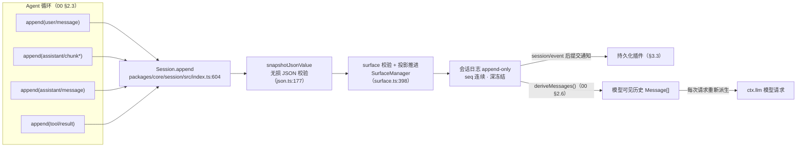
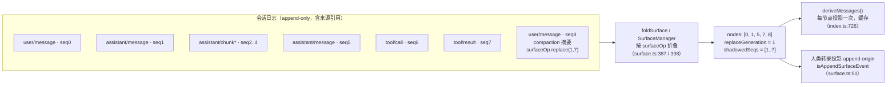
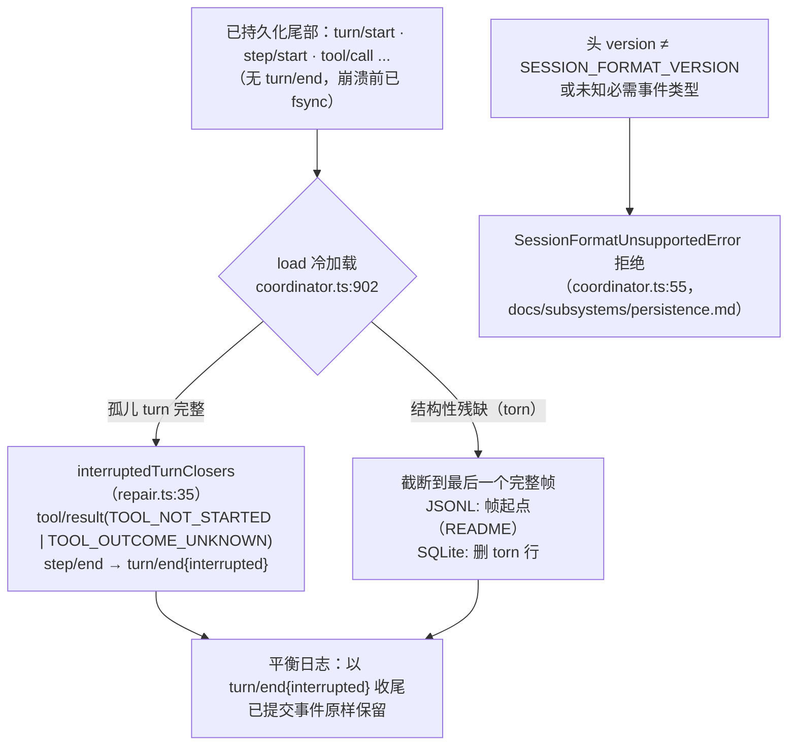
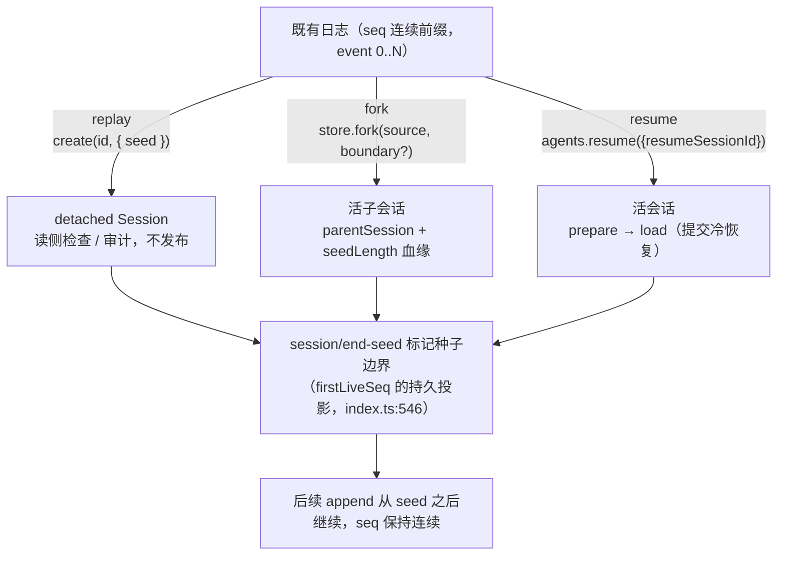
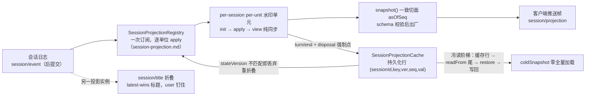

# 03 数据平面：会话日志与持久化

> 本维度分析 dsh 的数据平面：会话日志如何成为 agent 全部交互历史的唯一事实来源；surface 如何把原始日志折叠成模型可见顺序；持久化缝（JSONL/SQLite 两个后端、写入批次、冲刷检查点、崩溃恢复）如何让日志持久；fork/resume/replay 三种重建路径的语义差异；request/header 如何让每次请求成为日志的纯函数；以及 todo 列表、会话标题、查询索引等从日志派生的有状态事件投影。
>
> **阅读模式**：每节先讲"你能感知到什么、想实现某功能该怎么做"（【你会看到】/【模型看到】/【插件作者】三镜头），再讲内部如何运作；机制描述始终回扣外部可感知的功能。

## 0. 本维度分析问题

先用用户视角把本维度的领地说清楚。**你与助手对话产生的一切数据——以及这些数据在你看不见的地方如何被记账、存盘、恢复、分叉——全部发生在本维度**：

- 你在界面上看到的聊天记录、模型"记得"的上下文、存到硬盘上的会话文件，是**同一本账**的三个面孔（§3.1/§3.2）。
- 程序崩溃或断电后重开，对话原样恢复；没跑完的那轮以"被中断"收尾而非凭空消失，已执行但没等到结果的工具调用补上"结果未知"的记录（§3.4）。
- 从某条历史消息"分叉另存"得到分支会话，两边各自继续、互不影响；关掉的会话 resume 接着聊（§3.5）。
- 上下文快满时压缩：界面仍能翻看被压缩前的原文，模型看到的是摘要（§3.2）。
- 会话列表里的标题、todo 列表重启后还在；换模型后对话无缝继续、历史请求可被精确复现（§3.6/§3.7）。

**插件作者在本维度的动手入口**：新增会话事件→声明合并 `SessionEventMap`（§3.1）；做压缩/遮蔽类能力→追加带 `surfaceOp: replace` 的摘要消息（§3.2）；实现新的存储后端→实现 `SessionPersistence` 抽象并跑同一份契约测试（§3.3）；给 UI 派生状态→注册投影单位（§3.7）。

本文回答下列问题：

1. 会话日志如何成为唯一事实来源？"模型可见 ⟺ 已入日志"不变量在哪个边界被强制，坏事件为何不可能到达后端？
2. `SessionEventMap` 如何通过声明合并扩展而不破坏日志的可重放性与持久化契约？
3. surface 如何把 append-only 的原始日志折叠成"模型可见顺序"；compaction 的 replace 如何"删除"历史却不动原始日志，KV 缓存随之发生什么？
4. 持久化缝如何复用同一套会话事件词表（没有并行的持久化事件类型）；JSONL 与 SQLite 两个后端如何满足同一份契约、又在哪些物理维度分化？
5. 冲刷检查点（flush）如何在不阻塞 hot path 的前提下保证因果持久次序；崩溃恢复如何给孤儿 turn 打 `interrupted` 收尾而不截断已提交事件？
6. fork / resume / replay 三种"以事件前缀重建会话"的路径各自服务什么场景，边界条件有何不同？
7. request/header 如何使"下一次请求"可重建，从而闭环"模型可见 ⟺ 已入日志"？
8. 事件投影（投影注册表、持久化投影缓存、会话标题）如何从日志派生有状态值，冷读如何避免全量加载？

## 1. 前置概念

- 会话 / Session（定义：见 00 §2.3）——一次 agent 交互的内存态模型，本质是只追加的 typed 事件日志。
- 会话事件 / SessionEvent（定义：见 00 §2.3）——`{ type, seq, time, data }` 判别联合记录，`seq = log.length` 单调连续。
- 会话日志（定义：见 00 §2.3 会话条目）——agent 全部交互历史的唯一事实来源。
- Turn / Step（定义：见 00 §2.3）——一次输入排空与一次模型请求加其工具执行的嵌套层次。
- 派生 / deriveMessages()（定义：见 00 §2.6）——从日志投影模型可见历史；**模型可见 ⟺ 已入日志** 是持久化不变量的核心。
- 持久化缝（定义：见 00 §2.6）——让日志持久的抽象服务 `ctx.sessionPersistence` + 可互换后端，复用同一套 `SessionEvent` 词表。
- Agent / Agent 循环 / 收件箱（定义：见 00 §2.3）——公共句柄、唯一具体驱动者、两条悬置消息列表。
- 事件 / Typed Event、事件分派模式、效果 / Effect（定义：见 00 §2.1）——服务间通信载体、emit/parallel 等分派模式、"注册即效果"。
- 声明合并、…Map → 派生联合（定义：见 00 §2.6）——扩展 `*Map` 接口的机制，`SessionEventMap` 是六个经典 map 之一。
- 能力缝 / Seam（定义：见 00 §2.5）——Service Definition / Provider / Consumer 三元组；持久化缝是它的一个实例。
- Branded ID（定义：见 00 §2.6）——`SessionId`、`CallId` 等类型层不可互换的字符串 ID。
- 作用域 / Scope（定义：见 00 §2.4）——按 agent 单层分割的注册单元，`session/*` 事件按 owner scope 过滤分发。

## 2. 概念约定（本文引入的术语）

本节每个词条的写法：**一句直观白话（它对应你熟悉的什么体验）→ 正式定义（工程契约）**。

### 2.1 有序表面（surface）

直观：模型每次读历史时的"现行版本"视图。你翻旧消息看到的是全部原文，模型看到的是按 surfaceOp 折叠后的现行表面——压缩之后你看原文、它看摘要，分岔就发生在这层。

正式定义：surface 是**带 surfaceOp 的消息类事件按模型可见顺序组成的投影**：它是会话日志中"会产生 LLM 消息"的那部分事件的活视图。`Session.surface` 返回只读的 `SessionSurface`（`nodes: readonly number[]` + 单调的 `replaceGeneration`），由会话持有的唯一增量 `SurfaceManager` 维护（`packages/core/session/src/index.ts:428`、`packages/core/session/src/surface.ts:398`）。surface 不是历史本身：原始日志永远 append-only，surface 只是按 surfaceOp 折叠出的顺序视图（`packages/core/session/src/surface.ts:387` `foldSurface`）。"模型可见 ⟺ 已入日志"在 surface 的粒度上表述为：**只有入日志且带 surfaceOp 的事件才可能出现在模型历史中**。

### 2.2 SurfaceOp / SurfaceIntent

直观：每条消息类事件入账时都注明"我在模型眼里如何登场"：正常排队追加（append），或用一个新节点顶掉一段旧文（replace——压缩摘要就是这样"替换"历史的）。

正式定义：SurfaceOp 描述**事件如何进入表面**，取值 `'append'` 或 `{ op: 'replace'; start: number; end: number }`（`packages/core/session/src/types.ts:372`）。`append` 追加到尾部，是 user/assistant/tool 消息的正常路径；`replace` 用新节点遮蔽 surface 上从 `start` 到 `end`（含两端）的既有节点，其 `sourceEventSeqs` 必须包含所有被遮蔽的 surface 节点，由 compaction 使用。SurfaceIntent 是 `Session.append` 的参数：消息类事件**必须**声明 `surfaceOp` 与 `sourceEventSeqs`，非 surface 事件在编译期拒绝携带（`packages/core/session/src/types.ts:380`）。append 时对候选做位置替换有效性、唯一来源引用、完整遮蔽覆盖的校验，坏候选在提交前拒绝（`packages/core/session/src/index.ts:604`）。

### 2.3 冲刷检查点（flush checkpoint）

直观：后台存盘的"收账口"。平时写盘攒批异步做、不卡对话；轮次边界由检查点要求"上一轮的账已按因果次序落盘"。

正式定义：冲刷检查点是 `session/flush` 事件在轮次边界**要求持久性因果次序的机制**。`session/event` 是同步通知，持久化插件把事件拷贝进每会话控制器、异步缓冲，不阻塞生产者（`packages/session/session-persistence/src/coordinator.ts:1123`）；`session/flush` 则取消等待、排干至静止，作为循环认领下一条普通 turn 前的次序与错误观察检查点（`docs/subsystems/persistence.md` 冲刷检查点）。它由 `ctx.sessions.flush(session)` 唯一入口分派（并行模式，等待全部监听器），因为 store 持有 carrier（`docs/subsystems/session.md` 生成区 `session/flush`）。循环**不在 turn 边界自动等待 flush**——`dsh-session-checkpoint-policy` 拥有按请求的持久性检查点，读存储的消费方 `whenIdle()` 后自行 flush（`docs/subsystems/session.md` `turn/end` 事件 JSDoc）。其支撑机制是**写入批次（batch）**：首个待写事件开启固定合并窗口（JSONL/SQLite 默认 `writeBatchMaxDelayMs = 200`），后续事件并入不重置 deadline，到期写一个 durable batch（JSONL 一帧、SQLite 一个事务），flush 可随时绕过窗口。

### 2.4 崩溃恢复（crash recovery）

直观：断电/崩溃后的账本修复：不截断已落盘的内容，给没跑完的那轮补一个"被中断"的收尾。

正式定义：崩溃恢复是冷加载时**给孤儿 turn 打 `interrupted` 收尾的修复**。后端 reload 到"`turn/start` 无 `turn/end`"的日志时，不截断——单 turn 可能巨大，且事件在崩溃前已 durable——而是用合成的 `tool/result`（缺失的 `TOOL_NOT_STARTED` / `TOOL_OUTCOME_UNKNOWN` 结果文本）、`step/end`、`turn/end { reason: { kind: 'interrupted' } }` 闭合孤儿 turn（`docs/subsystems/persistence.md` 崩溃恢复、`packages/core/session/src/repair.ts:35`）。`interrupted` 是唯一循环从不发射的 `TurnEndReason`（`packages/core/session/src/types.ts:155`）。修复只针对冷会话；活会话 `load` 等待权威内存快照 durable 并拒绝开放 turn（`docs/subsystems/persistence.md`）。

### 2.5 SessionHeader

直观：流水账的扉页：版本、创建时间、工作目录、从哪个会话分出来——是档案信息而非对话内容，因此不进事件流。

正式定义：SessionHeader 是**与事件日志分开存储的会话元数据**：`{ version, id, createdAt, cwd?, parentSession?, seedLength?, origin?, delegationDepth?, agentPreset? }`（`packages/core/session/src/types.ts:61`）。格式版本、工作目录、血缘、种子边界、委托深度、agent 预设是存储关注点而非对话事件，因此不进 `SessionEventMap`、永不到达 `deriveMessages()`，通过 `session.header` 附着于会话。持久化后端在日志旁存储它；`seedLength` 让 resume 和 replay 区分父历史与子工作，`agentPreset` 持久化是因为它决定恢复会话的工具与提示词组合（`docs/subsystems/persistence.md` SessionHeader）。

### 2.6 事件投影（projection）

直观：从账本算出来的状态视图：todo 列表、会话标题、查询索引。与"派生"的分工：派生给模型看，投影给 UI/客户端看，且投影状态可持久化。

正式定义：事件投影是从日志派生的**有状态折叠**：todo 列表（`todo/write` 整表快照）、会话标题（`session/title`）、查询索引等。与派生（deriveMessages，00 §2.6，模型可见历史）不同，投影不面向模型请求，而面向 UI/客户端消费，且状态可持久化。`SessionProjectionRegistry` 一次订阅 `session/event`，对每个注册单位（`init` / `apply` / `view` 三个纯同步函数 + `stateVersion`）折叠每个已提交事件（`docs/subsystems/session-projection.md` 单位与注册表）。整值事件规则是承重设计：带状态的事件携带完整变更后状态，绝无裸 delta，使每次转移廉价、每个值自描述（latest-wins）。

### 2.7 fork / resume / replay

直观：从历史前缀开出会话的三个入口：fork 分叉出分支会话（原会话不动）、resume 把存盘会话接着聊、replay 只读回放审计。

正式定义：以事件前缀重建会话的三种路径，共用 `ctx.sessions.create(id, { seed })` 这一低层原语：

- **replay**：`create(id, { seed: seedEvents })` 校验并冻结一段连续当前格式日志，重建其 surface——读侧检查/审计，不发布（`docs/subsystems/persistence.md` CreateSessionOptions）。
- **fork**：`ctx.sessions.fork(source, boundary?, childSessionId?)` 选源会话事件到包含性 `boundary` seq（默认当前最后一条），要求前缀不落在开放 turn 内，创建带血缘元数据（`parentSession`、`seedLength`、继承 `cwd`）的活子会话（`docs/subsystems/session.md` live-session fork API、`packages/core/session/src/index.ts:792` SessionStore）。
- **resume**：`ctx.agents.resume({ resumeSessionId })` 把持久化会话恢复成活 agent，内部经 `prepare(id)` → `load(id)`（后者提交必需的冷恢复）交付（`docs/subsystems/persistence.md` CreateSessionOptions、`packages/session/session-persistence/src/index.ts:155`）。

三种路径构造出的会话都以 `session/end-seed` 事件标记种子边界——它是 `firstLiveSeq` 的持久投影（`packages/core/session/src/index.ts:546`）。

### 2.8 EpochHeader / request/header 事件

直观：每次请求的"装箱单"也记进账本：模型与参数、系统提示词全文、工具清单——任何一次历史请求都能从日志原样重建。

正式定义：EpochHeader 是**请求头快照**：`{ config, adapterDefaults?, system?, tools? }`（`packages/core/session/src/types.ts:201`）。它由 `request/header` 事件以完整快照形式记录在日志里（reason `'initial'` / `'resume'` / `'change'`，`packages/core/session/src/types.ts:228`），是**记录在日志里的会话状态**：配置、系统提示、工具 schema 都在日志中，因此"重建一次请求"所需的一切是日志的纯函数——`foldRequestHeader(events)` 选最新快照即可重建（`packages/core/session/src/request-header.ts:65`）。配套的 `request/context` 记录路由容量元数据，只在该路由/provider/model 变化时追加，不进 EpochHeader（`packages/core/session/src/types.ts:213`）。

### 概念登记表

概念登记表声明"术语→定义所在"。"直观对照"列给出该术语对应的用户可感知概念——它是阅读锚点，不是定义。

| 概念 | 定义 | 一句话 | 直观对照（用户可感知） |
|---|---|---|---|
| 有序表面 / surface | 本文 §2.1 | 带 surfaceOp 的消息类事件按模型可见顺序组成的投影 | 模型读的"现行版本"历史；你翻旧账看原文，它看折叠后的 |
| SurfaceOp / SurfaceIntent | 本文 §2.2 | 事件如何进入表面（append / replace[start,end]）及 append 参数 | 每条消息注明"如何登场"：排队追加，或用摘要顶掉一段 |
| 冲刷检查点 / flush checkpoint | 本文 §2.3 | session/flush 在轮次边界要求持久性因果次序的机制 | 轮次边界的"收账口"；平时攒批异步存盘不卡对话 |
| 崩溃恢复 / crash recovery | 本文 §2.4 | 冷加载时给孤儿 turn 打 interrupted 收尾的修复 | 断电重开对话还在；没跑完的那轮标"被中断"而非消失 |
| SessionHeader | 本文 §2.5 | 与事件日志分开存储的会话元数据 | 流水账的扉页：版本、时间、目录、血缘 |
| 事件投影 / projection | 本文 §2.6 | 从日志派生的有状态折叠（todo、标题、查询索引） | 从账本算出的 UI 状态（todo/标题）；给界面看，不是给模型 |
| fork / resume / replay | 本文 §2.7 | 以事件前缀重建会话的三种路径 | 分叉分支 / 接着聊 / 只读回放 |
| EpochHeader / request/header | 本文 §2.8 | 请求头快照；记录在日志里的会话状态 | 每次请求的装箱单也记账：模型、提示词全文、工具清单 |

## 3. 分析正文

### 3.1 会话日志：唯一事实来源与"模型可见 ⟺ 已入日志"

> **【你会看到】** 你在界面上看到的聊天记录、模型"记得"的上下文、导出/恢复的会话数据，永远出自**同一本只许往后写的账**——不存在"界面显示一套、模型记得另一套"。这本账还自带质检：进不了 JSON 的脏数据在入账前就被拒绝，绝无"坏记录写进会话文件"。
> **【模型看到】** 它每次开口前读到的历史是从这本账**当场投影**出来的；账本里的 turn/step 边界、流式 chunk 等结构记录对它不可见——它只见到消息。
> **【插件作者】** 新增事件：用声明合并向 `SessionEventMap` 添类型（合并的都是 log-only、不产生 LLM 消息）；想让不认识它的旧读者安全跳过，信封标 `ignorable: true`。你合并的事件的关系不变量由你（声明它的插件）负责，核心在 `switch` 的 documented `default` 上放行。

`SessionEventMap`（`packages/core/session/src/types.ts:236`）定义核心事件词表，十二类事件分属两个族：**消息类**（`user/message`、`assistant/message`、`tool/result`，即 `SurfaceEventType`，`types.ts:343`）与**结构/log-only 类**（`turn/*`、`step/*`、`assistant/chunk`、`tool/call`、`todo/write`、`request/header`、`request/context`、`session/end-seed`）。事件信封 `SessionEvent`（`types.ts:404`）是 proper discriminated union：`switch (event.type)` 无需 cast 即收窄 `event.data`；`seq` 单调且 `seq = log.length` 连续（`docs/subsystems/session.md` SessionEvent）。

**不变量在 append 边界强制**，而非在持久化边界。`Session.append` 的每一条路径（`packages/core/session/src/index.ts:604`）：

1. 用 `snapshotJsonValue` 对 `data` 与 surface 元数据做单遍无损 JSON 校验 + 拷贝（`packages/core/session/src/json.ts:177`）——BigInt、函数、符号、undefined、-0、非有限数、循环引用、稀疏数组、Map/Set/Date 等在源处拒绝；
2. 对 surface 候选做标记形状、来源引用唯一性、位置替换有效性、完整遮蔽覆盖校验；
3. 同步提交入日志（冻结）、再经 `session/event` 通知观察者，观察者失败按监听器独立包含，不改变提交结果（`index.ts:382` `invokeContainedSessionObservers`）。

由此，"事件已入日志"= "事件可持久化"：`session.events` 恒等于后端能持久化的内容（`docs/subsystems/session.md` 持久化契约），坏事件绝无可能到达 flush。

**声明合并保持词表可扩展而日志可重放**：插件用 `declare module '@deepseek-ai/dsh-session/types'` 向 `SessionEventMap` 合并新类型（compaction seam 的 `compaction/start` / `summary` / `end`、hook bridge 的 `hook/*`、bounded recovery 的 `llm/retry`，见 `docs/subsystems/compaction.md:11`）。合并的事件**都是 log-only**（不产生 LLM 消息、无 surfaceOp）；其关系不变量（是否允许独立于 turn 存在）归声明它的插件，核心在 `switch` 上对未知类型落到 documented `default` 而不是 `assertNever`（`docs/subsystems/session.md` SessionEvent 段）。信封的可选 `ignorable: true` 标记"读者不识此类型时可安全跳过"；缺席即"必须认识"——遇到不认识且不可忽略的类型，读者拒绝重建会话而非静默丢弃（可能改变其余日志的解释），这就是 `SESSION_FORMAT_VERSION = 0` 时代的版本机制（`types.ts:56`、`docs/subsystems/session.md` 信封 JSDoc、`docs/persistence-catalog.md:10`）。

模型请求装配把日志作为唯一输入：循环经 `ctx.systemPrompt` 装配请求前缀，从日志派生历史，流式调模型，再把每个模型可见事实追加回日志（`docs/subsystems/core.md:9`）。派生与持久化都只读这份日志，形成"日志 → 派生 → 模型"的单向数据流。（用户体感：界面上看到的与模型读到的永远同源——断线重开、导出、审计用的都是这一本账，不存在两份对不上的记录。）

**`session/event` 是唯一的发布通道**，但依赖关系上它比"日志的镜像"更多：appending 发布是后提交（commit 之后回调才跑）且 fire-and-forget，观察者失败被记录并包含、不改变提交结果（`docs/subsystems/session.md` 生成区 `session/event`）。语义上它与日志本身有两处刻意差异：其一，**构造器种子不发布**——seed 事件（replay/fork/resume）经构造而非 append 进入日志，因此把重放当发布替身的消费方（telemetry adoption）从 `firstLiveSeq` 起读，而不是从 seq0；其二，持久化插件要的是"提交的拷贝"，UI/投影要的是"逐事件的折叠输入"，两者都从同一个后提交通知派生，绝无第二份写路径。

**关系不变量在日志上断言**：可选的 `dsh-session/invariant` companion 把核心拥有的关系交给 `ctx.invariants`——单调 seq、turn/step 编号与包含关系、同 step 工具调用/结果配对（`packages/core/session/src/invariant.ts:55`）。它是"运行时不变量断言被断言的所有者关系"的落地：检查权威数据流（事件序），而不是服务存在性或插件元数据。合并事件的关系归声明它的插件，核心不因"未知事件、无 turn 开放"而拒绝——这是 `packages/AGENTS.md` 约定的具体实例。



图 3.1：数据平面的一条主轴。append 的校验、提交、发布是一条同步链，坏事件在入日志前被拒；持久化插件只观察已提交事件（fire-and-forget），模型历史每次从日志重新派生——三条下游（持久化、派生、模型请求）共享同一个只追加源。

### 3.2 surface：从日志到模型历史的投影路径

> **【你会看到】** 压缩之后，你往上翻旧消息仍然是**全文**，模型下一次请求读到的却是**摘要**——这不是两份记录打架，而是同一本账的两种读法：人类转录读"原始登场过的消息"，模型读"折叠后的现行表面"。
> **【模型看到】** 摘要以一条普通 user 消息出现在历史中段；被遮蔽的旧消息（含工具结果）从它的输入里整体消失，提供方前缀缓存从首个被遮蔽消息起失效。
> **【插件作者】** 做压缩/遮蔽类能力：追加一条带 `surfaceOp: { op: 'replace', start, end }` 的 `user/message`（摘要本体），`sourceEventSeqs` 必须覆盖全部被遮蔽节点；压缩过程自身的记账用声明合并的 `compaction/*` log-only 事件。**不要删日志**——原始记录永远保留，"删除"只发生在表面上。

原始日志里消息类事件与结构事件交错，且 compaction 会用新节点遮蔽旧节点，因此"模型可见顺序"不是简单的日志顺序。surface 层负责解决这件事：

- **foldSurface 全量重放**：把完整日志按 surfaceOp 折叠，返回当前 `nodes` 与每次替换的 `SurfaceFoldReplacement`（含实际遮蔽的 `shadowedSeqs`）（`packages/core/session/src/surface.ts:387`、`surface.ts:117`）；加载/恢复的种子走这条路。
- **SurfaceManager 增量推进**：活会话持有唯一实例，`validateNext` 在提交前验证候选、提交后 `_processDelta` 只折叠新事件，替换使 `replaceGeneration` 递增（`surface.ts:370`、`surface.ts:398`）——消费方可据此区分"纯尾部增长"与"一次重写"。
- **deriveMessages 缓存投影**：每个 surface 节点恰好投影一次（首次见到时），一次调用成本 O(新节点)，surface 重写（`replace`）触发重建；返回的是每次调用新建的数组，但 `Message` 对象共享且深冻结（`packages/core/session/src/index.ts:726`、`docs/subsystems/session.md` 派生段）。`deriveEventMessage` 是逐节点纯函数，公开给外部重建器，使其与缓存不可能分歧（`surface.ts:83`）。

投影规则（`docs/subsystems/session.md` 派生段）：`user/message` → user 消息（内容逐字）；`assistant/message` → assistant 消息（携带 provider/model）；`tool/result` → 带 tool-result 块的 user 消息；injected context 的 user 消息按其时间位置逐字进入。**结构性事件（`turn/*`、`step/*`）与原始 `assistant/chunk` 都被跳过**——组装后的 `assistant/message` 才是权威；空内容 assistant/message 也跳过（max-tokens 截断保留 usage/provider/model 但不进模型转录）。token 记账读 per-step `assistant/chunk { type: 'usage' }`，`assistant/message.usage` 是无 usage chunk 时的回退。

**compaction 的 replace 是关键用例**：压缩缝通过声明合并追加 `compaction/*` 三个 log-only 事件记录锁、摘要、遮蔽范围与 token 数；摘要本身承载在一条带 `surfaceOp: { op: 'replace', start, end }` 的 `user/message` 上，这是摘要压缩唯一的 surface 变更（`docs/subsystems/compaction.md:11`）。`dsh-compaction-tool-result-pruner` 则追加内容剪枝的 `tool/result` 替换。replace 的效果（`packages/core/session/README.md` 模型体验）：

- **Token 效果**：被遮蔽条目从未来输入中移除，但原始日志记录保留；
- **KV 缓存效果**：append 保持可复用前缀，replace 从首个被遮蔽消息起使前缀失效——尽管事件日志仍 append-only。

（用户体感：压缩发生后，"看得到历史"与"带着历史跑"从此是两种读法——你翻旧账仍见全文，模型输入里那段已被摘要替换，长对话因此得以继续而不溢出。）

一个设计后果：**人类转录必须投影 append-origin 事件**（`isAppendSurfaceEvent`），因为落地的 replace 会遮蔽读者已见过的历史；模型面向消费方读 `session.surface`（`docs/subsystems/session.md` SurfaceIntent 段、`packages/core/session/README.md` surface 类型）。

surface 折叠的窗口边界也值得注意：`SurfaceManager(log, baseSeq)` 可以折叠"首事件绝对 seq 为 baseSeq 的连续加载窗口"——加载/恢复路径把窗口外的历史交给验证器，窗口内每个事件仍在绝对 seq 空间里保持连续，跨窗口头的替换因声明范围缺席而失败（`docs/subsystems/session.md` SessionSurface 段）。这使持久化读取可以只折叠后缀（配合 §3.7 的投影冷读）而不丢失表面语义。



图 3.2：一次 compaction replace。seq0 的 user/message 与 seq8 的摘要节点都在 surface 上；seq1..7 的节点被遮蔽——对模型（右侧派生）消失，但对日志仍是可重放的原始记录；chunk 与结构事件从不进入 `nodes`。`replace` 的 `start`/`end` 是 surface 位置跨距而非 seq 数值区间，替换可使可见 seq 非单调（`docs/subsystems/compaction.md:46`）。

### 3.3 持久化缝：后端、写入批次与冲刷检查点

> **【你会看到】** 三个可感知事实。（1）存盘不卡对话：写盘在后台攒批（默认 200ms 一窗），轮次边界才由检查点收账；（2）装哪个后端由配置决定——每会话一个 JSONL 文件还是一个 SQLite 库——对你的使用无感（两者满足同一份契约）；（3）后台写失败不会悄悄丢数据：显式 flush 立即重试并经 `agent/error` 报出（错误对用户可见）。
> **【插件作者】** 实现新后端 = 实现 `SessionPersistence` 抽象（locate/create/append/load/…）+ 跑两个后端共享的 `runPersistenceContract` 契约测试；持久化的就是内存会话事件本身——**没有并行的持久化事件类型**，不要自建第二套词表或第二份写路径。

持久化缝是能力缝（00 §2.5）的一个实例：抽象服务 `SessionPersistence`（`packages/session/session-persistence/src/index.ts:84`）定义 locate / create / append / prepare / load / inspect / readFrom / list / listSnapshots，**没有并行的持久化事件类型**——后端持久化的就是内存会话事件本身（`docs/subsystems/persistence.md:7`）。两个后端实现同一抽象并共享 `runPersistenceContract` 契约测试套件：

| 维度 | JSONL（`session-persistence-jsonl`） | SQLite（`session-persistence-sqlite`） |
|---|---|---|
| 物理模型 | 每会话一个逻辑 JSONL 日志，`.jsonl.zstd`（逐帧校验和）或裸 `.jsonl`（`README.md` 磁盘布局） | `node:sqlite`，`events` 表每事件一行 `(session_id, seq, type, time, data, source_event_seqs, surface_op)`，行即事件（`README.md` 存储模型） |
| 文件位置 | `<root>/--<normalized-cwd>--/<encoded-id>/session.jsonl[.zstd]`；`locate` 返回绝对路径 | 全会话共享一个数据库；`locate` 返回 `undefined` |
| 压缩 | `packChunks: true` 时 ≥3 条连续同块 `assistant/chunk` 压成一行 packed row（~60% 体积），读取布局无关（`chunk-rows.ts:192/339`） | 无压缩，每 chunk 一行 |
| 原子写 | 临时文件 + POSIX `link()`（无覆盖）或 Windows `MoveFileExW(MOVEFILE_WRITE_THROUGH)`；追加路径 fsync，失败回滚到先前字节长度 | `append` = 一个 `BEGIN`/`COMMIT` 事务，先断言连续 seq，mid-batch 失败整体回滚 |
| 版本门 | 先从裸头行拒外来 `SESSION_FORMAT_VERSION`，再校验结构 | 先用 `PRAGMA application_id` + `user_version`（`SCHEMA_VERSION`）门住整个文件结构 |
| 读取能力 | `readFrom` 顺序介质，整件解析后跳过；`listSnapshots` 用 device/inode/size/mtime 识别 | `readFrom` 按 seq 寻址只读后缀 |

**写路径三段式**（两个后端一致，`packages/session/session-persistence-jsonl/README.md` 写路径、`session-persistence-sqlite/README.md` 写路径）：

1. **入队**：持久化插件在 `session/created` 捕获 header、持久化 fork 种子一次；在 `session/event` 拷贝每个已冻结事件进该会话的 `SessionWriteBehind`（`packages/session/session-persistence/src/coordinator.ts:1118-1126`）。每会话游标防止 resume 后重复追加已存事件。
2. **批次**：首个待写事件开启固定窗口（`writeBatchMaxDelayMs`，默认 200ms），后续事件并入不重置 deadline；到期写一个 durable batch，写期间新到事件获得自己的窗口。
3. **冲刷检查点**：`session/flush` 取消等待、排干至静止（`packages/session/session-persistence/src/write-behind.ts:63`、`coordinator.ts:1129`）；dispose 执行同样最终排干。循环在轮次边界之前经 `ctx.sessions.flush` 观测写入失败：被拒绝的后台写保留其事件、暂停自动重试，显式 flush 立即重试并经 `agent/error` 报告。

（用户体感：对话不因存盘而卡顿——写盘在后台攒批，轮次边界才要求收账；写坏了你会看到错误，而不是事后发现少了一段历史。）

`prepare` / `load` / `inspect` 共享 coordinator 的生命周期：`SessionPreparation` 持有一个未发布的精确 Session 直到发布或回滚；`inspect` 构建不可变逻辑视图但不提交恢复；coordinator 保留最近冷读的未发布 Session（`preparedSessionCacheSize`，默认 5）供后续 `prepare` 复用，同一会话一次读、解压、校验、冻结（`docs/subsystems/persistence.md` 准备与恢复所有权、`coordinator.ts:588`）。

**读侧还有三条不重建完整 Session 的通道**（`packages/session/session-persistence/src/index.ts:84`）：`readFrom(id, fromSeq)` 是从 seq 起的物理后缀读——投影缓存据此只折叠检查点之后的事件，SQLite 按 seq 寻址只读后缀、顺序介质（JSONL）仍整件解析后跳过（`index.ts:220`）；`locate(meta)` 同步解析后端拥有的独立工件路径（JSONL 返回绝对 transcript 路径、SQLite 返回 `undefined`），是位置提示而非授权或新鲜度保证（`docs/subsystems/persistence.md` SessionLocation）；`readRaw(id)` 返回后端原始工件文本、不经解析重建，保留后端的序列化细节（chunk 打包、键序、换行）供诊断/导出，JSONL 支持而 SQLite 不支持（`supportsRawArtifacts`）。`listSnapshots` 用 `SessionPersistenceRevision` 品牌化令牌标识"哪个源 + 哪个版本"，变化在 append 或变更型 load 修复的事务中完成，未变日志多次观察返回同一 revision（`docs/subsystems/persistence.md` 轻量版本）。

```mermaid
sequenceDiagram
    participant Loop as Agent 循环
    participant S as Session
    participant C as 持久化插件<br/>coordinator.ts:1123
    participant WB as WriteBehind<br/>write-behind.ts:22
    participant BK as 后端 JSONL/SQLite
    Loop->>S: append(...)
    S->>C: session/event（后提交同步通知）
    C->>WB: enqueue(event)（拷贝）
    WB->>WB: 首个事件开固定窗口<br/>writeBatchMaxDelayMs
    Note over WB: 后续事件并入，不重置 deadline
    WB->>BK: 窗口到期 → 一个 durable batch<br/>JSONL 一帧 / SQLite 一个事务
    Loop->>C: session/flush（冲刷检查点）
    C->>WB: flush() 取消等待、排干至静止
    WB->>BK: 排干 append（fsync / COMMIT）完成后 resolve
    Loop->>Loop: 认领下一条普通 turn 前<br/>dsh-session-checkpoint-policy 拥有按请求检查点
```

图 3.3：hot path 不被 I/O 阻塞——append 是同步提交 + 异步持久；`session/flush` 是把"已提交但可能仍在缓冲"的因果次序收敛到 durable 的唯一屏障，监听器并行跑、调用方等待全部 settle（`docs/subsystems/session.md` 生成区 `session/flush`）。

### 3.4 崩溃恢复：interrupted 收尾

> **【你会看到】** 断电/崩溃后重开：对话恢复，中断的那轮以"被中断"收尾——**已写盘的内容一字不丢**，包括那轮里已执行但没等到结果的工具调用。
> **【模型看到】** 缺失结果的工具调用以合成结果回到它的历史：`TOOL_OUTCOME_UNKNOWN`（附带指引——只重试只读/幂等操作、副作用先核外状态或问用户）或 `TOOL_NOT_STARTED`。它像读到普通工具结果一样据此继续。
> **【插件作者】** 崩溃恢复不需要插件级恢复代码——修复发生在持久化后端的冷加载；你要做的是把自己合并事件的关系不变量声明清楚；活会话的恢复语义由 load 的平衡检查保证。

后端 `load` 冷加载时若发现尾部是开放的（`turn/start` 无 `turn/end`），分两类处理（`packages/session/session-persistence/src/coordinator.ts:902`、`docs/subsystems/persistence.md` 崩溃恢复）：

1. **完整的孤儿 turn 保留**：单 turn 可以极大（长程任务、大量工具输出），事件在崩溃前已 durable，不能丢弃。恢复器 `interruptedTurnClosers`（`packages/core/session/src/repair.ts:35`）从开放边界反向推断缺失的工具结果，合成：工具调用无 durable 结果 → `tool/result` 带 `TOOL_OUTCOME_UNKNOWN`（错误文本指示模型只重试只读/幂等操作、副作用先核外状态或问用户）；assistant 工具请求无 durable `tool/call` → `TOOL_NOT_STARTED`（"工具调用在 Harness 记录其开始前被中断"）；再补 `step/end`、`turn/end { reason: { kind: 'interrupted' } }`（`repair.ts:110/129/131`）。
2. **结构性残缺尾部（torn）截断**：JSONL 从最后一个完整帧起点截断、保留其完整解码记录再重编码；SQLite 删除 torn 尾行。只丢弃"撕裂的最终记录"，已提交前缀一概不动。

修复只发生在冷会话；对活 id，`load` 等待权威内存快照 durable 且仅当平衡时返回，开放活 turn 拒绝而非合成中断边界；HMR 采纳活前缀时不开其活动 turn（`docs/subsystems/persistence.md`）。`inspect` 只在内存中合成 closers，不写物理、不改轻量 revision。（用户体感：恢复的原则是"补收尾"而非"截断"——崩溃不丢已落盘的对话，没跑完的那轮带着"结果未知"的记录留在历史里。）

**格式拒绝**是崩溃恢复之外的另一道读侧防线：`SessionFormatUnsupportedError`（`coordinator.ts:55`）区别于 `SessionPersistenceCorruptionError`（`coordinator.ts:36`）——前者"没什么损坏，只是这个 build 不能忠实读它"。头 `version` 超前命名方向（"新 harness 写的，升级再开"）、落后声明无升级路径；`KNOWN_SESSION_EVENT_TYPES`（`packages/core/session/src/known-event-types.ts:19`）之外的事件类型除非带 `ignorable: true` 同样拒绝（`docs/subsystems/persistence.md` 格式拒绝）。



图 3.4：崩溃恢复把"开放 turn"收成"以 `interrupted` 平衡的日志"，把 torn 尾截掉，但绝不改崩溃前已提交的事件；格式拒绝则保证 build 不会把不能忠实解释的日志当作可恢复的输入。

### 3.5 fork / resume / replay：三种重建路径

> **【你会看到】** 三种"从历史前缀开新会话"的入口。**fork**：从某个稳定轮次边界分叉出分支会话（血缘记着父会话与种子长度），原会话不动；**resume**：把存盘的会话恢复成活 agent 接着聊；**replay**：只读回放——审计/检查用，不发布不绑定。
> **【模型看到】** 无论哪条路径重建，它读到的历史前缀完全相同——重建方式对模型视角无差别；分界是一条 `session/end-seed` 标记，之后才是本生命周期的新工作。
> **【插件作者】** fork 要**显式**给 boundary（拒绝隐式裁剪）；子代理这类"父轮还开放"的启动场景保留专门的前缀裁剪（`dsh-subagent-fork-in-process`）。给会话列表按人类活动排序的消费方，记得把 end-seed 排除出去。

三者的共同种子机制：`ctx.sessions.create(id, { seed })` 校验并深冻结一段连续当前格式日志、重建其 surface；构造器随后追加 `session/end-seed` 作为其首个活写入，标记种子边界（`packages/core/session/src/index.ts:539/546`）。该事件是 `firstLiveSeq` 的持久投影：持对象者读字段、只持存储字节者读事件，两者回答同一个"本生命周期的工作从哪里开始"。种子已以 `session/end-seed` 结尾则不重复标记，因此未触碰会话的重开不增长日志；显式空种子在 seq0 写标记，区分"空 resume 会话"与"全新会话"（`docs/subsystems/session.md` end-seed 边界）。（用户体感：从某条历史消息之前"另存为分支"后，两边各自继续、互不影响；只是打开看看而没新对话的会话，重开也不会凭空多出记录。）

| 路径 | 入口 | 语义 | 边界条件 | 血缘 |
|---|---|---|---|---|
| replay | `ctx.sessions.create(id, { seed })` | detached 重建，不发布、不绑定 fiber | 种子须连续、当前格式；request header / assistant message 须带 provider/model | 无 |
| fork | `ctx.sessions.fork(source, boundary?)` | 活子会话，深克隆种子 + 子元数据 | 前缀必须落在开放 turn 之外；显式 boundary 可从任何稳定轮次间位置分叉，拒绝隐式裁剪 | `parentSession` + `seedLength` |
| resume | `ctx.agents.resume({ resumeSessionId })` | 持久化会话恢复成活 agent | 经 `prepare` → `load`；load 提交必需的冷恢复 | 继承 `SessionHeader` 全部字段 |

fork 的边界纪律是设计点：`dsh-subagent-fork-in-process` 保留其已完成前缀裁剪，因为工具时代理通常在父 turn 开放时启动；普通会话分支则应显式给出 boundary（`docs/subsystems/session.md` live-session fork API）。`seedLength` 之所以显式而非从种子推导，是因为 resume 的种子是完整存储日志（含本会话自己的工作），不只有继承前缀（`docs/subsystems/persistence.md` CreateSessionOptions）。

`session/end-seed` 还承担两个语义载荷。其一，**人类活动排序排除它**：消费方按人类活动排会话时，捡起一个会话不是工作，按日志尾排序会把每个被打开的会话浮到顶部，因此按尾序排除这条边界（`docs/subsystems/session.md` end-seed 边界）。其二，**它是生命周期括号的判读锚**：种子历史与活工作字节相同，拥有独立开/闭括号的插件（compaction 的 `compaction/start`…`compaction/end`）读它来判定——种子里的未配对开标记属于已结束的生命周期（崩溃、成功进程、或从仍活父进程分叉），无论以何种方式结束都当它死；但这只覆盖本会话继承的括号，容忍并发写者需要日志之外的活性信号，核心写这条边界却从不读它（`docs/subsystems/session.md` end-seed 边界、`docs/subsystems/compaction.md:21`）。



图 3.5：三条重建路径共用"种子 + end-seed 边界"机制，区别只在发布与否（replay 不发布）、血缘记录（仅 fork）、冷恢复提交（仅 resume 经 load）。三者产出的会话 log 前缀字节一致，因此模型视角重建无差别。

### 3.6 request/header：让请求可重建

> **【模型看到】** 每次请求的完整信封都以快照记在日志里：调用配置（provider/model）、适配器物化的默认值、渲染后的系统提示词**全文**、组装后的工具 schema。换模型后追加 reason `change` 的新快照，下次请求即用新信封。
> **【你会看到】** 两个体感。（1）换模型/改参数后对话无缝继续；导出或审计会话能精确复现"当时模型收到了什么"——有据可查。（2）请求前缀保持稳定时，提供方的前缀缓存可复用——长对话继续时更快更省；而记录请求头这件事本身不产生任何开销。
> **【插件作者】** 需要请求配置时读 `session.requestHeader()`，不要在请求路径上自存快照；路由容量变化走 `request/context`（它不进 EpochHeader——纳入会把容量变化误判为请求信封 change）。

请求的可重建性闭环"模型可见 ⟺ 已入日志"的最后一环：模型请求 = **前缀（请求头）+ 派生历史**。请求头不再是内存态，而是日志里 `request/header` 事件的最新完整快照（`EpochHeader`：call config + adapter 实际物化的默认值 + 渲染后的 system 文本 + 组装后的 tool schema；`packages/core/session/src/types.ts:201`）。每次请求发送前：

- 循环在 step 内、dispatch 前追加 `request/header` 快照（reason `initial` / `resume` 记录每次循环实例边界，变更时再追加 reason `change` 的完整快照）；
- `session.requestHeader()` 增量折叠最新快照，每次读取成本 O(新事件)；`foldRequestHeader(events)` 是全量重建路径，与内存折叠不可能分歧（`request-header.ts:65`、`packages/core/session/src/index.ts:670`）；
- `request/context` 记录路由容量元数据，仅在 provider/model/capacity 变化时追加，不进 EpochHeader——因为容量描述路由而非请求输入，纳入会让容量变化被误判为请求信封 `change`（`docs/subsystems/session.md` 路由容量事件）。

`headerEquals` 字段级比较信封，循环据此判断下一次请求是否"变了"（KV 缓存视角：重建的前缀身份一致才可复用提供方缓存）。`adapterDefaults` 区分"调用方显式配置"与"精确模型解析物化的有效值"。legacy v0 的 `request/header-delta` 与 `fallback` reason 在 seed / append / 持久化加载边界拒绝而非不完整重放（`docs/subsystems/session.md` 请求头事件）。注意 `request/header` 不是 `SurfaceEventType`：它不产生 LLM 消息，其快照由请求装配直接消费（拼在 `deriveMessages()` 之外）。

补两点边界事实：其一，**canonical 空值缺席**——空 system 提示或空工具列表以缺席字段表示，匹配请求如何被构造（`docs/subsystems/session.md` EpochHeader 段）；其二，**token 与 KV 缓存效应为零**——记录 header 不向消息历史加副本、前缀拼在 `deriveMessages()` 之外，重建导致的失效只可能发生在"changed"之后的首个差异处，而不是来自记录动作本身（`packages/core/session/README.md` 模型体验：logged request header）。每个 `request/header` 快照因此在模型面前开销为零，却让 audit/重放/分支（§3.5）都能原样重构出每次请求的完整信封。（用户体感：换模型后对话无缝继续——日志里既有旧信封也有新信封；事后任何时刻都能回答"那次请求到底发给了哪个模型、带了什么提示词"。）

```mermaid
sequenceDiagram
    participant Loop as Agent 循环
    participant Log as 会话日志
    participant FH as foldRequestHeader / requestHeader()
    participant DM as deriveMessages()
    participant M as ctx.llm 模型请求
    Loop->>Log: append(request/header, {reason: initial})（step 内 dispatch 前）
    Loop->>Log: append(request/header, {reason: change})（信封变化时）
    Loop->>Log: append(request/context)（仅路由/容量变化时）
    Log->>FH: 折叠最新 EpochHeader 快照（request-header.ts:65）
    FH-->>Loop: config + adapterDefaults + system + tools
    Log->>DM: 沿 surface 折叠派生历史（§3.2）
    DM-->>Loop: Message[]（深冻结共享）
    Loop->>M: 前缀 + 派生历史（日志 + 代码的纯函数）
```

图 3.6：`request/header` 把"非历史请求状态"也记进日志，使一次请求（配置、系统提示、工具、历史）全部可由日志重建；`headerEquals` 决定 KV 缓存前缀是否可复用，`request/context` 独立记录路由容量。

### 3.7 事件投影：投影缓存与标题

> **【你会看到】** 界面上的 todo 列表、会话列表里的标题，不是另存的文件——是从日志**当场折叠**出来的状态视图。你手动改了标题后，自动起名会停（"用户钉住"）；重启后列表和标题还在（投影缓存落了盘，冷读不必回放全部历史）。
> **【插件作者】** 给 UI 加"从日志算出来的状态"：注册投影单位（`ProjectionDefinition`：`init`/`apply`/`view` 三个纯同步函数 + `stateVersion`）。两条纪律：事件带**整值状态**（完整变更后状态，绝无裸 delta）；状态必须是 plain JSON（持久化缓存的前提）。

派生（00 §2.6）面向模型请求；**事件投影**面向客户端与 UI。`SessionProjectionRegistry` 是驱动方：一次订阅 `session/event`，对每个注册单位（`ProjectionDefinition`：`init` / `apply` / `view` 三个**纯同步**函数 + `stateVersion`）折叠每个已提交事件；`apply` 对不关心的事件必须返回同一 state 引用（`Object.is` 相同则零下游工作）。`snapshot(session)` 完全同步：carrier 在同一 tick 读取页面切片，`asOfSeq` 同时覆盖两次读取；每个值离开前过其 unit 的 schema（`docs/subsystems/session-projection.md` 单位与快照）。注册是效果（disposer 随调用 fiber），域插件在 `ctx.inject(['sessionProjections'], …)` 下注册，无注册表的 headless 装配不受影响；同 key 重复注册合并计数、最后一个卸载才消失。

`SessionProjectionCache` 让投影状态跨重启存活：在 `turn/end` 与会话 disposal 两个强制点 + 节流 write-behind（count/interval 触发）检查点持久化 `(sessionId, key, ver, seq, val)` 行。冷读走**四级阶梯**（`docs/subsystems/session-projection.md` 缓存）：缓存行（零 I/O）→ 持久化 `readFrom` 尾部 → 注册表 `restore` 重折叠 → 耐用写回。`stateVersion` 每次单位语义/序列化变化时递增，过期行被丢弃而非前向应用到垃圾；`restoreFloor` 的"水印之下一条"锚点让 restore 能检测日志因崩溃恢复截断而缩小，避免把过期行当现值（`docs/subsystems/session-projection.md` 缓存 API）。写失败 fail-soft：记警告，下一次写或冷读自愈。（用户体感：重启后 todo 列表与标题还在——投影缓存已落盘，冷读走阶梯而不是把整段历史重读一遍。）

会话标题是另一个投影实例：`session/title` 是 log-only 事件，`foldSessionTitle()` 折叠出 latest-wins 的标题快照（`SessionTitleSnapshot` 携带 `eventSeq` / `updatedAt`）；`ctx.sessionTitle` 的 `rename` 追加 `source: 'user'` 的标题事件**钉住**标题（后续自动生成停排），`refresh` 是唯一解钉。可选 provider 在自动 cadence（`first-prompt` / `all-prompts`）下经一次可重建的辅助请求生成标题，其请求记录也进日志（`docs/subsystems/session-title.md`）。todo 列表同理：`todo/write` 整表快照 latest-wins（`types.ts:299`）。（用户体感：你手动命名一个会话后，它就不会再被自动改名；自动起名的会话第一条消息之后就会有个可读标题。）

投影单位仍遵守统一的两条纪律（`docs/subsystems/session-projection.md`）：**整值事件规则**——带状态的事件携带完整变更后状态，绝无裸 delta，使每个转移廉价、每个被服务的值自描述（消费方无需相邻猜度）；**状态必须是 plain JSON**——`view` 输出的 wire-JSON 与纯状态是持久化缓存的前提，且三个单位函数必须同步（async unit 会撕裂 carrier 的一致性切割，行为上可能返回 Promise 而被 schema 拒绝）。对单位注册晚于事件流、或会话旧于注册表的场景，单元按需懒构建：首次触碰（事件或读取）时用 `init` 对内存日志折叠（`docs/subsystems/session-projection.md` 注册表段）——这是"投影从不落后于日志"与"后注册可用"两个要求的并合。



图 3.7：投影系统从同一个 `session/event` 派生有状态值。registry 驱动 + 缓存持久化 + 阶梯冷读，使 UI 服务端在读历史时不必把完整日志读进内存；域单位只提供纯数学，订阅与一致性切割归框架。

### 3.8 数据平面的故障面小结

> **【你会看到】** 这张表是一份"承诺清单"：无论故障发生在哪一层（写日志时、后台存盘时、崩溃时、重放时、跨重启时），你的对话数据要么未被改写，要么以可重放的方式闭合——没有"悄悄丢一段历史"的路径。
> **【插件作者】** 定位数据面故障时按"故障时机"查表找到对应判据与机制小节；每条判据都回扣同一条主不变式——模型可见的东西必须能由日志重建。

把七个小节合起来看，数据平面的可靠性不是一个"双写/镜像/定期快照"系统，而是一组按故障时机分域的判据：

| 故障时机 | 谁拒绝/修复 | 判据与机制 |
|---|---|---|
| append 时 | `Session.append` 同步校验 | 无损 JSON + surface 契约，坏事件不入日志（§3.1） |
| 后台写失败 | 冲刷检查点 + dispose 排干 | 写留事件、暂停自动重试；flush 立即重试并经 `agent/error` 报出（§3.3） |
| 冷加载遇开放 turn | 崩溃恢复 | 保留完整孤儿 turn，合成 `interrupted` 收尾；只截 torn 尾（§3.4） |
| 冷加载遇非当前格式 | 格式拒绝 | `SessionFormatUnsupportedError` 命名方向；未知必需事件拒绝（§3.4） |
| 重放/分叉遇脏前缀 | seed 校验 / fork 边界 | 前缀必须连续且结束于开放 turn 之外（§3.5） |
| 请求重建歧义 | `request/header` 快照 | 最新快照 + `headerEquals`；拒绝 legacy delta（§3.6） |
| 投影跨重启漂移 | 持久化缓存 | `stateVersion` 弃行 + `restoreFloor` 检测日志缩小（§3.7） |

每条判据都落在"模型可见的东西必须能由日志重建"这一条主不变式上：无论哪一层失败，日志要么未被改写（append 拒绝、torn 截断、格式拒绝），要么以可重放的方式闭合（`interrupted` 收尾、`session/end-seed` 标记种子边界）。这就是 `SESSION_FORMAT_VERSION = 0`（无兼容承诺）阶段的刻意选择——预发布宁可拒绝旧/未来格式，也不提供悄悄改变日志解释的迁移路径（`docs/subsystems/persistence.md` 格式拒绝、`packages/core/session/src/types.ts:56`）。

## 4. 交叉引用

| 目标 | 关系 |
|---|---|
| [00-概念总览](00-概念总览.md) | L0：会话/会话事件/turn/step/派生/持久化缝等概念的唯一定义源 |
| [01-组合与启动](01-组合与启动.md) | 配置装配决定哪个持久化后端、哪个压缩后端被挂载 |
| [02-核心执行循环](02-核心执行循环.md) | 循环的请求装配、事件序、flush 检查点在轮次边界的使用 |
| [04-扩展机制](04-扩展机制.md) | 声明合并细节：`SessionEventMap` 合并、`…Map → 派生联合` |
| [05-能力清单](05-能力清单.md) | 持久化缝作为能力缝的实例清单（JSONL/SQLite provider） |
| [07-LLM接入层](07-LLM接入层.md) | `StreamChunk`、`EpochHeader.config`、adapter 默认值物化 |
| [09-工程质量](09-工程质量.md) | `runPersistenceContract`、快照、doc-sync 生成的 persistence-catalog |
| [docs/subsystems/session.md](../docs/subsystems/session.md) | 事件词表、surface 类型、派生规则、fork API、`session/*` 事件 |
| [docs/subsystems/persistence.md](../docs/subsystems/persistence.md) | 持久化缝契约、flush、崩溃恢复、SessionHeader、格式拒绝 |
| [docs/persistence-catalog.md](../docs/persistence-catalog.md) | 生成的事件目录：每条事件的 payload、surface 徽标、声明处 |
| [docs/subsystems/session-projection.md](../docs/subsystems/session-projection.md) | 投影单位、注册表驱动、持久化缓存冷读阶梯 |
| [docs/subsystems/session-title.md](../docs/subsystems/session-title.md) | 标题折叠、user 钉住、辅助请求记录 |
| [packages/core/session/src/types.ts](../packages/core/session/src/types.ts) | SessionEventMap / SurfaceOp / SessionHeader / TurnEndReasonMap 源码 |
| [packages/session/session-persistence/src/coordinator.ts](../packages/session/session-persistence/src/coordinator.ts) | session/event 订阅、flush、崩溃恢复、格式拒绝的协调实现 |

## 5. 合规自查

- [x] §1 前置概念全部引用 00 概念总览（会话/会话事件/turn/step/派生/持久化缝等），无重复定义。
- [x] §2 概念约定只引入任务规定的 8 个新概念（surface、SurfaceOp/SurfaceIntent、冲刷检查点、崩溃恢复、SessionHeader、事件投影、fork/resume/replay、EpochHeader/request/header），未越界新增术语。
- [x] 正文未自造未登记术语；"写入批次""seq 连续""ignorable""replaceGeneration"等作为机制事实/字段名描述，均以证据引用锚定，不作为新概念登记。三镜头（【你会看到】/【模型看到】/【插件作者】）与"直观对照"列是全系列约定的阅读锚点，不是新概念登记。
- [x] 每个 major 小节至少 1 幅 Mermaid 图，全文档 7 幅，每幅图配说明文字。
- [x] 关键断言均带 `path:line` 或章节引用，覆盖词表、surface/deriveMessages、持久化缝、崩溃恢复、重建路径、request/header、投影系统。
- [x] 引用遵守"术语首次出现带定义处"的 L0 纪律；交叉引用与合规自查齐备。
- [x] 每个分析小节遵循"先能力后机制"模式：开头三镜头锚点（【你会看到】/【模型看到】/【插件作者】按需选用），机制描述以"（用户体感：……）"回扣；直观描述是阅读锚点，不是定义。
