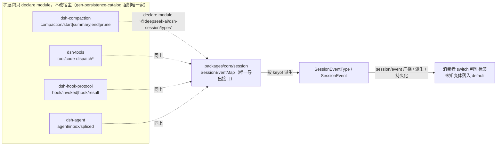
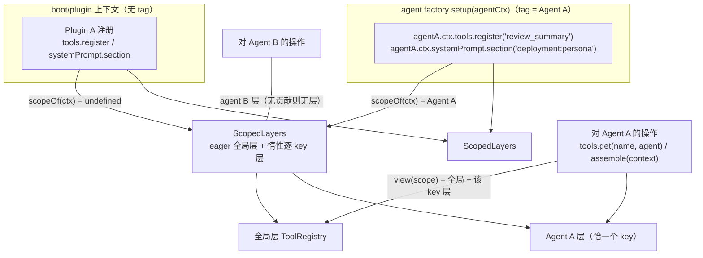
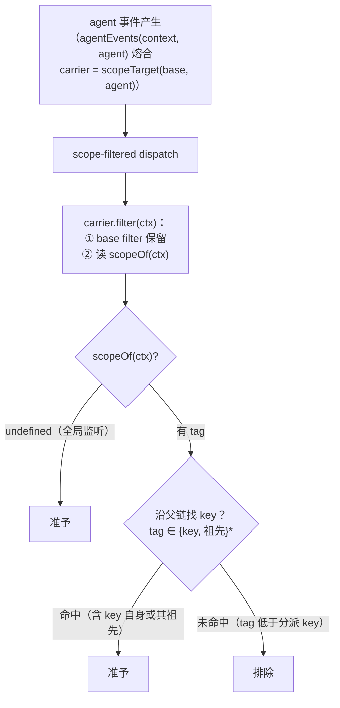
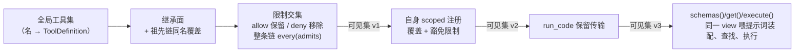
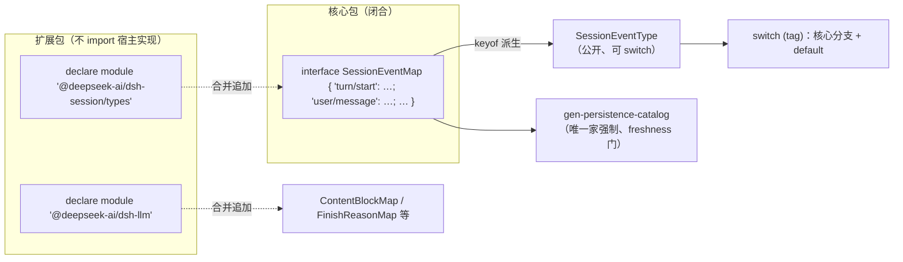
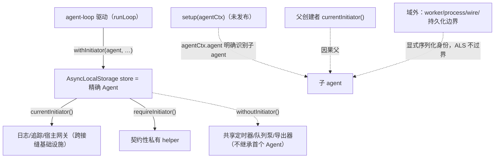
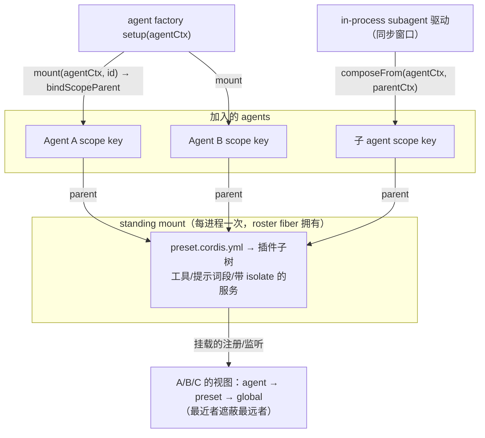
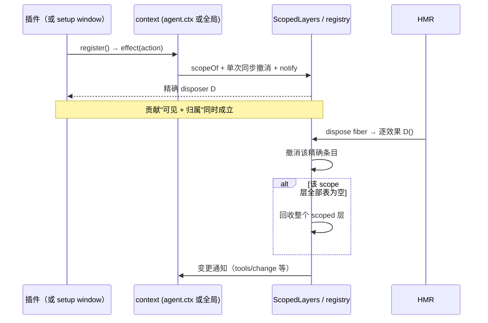

# 04 扩展机制与作用域

> 扩展机制与作用域是 dsh 两个互锁的开放面：**类型面**上，可扩展词表（会话事件、内容块、结束原因）靠声明合并与 `…Map → 派生联合` 模式保持"核心闭合、扩展不接触"；**运行面**上，每一项注册要么全局、要么属于恰好一个 agent 作用域，可见性与生命周期由同一个上下文决定。本文剖析这两条路径如何合作：模型可见 ⟺ 已入日志的持久化词表如何被插件扩大；按 agent 的注册分割如何做到不复制服务图、不把隔离做成权限；预设如何为每个 agent 装配完整能力；以及"注册即效果"如何让 HMR 换掉一个插件而不残留半卸载状态。
>
> **阅读模式**：每节先讲"你能感知到什么、想实现某功能该怎么做"（【你会看到】/【模型看到】/【插件作者】三镜头），再讲内部如何运作；机制描述始终回扣外部可感知的功能。

## 0. 本维度分析问题

先用用户视角把本维度的领地说清楚。本文是**插件作者的主场文档**——但它的每一个机制都对应你在界面上早已见过的现象：

- **装了新插件，工具清单变了**：下次请求里多出（或换掉）它的工具（§3.2、§3.8）。
- **同一个任务里，主 agent 与子 agent 拥有不同的工具集、人格**：某个子 agent"只能只读、说话像审查员"，是 scoped 注册遮蔽全局 + restriction 收窄继承面的结果（§3.2、§3.4）。
- **有的 agent 是按"角色包"整体装配的**（预设），换角色只能趁会话还没产出内容（§3.7）。
- **改插件配置保存即生效、卸载不留残骸**：热重载的干净拆装（§3.8）。
- **装了带自录事件的插件，会话日志文件里出现新的记录种类**，而产品核心不需要改版（§3.1、§3.5）。

**插件作者在本维度的动手入口**，按诉求对小节：想加一种新事件类型/新内容块 → §3.1、§3.5（声明合并）；想给单个 agent 单独注册 → §3.2（作用域两层）；想只对某个 agent 监听事件 → §3.3（scoped dispatch）；想覆盖全局默认或收窄某 agent 的工具面 → §3.4（shadowing 与 restriction）；想让日志/追踪拿到"操作发起者" → §3.6（initiator）；想做一套角色包 → §3.7（预设）；想让插件可热插拔 → §3.8（注册即效果）。

本文回答下列问题：

1. **词表如何扩展而不侵入宿主**：核心包声明的 `SessionEventMap` 是合并可扩展接口，扩展包如何在不 import 宿主实现、不改动宿主源码的前提下追加新事件？追加的事件要付出什么（`@mode` 契约、log-only 约束、JSON 可序列化、合并不兼容驱散到 `default` 分支）？
2. **按 agent 的注册分割如何做到两层**：只有两层（全局 / 恰好一个 scope key）、扁平、不下沉到子 agent，为什么仍然能支撑子 agent、预设、以及每个 agent 单独的 persona 与工具变体？
3. **作用域过滤分发与注册归属如何分开**：`Scoped<T>` carrier 只做路由，主题永远由事件参数显式携带；哪些事件保持"失滤"（registry-subject），为什么这是有意的而非漏洞？
4. **shadowing 与 restriction 的解析顺序**：一个 agent 看到的工具集如何由"全局（+祖先层）→ 相交的限制 → 自身 scoped 覆盖"三步收敛，且被限制掉的全局工具从提示词与执行两侧同时不可见？
5. **initiator 归属是什么、不是什么**：`ctx.agents` 携带的"发起 Agent"与 `agent.ctx` 注册作用域是两个不同的"上下文"概念，前者是异步链的因果归属，不作为授权也不替代显式字段。
6. **预设如何为每个 agent 装配能力**：预设怎么做到"mount 一次、全体 agent 共享"，agent 的 scope key 如何被挂在预设 standing scope 之下，冷读（无 agent）如何解析同一份注册。
7. **"注册即效果"的 HMR 意义**：所有注册都是可逆效果并返回精确 disposer，热重载卸载一个插件时如何按序撤销其全部贡献、且 scoped 层仅在整体为空时回收。

---

## 1. 前置概念

本节列出本维度借用的、已在 [00 概念总览](00-概念总览.md) 定义的基础概念；后面正文使用时不带括号。

- 插件（定义：见 00 §2.1）— Cordis 装配与扩展的基本可挂载单元。
- 上下文 / ctx（定义：见 00 §2.1）— 服务的仓库；服务认领稳定 `ctx.<key>`。
- 服务（定义：见 00 §2.1）— 在 ctx 占有唯一 key 的能力单元。
- 注入 / inject（定义：见 00 §2.1）— 声明式服务依赖，决定激活顺序。
- 事件（定义：见 00 §2.1）— 服务间通信的载体，是扩展点的最主要形态。
- 效果（定义：见 00 §2.1）— 可逆注册；`register()` 返回 disposer。
- 事件分派模式（定义：见 00 §2.1）— emit / waterfall / parallel / serial 四选一，属于事件的公共契约。
- Waterfall 语义（定义：见 00 §2.1）— `next()` 委托；不调用即短路；短路由决策监听器拥有。
- 注册即效果（定义：见 00 §2.1）— 任何对 ctx 的非空贡献都经 `ctx.effect()` / `ctx.on()` 安装并返回 disposer。
- Profile / Bundle / Patch（定义：见 00 §2.2）— 配置装配三层分发与补丁面。
- 会话 / Session（定义：见 00 §2.3）— 只追加的 typed 事件日志，是交互历史的唯一事实来源。
- 会话事件 / SessionEvent（定义：见 00 §2.3）— `{ type, seq, time, data }` 判别联合记录。
- Turn / Step（定义：见 00 §2.3）— 一次输入排空；一次模型请求 + 其工具执行。
- Agent / Agent 循环（定义：见 00 §2.3）— 公共句柄 / 唯一具体驱动者。
- 收件箱 / Inbox（定义：见 00 §2.3）— next-turn / next-step 两条有序待处理列表。
- 作用域 / Scope（定义：见 00 §2.4）— 按 agent 单层分割的注册单元。
- agent.ctx（定义：见 00 §2.4）— agent 的 scoped 上下文；可见性与生命周期同源。
- ScopeKey（定义：见 00 §2.4）— 不透明、按对象身份比较的 scope key；约定活 Agent 对象即自己的 key。
- 能力缝 / Seam（定义：见 00 §2.5）— Service Definition / Provider / Consumer 三元组。
- 派生 / deriveMessages（定义：见 00 §2.6）— 从日志投影模型可见历史；模型可见 ⟺ 已入日志。
- 持久化缝（定义：见 00 §2.6）— 复用同一套 SessionEvent 词表的抽象服务 + 后端。
- Branded ID（定义：见 00 §2.6）— 类型不可互换、运行即字符串的 ID；语言宿主为 `Branded<B>`。
- 声明合并（定义：见 00 §2.6，本 04 §2.4 细化）— 扩展 `*Map` 的 TypeScript 机制。
- `…Map → 派生联合` 模式（定义：见 00 §2.6，本 04 §2.5 细化）— 可扩展和类型的统一形态。

---

## 2. 概念约定

本节按 [00 概念总览 §2.7](00-概念总览.md) 的登记纪律为本文**新引入**（即尚未在 00 定义）的概念登记定义；§2.1–§2.8 是本文唯一允许的新术语来源。每个词条先一句直观白话，再正式定义；正式定义即登记文本。

### 2.1 作用域过滤分发（scoped dispatch）

直观：插件世界里"广播的听力范围"。装在公共大厅（全局监听）的什么广播都听得见；装进某间屋子（scoped 监听）的只听得见自己屋及其祖先屋里发生的事。**【插件作者】**想"只对某个 agent 的活动做事"，就把监听器注册到该 agent 的 `agent.ctx` 上——过滤分发保证它不会被别的 agent 的事件误触发。

正式定义：某 agent 活动的事件以其 carrier 分派，只允许"未标记监听者"与其"自身监听者"参与分派的规则。实现上由 [packages/core/scope/src/index.ts:170](packages/core/scope/src/index.ts) 的 `scopeTarget(base, key)` 构造过滤条件：未打标的监听者始终准予；打标监听者仅当其 tag 等于分派 key（或其祖先）时准予；key 为 `undefined` 则只容纳未打标听众。主题永远由事件参数携带，carrier 不暴露主题属性。与之对偶的事件是 **registry-subject**：描述共享注册表自身（如 `tools/change`）的事件保持失滤，因为它事关所有 agent 的下一次装配。

### 2.2 影子遮蔽（shadowing）

直观：同名"贴牌覆盖"。在某个 agent 的房间挂一件与大厅同名的东西（工具、提示词段、变量），它就在这间房里顶替大厅版本；其他房间照旧用大厅的。**【你会看到】**给某个子 agent 换一个专属 persona（人格提示词）而全局默认不变，就是这个机制。

正式定义：同名的 scoped 注册在其作用域内替换全局（或最近祖先）注册，而对其他作用域不可见的规则——"most-specific-wins" 命名决议。它是 persona（`deployment:persona` 覆盖全局默认 persona）、per-agent 工具变体和 scoped 提示词段的承载机制。遮蔽发生在同一表（named entries）内按名合并；被遮蔽者不是被删除，只是在该作用域视图上失去该名字。

### 2.3 全局注册 vs scoped 注册

直观：大厅与房间。经普通插件上下文注册的东西进大厅，每个助手都看得见、随该插件卸载；经 `agent.ctx` 注册的东西进某个助手自己的房间，只归它用、且随它退房一并撤走。

正式定义：**全局注册**与**scoped 注册**是注册可见性 / 生命周期归属的两种层级：经普通插件上下文做的注册进入全局层、随该插件卸载；经 `agent.ctx` 做的注册进入恰好一个 scope key 的层、随该 agent 作用域卸载。两层在中立的共享存储 ([packages/core/scope/src/store.ts:159](packages/core/scope/src/store.ts) `ScopedLayers`) 上是"一个 eager 全局层 + 惰性逐 key 层"。scoped 层仅在整体为空时被回收，读操作永不创建层。

### 2.4 声明合并（declaration merging）

直观：插件给核心词表"添词"的官方通道——不改核心包一行源码，新的事件名/新变体就能进入类型系统并被全体消费者看到。

正式定义：插件通过 `declare module` 给宿主包的 `*Map` / 接口追加成员，从而让核心包的类型继续闭合、宿主无需重编译的机制。宿主词表接口（如 `SessionEventMap`）由归属包声明为唯一的导出 `interface`，其余包只能以 `declare module '@deepseek-ai/dsh-session/types'` 追加成员（[`scripts/gen-persistence-catalog.ts:184`](scripts/gen-persistence-catalog.ts) 强制"顶层 `SessionEventMap` 只允许一个家"）。事件声明经同一机制挂到 Cordis `Events`（如 [packages/preset/agent-presets/src/types.ts:4](packages/preset/agent-presets/src/types.ts) 追加 `agent-preset/selected`），`AssembleContext` 等普通接口亦然（[packages/core/agent/src/runtime-types.ts:16](packages/core/agent/src/runtime-types.ts) 追加 `agent?` 字段）。

### 2.5 `…Map → 派生联合` 模式

直观：一张"标签→变体"登记表：宿主先写好核心行，插件往表里添一行，联合类型就自动多一个成员，消费者按标签 switch 分发。

正式定义：以判别标签为 key 的接口（`…Map`）派生联合类型（`keyof` / `[keyof …]`）的可扩展类型模式。宿主声明接口，消费者从接口派生和类型并按标签 `switch`；插件声明合并追加变体。合并可扩展联合的 `switch` 不能用 `assertNever` 封死——未知插件变体是合法值，已知分支枚举后落入文档化 `default`。核心六表：[docs/subsystems/core.md:283](docs/subsystems/core.md) 所列 `ContentBlockMap`、`MessageSourceMap`、`FinishReasonMap`、`TurnTriggerMap`、`TurnEndReasonMap`、`SessionEventMap`。

### 2.6 限制（restriction / tools.restrict）

直观：给某个助手"划工具范围"的名单。名单划掉的工具在这个助手那里等于从未存在——它读不到、也叫不出。**【你会看到】**"这个子 agent 只能用只读工具"就是 restriction 的效果。

正式定义：per-scope 对全局（连同其祖先链）工具集的过滤。`ToolRestriction`（[docs/subsystems/tools.md:157](docs/subsystems/tools.md)）含 `allow` / `deny` 名表，多个限制按"交集"组合；被限制掉的全局工具在提示词装配中缺席、且执行侧以 `UNKNOWN_TOOL` 拒绝——与"从未存在"不可区分。限制只作用于**继承面**，作用域自身层注册的工具豁免（[packages/core/tools/src/index.ts:1152](packages/core/tools/src/index.ts) `view()`）。

### 2.7 扩展点（extension point）

直观：挂号台——"我想实现 X，该把新行为挂到哪"的对照表；事件就是挂载位置的接收器。选错领域是插件作者最容易踩的坑，所以它是动手前的第一个决定。

正式定义：**扩展点（extension point）**：`agent/*`、`fs/*`、`tools/*` 等事件作为新行为挂载位置的接收器。新行为的归属面由 `docs/architecture.md` 的"Where new behavior goes"表裁决（[docs/architecture.md:104](docs/architecture.md)）：加能力缝角色 → 注册 provider/consumer；拦截请求/工具/轮次 → 用对应 `agent/*` 或 `tools/*` 事件；加持久化会话状态 → 扩 `SessionEventMap`；把注册限定到一个 agent → 用该 agent 的 `agent.ctx`。选对事件领域是改动前的第一个决定。

### 2.8 Agent 预设（agent preset）

直观：一套"角色包"：一份 preset 配置（目录 + `agent.cordis.yml`）一次性定义某角色拥有的工具、提示词段、人格；凡选用该角色的 agent 都长成同一套样子。

正式定义：从一个 preset cordis.yml 按 agent 作用域装配能力的机制（[packages/preset/agent-presets/README.md:5](packages/preset/agent-presets/README.md)）。一个 preset 是以 `agent.cordis.yml` 为根的目录；登记表一旦发现某 agent 命名它，就**每进程仅挂载一次**到 standing scope，并对该 agent 的 scope key 执行 `bindScopeParent`（[packages/preset/agent-presets/src/index.ts:286](packages/preset/agent-presets/src/index.ts)），使挂载的注册与监听覆盖所有加入的 agent。视图解析顺序为 agent → preset → global，最近者遮蔽最远者。

### 2.9 概念登记表

「直观对照」列给出每个术语对应的用户可感知概念——它是阅读锚点，不是定义。

| 概念 | 定义所在 | 一句话 | 直观对照（用户可感知） |
|---|---|---|---|
| 作用域过滤分发 | 本文 §2.1 | 未打标 + 自身（及祖先）监听者参与的事件分派规则 | 房间里的监听器只听得见自己屋（及祖先屋）的事；大厅广播人人可听 |
| registry-subject | 本文 §2.1（对偶） | 描述共享注册表自身、保持失滤的事件 | "工具清单变了"这类全局事实广播给所有 agent |
| 影子遮蔽 | 本文 §2.2 | 同名 scoped 注册在该作用域替换全局注册 | 某个助手房里的同名工具/人格顶替全局版，别的房间不受影响 |
| 全局注册 / scoped 注册 | 本文 §2.3 | 可见性/生命周期归属的两种层级 | 大厅人人可用 vs 房间专属、退房即撤 |
| 声明合并 | 本文 §2.4 / 00 §2.6 | 插件以 `declare module` 扩展宿主 Map 接口 | 给核心词表添词，不改核心源码 |
| `…Map → 派生联合` | 本文 §2.5 / 00 §2.6 | 判别键接口派生联合的可扩展类型模式 | 标签→变体登记表，添一行多一个成员 |
| 限制 / tools.restrict | 本文 §2.6 | per-scope 对全局工具集取交集的过滤 | 给某个助手划工具范围，划掉的等于不存在 |
| 扩展点 | 本文 §2.7 | 事件作为新行为挂载位置的接收器 | "想实现 X 该挂哪"的挂号台对照表 |
| Agent 预设 | 本文 §2.8 | 从 preset cordis.yml 按 agent 作用域装配能力 | 一套角色包，选它的 agent 都长成同款 |

---

## 3. 分析正文

### 3.1 声明合并：词表如何保持核心闭合、扩展开放

> **【插件作者】** 本节是"想加一种新事件类型"的完整答案：不改任何核心包源码，写一个 `declare module '@deepseek-ai/dsh-session/types'` 块往 `SessionEventMap` 添成员（下方 compaction 示例逐字可抄），并付出四个结构约束（模型可见 ⟺ 已入日志、log-only、JSON 可序列化、`@mode` 契约）。
> **【模型看到】** 插件追加的事件默认"只记账、不上屏"——除三个 `SurfaceEventType`（`user/message`、`assistant/message`、`tool/result`）之外，新事件不进入它读到的派生历史；若新事件要成为模型可见输入，必须扩词表并保证能从日志重放。
> **【你会看到】** 装了带自录事件的插件（如 compaction）后，会话日志文件里多出该插件自己的记录行（`compaction/start` 等）——聊天界面一如往常，账本如实入账。

会话日志的词表 `SessionEventMap` 由 [packages/core/session/src/types.ts:236](packages/core/session/src/types.ts) 声明为**唯一的导出接口**，核心事件（`turn/*`、`step/*`、`user/message`、`assistant/*`、`tool/*`、`todo/write`、`request/header`、`request/context`、`session/end-seed`，见 [docs/subsystems/session.md:27](docs/subsystems/session.md)）悉数在此声明。扩展包不 import 宿主实现，只做声明合并：

```ts
// packages/compaction/compaction/src/types.ts:16 —— 逐字摘取，节点合并
declare module '@deepseek-ai/dsh-session/types' {
  interface SessionEventMap {
    /** Marks the start of a compaction — log-only，持有锁直到 compaction/end。 */
    'compaction/start': { compactionId: CompactionId; sourceCommandId?: CommandId; turn: number | null }
    'compaction/summary': { /** … summary、shadowedRange、provider、model、usage … */ }
    'compaction/end': { compactionId: CompactionId; sourceCommandId?: CommandId; turn: number | null; error?: string }
    'compaction/prune': { shadowedRange: { start: number; end: number }; shadowedSeqs: number[]; shadowedTokenCount: number }
  }
}
```

合并块的载荷使用各自包的 Branded ID（`CompactionId`、`CommandId`、`CallId`），类型层跨包不可互换。`Agent` 包结构性地依赖：dom 'tool/code-dispatch-start' 与 'tool/code-dispatch'（[packages/core/tools/src/types.ts:25](packages/core/tools/src/types.ts)）、agent 收件箱变更 'agent/inbox/spliced'（[packages/core/agent/src/types.ts:12](packages/core/agent/src/types.ts)）、hook 桥的 'hook/invoked' / 'hook/result'（[packages/hooks/hook-protocol/src/types.ts:9](packages/hooks/hook-protocol/src/types.ts)）都是同一机制。宿主不认识插件变体时"必拒读"默认（`ignorable` 缺省 = required）决定了消息类事件必须被正确理解，纯记录类事件可标记 `ignorable: true`（[docs/subsystems/session.md:222](docs/subsystems/session.md)）。（用户体感：把一份带插件事件的会话日志拿到没装该插件的环境重放——纯记录类事件可跳过继续读，消息类事件则被拒读；"缺词必拒"保护的是历史的可解释性。）

追加一个新事件要付出四个结构约束：**① 模型可见 ⟺ 已入日志**——新模型可见输入必须扩 `SessionEventMap` 并从日志渲染重放（[docs/architecture.md:96](docs/architecture.md)）；**② log-only**——插件追加的事件除非是三个 `SurfaceEventType`（`user/message`、`assistant/message`、`tool/result`）之一，不得带 `surfaceOp`、不进派生历史（[docs/subsystems/session.md:593](docs/subsystems/session.md)）；**③ JSON 可序列化**——`Session.append` 在追加点运行时校验全量 `data`（[docs/subsystems/session.md:603](docs/subsystems/session.md)）；**④ `@mode` 契约**——事件的 `@mode` JSDoc 是公共契约，生成的目录校验声明与调用点一致（[docs/cordis-primer.md:26](docs/cordis-primer.md)）。核心包自身对持久化日志的三大词表（`TurnEndReasonMap`、`TurnTriggerMap`、事件 map）都走该模式，因此"加持久化状态"不触碰会话实现。



### 3.2 scope 的设计：活 Agent 即 ScopeKey，两种层级

> **【你会看到】** 同一场对话里的主 agent 与子 agent 可以有完全不同的工具集与人格——"这个子 agent 只能用只读工具、说话像审查员"这类体验，最终由本节的两层注册承载。
> **【插件作者】** 想给单个 agent 单独注册东西：在 agent 工厂的 `setup(agentCtx)` 窗口里经 `agentA.ctx` 做 `tools.register` / `systemPrompt.section`——注册同时获得"该 agent 可见"与"随该 agent 拆除"两个属性，不需要自己管理清理；想人人可用就经普通插件上下文注册进全局层。

[packages/core/scope](packages/core/scope) 是一个**库原语而非服务**（[docs/subsystems/scope.md:5](docs/subsystems/scope.md)）：`createScope(ctx, key, options)` 铸造一个打标上下文，其内部 fiber 拥有经它做的每一项注册（[packages/core/scope/src/index.ts:137](packages/core/scope/src/index.ts)）。`ScopeKey` 是不透明、按对象身份比较的 key（`type ScopeKey = object`，[packages/core/scope/src/index.ts:15](packages/core/scope/src/index.ts)），dsh 约定**活 Agent 对象本身就是自己的 scope key**（[docs/glossary.md:14](docs/glossary.md)）。agent 循环为每个活 agent 铸造一个作用域；机制本身对 key 无立场，低层包可以不经 agent 包直接使用。



可见性与生命周期是**同一事实**（[docs/glossary.md:15](docs/glossary.md)）：经 scoped 上下文做的注册既能当场被追踪又随作用域吊销，不存在"一个作用域可见、另一个作用域销毁"的分裂（[packages/core/scope/README.md:27](packages/core/scope/README.md)）。两层之间**不继承下沉**（[docs/glossary.md:13](docs/glossary.md)）：作用域扁平、scoped 注册不下沉到子 agent；父子关系以**谱系数据**（`parentSession`、`delegationDepth`、`subagentDepth`）表达，绝不作为 scope 结构（[docs/glossary.md:21](docs/glossary.md)）。注册表自身决定域规则（命名 shadow 合并、工具则另有限制解析），scope 只提供存储生命周期与命名遮蔽，不提供"通用视图"（[.agents/notes/implemented/architecture/2026-07-12-agent-scope-runtime-design.md:77](.agents/notes/implemented/architecture/2026-07-12-agent-scope-runtime-design.md)）。（用户体感：主 agent 与它派出的子 agent 可以拥有完全不同的工具与人格、互不串扰——因为每个 agent 解析各自的视图。）

> 补充链机制：scope key 允许一条**可选父链**（`bindScopeParent` / `scopeChainOf`，[packages/core/scope/src/index.ts:72](packages/core/scope/src/index.ts)）：注册视图沿链**向下**继承（子 scope 见祖先层，最近者遮蔽最远者），事件准入沿链**向上**延伸（打祖先 tag 的监听者收到后代 key 的事件）。它只用于预设的 standing mount（§3.7），不改变"每项贡献恰好归属一个 key"的所有权结构。

### 3.3 作用域过滤分发与 carrier

> **【插件作者】** 想"只对某个 agent"监听事件：把 `ctx.on` 做在该 agent 的 `agent.ctx` 上；想全局观察：普通插件上下文注册（未打标监听者始终准予）。自己声明 scoped 事件时必须以 `Scoped<T>` carrier 作 `this` 型参数——裸主题分派是编译错误，"路由与主题"从源头分开。
> **【模型看到】** 模型对此毫无感知——过滤只决定"哪些插件代码被叫到"，不改变进入请求的内容；需要 agent 的代码永远读事件参数，carrier 上没有主题可读。

`Scoped<T>` 是编译期不透明路由品牌（[packages/core/scope/src/index.ts:27](packages/core/scope/src/index.ts)）：scope-filtered 的事件声明要求 carrier 作 `this` 型，裸主题分派是编译错误；真实事件主题仍然是显式参数。[packages/core/scope/src/index.ts:170](packages/core/scope/src/index.ts) `scopeTarget(base, key)` 把基 receiver 的 Cordis filter 与作用域谓词合成：未打标监听者始终准予；打标监听者仅当其 tag 等于 key 或其祖先时准予；无 key 的 carrier 只容纳未打标听众。三个代表性声明：

```ts
// packages/core/agent/src/runtime-types.ts:159 / 244（agent/* 事件族）
'agent/created'(this: Scoped<Agent>, payload: { agent: Agent }): void          // mode emit
'agent/pre-step'(this: Scoped<Agent>, payload, next): Promise<PreStepDecision> // mode waterfall
// packages/core/session/src/index.ts:76 —— 会话追加订阅的 firehose
'session/event'(this: Scoped<Session>, session: Session, event: SessionEvent): void
// packages/core/tools/src/index.ts:163 —— 工具管线，按 exec.agent 定 key
'tools/pre-execute'(this: Scoped<ToolRuntime>, exec: ToolExecution, next): Promise<PreToolDecision>
```



宣讲语义：主题显式、路由隐含；carrier 不含主题属性，需要 agent 的代码读事件参数（[docs/glossary.md:16](docs/glossary.md)）。**注册分发 scoping 不改变注册归属**——`agent.ctx` 之上监听参与该 agent 过滤分发，附带 `{ global: true }` 的监听者绕过语境过滤但其清理仍随注册上下文（[.agents/notes/implemented/architecture/2026-07-08-agent-scope-contexts.md:107](.agents/notes/implemented/architecture/2026-07-08-agent-scope-contexts.md)）。**registry-subject 事件有意失滤**：`tools/change`（[packages/core/tools/src/index.ts:199](packages/core/tools/src/index.ts)）与 `system-prompt/change`（[docs/subsystems/system-prompt.md:191](docs/subsystems/system-prompt.md)）描述共享注册表本身，全局变更关切每个 agent 的下一代装配，因此 scoped 监听者在这里看到全部变更而非仅自己作用域。（用户体感：给某个子 agent 单独装的守护/提醒策略只作用于它自己的活动，不会误伤别的 agent——这是分派过滤的直接效果；而"工具清单变了"这类全局事实对每个 agent 的下一次装配都可见。）运行时不变量（`dsh-scope/invariant`）核查每个声明为 scoped 的事件都携带 carrier，且暴露路由主题的事件与 carrier key 同一（[packages/core/scope/README.md:23](packages/core/scope/README.md)）。

### 3.4 shadowing 与 restriction 的解析顺序

> **【你会看到】** 一个被限制成"只读"的子 agent：它的工具清单里根本没有写文件工具——不是"调用被拒绝"，而是"从未存在"；给某个 agent 换 persona 后它自我介绍变了、其他工具照旧——那是 shadowing 只换同名提示词段。不同子 agent 拥有不同工具集的最终效果，由本节三步解析收敛。
> **【模型看到】** 它每次请求看到的工具 schema 清单就是三步解析后的最终视图；被限制掉的工具在它的世界里不存在——即使凭上下文硬叫那个名字，也只会得到 `UNKNOWN_TOOL`。
> **【插件作者】** 想给某个 agent 覆盖某个全局工具/提示词段：在它的 scoped ctx 做同名注册（最近者胜）。想收窄某个 agent 的工具面：在它的 scoped ctx 调 `tools.restrict`（全局调用是显式错误）。两条路都在 scoped 上下文，永远不在全局。

工具注册表以**一次层遍历**解析一个作用域的完整视图（[packages/core/tools/src/index.ts:1152](packages/core/tools/src/index.ts) `view(scope)`）：

1. **继承面**：从全局层条目起步，沿 scope 父链追加祖先层的命名条目，最近祖先最后写入——同名遮蔽"最近者胜"（`layer.tools.entries()` 依插入序，全局最远后被覆盖）。
2. **相交限制**：对继承面逐名应用整条链上全部限制的交集——链上任一 scope 都可为其下嵌套掩掉一个继承名（`layers.every(layer => layer.admits(name))`）。
3. **自身覆盖**：作用域**自身层**的注册最后覆盖，且**豁免**于上方滤镜——这是委托运行时必须保住的缺口：子 agent 经自身的 reporting / structured-output 工具应答，能力过滤器不能剥掉它。
4. **保留传输**：`run_code` 呈现传输按每个 scope 的模式决议最后插入，本身不可注册也不可被 restrict 点名。



反立柱之一：`restrict()` 只在 scoped 上下文可用——全局调 `tools.restrict` 会屏蔽每个 agent，写成了显式错误（[packages/core/tools/src/index.ts:1074](packages/core/tools/src/index.ts)）；空滤镜、未知名字、scoped 本地名、保留传输名都当场失败（index.ts:1078–1092）——"misconfiguration fails loud"。另一根：**被限制掉的全局工具在提示词缺席且执行侧不可分辨**——`resolveExecution` 在 view 上查到缺席即弹 `UNKNOWN_TOOL`（[docs/subsystems/tools.md:153](docs/subsystems/tools.md)），不会留下"提示词里有、执行被拒"的可观测分歧。遮蔽的 selector 同样喂给查找与执行，`get(name, agent)` 返回的正是那一个解析定义，提示词渲染与执行保持一致（[docs/subsystems/tools.md:482](docs/subsystems/tools.md)）。（用户体感：被限制的子 agent 里模型永远不会"调出"被划掉的工具——清单里没有；真去叫名字也只得到与"从未存在"不可区分的未知工具错误。）

命名遮蔽的通用形态在共享存储里：`ScopedLayers.merge()` 物化"全局命名条目在前、scope 链遮蔽在后、最近者胜"的插入序有效映射（[packages/core/scope/src/store.ts:208](packages/core/scope/src/store.ts)）。提示词段与变量走同一命名合并：`agent.ctx.variable('cwd', ...)` 覆盖全局同名变量，`deployment:persona` scoped 段覆盖全局默认 persona（[docs/subsystems/core.md:169](docs/subsystems/core.md)）。（用户体感：给某个 agent 挂 scoped persona 段后，它的"自我介绍"立刻换成新版，其他 agent 一概不变。）

### 3.5 `…Map → 派生联合` 模式：核心闭合、扩展不接触

> **【插件作者】** 加新变体：`declare module` 往对应 `…Map` 添一行；写消费代码时 switch 在判别标签上、未知变体落文档化 `default`——合并可扩展联合禁止 `assertNever` 封死，否则你会吞掉别的插件的合法变体。
> **【你会看到】** 你装了多少插件，历史与请求里就能出现多少"新种类记录"，而产品主体不随插件改版——"核心闭合、扩展不接触"落在用户身上就是：插件随装随有，核心不需要为它升级。

每个可扩展和类型都呈现同一形态——"以判别标签为 key 的接口 + `keyof` 派生联合 + 声明合并追加变体"（[docs/subsystems/core.md:256](docs/subsystems/core.md)）：

```ts ignore-check
interface ThingMap {
  'a': { kind: 'a' }        // 宿主声明
  'b': { kind: 'b' }
}
type Thing = ThingMap[keyof ThingMap]       // 消费者派生联合，switch 窄化
declare module '@deepseek-ai/dsh-llm' {     // 插件追加，不改宿主源码
  interface ThingMap { 'c': { kind: 'c' } }
}
```

六个经典 map（[docs/subsystems/core.md:283](docs/subsystems/core.md)）：`ContentBlockMap`、`MessageSourceMap`、`FinishReasonMap`（dsh-llm），`TurnTriggerMap`、`TurnEndReasonMap`、`SessionEventMap`（dsh-session）。消费者对派生联合 **switch 在标签上**而非连环 `if`（AGENTS.md 约定）。合并可扩展联合的 `switch` 不得 `assertNever` 封死——一个插件变体是合法未知；已知分支枚举后落入文档化 `default`（[docs/subsystems/session.md:247](docs/subsystems/session.md)）。



闭合的代价与边界：宿主永远按 `keyof` 派生，不显式枚举连锁变体；变体的**持久化语义**（surface 资格、turn 围栏、JSON 载荷、是否 `ignorable`）由归属插件在声明 JSDoc 中标明，核心只追加未知事件不动已有成员。这使核心包能在重编译时保持闭合并，扩展包增长不触及其包。

### 3.6 agent.initiator 归属

> **【插件作者】** 深基础设施（日志、追踪、宿主网关）想知道"当前操作是哪个 agent 发起的"：`ctx.agents.currentInitiator()` / `requireInitiator()` 读取、`withInitiator(agent, operation)` 建立边界、`withoutInitiator()` 为不继承 Agent 的惰性基础设施清障——不要为这个给每个缝加参数，也不要拿它做授权。
> **【模型看到】** 发起者归属对模型不可见也不可操纵——模型可见参数永远不能选择受信任的 Session/路由头；模型只知道自己在某个会话里，不知道自己挂在谁的异步链上。

发起 Agent 归属是**进程内异步链的因果事实**，与 `agent.ctx` 的注册作用域是两个概念（[.agents/notes/implemented/architecture/2026-07-15-agent-initiator-scope.md:9](.agents/notes/implemented/architecture/2026-07-15-agent-initiator-scope.md)）：一个 Cordis Context 选择服务与注册归属；Agent/Session 身份描述异步操作的主体。`ctx.agents` 用 `AsyncLocalStorage` 携带发起 Agent：`withInitiator(agent, operation)` 建立边界（保留返回值原样）、`currentInitiator()` / `requireInitiator()` 读取、`withoutInitiator(operation)` 为不继承 Agent 的惰性基础设施清障（[docs/subsystems/core.md:561](docs/subsystems/core.md) 生成的 ctx.agents 目录）。`AgentLoop` 把每个具体驱动的完整 `runLoop` 生命周期包进 `withInitiator(agent, …)`；循环内的 turn/step/工具编排入口从 `ctx.agents` 恢复精确 Agent、派生一次 `agent.session`，让操作局部 helper 闭包捕获而不透过浅接口传驱动或 Session（[packages/AGENTS.md:20](packages/AGENTS.md) 的 initiator-owned 规则）。



三条纪律（[docs/subsystems/core.md:209](docs/subsystems/core.md)、[packages/core/agent/src/index.ts:557](packages/core/agent/src/index.ts)）：**存在 ≠ 活性**（ambient presence 既不证明 liveness 也不构成授权）；**不替换显式主体**——`ToolExecution.agent`、`AssembleContext.agent`、`GenerateOptions.sessionId` 等保持显式字段；**不过穷途**——ALS 是进程本地，worker/进程/HTTP/队列边界必须在类型化请求内物化自己需要的身份。因此轨道 HD：归属解决了"深基础设施要一个受信任的发起 Agent 而不拓宽每个缝"的问题，但模型可见参数永远不能选择受信任的 Session/路由头。（用户体感：子 agent 委派链里，日志与追踪能把每一步正确归到发起的那个 agent 名下——背后就是这条异步链归属。）

### 3.7 Agent 预设：为每个 agent 装配能力

> **【你会看到】** 给会话选定一个预设角色后，该 agent 立即获得这个角色的工具表与人格；想换角色只有趁它还没产出任何内容——已开工的会话会被拒绝（`agent-preset-locked`）。
> **【模型看到】** 它的工具 schema 清单与提示词段由预设决定；而且"用了哪个预设"是日志事实（`agent-preset/selected`）——重放同一份日志能重建同样的角色装配。
> **【插件作者】** 想发布一套角色包：写一个以 `agent.cordis.yml` 为根的目录，用户让某个 agent 在登记表里命名它即可——standing mount 每进程只挂一次，不必每个会话挂一份。

一个 preset 是目录下的一张 `agent.cordis.yml`。登记表（`ctx.agentPresets`，包 [packages/preset/agent-presets](packages/preset/agent-presets)）**每进程仅挂载一次**到 standing scope（[packages/preset/agent-presets/README.md:5](packages/preset/agent-presets/README.md)），随后每个命名该 preset 的会话，由 agent 工厂的 `setup(agentCtx)` 调用 `mount()` 把 agent 的 scope key **绑定为 standing key 的子节点**（`bindScopeParent`，[packages/preset/agent-presets/src/index.ts:286](packages/preset/agent-presets/src/index.ts)）。效果：挂载的工具、提示词段、变量只存在一份，覆盖所有加入的 agent；其插件以 Session/Agent 为 key 分隔状态，会话在共享实例内各归各位。视图解析 agent → preset → global，最近者遮蔽最远者；预设的监听者因 parent 链对每个后代 key 通行，兄弟预设保持失聪（[packages/preset/agent-presets/README.md:7](packages/preset/agent-presets/README.md)）。（用户体感：多个会话选用同一个预设角色时行为完全一致——一份角色定义，人人同款。）



四个关键事实支撑这一机制：

- **冷读无 agent 也能解析**：`standingKeyFor(id)` 只确保挂载、不启动 agent/session/turn，主机读取者用返回的 standing key 作注册表视图 scope（[packages/preset/agent-presets/README.md:20](packages/preset/agent-presets/README.md)）。
- **子 agent 用 bind 而非 mount**：`composeFrom(agentCtx, parentCtx)` 是同步、读不到 roster、无自身失败模式——在进程内 subagent 驱动器的同步 setup 窗口内可用；bind 拿到的是父正在运行的确切代的注册实例（[packages/preset/agent-presets/README.md:33](packages/preset/agent-presets/README.md)）。
- **切换是 parent 重链、仅限空白会话**：`recompose()` 在"agent 尚未产出任何东西"时把 scope key 重联想到新 standing key，两侧存根注册不共存故绝不 unmount 旧的；网关在 wire 上以 session 历史为据拒绝已产出会话（`agent-preset-locked`，[packages/preset/agent-presets/README.md:49](packages/preset/agent-presets/README.md)）。
- **切换是持久事实**：模型看到的工具表与提示词段由预设决定，故必须能从日志重建——空白会话挂载即写 `agent-preset/selected` session 事件（[packages/preset/agent-presets/README.md:43](packages/preset/agent-presets/README.md)），并重发为非 scoped 的 Cordis 事件（[packages/preset/agent-presets/src/types.ts:13](packages/preset/agent-presets/src/types.ts)）供远端消费。

### 3.8 "注册即效果"的 HMR 意义

> **【你会看到】** 改插件配置/patch 保存后不重启就生效；卸载或热重载一个插件，它贡献的工具从清单里消失、监听停止，不留"半卸载"残骸——本节讲这套干净拆装的机制保证。
> **【插件作者】** 铁律一条：一切注册经 `ctx.effect()` / `ctx.on()` 并保留返回的精确 disposer；注册表的 `register()` 已经返回 disposer，不要自设清册。发版前过 HMR-safety 测试（dispose 掉 fiber、观察移除）。

所有注册（服务、事件监听、waterfall、工具、提示词段、适配器、Provider、guard、限制）都必须经 `ctx.effect()` / `ctx.on()` 安装并**返回精确 disposer**（[docs/cordis-primer.md:44](docs/cordis-primer.md)）。作用域层存储把这一步拉平成一个动作：`ScopedLayers.effect(ctx, action, { label, notify })` 从调用上下文同时得出作用域可见性与效果归属，先收取同步撤消、再发变更通知，且**只把全部表为空的作用域层回收**（[packages/core/scope/src/store.ts:226](packages/core/scope/src/store.ts)）。`tools.register` / `restrict`（index.ts:1057/1093）、guard（:1110）都返回 `layers.effect` 的精确结果。（用户体感：热重载换掉一个插件后，它贡献的工具从清单消失、监听停止、没有任何半卸载状态。）

热重载（HMR）把卸载一个插件等同于"有序撤销它的一切贡献"：

- **精确 disposer 保序**：`rawDispose` 是内层 fiber 的精确 Cordis disposer，复合 generator 效果可原样 yield 它，让作用域拆卸嵌套在该 yield 位（而非作为并发兄弟）——Cordis 按函数身份去重嵌套效果（[packages/core/scope/README.md:12](packages/core/scope/README.md)）。
- **结构清理**：`ctx.effect()/ctx.on()` 的 disposer 也挂到注册 fiber，卸载插件或 agent 作用域即撤除经该上下文注册的一切，无需另设清册（[.agents/notes/implemented/architecture/2026-07-12-agent-scope-runtime-design.md:47](.agents/notes/implemented/architecture/2026-07-12-agent-scope-runtime-design.md)）。
- **测试闸**：registry 贡献都要通过 HMR-safety 测试——dispose 掉 fiber 并观察移除（[packages/AGENTS.md:29](packages/AGENTS.md)）。
- **闸边界**：agent 作用域在 **setup window** 完成世界装配（创建后、发布前：scope 与 agent 对象已存在，但 `agent/session-start` 未发、首轮请求未装配；[docs/glossary.md:20](docs/glossary.md)），发布前装配失败整体回滚；拆卸保作用域直至事件/持久化收尾，最后撤销作用域（[docs/glossary.md:20](docs/glossary.md)、[.agents/notes/implemented/architecture/2026-07-08-agent-scope-contexts.md:109](.agents/notes/implemented/architecture/2026-07-08-agent-scope-contexts.md)）。



---

## 4. 交叉引用

| 目标 | 关系 |
|---|---|
| [00-概念总览](00-概念总览.md) | L0 定义源：作用域、agent.ctx、ScopeKey、声明合并、`…Map → 派生联合` 的基定义 |
| [01-组合与启动](01-组合与启动.md) | Plugin 树如何从配置装配（预设 cordis.yml 的 Loader 依赖） |
| [02-核心执行循环](02-核心执行循环.md) | turn/step 内 extension point 的消费序 |
| [03-数据平面](03-数据平面.md) | SessionEventMap 追加后的持久化/重放/投影细节 |
| [05-能力清单](05-能力清单.md) | 各能力缝的 Service Definition / Provider / Consumer 实例清单 |
| [06-进程与边界](06-进程与边界.md) | initiator 归属不过 worker/process/wire 边界；身份显式物化 |
| [08-安全与治理](08-安全与治理.md) | restriction/guard 与审批、权限的关系（scope 非权限） |
| [09-工程质量](09-工程质量.md) | 类型门、doc-typecheck、声明合并唯一家门、HMR-safety 测试 |
| [docs/subsystems/scope.md](../docs/subsystems/scope.md) | ScopeKey/Scoped/Scope/ScopedLayers/NamedEntries 的权威页 |
| [docs/subsystems/core.md](../docs/subsystems/core.md) | `…Map → 派生联合` 六表、`agent/*` 事件族、Initiating Agent、ctx.agents |
| [docs/subsystems/session.md](../docs/subsystems/session.md) | SessionEventMap 合并扩展、`ignorable` 语义、log-only 插件事件 |
| [docs/subsystems/tools.md](../docs/subsystems/tools.md) | ToolRestriction、工具管线与 scoped 事件 |
| [docs/subsystems/system-prompt.md](../docs/subsystems/system-prompt.md) | scoped prompt section/变量遮蔽、`system-prompt/assemble` waterfall |
| [docs/architecture.md](../docs/architecture.md) | "Where new behavior goes" 扩展点表 |
| [docs/cordis-primer.md](../docs/cordis-primer.md) | 声明合并、typed events、waterfall 语义 |
| [packages/core/scope](../packages/core/scope) | 原语源码与 README（carrier、层存储、链） |
| [packages/preset/agent-presets](../packages/preset/agent-presets) | 预设机制权威（mount/composeFrom/standingKeyFor/recompose） |
| Agent Note: [2026-07-08 agent-scope-contexts](../.agents/notes/implemented/architecture/2026-07-08-agent-scope-contexts.md) | 四规则贡献契约、发布最后/吊销最后 |
| Agent Note: [2026-07-12 agent-scope-runtime-design](../.agents/notes/implemented/architecture/2026-07-12-agent-scope-runtime-design.md) | 一 key 选一层、一视图、一事务的运行时不变量 |
| Agent Note: [2026-07-15 agent-initiator-scope](../.agents/notes/implemented/architecture/2026-07-15-agent-initiator-scope.md) | ALS 发起 Agent 归属的边界与禁止项 |

---

## 5. 合规自查

- [x] 所有术语可追溯到 [00 概念总览](00-概念总览.md) 或本 [§2 概念约定](#2-概念约定)；正文未自造未登记术语。三镜头（【你会看到】/【模型看到】/【插件作者】）与"用户体感"括注是全系列约定的阅读锚点，不是新概念登记。
- [x] §2 仅登记任务许可的 8 个新概念（含 `…Map → 派生联合`、声明合并两处对 00 的细化），并附登记表。
- [x] 正文以具体文件路径 + 行号/章节支撑（scope 原语、session 词表、tools view、preset、agent initiator、gen-persistence-catalog 唯一家门等）。
- [x] 覆盖任务要求全部主题：SessionEventMap 扩展示例（§3.1）、scope 设计两层级与 carrier（§3.2–§3.3）、shadowing+restriction 解析序（§3.4）、`…Map → 派生联合` 闭扩展（§3.5）、initiator 归属（§3.6）、preset 装配（§3.7）、"注册即效果"HMR 意义（§3.8）。
- [x] 每个分析小节遵循"先能力后机制"模式：开头三镜头锚点（用户现象/模型视角/插件作者入口，§3.6 无直接用户现象故选插件作者+模型镜头），机制描述以"用户体感"括注回扣。
- [x] 全文 8 幅 Mermaid 图，每幅配说明文字；语言为简体中文。
