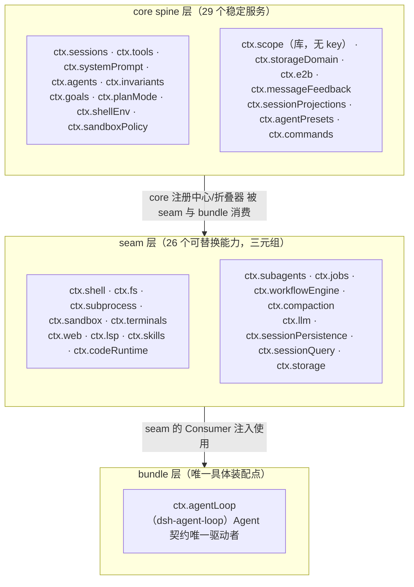
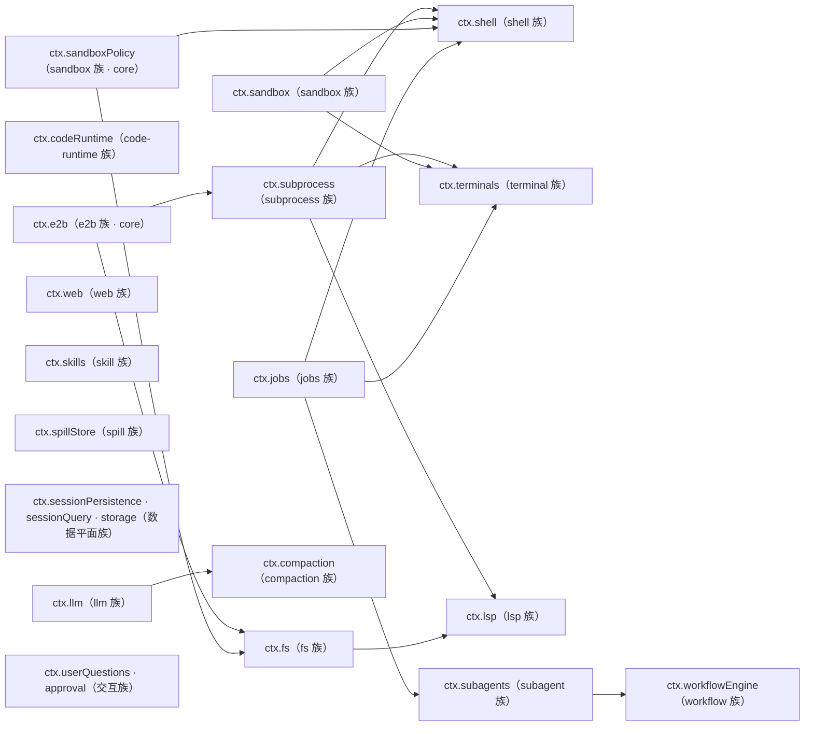
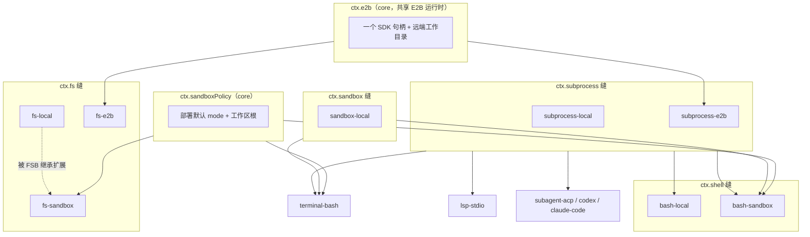
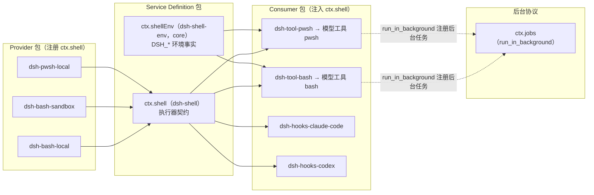
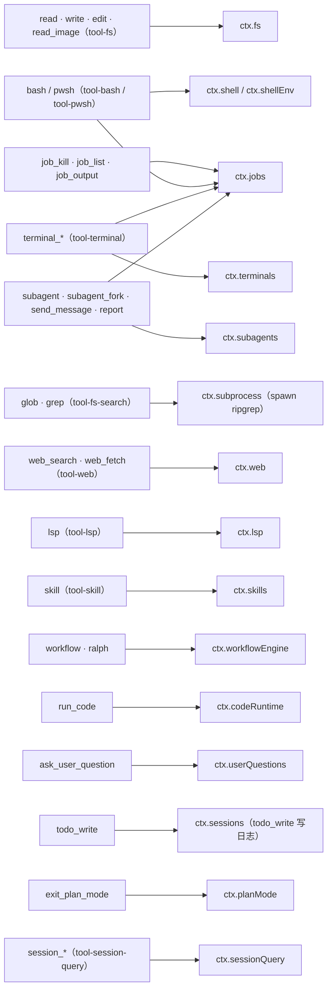
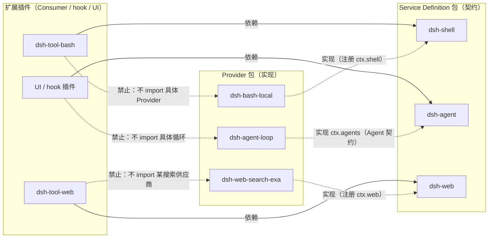

# 05 能力清单：Seam 全景

> 本文盘点 dsh 全部能力缝（Seam）实例与核心服务：把 `docs/capability-seams.md` 的权威 ctx key → owner / implementations / consumers 表翻译成一份可导航的全景清单，回答"产品有哪些可替换能力、每个能力的三角色是谁、它们之间怎么依赖"。这是对表量最大的一个维度，因此表格是本文的主体。
>
> **阅读模式**：每节先讲"你能感知到什么、想实现某功能该怎么做"（【你会看到】/【模型看到】/【插件作者】三镜头），再讲内部如何运作；机制描述始终回扣外部可感知的功能。

## 0. 本维度分析问题

先用用户视角把本维度的用法说清楚。**本文是目录型文档**：它把"你在界面上见过的每一类现象"与"插件作者换/加这类能力时要认领的角色位置"逐一对应——全文的组织就是这张对照表的展开：

- 你见过的 **bash/pwsh 命令卡片、文件读写卡片（read/write/edit/read_image）、glob/grep 搜索、terminal_\* 终端、run_code 代码执行**——对应执行世界族（§3.3）与 shell 族深挖（§3.4）。
- 你见过的 **web_search/web_fetch 搜索卡片、lsp 代码导航、skill 技能目录**——对应信息获取与知识族（§3.5）。
- **主 agent 派子 agent 干活（subagent、send_message、interrupt_agent）、workflow/ralph 编排、后台任务 job_\***——对应委托、编排与后台族（§3.6）。
- **崩了重开对话还在、会话列表的自动标题、session_\* 历史检索工具**——对应会话数据平面族（§3.7）。
- **模型下拉换供应商、审批弹窗、ask_user_question 提问卡片**——对应配置、身份与交互族（§3.8）。
- **上下文快满时自动压缩、超长工具输出被搬出内联结果**——对应压缩与溢出族（§3.9）。
- **todo 列表、计划模式、重复调用提醒**——非缝单包能力（§3.10）。

**插件作者在本维度的动手入口**：按能力族找到目标缝，认领你的角色——**换后端**就实现该缝的 Provider（换搜索供应商、换沙箱、换模型接入）；**加模型可见工具**就写 Consumer 注入 Service Definition；**加全新能力**就设计三角色齐备的新缝（00 §2.5）。方向约束只有一条：依赖 Service Definition 包，从不依赖具体 Provider（§3.12）。

本文回答下列问题：

1. 对全部 `ctx.<key>` 服务做**穷举分类**：core spine（内核对带）/ seam（能力缝）/ bundle（装配点）三类，给出分层地图。
2. 按**能力族**分组枚举每个能力缝的 Service Definition / Provider / Consumer / 配套插件，每族一张表。
3. 画**模型面向工具总地图**：工具名 → 背后消费的能力缝。
4. 明确**依赖方向约束**：扩展插件只依赖 Service Definition 包，从不依赖具体 Provider 包。
5. 给出**上下层关系**：subprocess 被 shell/terminal/lsp/subagent 消费，sandbox 被 bash-sandbox/fs-sandbox/terminal-bash 消费。

事实来源：`docs/capability-seams.md`（生成 + 分类守卫）、`packages/README.md`、`docs/glossary.md`、`docs/tool-catalog.md` 及能力族包 README。本文不编造表格之外的能力；权威全量图以 `docs/capability-seams.md` 为准，本文图是其可读化聚合。

## 1. 前置概念

- 插件、上下文 / ctx、服务、注入（inject）（定义：见 00 §2.1）
- 事件、事件分派模式、Waterfall 语义、效果、注册即效果（定义：见 00 §2.1）
- Profile、Bundle、Patch（定义：见 00 §2.2）
- 会话、会话事件、Turn、Step（定义：见 00 §2.3）
- Agent、Agent 循环、收件箱（定义：见 00 §2.3）
- 作用域、agent.ctx、ScopeKey（定义：见 00 §2.4）
- 能力缝 / Seam、Service Definition、Service Provider、Consumer（定义：见 00 §2.5）
- 派生、持久化缝、Branded ID（定义：见 00 §2.6）

> 本文只用能力缝及其三角色术语来指称"可替换能力"；三角色之外的配套参与者在 §2 另立名词。

## 2. 概念约定（本文引入的术语）

本节登记本文新引入的 5 个术语；每行先给直观白话（用户可感知的对照），再给正式定义（原文），依据列不变。

| 概念 | 直观白话 | 正式定义 | 依据 |
|---|---|---|---|
| **模型面向能力（model-facing capability）** | 模型"知道自己有哪些能力"的那张清单；你在界面上看到的每张工具卡片，都是某个模型面向能力被调用的一瞬 | 对模型面世、由模型经 `ctx.tools` 调用的能力；一个工具名背后往往是某个能力缝的 Consumer | `docs/tool-catalog.md` 按"工具包 → 模型可见名 → 服务缝"登记 |
| **角色分包（role split）** | 契约、实现、使用在包层面"一人一格"——像插槽的规格书、插头、电器各归其位 | 一个能力族在包层面对 Service Definition / Provider / Consumer 三个角色各占一包的实践；当角色独立演化时才拆分，同一包可兼多角 | `docs/glossary.md`（capability-seam 条目）、`packages/README.md` |
| **配套插件（companion plugin）** | 不占插槽、只"旁听+插话"的参与者——经事件门出策略，既不提供也不使用服务本身 | 通过事件门参与但不实现服务本身的能力族额外插件，如 fs-observation-policy（经 `fs/*` 事件门贡献策略，无 ctx key） | `docs/capability-seams.md` 表之 "Companion plugins" 列 |
| **目录（catalog）** | 机器生成、不许手改也不许过期的"库存单" | 由脚本生成、drift 校验的清单：tool-catalog（模型面向工具）、config-catalog（配置字段）、persistence-catalog（持久化数据） | 生成器 + `doc-sync` 新鲜度门 |
| **能力族（capability family）** | 同一领域的一串插槽与插头（如 shell 族 = 执行器缝 + 几个后端 + 几个工具） | 一组围绕同一领域、共用 Service Definition 或同一执行世界的相关 Seam 与插件，如 shell 族 = 执行器缝 + bash-local + pwsh-local + tool-bash | 各组 README 自述的 "capability family" |

> 其余术语一律引用 00。工具的 Execution 细节（ToolExecution、pre-execute 等）属于 [02-核心执行循环](02-核心执行循环.md)，本文只在工具总地图中标注"工具消费了哪条缝"，不展开执行管细节。

## 3. 分析正文

### 3.1 分层地图：core spine / seam / bundle 三类服务

> **【你会看到】** 最能说明三层分类的一个日常现象：把搜索供应商、沙箱后端或模型供应商整个换掉，你界面上的工具卡片一张不改——`web_search` 还是 `web_search`、`bash` 还是 `bash`。可换的都住在 seam 层；从不换的注册中心住在 core spine 层。
> **【插件作者】** 动手前先对表定层：你要动的东西是 core spine（经注册表/事件参与，不是拿来换的）、seam（实现 Provider 即换后端）、还是 bundle 层的 `ctx.agentLoop`（唯一装配点——而扩展插件只依赖 `dsh-agent`，不依赖它）。

`docs/capability-seams.md` 把每个 `ctx.<key>` 归类为三档。分类依据是**可替换性**与**装配位置**，不是包的位置：

- **core spine（Role=`core`）**：产品 API 主干，接口稳定，不设 Provider；自持词表与状态，作"注册中心"或"折叠器"（`ctx.sessions`、`ctx.tools`、`ctx.systemPrompt`、`ctx.agents`、`ctx.invariants`、`ctx.goals`、`ctx.planMode`、`ctx.shellEnv`、`ctx.sandboxPolicy`、`ctx.storageDomain`、`ctx.e2b`、`ctx.sessionProjections` 等 29 个）。
- **seam（Role=`seam`）**：可替换能力，三元组齐备。Service Definition 认领 ctx key，Provider 们注册实现，Consumer 注入使用。共 26 个（`ctx.shell`、`ctx.fs`、`ctx.subprocess`、`ctx.web`、`ctx.lsp`、`ctx.terminals`、`ctx.skills`、`ctx.sandbox`、`ctx.subagents`、`ctx.jobs`、`ctx.workflowEngine`、`ctx.compaction`、`ctx.llm`、`ctx.sessionPersistence`、`ctx.sessionQuery`、`ctx.sessionTitle`、`ctx.storage`、`ctx.attachments`、`ctx.settings`、`ctx.credentials`、`ctx.sessionTelemetry`、`ctx.userQuestions`、`ctx.approval`、`ctx.spillStore`、`ctx.directoryPicker`、`ctx.codeRuntime`）。
- **bundle（Role=`bundle`）**：装配点。唯一一例是 `ctx.agentLoop`（dsh-agent-loop）——Agent 契约的唯一具体驱动者，本身可被替换，但扩展插件只依赖 `ctx.agents`（dsh-agent），从不依赖它。（用户体感：这一切分类落到你眼前就是一句话——工具卡片稳定，背后的供应商与后端随时可换。）

> `core`/`seam`/`bundle` 三档是该表 Role 列的原文；完整 56 个服务的归属见 `docs/capability-seams.md`。

### 3.2 全局服务拓扑（能力族粒度）

> **【你会看到】** 这张图上"地基边"的杠杆效果你在换执行环境时体会过：把执行世界指到 E2B 远端沙箱，bash 卡片、终端卡片、LSP 卡片全部跟进云端 Linux 环境，界面工具一张不变（详见 §3.3.8）。
> **【插件作者】** 规划新能力前先读跨族消费边：subprocess/sandbox 是多数执行能力的地基、jobs 是后台化的公共协议——你的 Consumer 该注入哪条缝，往往由这张图直接决定。

把 26 个能力缝按能力族聚合，跨族消费边是本文的分析重点：subprocess/sandbox 是多数执行能力的地基，jobs 是后台化的公共协议，e2b 为一族提供两个基础适配器。权威全量图在 `docs/capability-seams.md` 的 Mermaid（含 core 服务与全部单项边）。（用户体感：图上每条边都对应一类你见过的卡片行为；"换到 E2B 时同一批消费方无分支"就是你看到的"工具没变、世界变了"。）

> 图中每条跨族边都对应后续各族小节表里某一具体 Consumer（例如 `SUB --> SH` 是 bash-local/bash-sandbox 经 ctx.subprocess 拉起进程；`SHP --> FS` 是 fs-sandbox 按 ctx.sandboxPolicy 的 mode 围栏写/编辑）。族内的边（Provider 注册进 SD、Consumer 注入 SD）在各族小节表列出。

### 3.3 执行世界族（execution world）

> **【你会看到】** 执行世界族就是你界面上"动手干活"那批卡片背后的世界：bash/pwsh 命令、文件读写、glob/grep 搜索、terminal_\* 终端、run_code——它们全部跑在同一套"文件系统 + 进程"地基上，地基可以整体指到本地或远端沙箱。
> **【插件作者】** 本族动手口诀：换后端 = 实现对应缝的 Provider（不动任何工具）；加模型工具 = 写 Consumer 注入缝；围栏模式与工作区根不归 Provider 配——那是 core 的 `ctx.sandboxPolicy`。

执行世界（execution world）是仓库既有用语（见 e2b README）：文件系统与进程属同一执行世界，把二者指到远端沙箱即可整体搬走 Bash、PTY 与 LSP，无需 Provider 分支。

#### 3.3.1 subprocess 能力族

> **【你会看到】** 你永远看不到 subprocess 自己的卡片——它是地基：bash 卡片、终端卡片、LSP 启动、跨进程子 agent，背后真正拉起进程的都是它。
> **【插件作者】** 想换进程后端（本地进程树 → E2B 远端）：实现 `ctx.subprocess` 的 Provider；想用进程原语：注入 `ctx.subprocess`，别自己 spawn。

进程地基：可执行查找、受管进程树、stdout/stderr、终端进程原语。它不定义"命令"的语义——那是消费者的事。

| 角色 | 包（`@deepseek-ai/dsh-*`） | ctx key |
|---|---|---|
| Service Definition | `subprocess` | `ctx.subprocess` |
| Provider | `subprocess-local`（本地产进程树）、`subprocess-e2b`（E2B 远端） | 注册 `ctx.subprocess` |
| Consumer | `bash-local`、`bash-sandbox`、`terminal-bash`、`lsp-stdio`、`subagent-acp`、`subagent-codex`、`subagent-claude-code`、`tool-fs-search`（spawn ripgrep） | 注入 `ctx.subprocess` |
| 配套插件 | — | — |

#### 3.3.2 fs 能力族

> **【你会看到】** 文件读写卡片（read/write/edit/read_image）：模型读你仓库的文件、改文件，卡片回显路径与内容；换成沙箱后端后这些卡片照旧出现，实际写入被 mode 围栏拦在工作区内。
> **【模型看到】** 无论后端是本地还是沙箱，它调 read/write/edit 时的工具名与参数 schema 不变——围栏是 Provider 内部的事，不进模型视野。

文件系统缝：规范路径、有界文本 IO、原子变更 + 可选版本守卫。**围栏与策略正交组合**：fs-sandbox 只做 mode 围栏，fs-observation-policy 只做观察态门。

| 角色 | 包 | ctx key |
|---|---|---|
| Service Definition | `fs` | `ctx.fs` |
| Provider | `fs-local`、`fs-sandbox`（mode 围栏，extends fs-local）、`fs-e2b`（E2B 远端） | 注册 `ctx.fs` |
| Consumer | `tool-fs`（read/write/edit/read_image）、`tool-str-replace-editor`、`lsp-stdio`（经 ctx.fs 读源文件） | 注入 `ctx.fs` |
| 配套插件 | `fs-observation-policy`（`fs/*` 事件门的观察态 + read-before-edit 策略，无服务） | — |

> 注意 `tool-fs-search` 是**反例**：glob/grep 不扩展 ctx.fs 契约，而是经 ctx.subprocess 拉起打包的 ripgrep 二进制，所以文件系统后端不必承担通用搜索契约。

#### 3.3.3 shell 能力族（深挖，见 3.4 图 4）

> **【你会看到】** bash/pwsh 卡片：模型要跑命令时，卡片先出现命令与参数（敏感时等你审批），执行后回显输出——它面向的是"执行器"这个抽象，不是某个具体 shell。
> **【插件作者】** 想换执行后端（沙箱化、PowerShell）：实现 `ctx.shell` 的 Provider（三个现成可参照）；`tool-bash`/`tool-pwsh` 是 Consumer，一行不用动。

bash 执行器缝。Consumer 面向"执行器"编程，沙箱化 / PowerShell 后端替换 bash-local 时不碰工具。

| 角色 | 包 | ctx key |
|---|---|---|
| Service Definition | `shell` | `ctx.shell` |
| Provider | `bash-local`、`bash-sandbox`、`pwsh-local` | 注册 `ctx.shell` |
| Consumer | `tool-bash`（bash 工具）、`tool-pwsh`（pwsh 工具）、`hooks-claude-code`、`hooks-codex` | 注入 `ctx.shell` |
| 配套插件 | `shell-env` 提供 `ctx.shellEnv`（core，DSH_\* 事实），被两个 shell 工具消费 | 注入 `ctx.shellEnv` |

#### 3.3.4 terminal 能力族

> **【你会看到】** 终端卡片（terminal_\* 六个工具 + 持久 bash）：模型开一个终端会话反复执行命令，先后命令跑在同一个终端里（工作目录、环境随命令保留）——这是它与一次性 bash 卡片的体感差别。
> **【插件作者】** 想换终端机制后端：实现 `ctx.terminals` 的 Provider（参照 terminal-bash：spawnTerminal + sandboxPolicy）；会话身份与清理归注册表所有，不用自管。

持久 PTY 会话，按 Agent 隔离；注册表拥有精确身份与清理，后端拥有终端机制。

| 角色 | 包 | ctx key |
|---|---|---|
| Service Definition | `terminal` | `ctx.terminals` |
| Provider | `terminal-bash`（经 `ctx.subprocess.spawnTerminal` + `ctx.sandboxPolicy`） | 注册 `ctx.terminals` |
| Consumer | `tool-terminal`（六个 terminal_\* 工具）、`tool-bash-persistent`（持久 bash 工具） | 注入 `ctx.terminals` |
| 配套插件 | — | — |

#### 3.3.5 sandbox 能力族

> **【你会看到】** "沙箱模式"开启后，命令与写文件被围栏在工作区根之内，越界操作失败——你感知到的是"它出不了这个目录"；模式与工作区根的归属就在本族。
> **【插件作者】** 想换围栏实现（bwrap/Landlock/Seatbelt 之外的新机制）：实现 `ctx.sandbox` 的 Provider；但模式与根在 core 的 `ctx.sandboxPolicy`，别在 Provider 里自带策略。

进程围栏缝 + 策略归属。**消费者把将 spawn 的精确 argv 交给后端**，后端按每次调用的策略包装并回报强制结果。策略（默认 mode + 工作区根）是 core 服务 `ctx.sandboxPolicy` 的独有属地，bash 与 fs 两族同读一个根，避免围到不同目录。

| 角色 | 包 | ctx key |
|---|---|---|
| Service Definition | `sandbox` | `ctx.sandbox` |
| Provider | `sandbox-local`（bwrap/Landlock/Seatbelt 本地后端） | 注册 `ctx.sandbox` |
| Consumer | `bash-sandbox`（包装 argv 后执行）、`terminal-bash` | 注入 `ctx.sandbox` |

> 策略归属 `ctx.sandboxPolicy`（`sandbox-policy`）是 core 服务，不是配套插件（配套插件定义见 §2：经事件门参与、无 ctx key）。bash 与 fs 两族都读它，避免围到不同根目录。策略解析细节见 08-安全与治理 §3.3。

#### 3.3.6 code-runtime 能力族

> **【你会看到】** run_code 卡片：模型写一整段程序直接执行（Code Mode），而不是逐条调工具拼流程。
> **【插件作者】** 想加新的执行基质（worker 线程之外）：实现 `ctx.codeRuntime` 的 Provider；Consumer 是 tools 的 Code Mode（`run_code` 工具 + 生成式 SDK）。

执行"一段模型写成的程序"：一条 runtime Service Definition，宿主提供异步绑定，后端按 substrate/语言区分。

| 角色 | 包 | ctx key |
|---|---|---|
| Service Definition | `code-runtime` | `ctx.codeRuntime` |
| Provider | `code-runtime-worker`（worker-thread 后端） | 注册 `ctx.codeRuntime` |
| Consumer | `tools`（Code Mode：`run_code` 工具 + 生成式 SDK） | 注入 `ctx.codeRuntime` |
| 配套插件 | — | — |

#### 3.3.7 e2b 能力族（POC）

> **【你会看到】** 把执行世界整体搬进云端：bash/终端/LSP 卡片照常出现，实际进程与文件全在远端 Linux 沙箱——上层消费者零分支，这是"执行世界"概念的兑现。
> **【插件作者】** 本族的 Provider 角色是两个适配器：`fs-e2b` 注册 `ctx.fs`、`subprocess-e2b` 注册 `ctx.subprocess`；`ctx.e2b` 本身是 core（共享生命周期），不换 Provider。

共享一个 E2B Linux 沙箱生命周期，向 fs 与 subprocess 两条缝各挂一个适配器。`ctx.e2b` 本身是 core（不换 Provider），两个适配器才是 Provider。

| 角色 | 包 | ctx key |
|---|---|---|
| Service Definition（生命周期 owner，core） | `e2b` | `ctx.e2b` |
| Provider | `fs-e2b`（注册 ctx.fs）、`subprocess-e2b`（注册 ctx.subprocess） | 各自注册目标缝 |
| Consumer | 无直接 Consumer；上游 `bash-local`/`terminal-bash`/`lsp-stdio` 无需 e2b 分支 | — |
| 配套插件 | — | — |

#### 3.3.8 执行世界上下层（图 3）

> **【插件作者】** 这张上下层图是本族的"动手地图"：想插入一层（新的围栏、新的进程后端），先找准你在图中的位置——上层消费者永远经服务缝、永不直接触实现。
> **【你会看到】** 图中每条边都对应一类你见过的卡片行为；换到 E2B 时"同一批消费方无分支"就是你体验到的"工具没变、世界变了"。

> 读法：**上层消费者永远经服务缝、永不直接触实现**。bash-local 经 ctx.subprocess 落地为进程；bash-sandbox 先经 ctx.sandbox 包装 argv、再经 ctx.subprocess spawn；fs-sandbox 不 spawn 进程，而是按 ctx.sandboxPolicy 的 mode 围栏自己的写/编辑。换到 E2B 时，同一批 bash/terminal/lsp 消费方无分支地把可变工作放进同一远端运行时。

### 3.4 shell 族深挖（图 4）

> **【你会看到】** shell 族最直观的杠杆：从 bash-local 切到 bash-sandbox 只改一行配置，模型工具 schema 不变——你在界面上几乎感觉不到切换发生了。
> **【插件作者】** 本族是"角色分包"模板与"请求/规格显式拆分"的样板：设计新缝时照此拆三包（契约 / 实现 / 使用），Consumer 永远只面向契约编程。

shell 族是文档自述的"角色分包"模板：Service Definition 定义 `ShellExecutor` 契约（请求/规格显式拆分的样板），三个 Provider 共享它，四个 Consumer 只面向契约。

> 语义要点：`dsh-bash-local` 与 `dsh-bash-sandbox` 是两条**可互换的 ctx.shell Provider**，切换只改一行配置，模型工具 schema 不变；`dsh-pwsh-local` 服务 Windows 组合，与 bash 工具逐调用镜像、减去沙箱参数。所有 shell 工具的背景运行统一挂到 ctx.jobs，由 `job_*` 工具回收。

### 3.5 信息获取与知识族

> **【你会看到】** 本族的卡片是"向外看"的那批：web_search/web_fetch 的搜索与抓取、lsp 的代码导航跳转、skill 的技能目录与装载。
> **【插件作者】** 三族共用一条动手规则：后端差异全部被 Provider 吸收（换搜索供应商、换语言服务器、换技能来源），模型问法与工具名由 Consumer 钉死。

#### 3.5.1 web 能力族

> **【你会看到】** web_search 卡片回显搜索结果、web_fetch 卡片回显网页正文；换成哪家搜索供应商，工具名与参数都不变。
> **【插件作者】** 想接新搜索/抓取后端：实现 `ctx.web` 的 Provider（四个现成参照）；`tool-web` 是 Consumer，不动。

搜索与 fetch 共享一条 Provider 选择缝，保证模型可见名跨后端稳定。

| 角色 | 包 | ctx key |
|---|---|---|
| Service Definition | `web` | `ctx.web` |
| Provider | `web-search-exa`、`web-search-perplexity`、`web-search-deepseek`、`web-fetch-http` | 注册 `ctx.web` |
| Consumer | `tool-web`（web_search / web_fetch） | 注入 `ctx.web` |
| 配套插件 | — | — |

#### 3.5.2 lsp 能力族

> **【你会看到】** lsp 卡片：模型查"这个符号在哪定义/谁引用它/实现跳转/hover"——恰好四个操作，问法从不因语言或服务器而变。
> **【模型看到】** 只有归一化后的四个操作与结果——语言服务器协议的复杂度被 Provider 翻译掉，模型永远见不到原始协议细节。

语言服务器导航缝：恰好四个操作（goToDefinition / findReferences / goToImplementation / hover），**无 JSON-RPC 逃生舱**，后端翻译进归一化请求/结果，故 Provider 换掉也不改模型问法。

| 角色 | 包 | ctx key |
|---|---|---|
| Service Definition | `lsp` | `ctx.lsp` |
| Provider | `lsp-stdio`（经 ctx.fs + ctx.subprocess 的多 server stdio 后端） | 注册 `ctx.lsp` |
| Consumer | `tool-lsp`（lsp 工具） | 注入 `ctx.lsp` |
| 配套插件 | — | — |

#### 3.5.3 skill 能力族

> **【你会看到】** 会话前缀里出现的技能目录（有哪些技能可用）；模型用 skill 工具装载某个技能的完整说明，再照着做。
> **【插件作者】** 想加技能来源：实现 `ctx.skills` 的 Provider；模型面向的目录/装载器是 `tool-skill`（Consumer）。

Provider 目录合并 + 模型面向目录/装载器。

| 角色 | 包 | ctx key |
|---|---|---|
| Service Definition | `skill` | `ctx.skills` |
| Provider | `skill-badge`（捆绑 dsh badge skill）、`skill-filesystem`（本地文件系统发现） | 注册 `ctx.skills` |
| Consumer | `tool-skill`（渲染会话前缀目录 + 装载完整 skill 体） | 注入 `ctx.skills` |
| 配套插件 | — | — |

### 3.6 委托、编排与后台族

> **【你会看到】** 本族对应"分身有术"的那批现象：主 agent 派出子 agent（subagent 卡片、send_message 追话、interrupt_agent 打断）、workflow/ralph 编排脚本、命令放到后台稍后回收（job_\* 工具）。
> **【插件作者】** 三条缝三种动手法：subagent 支持多 Provider 共存（想接新的子 agent 后端就再注册一个）；workflow 每上下文一条引擎（实现 `ctx.workflowEngine`）；jobs 是生产者注册协议——你的工具只要会注册"运行中的工作"就能获得后台语义。

#### 3.6.1 subagent 能力族

> **【你会看到】** 子 agent 委派：主 agent 用 subagent/subagent_fork 派活，用 send_message 追加指示、interrupt_agent 打断、list_agents 列出在跑的分身——子 agent 的活动与汇报各有卡片。
> **【插件作者】** 想换/加子 agent 后端（进程内、ACP、codex、claude-code、SDK）：实现 `ctx.subagents` 的 Provider，多 Provider 可共存于同一上下文；模型面向工具（tool-subagent 等）是 Consumer。

多 Provider 可共存于同一上下文；服务还持有可续话（continuable）的激活编排。

| 角色 | 包 | ctx key |
|---|---|---|
| Service Definition | `subagent` | `ctx.subagents` |
| Provider | `subagent-spawn-in-process`、`subagent-fork-in-process`（同进程；共享驱动 `subagent-inprocess`）、`subagent-acp`、`subagent-codex`、`subagent-claude-code`（跨进程，经 ctx.subprocess）、`subagent-dsh-sdk` | 注册 `ctx.subagents` |
| Consumer | `tool-subagent`（subagent / subagent_fork）、`tool-subagent-control`（send_message / interrupt_agent / list_agents）、`tool-ralph`（固定工作流要求一条新结构化路由）、`tool-subagent-report`（子作用域内） | 注入 `ctx.subagents` |
| 配套插件 | — | — |

#### 3.6.2 workflow 能力族

> **【你会看到】** workflow/ralph 卡片：一段脚本按步骤扇出多个 agent 干活再汇合（ralph 是固定工作流的特例，每次要一个全新 agent）。
> **【插件作者】** 想换执行引擎：实现 `ctx.workflowEngine` 的 Provider（每上下文一条，无命名注册表）；脚本的 `agent()` 调用经 ctx.subagents 扇出，不必自己管 agent 生命周期。

一条引擎每次上下文一个，无命名 Provider 注册表；脚本的 `agent()` 调用经 ctx.subagents 扇出。

| 角色 | 包 | ctx key |
|---|---|---|
| Service Definition | `workflow` | `ctx.workflowEngine` |
| Provider | `workflow-worker-thread`（worker 线程引擎） | 注册 `ctx.workflowEngine` |
| Consumer | `tool-workflow`（通用 workflow 工具）、`tool-ralph`（固定 fresh-agent Ralph） | 注入 `ctx.workflowEngine` + `ctx.subagents` |
| 配套插件 | — | — |

#### 3.6.3 jobs 能力族

> **【你会看到】** 后台语义的统一入口：bash 卡片选择后台运行、终端里继续发命令、子 agent 放后台跑——稍后用 job_list 看清单、job_output 取产出、job_kill 终止。
> **【插件作者】** 你的工具想支持"放后台"：作为生产者把运行中的工作注册进 `ctx.jobs`；`job_*` 是现成的模型面向控制器，不必重写。

后台工作协议：生产者注册运行中的工作，`job_*` 是模型面向控制器，jobs-local 是进程内注册表。**同一条缝吞三种后台**：后台 bash、PTY 发送、子代理委托。

| 角色 | 包 | ctx key |
|---|---|---|
| Service Definition | `jobs` | `ctx.jobs` |
| Provider | `jobs-local`（进程内注册表） | 注册 `ctx.jobs` |
| Consumer | `tool-bash`、`tool-terminal`、`tool-subagent`（后台生产者）、`tool-jobs`（job_kill/job_list/job_output） | 注入 `ctx.jobs` |
| 配套插件 | — | — |

### 3.7 会话数据平面族

> **【你会看到】** 本族的现象都围绕"对话本身"：程序崩了重开对话还在（持久化）、会话列表里的自动生成标题（标题缝）、session_\* 历史检索工具（检索缝）、跨会话的存储与图片附件读取。
> **【插件作者】** 想换存储后端：JSONL/SQLite 就是 `ctx.sessionPersistence` 的两个可换 Provider，复用同一套 SessionEvent 词表——不存在"持久化事件类型"这种东西要你额外维护。

持久化、检索、标题、存储、附件共享同一套 `SessionEvent` 词表，**没有并行的持久化事件类型**（持久化缝，见 00 §2.6）。

| 能力缝 | Service Definition（ctx key） | Provider | Consumer | 配套插件 |
|---|---|---|---|---|
| 持久化 | `session-persistence`（`ctx.sessionPersistence`） | `session-persistence-jsonl`、`session-persistence-sqlite` | `agent-loop`、`tool-bash`、`hooks-*`、`session-query`、`message-feedback` | — |
| 检索 | `session-query`（`ctx.sessionQuery`） | `session-query-sqlite` | `session-reference`、`tool-session-query` | — |
| 标题 | `session-title`（`ctx.sessionTitle`） | `session-title-first-prompt-llm`、`session-title-all-prompts-llm` | `session-projection`（经 host-apiproxy 推送） | — |
| 存储 | `storage`（`ctx.storage`） | `storage-json`、`storage-sqlite` | `storage-domain`（core）→ `workspace`、`message-feedback` | — |
| 附件 | `attachment`（`ctx.attachments`） | `attachment-local` | `host-runtime`、`llm-pi-ai`（`tool-fs` 的 read_image 也经它） | — |

> 数据平面里多数是 seam，其上还叠 core 折叠器：`ctx.sessions`（只追加日志 + 事件流）、`ctx.sessionProjections` / `ctx.sessionProjectionCache`（状态驱动投影 + 冷读阶梯）、`ctx.sessionReferenceResolver`（跨会话快照）——这些在 `docs/capability-seams.md` 的 Role 列标为 core。

### 3.8 配置、身份与交互族

> **【你会看到】** 本族的现象是"人与产品的配置面"：模型下拉里换供应商（LLM 缝）、设置文件与凭据被自动读取（设置/凭据缝）、审批弹窗（审批缝）、ask_user_question 向你提问并等待回答的卡片（人工问答缝）。
> **【插件作者】** 想接新模型供应商：实现 `ctx.llm` 的 Provider（settings/credentials 是它的配套数据来源）；想换审批回答者（如新 UI）：回答 `approval/request` waterfall——缺省无审批服务时 ask 降级为 deny，安全姿态宁可拒绝。

| 能力缝 | Service Definition（ctx key） | Provider | Consumer | 配套插件 |
|---|---|---|---|---|
| LLM | `llm`（`ctx.llm`） | `llm-deepseek`、`llm-pi-ai`、`llm-replay`（test-support） | `agent-loop`、`compaction-basic` | — |
| 设置 | `settings`（`ctx.settings`） | `settings-file` | `llm-deepseek`、`llm-pi-ai`、`apiproxy` | — |
| 凭据 | `credentials`（`ctx.credentials`） | `credentials-local` | `llm-deepseek`、`llm-pi-ai`、`apiproxy` | — |
| 人工问答 | `user-questions`（`ctx.userQuestions`） | 无打包 Provider（UI 前端提供活动回答者） | `tool-ask-user` | — |
| 审批 | `approval`（`ctx.approval`） | `acp`（`approval/request` waterfall 回答者） | `tools`、`tool-bash` | — |

> 交互族注意：`ctx.userQuestions` 是"缝缺 Provider 打包实现"的实例——Provider 由宿主 UI 前端扮演，工具在 provider-neutral 的 ask() promise 上挂起。`ctx.approval` 缺省关闭到 `unavailable`（失败即拒绝），`ctx.permissionPresets`（core）把模式与审批旋钮打包成预设表。二者与 `ctx.planMode`、`ctx.commands` 一起构成人工协作平面（interaction）。

### 3.9 压缩与溢出族

> **【你会看到】** 两个"默默发生"的现象：上下文快满时助手自动压缩旧历史继续干活（没有任何 compact 工具卡片——压缩不是模型可调用的能力）；超长工具输出不再整段刷屏，模型拿到"定位符 + 检索提示"按需取回。
> **【插件作者】** 想换压缩策略：实现 `ctx.compaction` 的 Provider（压力/错误事件驱动，自消费）；想改溢出时机：spill-policy 经 tools/post-execute 参与；溢出存储换后端 = 实现 `ctx.spillStore` 的 Provider。

| 能力缝 | Service Definition（ctx key） | Provider | Consumer | 配套插件 |
|---|---|---|---|---|
| 压缩 | `compaction`（`ctx.compaction`） | `compaction-basic`（压力/错误事件驱动） | `compaction-basic`（自消费；另消费 core `ctx.tokenMeter`、`ctx.toolResultPruner`、`ctx.llm`）、`command-compact`（human 命令） | — |
| 溢出 | `spill`（`ctx.spillStore`） | `spill-local` | `spill-policy`（tools/post-execute 消费者，决定何时溢出）、`tool-fs-search`（封顶结果存盘） | — |

> 压缩族**没有模型面向的 compact 工具**——压缩是后台策略，不是模型可调用的能力；这正是"能力缝 ≠ 工具"的反例。溢出族则面向模型返还"定位符 + 检索提示"，把超长工具文本搬出内联结果。

### 3.10 非缝单包能力（不是 Seam 的能力族）

> **【你会看到】** 这批能力你天天见，但它们不是缝：todo_write 的待办清单卡片、计划模式（exit_plan_mode 工具 + `/plan` 命令）、模型重复犯错时收到的提醒（guard）。
> **【插件作者】** 它们没有 Provider 可换——动手方式是直接注册 `ctx.tools`（todo_write）、监听 tool/agent 事件（guard）、或作为 core 注册表参与（commands/goal）。

| 族 | 包（贡献） | 性质 |
|---|---|---|
| todo | `tool-todo`（`todo_write` 工具，注册 ctx.tools） | 单包模型面向工具；无 Provider 契约 |
| plan | `plan-mode`（`ctx.planMode`，core）+ `exit_plan_mode` 工具 + `/plan` 命令 | logged 协作状态，非模式注册表 |
| guard | `repeat-tool-reminder`、`timeout-policy` | 监听 tool/agent 事件；注册 `tools/execute` 监听器 |
| commands | `commands`（`ctx.commands`，core） | 人类命令注册表，不发给模型 |
| goal | `goal`（`ctx.goals`，core）+ `tool-goal` | 同会话目标折叠器 |
| schedule | `schedule`（opt-in，活根 Agent 作用域内注册） | 会话内定时提醒 |

### 3.11 模型面向工具总地图（图 5）

> **【模型看到】** 本图就是模型眼中的"能力清单"：每次请求里它看到 `ctx.tools.schemas()` 的稳定名字——bash、read、web_search……它知道自己有哪些工具，不知道每个名字背后是哪条缝、哪个后端。
> **【你会看到】** 界面上的工具卡片逐名对应图左列——这张图是"卡片 ↔ 缝"的总对照表。
> **【插件作者】** 你的新工具必须出现在 `ctx.tools.schemas()` 里才模型可见（tool-catalog 的 freshness 门会核对）；工具名是跨后端的公共契约，起名要稳定。

`docs/tool-catalog.md` 是此图的机器生成事实源（boot 每个工具插件读 `ctx.tools.schemas()`，freshness 门守卫）。模型经 system-prompt 看到的是 `ctx.tools.schemas()` 的稳定名字；每个名字背后消费一条（或几条）能力缝。

> 读法：**工具名稳定，后端可换**。`web_search` 不依赖某家搜索供应商、`lsp` 不依赖某语言服务器、`bash` 不依赖本地执行器——Provider 换动只发生在缝上。`run_code` 是工具注册表保留给 Code Mode 的传输，不在可过滤能力层内。`bash`/`terminal_*`/`subagent` 的背景分支汇入同一条 `ctx.jobs`。

### 3.12 依赖方向约束（图 6）

> **【插件作者】** 本节是你发版前的依赖体检：扩展插件只依赖 Service Definition 包，从不 import 具体 Provider——违反的边会被 module-graph 生成器与 CI 拦下。
> **【你会看到】** 这条约束的用户面收益就是全文反复出现的现象：换后端（模型供应商、搜索供应商、沙箱）不破坏任何工具与 UI。

`packages/README.md` 把方向约束写进依赖策略：**扩展插件依赖 Service Definition，从不依赖具体 Provider**。`dsh-agent-loop` 可被替换，所以 UI、hook、工具插件只依赖 `dsh-agent`；能力缝把三角色拆包后，Consumer 的依赖只指向定义包。

> 该约束的可机械检查形态是 `docs/module-graph.md`（`pnpm run gen-module-graph` 生成 + CI fresh 门）：依赖图在包层面必须保持"扩展包 → 定义包"，反向或横穿到 Provider 的实现边会被生成器与审查拦下。装配面（如 `dsh-agent-spine-demo`、bundle）是唯一允许依赖 spine 包的地方。

## 4. 交叉引用

| 目标 | 关系 |
|---|---|
| [00-概念总览](00-概念总览.md) | 本文所有术语的上游定义源（能力缝、Service Definition、Provider、Consumer、持久化缝、Branded ID） |
| [02-核心执行循环](02-核心执行循环.md) | 工具执行管道（ToolExecution、pre/post-execute）细节；本文只引用"工具消费哪条缝" |
| [04-扩展机制](04-扩展机制.md) | 作用域、声明合并、`…Map → 派生联合`；本文的注册点表述依赖这些机制 |
| [06-进程与边界](06-进程与边界.md) | 深化子进程缝、沙箱缝、worker/host/client 传输 |
| [07-LLM接入层](07-LLM接入层.md) | 深化 ctx.llm adapter、StreamChunk、重试 |
| [08-安全与治理](08-安全与治理.md) | 深化 ctx.approval、ctx.sandboxPolicy、凭据、guard |
| `docs/capability-seams.md` | 权威表与全量 Mermaid（生成 + 分类守卫）——本文事实源 |
| `packages/README.md` | 组角色与发布预期、依赖方向策略 |
| `docs/tool-catalog.md` | 模型面向工具目录（生成、drift 守卫）——图 5 事实源 |
| `docs/glossary.md` | seam 定义与角色分包规范 |
| `docs/module-graph.md` | 包级依赖图的机械校验源 |
| `docs/config-catalog.md`、`docs/persistence-catalog.md` | 目录（catalog）概念下另外两张生成清单 |

## 5. 合规自查

- [x] 全部基于 `docs/capability-seams.md` 事实，未编造能力；全量权威图已指向原文档。
- [x] 新概念仅限 §2 登记的 5 个：模型面向能力、角色分包、配套插件、目录、能力族；其余术语全部引用 00。三镜头（【你会看到】/【模型看到】/【插件作者】）与"直观白话/用户体感"是全系列约定的阅读锚点，不是新概念登记。
- [x] 正文未自造术语；"执行世界"为仓库既有用语（e2b README），已标注来源。
- [x] 覆盖三类服务分层、穷举能力族分组（每族一张三角色表）、模型面向工具总地图、依赖方向约束、上下层关系。
- [x] 每个分析小节/能力组叙述段带三镜头锚点，遵循"先能力后机制"模式：先讲界面对应的卡片/现象与插件作者的动手角色，再讲缝的三角色与依赖；全部能力表与图原样保留。
- [x] 图 6 幅：分层地图、全局拓扑、执行世界上下层、shell 族深挖、模型工具总地图、依赖方向约束（≥ 5 幅要求），每幅均有说明文字；工具 Execution 细节未展开，仅引用对应维度。
