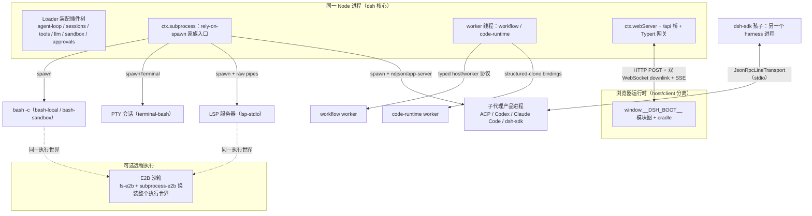
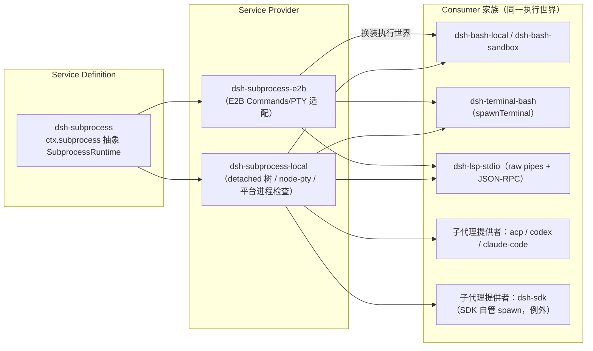
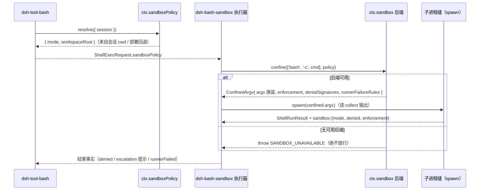
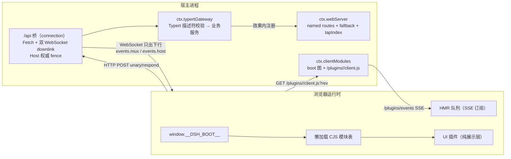
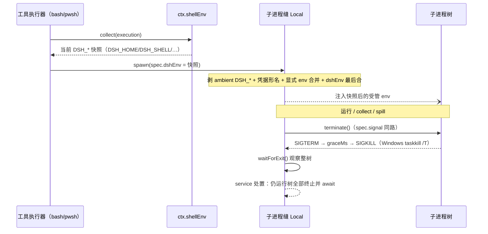

# 06 进程与边界

> 本维度回答一个贯穿 dsh 的问题：**主进程在哪里、谁被放到主进程外面、以什么协议穿过边界、以及边界被拆掉（dispose / 取消 / 宿主退出）时如何不留下孤儿。** dsh 把几乎整个运行时装进单一 Node 进程（Loader 在同一进程装配插件树），因此"进程边界"几乎全部出现在"向外"一侧：受控子进程、worker 线程、远程沙箱、独立的子代理运行时，以及浏览器宿主/客户端两极。判断标准全部来自可运行代码与生成的子系统目录，不是设计稿。
>
> **阅读模式**：每节先讲"你能感知到什么、想实现某功能该怎么做"（【你会看到】/【模型看到】/【插件作者】三镜头），再讲内部如何运作；机制描述始终回扣外部可感知的功能。

## 0. 本维度分析问题

先用用户视角把本维度的领地说清楚。**你界面上每一次"工具真的动了手"的时刻，都跨过了本维度讲的边界**：

- 你批准一条 Bash 命令，它不在 dsh 进程里跑，而是主进程外的一棵真实子进程树（§3.2、§3.7）；
- 权限模式是 `read-only`/`workspace-write` 时，这条命令被关进本机沙箱围栏，越界写入被挡下；`danger-full-access` 才绕过围栏（§3.3）；
- 换装 E2B 后，同样的 Bash/终端/LSP 工具把实际执行整体搬进云端 Linux 沙箱，工具层一行不改（§3.2 的"执行世界"）；
- 主 agent 委托的子 agent 可能是同进程的另一个助手，也可能是 Claude Code/Codex 这样的独立产品进程——只把最终答案交回来（§3.4）；
- 网页版里，浏览器标签页与宿主进程是两个执行体，靠 HTTP/WebSocket 通话；ACP 客户端（如编辑器集成）则以自动化服务器的方式驱动 dsh（§3.5）；
- 你正常退出 dsh 或停掉一轮后，已启动命令的整棵进程树被收干净、不留孤儿——除非宿主进程本身被外部强杀（§3.7）。

**你作为插件作者在本维度的动手入口**是一组"换世界的缝"：想换执行世界（本地 ↔ 云端）→ 同时替换 `ctx.fs` 与 `ctx.subprocess` 的 Provider；想给命令调用加围栏策略 → `ctx.sandboxPolicy` / `ctx.sandbox`；想接入一种新的子 agent 后端 → 往 `ctx.subagents` 注册 Provider；想加一种宿主形态（新 UI / 新自动化入口）→ 组合 Web 网关、ACP 服务器、SDK 服务器这些既有传输。任何"想自己 spawn 一个进程"的冲动，先问一句：能不能挂在 `ctx.subprocess` 上——挂上就免费获得进程坐标、终止升级与 `DSH_*` 清洗。

本维度具体回答下列七个问题：

1. **拓扑**：同一 dsh 进程里驻留哪些东西，主进程外面又有哪几类执行体（子进程、worker 线程、远程沙箱、浏览器、独立子代理运行时），它们的生命周期由谁持有。
2. **执行世界**：子进程缝（`ctx.subprocess`）的工作目录/可执行路径为什么与挂载的 filesystem 缝共享同一个命名空间，以及这个"执行世界"被整体搬走（E2B）后消费方为什么不必 fork。
3. **围栏**：沙箱缝（`ctx.sandbox`）在什么机理解释下只能做"同一世界同框"，per-call 策略为什么是调用的属性而不是 provider 的属性。
4. **子代理传输**：in-process / ACP / Codex / Claude Code / dsh-sdk 五类子代理提供者传输各自的成本与获取效果，以及为什么它们能在同一个 `ctx.subagents` 注册表里共存。
5. **宿主/客户端分离**：Web GUI 的进程侧 API 网关（`ctx.webServer`、`/api` 桥、Typert 网关）与浏览器运行时（boot manifest、模块图、HMR）之间的传输与装配边界。
6. **线程边界**：workflow-engine 与 code-runtime 的 worker 线程执行体隔离什么、不隔离什么（不是安全边界）。
7. **撤销**：`DSH_*` 环境词表如何被声明、重建、双向清洗，以及进程树的终止升级（SIGTERM → grace → SIGKILL）如何做到整树 quiescence。

本维度不写审批、凭据、guard 策略（见 [08-安全与治理](08-安全与治理.md)），不写模型接入与请求装配（[07-LLM接入层](07-LLM接入层.md)），不写装配/加载（[01-组合与启动](01-组合与启动.md)）。

## 1. 前置概念

- **插件 / 上下文（`ctx`）/ 服务 / 注入（inject）/ 效果（Effect）/ 事件（Typed Event）**（定义：见 00 §2.1）——所有能力都以插件挂进 `ctx`，注册即效果，卸载即撤销。本维度所有"服务"都是这一机制的实例。
- **能力缝（Seam，Service Definition / Service Provider / Consumer 三角色）**（定义：见 00 §2.5）——子进程缝与沙箱缝是两对完整三元组；子代理、shell、lsp、terminal、fs、web、workflow、code-runtime 在同一定义域内。缝是完整能力，单角色不是缝。
- **会话 / Session、会话事件 / SessionEvent、Turn、Step、Agent、Agent 循环**（定义：见 00 §2.3）——会话日志是唯一事实来源；Agent 是运行中公共句柄；子代理孩子是另一个 Agent。
- **作用域 / Scope、agent.ctx**（定义：见 00 §2.4）——in-process 子代理孩子获得"新的扁平作用域，不继承父注册"（见 §3.4）。
- **Branded ID**（定义：见 00 §2.6）——`SessionId`、`CallId`、`JobId`、terminal 的 `TerminalSessionId` 在类型层不可互换，跨进程/跨线程边界只能以品牌化字符串出现。
- **派生 / deriveMessages、持久化缝**（定义：见 00 §2.6）——"模型可见 ⟺ 已入日志"在跨进程场景由传输层替孩子重建日志；持久化缝让子代理会话能 cold-resume。
- **Profile / Bundle / Patch / 图层**（定义：见 00 §2.2）——子代理 SDK 孩子运行的是另一棵由自己的 `cordis.yml` 组合的插件树。

## 2. 概念约定

本维度登记以下 7 个术语（L0 未定义；正文不再造新词）。每个词条先直观后正式。

**子进程缝（subprocess seam，`ctx.subprocess`）**

直观：**所有"起进程"的统一插座**——你界面上每张 Bash 卡片背后的 `bash -c`、每个持久终端会话、每个语言服务器、每个外部子 agent 进程都从这里起。插座后面可以整体换成 E2B 云沙箱，前面的工具毫无察觉。

正式定义：进程坐标、进程树、生命周期、stdin/out 处置与终止升级的所有者；由 Service Definition `dsh-subprocess` 与本地/远程 Service Provider 组成。所有 rely-on-spawn 的家庭成员（bash 执行器族、terminal-bash、lsp-stdio、子代理提供者）都通过它起进程。

**沙箱缝（sandbox seam，`ctx.sandbox`）**

直观：**命令的"围栏"**。权限模式生效时，你批准的命令实际被包在一个受限运行器里执行，越界操作被挡下并带回失败；机器上没有可用后端时，命令宁可报"沙箱不可用"也不裸跑。

正式定义：对**精确 argv** 的按调用策略包裹 + 强制报告的进程围栏：`confine(argv, policy)` 返回替换 argv，或抛 `SANDBOX_UNAVAILABLE`。只围"同一执行世界"内共享宿主文件系统/内核的进程。

**传输（transport）**

直观：**跨进程说话的"线路制式"**：跟 ACP 子代理用 ndjson stdio、跟 SDK 孩子用一行一帧的 JSON-RPC、跟浏览器用 HTTP/WebSocket/SSE——每条线路都有明确规范，不靠私下约定。

正式定义：跨进程通信协议——ACP（Agent Client Protocol over ndjson stdio）、SDK JSON-RPC（`JsonRpcLineTransport`，一行一个紧凑 JSON 帧）、hook wire（Claude/Codex shell-hook 的 stdin 载荷 + 输出解码协议）以及浏览器侧 HTTP/WebSocket/SSE 信道。

**子代理提供者传输（subagent provider transport）**

直观：**"委托干活"时孩子住在哪里、怎么通话**。孩子可以是同进程的另一个助手（近零开销、能力全量），也可以是 Codex/Claude Code 这样的独立产品进程、甚至另一个完整 dsh；住法决定你等回什么、每次委托花多少。

正式定义：子代理能力缝的 Provider 后端路由——in-process（spawn/fork）、ACP、Codex、Claude Code、dsh-sdk——它们在同一 `ctx.subagents` 注册表按名共存，孩子可以是同一进程的 Agent、别的进程的 ACP 代理，或另一个 dsh runtime。

**worker 线程（worker thread）**

直观：**跑"可能失控的脚本"的隔离间**：长循环脚本不卡主线程/界面，无视取消的死循环脚本也能被一键强杀。它防"卡"与"杀不掉"，不防恶意——不是沙箱。

正式定义：workflow-engine 与 code-runtime 的线程内执行体——用 `node:worker_threads` 把脚本/程序的主循环移出宿主事件循环；是隔离机制，不是安全边界。

**宿主/客户端分离（host/client split）**

直观：**网页版"界面"与"大脑"分居两地**：浏览器只管渲染与交互，agent 运行在宿主进程；你的每次点击跨传输到达宿主，回复沿下行通道流回屏幕。

正式定义：Web GUI 的进程侧 API 网关（`ctx.webServer` 路由 + `/api` 桥 + Typert RPC 网关 + 插件 bundle 路由）与浏览器运行时（`window.__DSH_BOOT__` 模块图、懒加载 CJS 模块表、HMR 通道）之间的边界。

**`DSH_*` 环境词表**

直观：**子进程世界的"dsh 身份胸牌"**：每条命令拿到的是"此刻这份"身份（家目录、shell、会话号），发新牌前先撕掉旧的——嵌套/并发场景不会把陈旧身份带进新进程；环境里长得像密钥的项默认也被剥掉。

正式定义：由 `dsh-shell-env` 声明、工具执行器重建的子进程环境命名空间——`ctx.shellEnv` 收集 per-execution 快照，执行器先丢弃 ambient `DSH_*` 再注入当前快照，子进程缝同时把凭据形变量与 ambient 名剥除。

**本概念登记表**（在本文件追加；"直观对照"列是阅读锚点，不是定义）：

| 概念 | 定义所在 | 直观对照（用户可感知） |
|---|---|---|
| 子进程缝 / subprocess seam | 本文 §2 | 起进程的统一插座；换 E2B 后命令/终端/LSP 全家搬云端 |
| 沙箱缝 / sandbox seam | 本文 §2 | 命令的围栏：越界被挡、无后端宁可报错不裸跑 |
| 传输 / transport | 本文 §2 | 跨进程线路制式（ndjson / JSON-RPC 帧 / hook wire / HTTP+WS+SSE） |
| 子代理提供者传输 | 本文 §2 | 委托干活时孩子住哪、怎么通话、等回什么 |
| worker 线程 | 本文 §2 | 失控脚本的隔离间：不卡主线程、可强杀，但不是沙箱 |
| 宿主/客户端分离 | 本文 §2 | 网页版界面在浏览器、大脑在宿主进程 |
| `DSH_*` 环境词表 | 本文 §2 | 子进程的 dsh 身份胸牌：现发现戴、旧的先撕 |

## 3. 分析正文

### 3.1 进程拓扑总览

> **【你会看到】** 你能感知到的一切对话、思考卡片、工具卡片都发生在同一个主进程里；而每次工具"真的动手"——跑命令、开终端、起语言服务器、派子 agent——主进程外面就多出一类执行体。三个最直观的现象：（1）网页版里浏览器标签页与后台宿主进程是两个东西；（2）你跑的每条 bash 命令是一棵独立的子进程树；（3）换装 E2B 后这些命令实际全部跑在云端 Linux 沙箱里，而聊天界面毫无变化。
> **【插件作者】** 先记住一张地图：默认情况下你的插件代码（工具、监听器、策略）全在主进程；想引入"主进程之外的执行体"只有两条正道——挂在 `ctx.subprocess` 上（获得进程坐标、终止升级与 `DSH_*` 清洗），或定义一种传输（获得协议边界）。worker 线程是第三种形态（隔离事件循环），但不占前两者任何一条。

一个 `dsh` 进程就是一棵由 Loader 装配的插件树（见 [docs/architecture.md](../docs/architecture.md) §Profiles and bundles；00 §3.1 运行模型图）：agent 循环、会话日志、持久化、工具注册表、沙箱与审批策略、凭据、telemetry 全部注册在主进程的同一个 `ctx` 上（architecture.md:39-51）。核心服务里没有任何一个跑在第二个进程。所以"进程边界"的图景是一颗星：主进程居中，外圈是不同的执行体，各自通过**传输**或**受管子进程**相连。（用户体感：界面上每个"活动单元"——正在转圈的命令、常驻的终端、被委托出去的子 agent——都能在这颗星的外圈找到对应的一类执行体；而对话、审批、日志永远在主进程这一侧。）

外圈的类别与各自的持有者：

1. **受管子进程（children）**——经子进程缝（§3.2）spawn 的 `bash -c`、PTY 会话、LSP 服务器、ACP/Codex/Claude Code/SDK 子代理进程，以及经 `ctx.shell` 执行的 Claude/Codex 钩子命令；生命周期由 `SubprocessHandle` 与各 consumer 自建的 teardown ladder 持有。
2. **worker 线程**——workflow 脚本与 code-runtime 程序（§3.6），同进程但隔离事件循环。
3. **远程沙箱（可选 remote worker）**——E2B 把"filesystem + 子进程"整个执行世界搬到云端沙箱（packages/e2b/README.md:5-13）；`dsh-bash-local`、`dsh-terminal-bash`、`dsh-lsp-stdio` 因只依赖 `ctx.fs`/`ctx.subprocess` 而免于 fork（e2b/README.md:13）。
4. **浏览器宿主/客户端（browser host/client）**——Web GUI 的浏览器运行时经 HTTP/WebSocket/SSE 与宿主进程通信（§3.5）。
5. **独立子代理运行时**——`dsh-subagent-acp`/`-dsh-sdk` 启动的孩子各有自己的进程、自己的运行时与模型配置（§3.4）。



**要点**：外圈的每个成员要么挂在 `ctx.subprocess` 上（进程坐标统一），要么用传输（协议统一）；而"worker 线程"两条线都不占——它只隔离事件循环，见 §3.6。

### 3.2 子进程缝：执行世界共享 + 消费方家族

> **【你会看到】** 三个日常现象都由这条缝供给。（1）Bash 卡片上的命令是一条真实的 `bash -c` 子进程，输出很长时只保留有界尾部（溢出部分落到私有文件），不会把内存撑爆；（2）持久终端是一个真实 PTY 会话；（3）换装 E2B 云沙箱后，Bash、终端、LSP 的实际执行全部搬进云端——因为这条缝的 Provider 被换掉了，工具层毫无察觉。
> **【模型看到】** 它只知道"我发起了工具调用、拿到了结果文本"；命令跑在本机还是云端、输出是全量还是截尾，对它只是工具结果的内容差异，边界本身不可见。
> **【插件作者】** 想"起一个进程"（新的语言运行时、新的外部产品进程）→ 注入 `ctx.subprocess` 并用全显式 spec spawn，不要自己 `child_process.spawn`；想整体搬走执行世界 → 同时替换 `ctx.fs` 与 `ctx.subprocess` 两个 Provider——split-world 组合（fs 在一处、subprocess 在另一处）是非法的，会被明确拒绝。

子进程缝的 Service Definition 是 `dsh-subprocess`（`ctx.subprocess`，抽象 `SubprocessRuntime`），Service Provider 有本地的 `dsh-subprocess-local` 与远程的 `dsh-subprocess-e2b`。缝的契约要点（docs/subsystems/subprocess.md:91-133；packages/subprocess/subprocess/README.md:9-16）：

- **spec 全显式，无 hidden default**：`argv`（从不由缝做 shell 解释）、`cwd`、逐流 `stdio`、`graceMs`、可选 `signal`/`env`。部署相关的默认值归 caller 的 config（`dsh-shell` 的 request/spec 分裂是拥主模板）。
- **stdio 是 Node 形状逐流处置**：`'pipe'` 把原始流交给 caller 做协议分帧（LSP JSON-RPC、ACP ndjson），`'inherit'` 透传父描述符给诊断，collect 模式 `{ maxBytes, spill? }` 缓冲有界尾部并可选溢出到私有 spill 文件（0600/0700，随机名）。collect 读器按整流字节偏移、永不消费，所以并行读器互不偷数据。
- **终止是整树作用域**（subprocess-local/README.md:9）：POSIX 对孩子 detached 成独立进程组、按负 pgid 发信号（组消失时退回直接子进程）；Windows 用 `taskkill /PID <pid> /T /F`。`terminate()` 是唯一的终止动词，`waitForExit(signal?)` 观察整树活性——consumer 自建 teardown ladder 因而每一层都停在真实 quiescence 上。

**执行世界共享**是这条缝最重要的语义：spawn 的工作目录与可执行路径属于"与挂载的 filesystem 缝共享的同一执行世界"（subprocess.md:11；architecture.md:102）。决定性的推论是：这个世界的坐标由 `ctx.fs` + `ctx.subprocess` 一起定义，**换掉这两个服务就把整个世界搬走**。E2B 正是这么做的——`fs-e2b`/`subprocess-e2b` 挂载后，bash、终端、LSP 的 mutable 工作在同一个云端沙箱里（e2b/README.md:13），而 `lsp-stdio` 还明确声明"必须同时挂同一执行世界的 fs 与 subprocess provider；split-world 组合非法"（packages/lsp/lsp-stdio/README.md:45）。远程的所有权伸缩（`resolveExecutable` 带 abort signal、远程 spill、远程 terminal 会话）是缝内语义，不是各消费方的职责。（用户体感：切换到云沙箱后，你在终端里 `ls` 看到的就是云端目录、Bash 写的文件落在云端——三个工具像约好了一样同时搬家，因为它们共用同一对缝。）

消费方家族各按自己的 stdio 处置与终止形态取用同一条缝：

| 消费方 | 缝原语 | stdio 处置 | 协议 | 终止/清理形态 |
|---|---|---|---|---|
| `dsh-bash-local` | `spawn` | collect + spill | 无（`bash -c`） | `terminate()` 树升级 |
| `dsh-bash-sandbox` | `spawn`（换装后的 argv） | collect + spill | 无 | 同上 + runner 失败分类 |
| `dsh-terminal-bash` | `spawnTerminal` | 非 pipe 原语（TTY UTF-8，拥有前台进程组） | 无 | `terminate()` 整会话 TERM→KILL |
| `dsh-lsp-stdio` | `spawn` | stdout/stderr `'pipe'`（LSP JSON-RPC）；stderr 附加 collect 尾 | LSP JSON-RPC | `shutdown`/`exit` → 树杀 + 树活性等待 |
| `dsh-subagent-acp` | `spawn` | ndjson `'pipe'` + stderr `'inherit'` | ACP | stdin-EOF 先行的 `disposeAcpChild` ladder |
| `dsh-subagent-codex` / `-claude-code` | `spawn` | app-server stdio pipes | JSON-RPC / Claude Agent SDK | interrupt → 树杀 + 整树退出等待 |
| `dsh-subagent-dsh-sdk` | SDK client 自管 spawn（例外） | SDK 传输内部持有 | dsh-sdk stdio JSON-RPC | `shutdown` → stdin-EOF → SIGTERM → SIGKILL |
| hooks 桥（`dsh-hooks-claude-code` / `-codex`） | `ctx.shell`（bash 执行器） | collect / stdin 载荷 | hook wire（stdin JSON 载荷 + 输出解码） | `runHook` 转发 signal → 执行器的进程组 kill → join |

（各行的依据：subprocess.md:5 给出的缝家庭分派；bash-local/README.md:25-30；bash-sandbox/README.md:9,23；terminal/README.md:10 与 terminal-bash 在 `ctx.subprocess.spawnTerminal` 上；lsp-stdio/README.md:15-16；subagent-acp/README.md:17,60；subagent-dsh-sdk/README.md:15,56-58；packages/hooks/hook-protocol/README.md:14,23 描述 `runHook` 经 `ctx.shell` 的 stdin 载荷 + env + 输出解码，且取消即到达执行器的进程组 kill 与 join 边界——hooks 桥因此在 `dsh-tool-bash` 之外构成一条"钩子命令进程也经同一执行世界"的旁路。）



### 3.3 沙箱缝：同一世界同框与 per-call 策略

> **【你会看到】** 权限模式生效时的几类体感。（1）`read-only` 下模型想改文件，命令会失败并带回"被围栏挡住"的输出；（2）`workspace-write` 下工作区内可写、区外被挡；（3）`danger-full-access` 才绕过围栏直接跑；（4）最关键的安全姿态：机器上没有可用沙箱后端时，命令**宁可报"沙箱不可用"也不裸跑**——fail-closed 而不是 fail-open。
> **【模型看到】** 被围栏挡下的命令以一条失败的工具结果回到它面前（携带 denied 事实）；它不知道"沙箱"的存在，只看到命令没成、错误输出是什么，然后自行换路。
> **【插件作者】** 想给某类调用加围栏策略 → per-call 策略经 `ctx.sandboxPolicy.resolve()`（策略是调用的属性，不是 provider 的全局配置）；想换本机围栏后端（bwrap/Landlock/Seatbelt/ACL）→ 注册 sandbox Provider。想上容器/microVM 不是这条缝的事——那要整体替换 `ctx.shell`/`ctx.fs` 的 Provider 组。

沙箱缝的 Service Definition 是 `dsh-sandbox`（`ctx.sandbox`），Provider 是 `dsh-sandbox-local`；消费它是 `dsh-bash-sandbox` 与 `dsh-pwsh-sandbox`（docs/subsystems/sandbox.md:5）。缝的契约是一句话：**`confine(argv, policy)` 返回"以你的 argv 换成的候选 argv"**（runner、profile、分隔符、再来你的 argv），并附上所选后端的 enforcement 完整性、denial 方言与 runner-failure 规则；没有可用后端时抛 `SANDBOX_UNAVAILABLE`，**绝不明知不可用仍放行**（sandbox.md:152-154；packages/sandbox/sandbox/README.md:7）。`argv` 是"你正要 spawn 的精确 argv，不是 shell 字符串"——shell 形消费方自己传 `['bash', '-c', command]`（sandbox.md:184）。

**同一世界同框**是这条缝的硬边界：后端共享宿主的文件系统与内核——Linux 用 `bwrap`、否则 per-platform Landlock 启动器，macOS 用 Seatbelt（`sandbox-exec`），Windows 用 ACL restricted-token runner（sandbox-local/README.md:5,13,15）。`workspaceRoot` 指的是宿主机器上真实被 canonicalize 的目录，所以含义是"回到同一个框里的同一条执行路径"，而不是虚拟化出一个新世界。容器、microVM、与远程执行**不是**这条缝的后端——它们是整条能力缝的 Service Provider 替换（`ctx.shell`/`ctx.fs` 的环境一致组），E2B 是这一替换的 POC（sandbox/README.md:11；e2b/README.md:13）。

**`SandboxMode` 只管辖文件效果**：`read-only`（POSIX 端额外给 shell 需要的 `/dev/null` 写口）、`workspace-write`（workspaceRoot + 后端承诺的临时区）、`danger-full-access`（绕过围栏，provider 根本不被咨询）。网络与进程可见性在模式词表之外（sandbox.md:11-22；bash-sandbox/README.md:22）。**enforcement 是报告出来的事实**：`full`/`partial`——旧 Landlock ABI 与 Windows ACL 的 Everyone 边界都如实报 `partial` 而不是夸大（sandbox.md:30-38；sandbox-local/README.md:36-37）。（用户体感：工具结果里的围栏强度标注可信——旧 Landlock ABI/Windows ACL 场景如实标"部分强度"，不会被夸大成完整围栏。）

**per-call 策略**是区别于"provider 全局配置"的关键。`ctx.sandboxPolicy.resolve()` 把"本次能力调用"的总策略解析出来（sandbox.md:41-94；packages/sandbox/sandbox-policy/README.md）：正常工具调用从调用会话的不可变 cwd 派生 `workspaceRoot`，部署配置是 agentless 回退；已批准的 escalation 是一次"更宽的新调用"。Provider 不持有调用间策略状态，两个消费者可以同一瞬间在不同策略下围同一 provider（bash 在 `read-only` 下、一个被围的续话子代理需要它的状态目录可写）。默认化/解析是在消费者边界的一个显式步骤，Provider 把策略视为完全指定（sandbox.md:81-94）。（用户体感：不存在"全局切一档"的顿挫——同一时刻不同对话/不同调用可以各围各的框，互不影响。）

**失败分类是两个正交的方言**（sandbox.md:96-147）：`denialSignatures` 识别"围栏正常工作、挡住了被围命令"（bwrap 的 EROFS 文本、Landlock 的 EACCES、Seatbelt 的 EPERM）；`runnerFailureRules` 识别"runner 在执行命令前就拒绝/失败了"——consumer 先判 runner 失败（这会报 `SANDBOX_UNAVAILABLE` 而不是普通任务失败），再在允许的非零退出与信息行排除后匹配 denial。子进程缝的退出码/输出事实独立保留，`ShellSandboxInfo` 把 mode/denied/enforcement/runnerFailed 作为独立事实报告（docs/subsystems/shell.md:147-163）。



### 3.4 子代理提供者传输：横向比较

> **【你会看到】** 主 agent 说"把这块委托给子 agent"之后发生什么，取决于用哪个后端：in-process 孩子与主 agent 同住一进程，零进程启动、能力全量；ACP/Codex/Claude Code/dsh-sdk 孩子则是独立进程——每次委托要付一次进程启动（拉起一个完整运行时或产品进程），换来进程级隔离，而且**父 agent 只拿到干净的最终答案**（ACP 回最终流式文本，Codex/Claude Code 只回 final answer；孩子的完整过程留在孩子自己的会话根里）。
> **【模型看到】** 它看到的是 delegation 工具的一条结果——孩子的最终产出文本。孩子内部跑了几步、用什么模型、留了什么 transcript，都不进入它的上下文。
> **【插件作者】** 想接入一种新的子 agent 后端（另一个 agent 产品）→ 实现该缝的 Provider 并按名注册进 `ctx.subagents`（名字即路由）；孩子不支持的能力必须在 `start()` 前以 `UNSUPPORTED_CAPABILITY` 明确拒绝，不能"接受后忽略"。

子代理能力缝不同于其他缝的一点是**多个 Provider 在一个 `ctx.subagents` 注册表里按名共存**（docs/subsystems/subagent.md:5；packages/subagent/subagent/README.md:5）——注册是效果、移除阻止新 start 但不撤销已交付的 run（subagent/README.md:15）。五个提供者的共享契约由 Service Definition 持有：start-time capabilities 在一次性 run 创建前被服务检查（`outputSchema`/`depthLimit`/`toolFilter`/`persona`），缺的东西在 `start()` 前就 `UNSUPPORTED_CAPABILITY` 拒绝，绝不"接受后忽略"；容续子代理由 continuation 管理器自己组合，由 `prepareContinuable` 方法**存在与否**作为能力门（subagent.md:13,406-458）。

五个后端在"孩子的进程形态 × 传输 × 孩子能做什么 × 每次 run 花什么"上的取舍：

| Provider | 孩子进程 | 传输 | 孩子构成 | start-time capabilities | `inheritsParentContext` | 续话 | 每 run 花费 | 获取效果 |
|---|---|---|---|---|---|---|---|---|
| `fork` / `spawn`（in-process） | 同一进程新 Agent | 无（进程内 typed 值） | 经 `parent.ctx` 新建、新扁平作用域；fork 注入父已完成的平衡轮次前缀 | 全部 | fork: true / spawn: false | 支持（`prepareContinuable`） | 同一进程内的一个额外 agent/session；零进程启动 | 完整 harness 能力、预设/工具 join、深度/工具过滤/人设作用域化 |
| `acp` | 每 run 一子进程（任意 ACP runtime） | ACP（ndjson stdio） | 独立 runtime、独立会话/模型/工具；只收最终流式文本 | 全部 none（远程不可强制） | false | 否（需每子代理 persistence 广告） | 子进程 + 完整 runtime boot | 进程隔离、parent 拿干净结果；仅最终 `agent_message_chunk` 文本回传 |
| `codex` | 每 run 一 `codex app-server --stdio` 子进程 | Codex app-server JSON-RPC（ephemeral thread） | 原生 Codex 安装/配置/认证 | 全部 none | false | 否 | 子进程 + 原生产品上下文 | Codex 独立上下文与独立 KV 缓存；只回 final answer |
| `claude-code` | 每 run 一官方 SDK 查询 + CLI 子进程 | Claude Agent SDK 消息流 | 原生 `claude` + native settings 权威 | 全部 none | false | 否 | 子进程 + 原生账号状态 | 独立产品会话；只回严格 final answer；宿主 settings 不能被过滤 |
| `dsh-sdk` | 每 run 一完整 harness runtime 子进程 | dsh-sdk stdio JSON-RPC（`session.event` 流） | 另一个 dsh：自己的 `cordis.yml` 组合、持久化、模型路由 | 全部 none | false | 否 | 最重（完整插件树 boot） | 完整 peer harness 隔离；孩子的 transcript 留在孩子自己的会话根 |

（各行的依据：in-process 深度/fork 种子与作用域见 subagent.md:463-468 与 subagent/README.md:43,54-57；ACP 见 subagent-acp/README.md:5-21,60；Codex 见 subagent-codex/README.md:5-19；Claude Code 见 subagent-claude-code/README.md:5-23,32；dsh-sdk 见 subagent-dsh-sdk/README.md:5-23,56-58。续话/无续话的边界在 subagent/README.md:145-147 的 Known Limitations。）

**花费与获取效果的对称性**：in-process 最便宜（零进程启动、共享工具注册表与策略派生），但接受同一信任域——孩子经 `applyChildComposition` join 父的 agent-preset 组合才有了工具集（subagent/README.md:43）。三个"完整运行时/产品"后端每次都付独立的进程启动与独立上下文，买来的是进程级隔离与"parent 只拿到干净最终答案"；尤其是 Codex/Claude Code，各自的 `dispose()`（interrupt → 树杀 → 整树退出，subagent-codex/README.md:15、claude-code/README.md:13）也正是把独立子进程清干净的自然路径。`dsh-sdk` 是三者的上限：同一个产品保证（完整 harness 行为）加上最难清理的边界（`shutdown` → EOF → 树杀 ladder，subagent-dsh-sdk/README.md:15）。（用户体感：选后端就是在"零开销、能力全"与"隔离好、答案干净"之间选——同进程委托立即开始且孩子能用父的工具集；外部产品委托要先拉起一个进程，但两边上下文互不污染，父只收最终答案。）

```mermaid
flowchart LR
    subgraph REG["ctx.subagents 注册表"]
        V["SubagentRuntime<br/>start / startContinuable / followup / interrupt"]
    end
    T["dsh-tool-subagent（模型面 Consumer）"]

    V -->|"按名路由"| P1["fork / spawn"]
    V -->|"按名路由"| P2["acp"]
    V -->|"按名路由"| P3["codex"]
    V -->|"按名路由"| P4["claude-code"]
    V -->|"按名路由"| P5["dsh-sdk"]
    T -->|start(name, req)| V

    P1 -->|进程内| C1["同进程新 Agent（父 ctx / 种子）"]
    P2 -->|ACP ndjson| C2["子进程 ACP runtime"]
    P3 -->|app-server JSON-RPC| C3["codex 产品进程"]
    P4 -->|Claude Agent SDK| C4["claude 产品进程"]
    P5 -->|sdk stdio JSON-RPC| C5["完整 harness runtime 进程"]
```

### 3.5 宿主/客户端分离：API 网关与浏览器运行时

> **【你会看到】** 网页版的"分身"体验：聊天界面活在浏览器里，agent 活在宿主进程里——你的每次操作经 HTTP POST 过去，回复沿只下行的 WebSocket 流回来；开发模式下改前端插件代码，页面自动"失效→预取→重挂载"，不用手动刷新。另一个同构形态：ACP 客户端（如编辑器集成）把 dsh 当作自动化服务器/子 agent 驱动，走的也是"宿主进程 + 外部客户端"这一类分离。
> **【插件作者】** 想加一种宿主形态（新 UI、新自动化入口）→ 不需要 fork 核心：宿主侧用 `ctx.webServer` 注册路由、经 `/api` 桥暴露 Typert 远端；浏览器侧把插件做成声明 `dsh.client` 的包进入 boot 模块图；纯自动化场景则组合 ACP 服务器或 SDK 服务器。

Web GUI 的分离线把"进程里能干什么"与"浏览器里能渲染什么"切在传输上。宿主侧三类服务共同构成网关：

- **HTTP 载波**：`dsh-host-webserver` 提供 `ctx.webServer`——单一 `node:http` 插件，拥有 named-route 注册表、index.html 变换回调与一个 fallback 座位（二次注册会抛）；它不知道任何 harness 概念，`/api` 桥、插件 bundle、HMR 事件流都由别的插件注册（docs/subsystems/web-server.md:5,27,45）。
- **`/api` 桥与双 WebSocket downlink**：`dsh-client-connection` 的 Host 半段拥有唯一 `/api` 路由与 Fetch bridge——注册的 Typert 拦截器先认领它的 Remote 端点，未认领的落到 API Proxy 回退；浏览器的下行是 `/api/events.mux` 与 `/api/events.host` 两个只出不进文本帧的 WebSocket（connection/README.md:5,9,13）。同一包为 `Host` 权威声明做 loopback/`trustedHosts` DNS-rebinding 防御（connection/README.md:7-9）——这是**可达性策略，不是认证**。
- **Typert RPC 网关**：`dsh-api-gateway` 的 Host 端提供 `ctx.typertGateway`（按生成描述符校验命名实参、解析对象/Context 身份、调用业务方法并验证结果），客户端端提供 `ctx.remote`（`$mount` 生成方法、`$on` 订阅转发事件）；业务选择留给 `api/remotes` 的 BFF 装配，传输/关联/信任留给 Connection（packages/api/gateway/README.md:5,9,17-25）。

浏览器侧由 **boot manifest + 模块图** 完成对接：`dsh-client-modules` 扫描声明 `dsh.client` 的包，把 `window.__DSH_BOOT__` 条目图作为 `<head>` 里第一个 script 注入（`<` 转义以免插件可控字符串跳出 script 元素），把每个 bundle 在 `GET /plugins/<id>/client.js` 用 `no-cache` + `rev` 提供，并对每次 index 渲染 tap 注入当前图——页面缺 manifest 就不 boot，解析失败 loud（docs/subsystems/client-modules.md:5,11,45-57）。`dsh-client-hmr` 是 dev 模式下的重建驱动：Host 半段 stat-poll 每个图行的 bundle、只广播真实 rev 变化，浏览器半段订阅系统 SSE 通道 `GET /plugins/events`、按帧做 serialize 的 invalidate → prefetch → remount 链（packages/client/hmr/README.md:7）。（用户体感：开发时保存前端插件代码，页面自动完成失效→预取→重挂载，无需手动刷新；且只有 bundle 版本真变化才广播，不会无谓闪烁。）

两者之间的传输形态：浏览器 → Host 用 HTTP POST 做 unary/respond，Host → 浏览器仅经两条下行 WebSocket（connection/README.md:5）；整套 RPC 载荷是 Typert 生成的描述符（JSON-RPC 形方法表，gateway/README.md:9-11）；HMR 走 SSE 事件帧。同一个 `ctx.webServer` 只服务浏览器：Electron 宿主直接以 `file://` 加载构建产物并把 fetch 请求改经 IPC 桥，不经过这个 HTTP 服务器（web-server.md:5）。这条线之外还有两个"外进程编排"形态与宿主同构：ACP 自动化服务器（`session/prompt` → `agent_message_chunk`，packages/acp/acp/README.md:20-34）与 SDK 服务器（stdio JSON-RPC，packages/sdk/README.md:7-10）——它们都是 §2「传输」定义的实例。



### 3.6 worker 线程执行边界

> **【你会看到】** 两类"不怕失控"的体验：长循环的 workflow 脚本再怎么转，聊天界面与主循环不卡；一个无视取消信号、死循环的脚本能被真正强杀（`terminate()`），不会变成杀不掉的僵尸。同时有个诚实的边界提示：这不是沙箱——别指望它防恶意脚本。
> **【插件作者】** 想跑"可能长时间忙等 / 可能不听取消"的脚本 → 走 workflow 引擎或 code-runtime 的 worker 线程执行体；想要真正的安全围栏 → 叠加 §3.3 的沙箱或 §3.7 的环境清洗，worker 线程本身只隔离事件循环并提供干净终态。

worker 线程在 dsh 里有两个家。**workflow**：`dsh-workflow-worker-thread` 实现 `WorkflowEngine`，每个 run 一个 worker，脚本在该 worker 的 `node:vm` 上下文里执行；孩子 agent 留在宿主，经 typed host/worker 协议走 `ctx.subagents`（workflow-worker-thread/README.md:5）。这个分裂的目的是两件**流程**上的事：同步脚本循环不能卡宿主事件循环；无视取消的脚本能被 `worker.terminate()` 真正终结（README.md:9）。它**明确不是安全边界**：逃出 vm 的脚本能拿回 worker 进程权限（README.md:9,13,120），所以它是"API-shaping + 干净终止"，不是沙箱。worker 仍提供三层有用隔离：CPU 忙等离环、`terminate()` 作为 disposal 的真实终态、空环境启动使 ambient 凭据不经过 `process.env` 跨界；host/worker 消息用 structured-clone 数据 + 脚本边界 plain-JSON 校验（README.md:15-20,53-55）。（用户体感：点"停止"后，哪怕脚本正在死循环里出不来，也能被真正杀掉——这就是"干净终态"的体感。）

**code-runtime**：`ctx.codeRuntime` 的 `isolation` 只读描述符取 `'worker-thread'`/`'process'`/`'container'`——是部署与诊断标签，**不是安全声明**（docs/subsystems/code-runtime.md:161；packages/code-runtime/code-runtime/README.md:15,37）；当前只有 worker-thread 后端发货，'process'/'container' 是已声明未实现的 well-known 值，硬安全边界等 container 后端。

与子进程缝的关系一句话：worker 不经过 `ctx.subprocess`（无进程坐标、无树、无 `DSH_*` 通道），它们的隔离对象是宿主事件循环与"一个废弃脚本能被强拆"，不是对宿主文件/凭据围栏。真正的围栏依赖 §3.3 的同一世界沙箱，或在 §3.7 的 scrub 上叠。

```mermaid
flowchart TB
    subgraph HOSTC["宿主进程"]
        WE["ctx.workflowEngine（worker-thread 引擎）"]
        CR["ctx.codeRuntime（worker-thread 后端）"]
    end
    subgraph W1X["worker（每 run 一个）"]
        VM1["node:vm 脚本上下文<br/>agent() / parallel() / pipeline() / phase()"]
    end
    subgraph W2X["worker（每 run 一个）"]
        VM2["程序体 + bindings（structured-clone）"]
    end

    WE <-->|"typed host/worker 协议"| W1X
    W1X -->|agent() 经 ctx.subagents| SA["宿主侧子代理 children"]
    CR <-->|"CodeRunRequest + 结果（结构化克隆桥）"| W2X
    NOTE["隔离 = 事件循环 + terminate() 真终态<br/>不是安全边界（vm 可逃逸、isolation 是标签）"]
```

### 3.7 `DSH_*` 环境词表与进程树撤销

> **【你会看到】** 两个"看不见但重要"的体验。（1）你正常退出 dsh 或取消一轮后，已启动命令的**整棵**进程树被收干净——没有残留进程继续在后台跑（宿主进程本身被外部强杀除外，那超出任何进程内机制的能力）；（2）嵌套/并发场景不会串身份：每条命令拿到的是"此刻这份"dsh 身份，陈旧的旧身份先被撕掉，环境里长得像密钥的项默认也不会混进子进程。
> **【模型看到】** 环境词表与终止升级对它纯幕后：它只看到命令的输出与退出结果，命令树怎么被杀、环境怎么清洗不改变工具结果的形态。
> **【插件作者】** 想给子进程注入 dsh 身份信息 → 声明 `ctx.shellEnv` 的 effect-scoped contributor（重复属主/未声明 key 会报错 loud），**永远不要自己改 `process.env`**；想让你的子进程合作式退出 → 学 ACP 的 teardown ladder：先给合作期（如 stdin-EOF），再走 `terminate()` 升级链并 await 整树退出证明。

**词表由 `dsh-shell-env` 声明**：`ctx.shellEnv` 的注册表携带受信的 per-execution `DSH_*` 变量（内建 `DSH_HOME`/`DSH_SHELL`/`DSH_SESSION_ID`，持久化翻译器再加 `DSH_SESSION_JSONL` 位置提示；其他插件提供 effect-scoped contributor，重复属主/未声明 key 报错 loud）。`collect(execution)` 在每次 shell 工具调用时重建当前离线快照，经 `ShellExecRequest.dshEnv` 专属通道传给执行器；执行器先把继承来的全部 `DSH_*` 丢弃，再注入这份快照，所以嵌套 harness 与并发父/子 agent 不能泄漏陈旧身份，且 `process.env` 从不被改写（packages/shell/shell-env/README.md:5,20-39；docs/subsystems/shell.md:11）。

**子进程缝同时做两次清洗的同一地基**：`scrubbedParentEnv()` 把凭据形名（`*KEY*`/`*PASSWORD*`/`*SECRET*`/`*TOKEN*`）与全部 ambient `DSH_*` 剥掉，显式 `env` 在剥之后合并；`undefined` 墓碑删除一条普通 ambient 值（docs/subsystems/subprocess.md:15,128；subprocess-local/README.md:11）。最关键的语义是"当前事实只能以显式字符串进入"——一个有意传入的 `DEEPSEEK_API_KEY` 或 `DSH_*` 部署事实（如 `DSH_PERMISSION_MODE`）在剥壳后仍能存活，而 ambient 的陈旧同名项被丢弃（subagent-acp/README.md:60）。

**进程树撤销是唯一终止动词的升级链**：`SubprocessHandle.terminate()`（与 spec 的 abort signal 同路触发）做 SIGTERM → `graceMs` → SIGKILL（Windows 直接 force-terminate），幂等、树已消失时是 no-op；`waitForExit(signal?)` 观察整树退出。disposal 与宿主退出各有兜底：服务 dispose 终止所有仍在运行的 managed 进程并 awaited 其退出（subprocess/README.md:17 的契约）；处于激活效果期时，Node `exit` 监听器同步对仍在 live 集合的普通树与可观察终端会话发 SIGKILL/`taskkill /T /F`（不建 promise 或 timer、保存宿主退出码）（subprocess-local/README.md:9,16）。外部 supervision 缺口如实记录：`SIGKILL`/OOM/`process.abort()`/native 崩溃需要外部 supervisor 或容器 init（subprocess-local/README.md:31）。（用户体感：哪怕命令自己 fork 出了孙进程，停止/退出时也是整树一起走——TERM 不理就给 grace 期、再不理就 KILL。）

consumer 侧的 teardown ladder 是"缝给动词、consumer 给合作形状"的模板：ACP 后端 `disposeAcpChild` 先关 stdin 并给 `disposeEofGraceMs` 合作性 quiescence，再调用缝的 `terminate()` 升级并 await 整树退出证明（subagent-acp/README.md:17）——这正是 defensive-patterns 的"Dispose 必须到达 quiescence 而非仅仅请求它"。



## 4. 交叉引用

| 目标 | 关系 |
|---|---|
| [00-概念总览](00-概念总览.md) | L0：插件/上下文/能力缝/会话/作用域等本维全部前置概念 |
| [01-组合与启动](01-组合与启动.md) | Loader、图层与插件树装配决定主进程里有什么；bundle 换装 provider 决定执行世界被搬去哪 |
| [03-数据平面](03-数据平面.md) | 会话日志的持久化与 cold-resume 是子代理"续话"与 SDK 孩子 transcript 的前提 |
| [05-能力清单](05-能力清单.md) | 本文涉及的所有能力缝（shell/subprocess/sandbox/subagent/lsp/terminal/fs/web/workflow/code-runtime）的完整实例清单与依赖方向 |
| [07-LLM接入层](07-LLM接入层.md) | 模型请求装配不跨进程；子代理孩子各自的模型路由在各自进程内 |
| [08-安全与治理](08-安全与治理.md) | 审批/凭据/guard 不在本维度；子代理的委托策略固定（`approval: never`）与沙箱 escalation 属于 08 |
| [docs/subsystems/subprocess.md](../docs/subsystems/subprocess.md) | 子进程缝的 Service Definition/Provider 细分与完整契约 |
| [docs/subsystems/sandbox.md](../docs/subsystems/sandbox.md) | 沙箱缝的模式/围栏/enforcement/per-call 策略 |
| [docs/subsystems/subagent.md](../docs/subsystems/subagent.md) | 子代理缝的提供者契约、continuable、结果契约 |
| [docs/subsystems/{web-server,client-modules}.md](../docs/subsystems/web-server.md) | 宿主/客户端分离的两侧子系统页 |
| [docs/subsystems/{shell,lsp,terminal}.md](../docs/subsystems/shell.md) | 本文涉及的 rely-on-spawn 家族消费方各自的子系统页 |
| [packages/sdk/{protocol,client,server}](../packages/sdk/protocol/README.md) | dsh-sdk 传输：（`JsonRpcLineTransport`、TS 客户端、stdio 服务器） |
| [packages/hooks/hook-protocol](../packages/hooks/hook-protocol/README.md) | hook wire 传输库与两个桥插件的共享原语 |
| [docs/defensive-patterns.md](../docs/defensive-patterns.md) | 生命周期/并发/子进程防御规则：quiescence 而非请求、正交结果独立报告、scrub 与私有路径 |

## 5. 合规自查

- [x] 概念纪律：正文术语均来自 L0 或本文 §2；§2 仅登记了任务授权的 7 个概念（子进程缝、沙箱缝、传输、子代理提供者传输、worker 线程、宿主/客户端分离、`DSH_*` 环境词表）。
- [x] 仓库既有短语（"执行世界"、"同一世界同框"、"同框"）均为**带引用的转述**（architecture.md:102、sandbox/README.md:11、sandbox-local/README.md:11），不作为本文新定义。
- [x] 审批/凭据/guard 等安全概念仅作指向 08 的行文，未在本篇定义。
- [x] 覆盖要求：进程拓扑总览（图 6-1）、子进程缝消费方家族与执行世界共享（图 6-2）、沙箱缝同框/per-call（图 6-3）、子代理提供者传输横向对比（图 6-4）、host/client 分离（图 6-5）、worker 线程执行边界（图 6-6）、`DSH_*` 环境与 kill 升级（图 6-7）——共 **7 幅 Mermaid 图**，每幅配说明文字。
- [x] 全文证据均为文件路径 + 行号/章节（`docs/subsystems/*.md`、`packages/*/README.md`、`docs/architecture.md`）。
- [x] 每个分析小节遵循"先能力后机制"模式：开头三镜头锚点（【你会看到】/【模型看到】/【插件作者】，至少两镜头），机制描述以"（用户体感：……）"回扣外部可感知功能；直观描述是阅读锚点，不新增技术论断。
- [x] 未修改仓库任何其他文件（本次仅改写本文）。
