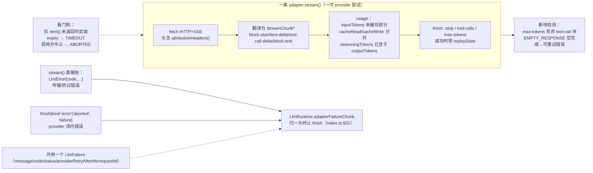
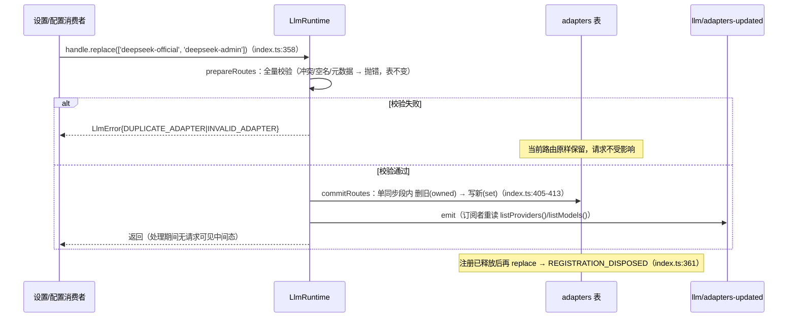

# 07 LLM 接入层

> 架构分析序列第 07 篇。剖析 LLM 接入层：`ctx.llm` 服务如何同时承担「适配器注册表」与「可拦截的流式模型调用」两个角色，把 provider 无关的请求/会话日志词表接到具体 provider 的 HTTP+SSE 线上协议；以及 adapter 契约、重试恢复、token 记账与注册表替换如何在这条边界上保持各自的不可变性质。所有结论均可回溯到仓库源码与 docs 的精确位置。
>
> **阅读模式**：每节先讲"你能感知到什么、想实现某功能该怎么做"（【你会看到】/【模型看到】/【插件作者】三镜头），再讲内部如何运作；机制描述始终回扣外部可感知的功能。

## 0. 本维度分析问题

先用用户视角把本维度说清楚。**模型每一句话怎么发出去、怎么流回来，全在这一层**：

- 你看到的打字机效果，是模型回复被切成一个个流式片段、逐块先落日志再上屏（§3.2）；
- 模型下拉里切换供应商/模型，下一句就走新路由，且每次生效配置在会话日志里留下快照（§3.1、§3.2）；
- 限流/网络抖动时它会"停一下然后自己继续"——那是重试插件在退避后自动恢复（§3.4）；
- 会话标题自动生成、上下文快满时的压缩摘要，是同一条缝上的"辅助调用"，不占用对话轮次（§3.7）；
- token 用量按"未缓存输入 / 缓存读 / 缓存写"分开记账，思考 token 已含在输出里（§3.5）。

**你作为插件作者在本维度的动手入口**：想接一个新模型供应商 → 继承 `LlmAdapter` 实现 `stream()` 并注册路由（§3.1、§3.3）；想拦截/观察每一次模型调用 → `llm/stream` waterfall（§3.7）；想自定义失败恢复 → 监听 `agent/request-error` 返回 `{kind:'retry'}`（§3.4）；想读会话 token 压力 → `ctx.tokenMeter.measure()`（§3.5）。

本维度回答五组问题：

1. **注册表内部**：`ctx.llm`（`LlmRuntime`）的内部状态是什么？`registerAdapter` 为什么是「注册即效果」的？`llm/stream` waterfall 如何把 adapter 的选择、分派与迭代错误统一归一成一个终止的 chunk？
2. **一次生成**：从循环装配请求头开始，到 `assistant/message` 落入会话日志为止，chunk 流经历了哪些环节？为什么请求是「日志的纯函数」、原始 chunk 与组装块如何双轨并存？
3. **adapter 契约**：所有 adapter 必须遵守的不可变不变量是什么——`usage` 相对 `finish` 的次序、tool-call 参数的原始 JSON 形式、两条错误路径、超时看门狗、context overflow 编码、空响应可重试、app attribution？
4. **失败与记账**：`agent/request-error` 如何用 `ResolvedRetryPolicy` 驱动重试恢复；`TokenUsage` 如何进入日志、被 token-meter 以 per-session 隔离折叠复用；`AdapterRegistrationHandle.replace` 为何能做到无间隙原子替换？
5. **直接调用 vs loop-built**：`ctx.llm.stream()` 与 `prepareCall().stream()` 对普通调用方与循环分别要求什么契约？`markAgentLoopRequest` 标记与深冻结请求对监听器意味着什么？

文档只读写作，不修改仓库内任何其他文件。

## 1. 前置概念

本节列出正文引用、但不在此定义的既有概念，均来自 00 概念总览或既有维度文档。

- 上下文 / ctx、服务、注入（定义：见 00 §2.1）
- 插件、效果、事件、事件分派模式、Waterfall 语义（定义：见 00 §2.1）
- 会话、会话事件、Turn、Step、Agent、Agent 循环（定义：见 00 §2.3）
- 能力缝（定义：见 00 §2.5）——LLM 是一处缝：Service Definition 为 `llm` 包，Provider 为各 adapter，Consumer 为 `agent-loop` 与 `compaction-basic`
- 派生 / `deriveMessages`、模型可见 ⟺ 已入日志、Branded ID、声明合并（定义：见 00 §2.6）
- `request/header`、`request/context`、`assistant/chunk`、`assistant/message` 等会话事件的数据平面语义（定义：见 03-数据平面.md，本文只引用不再重定义）

## 2. 概念约定

本节登记本维度专属的 9 个概念，正文不再自造术语。每个词条先直观后正式。

**适配器（adapter / `LlmAdapter`）**

直观：**接一个模型供应商时要写的那个类**。模型下拉里多一个供应商，等于有人写了一个适配器并注册了路由；你要做的只有一件事——把 provider 无关的请求翻成它的 HTTP/SSE 线上协议、把它的流翻回统一的 chunk 序列。

正式定义：每个 provider 路由要注册的实现。继承 `LlmAdapter`（`packages/llm/llm/src/index.ts:180`）并实现唯一的抽象方法 `stream(options): AsyncIterable<StreamChunk>`（`index.ts:232`）。可选方法 `providerInfo` / `providerRetryPolicy` / `listModels` / `resolveModel` 提供路由元数据、重试策略与目录型模型信息。一个 `ctx.llm` 只装一次、按 provider 路由分发。

**provider 路由（provider route）**

直观：**模型下拉里的"那一项"**。请求指名要哪个路由；一个适配器实例可以同时占多个路由名，路由名与适配器是多对一。

正式定义：注册在 Registry 里的路由 key（如 DeepSeek 官方线的 `deepseek-official`，参见 `packages/llm/llm-deepseek/README.md:7`）。`GenerateOptions.provider` 选择它对应的 adapter 实例；`model` 被透传给该 adapter，无需生命周期注册。路由名与 adapter 之间是多对一——一个 adapter 实例可持有多个路由。

**StreamChunk**

直观：**模型流式输出的"最小颗粒"**：打字机效果里的每一小段文字、每一小段思考、工具调用参数的每个碎片，都是一个 chunk；流的末尾以 `usage`（记账）与 `finish`（终止理由）收束。

正式定义：适配器发出的原始流协议（`packages/llm/llm/src/types.ts:291-303`）。闭合判别联合：`block-start` / `text-delta` / `reasoning-delta` / `tool-call-delta` / `block-end` / `usage` / `finish`，用 `index` 关联交错的多块 delta，`block-end` 携带完整组装块，`finish` 携带 `FinishReason`（终止理由，可扩展）与可选 `replayState`。

**BlockAssembler**

直观：**把碎片拼回整句话的装配工**：界面上的完整回复、日志里的 assistant 消息，都是它把 chunk 流折叠出来的成品。

正式定义：把 chunk 流折回 ContentBlock 与 assistant message 的共享实现（`packages/llm/llm/src/assembler.ts:36-164`）。循环在把每个原始 chunk 追加进日志的同时喂给它（`packages/core/agent-loop/src/agent.ts:343-351`），流结束后读 `blocks()` / `usage` / `finish` / `replayState`。容忍 delta-only 协议；`max-tokens` 结尾丢弃无法安全执行的 tool-call 块（`assembler.ts:136-138`）。

**LlmFailure**

直观：**所有供应商错误的"统一病历"**：不管哪家报的错，最后都长成同一个样子——错误码、状态、请求 ID、建议等待时间。你在界面上看到的错误口径、以及重试逻辑，都据此工作，不需要为每家供应商写特判。

正式定义：序列化、provider 无关的失效载荷（`types.ts:40-51`）：`message` / `code` / `status?` / `providerRetryAfterMs?` / `requestId?`。`providerRetryAfterMs` 是 provider 请求的合法正延时，不是重试决策；`ProviderRequestId` 是品牌化诊断 ID。策略层决定它是否可重试。

**重试策略（`ResolvedRetryPolicy`）**

直观：**"失败后怎么办"的预算表**：哪些错可重试、最多几次、间隔怎么退避——在注册路由时就定死成不可变值；改配置时原位替换、立即生效。

正式定义：provider 配置在路由注册前解析成的不可变判别联合（`docs/subsystems/llm-streaming.md:220`）。`normal` 模式带有限次 `maxRetries`、`retryableCodes` 与必填 `initialDelayMs`/`maxDelayMs`/`jitterRatio`；`always` 模式无次数上限、字段相同。`ctx.llm.providerRetryPolicy(provider)` 返回注册时捕获的策略并补足普通默认。

**TokenUsage**

直观：**每次调用的 token 账单**：未缓存输入、缓存读、缓存写分开记；思考 token 已含在输出数里——桶与桶不相交，加总不会重复计费。

正式定义：每调用 token 记账（`types.ts:135-141`），`assistant/message` 或 `assistant/chunk{type:'usage'}` 携带。计数不相交：`inputTokens` 仅未缓存输入；缓存读/写单独计入，计费输入是三者之和；`reasoningTokens` 已含在 `outputTokens` 内，加总不得重复。

**请求头（EpochHeader）与请求可重建性**

直观：**每次请求的"存档快照"**：这次用了什么模型/参数、系统提示是什么、带上了哪些工具，都随会话记一笔——任何时候都能从日志原样重放出当时发给模型的请求。

正式定义：循环把请求配置/系统提示/工具清单作为会话事件 `request/header` 记录（`packages/core/agent-loop/src/agent.ts:466-470`），并标记哪些字段由 adapter 默认补足（`LlmCallConfigAdapterDefaults`）。加上派生历史，请求是会话日志的纯函数——`packages/core/agent-loop/src/invariant.ts:21-37` 在线校验每个 loop-built 请求都有 `request/header` 支撑。

> 术语边界提醒：`EpochHeader` 对应会话 `request/header` 事件的 `data.header`；下文提及 `assistant/chunk`、`llm/retry` 等会话事件时，均指 03-数据平面定义过的 `SessionEvent` 词表成员（`data` 载荷规范以 00 §2.3 的判别联合为准），本文只在引述 adapter 输出侧时才直接使用 `StreamChunk` 之名。

**AppIdentity / attribution header**

直观：**dsh 自报家门的固定名片**：每个发往供应商的请求都带统一的 `user-agent`（产品名+版本），不含密钥、路径或会话内容——供应商端据此认出"这是 dsh 发的"。

正式定义：静态公共应用身份（`packages/llm/llm/src/attribution.ts:25-44`），默认 `APP_IDENTITY` = `deepseek-harness/<版本> (+url)`，版本取自包清单。每个提供者 HTTP 请求的自定义头 `user-agent` 只由 `attributionHeaders()` 生成，无请求内参数、无密钥/路径/会话信息。

## 3. 分析正文

### 3.1 ctx.llm：适配器注册表 + 可拦截流服务的内部结构

> **【你会看到】** 模型下拉列表就是这张注册表的投影：每个供应商选项背后是注册表里的一行路由（如 `deepseek-official`）。装一个新 provider 插件，下拉多一项；路由或目录每次变化都会广播一次"注册表变了"，界面即时刷新。还有一个目录小细节：装了 provider 插件但还没配路由时，下拉也能先列出它支持的模型——那是"目录"在起作用，且清单只是建议、不是白名单。
> **【模型看到】** 这一节对它是纯幕后：路由换的是线上端点与协议翻译，不改变它收到的消息内容。
> **【插件作者】** 想接新模型供应商 → 写一个插件：继承 `LlmAdapter`、实现 `stream(options)`，`registerAdapter(['路由名'], adapter)` 注册（注册即效果，卸载即移除）；想观察/拦截每一次模型调用 → 监听 `llm/stream` waterfall（可包可短路）；想在路由变化时刷新 UI → 监听 `llm/adapters-updated`。

`LlmRuntime extends Service` 认领 `ctx.llm` key（`packages/llm/llm/src/index.ts:284`），服务内部只有三张表（`index.ts:285-290`）：

- `adapters: Map<provider, AdapterRegistration>`——真正的路由表；每个注册项持有 `adapter` 实例、`provider` 元数据与捕获的不可变 `retryPolicy`（`index.ts:941-945`）。
- `directory: Map<provider, LlmConfigurableProvider>`——可配置 provider 目录，让配置面能提供休眠路由。
- `discoveries`——草案端点探测的注册回调。

**这是能力缝里的 Service Definition 角色**：`dsh-llm` 包既是定义（抽象 `LlmAdapter` 契约 + 词表），又承担着 Consumer 侧的装配（`BlockAssembler` 供循环与计量端复用），Provider 侧由 adapter 包扮演；`docs/capability-seams.md:415` 把 `ctx.llm` 列为 seam，Provider 列出 `llm-deepseek`、`llm-pi-ai`、test-support 的 `llm-replay`，Consumer 列出 `agent-loop` 与 `compaction-basic`。这解释了为什么契约不变量写在 `LlmAdapter` 的 JSDoc 而非任何单个 adapter 上——定义侧必须能约束任意 Provider。

`registerAdapter`（`index.ts:338-367`）是「注册即效果」的：路由提交放在 `ctx.effect(...)` 的生成器体里，disposer 逐路由删除并广播 `llm/adapters-updated`（`index.ts:345-353`）。全有或全无（`INVALID_ADAPTER` / `DUPLICATE_ADAPTER`），候选集在 `prepareRoutes`（`index.ts:374-396`）中先校验后提交：空名、重复、provider 元数据不保留 id、`providerRetryPolicy` 缺省时补 normal 默认，任何一项失败都不改表。`llm/adapters-updated` 是 payload-free 的 emit 事件，通知在每次提交点发出，观察者失败被逐个包含、不能否决提交（`index.ts:297-322`）。（用户体感：装/卸 provider 插件或改配置的瞬间，界面上的模型列表即时更新——每次提交点都会广播一次"注册表变了"。）注册表自身的 invariant 伴生检查器（`llm/src/invariant.ts:100`）把「广播时必须可读到该 provider 的有效注册」固化为运行时断言——拓扑通知与拓扑本身之间不允许漂移。

流的内部结构在 `streamWithRegistration`（`index.ts:917-927`）：每次调用都走 `ctx.waterfall('llm/stream', options, () => adapterStream(...))`。`llm/stream` 是 bound 于 `LlmRuntime` 的 waterfall（`index.ts:62`）：监听器可以调用 `next()` 委托到最终解析出的 adapter 流，也可以用自己 yield 的 chunk 短路。真正触地的是 `adapterStream`（`index.ts:843-900`）——adapter 的选择、`stream()` 分派、迭代器的构造与 `next()` 迭代，任何抛错都被 `adapterFailureChunk`（`index.ts:931-939`）归一成一条终止的 `finish{kind:'error'|'aborted'}`。middleware 与下游消费者的错误则保持抛出，不做归一。`forAdapter`（`index.ts:823-836`）在触地前剔除不属于本 adapter 实例的历史 `replayState`，因此 replay 状态只在同一 adapter 实例同时拥有历史 provider 与目标 provider 时保留。

图 1：ctx.llm 的注册表与流调用内部结构。

```mermaid
flowchart TB
    subgraph Registry["LlmRuntime（ctx.llm，index.ts:284）"]
        MAP["adapters: Map<provider, AdapterRegistration><br/>（adapter 实例 + provider 元数据 + 捕获的 retryPolicy）"]
        DIR["directory: Map<provider, LlmConfigurableProvider><br/>（休眠/可配置 provider 目录）"]
        EVT["'llm/adapters-updated' emit<br/>每个提交点通知，观察者不否决"]
    end

    P1["dsh-llm-deepseek 插件"] -->|registerAdapter(['deepseek-official'], DeepSeekAdapter)| REG["registerAdapter / ctx.effect<br/>prepareRoutes 全量校验 → commitRoutes 一次同步提交<br/>返回 AdapterRegistrationHandle（disposer + replace）"]
    P2["dsh-llm-pi-ai 插件"] -->|registerAdapter(['deepseek','openai',...], PiAiAdapter)| REG
    REG --> MAP
    REG --> DIR

    LOOP["AgentLoop / compaction-basic（Consumer）"] -->|prepareCall() 绑定一次注册<br/>index.ts:779-814| WCALL
    WCALL["stream(options)<br/>= ctx.waterfall('llm/stream', options, () => adapterStream(...))<br/>index.ts:917-927"] -->|"middleware 可包/短路"| L1["agent-loop invariant.ts:21-37<br/>loop-built 请求必须有 request/header"]
    WCALL --> AS["adapterStream 触地<br/>选 adapter → forAdapter → stream() → 迭代<br/>任何抛错 → adapterFailureChunk 归一为终止 finish"]
    AS --> A1["DeepSeekAdapter.stream<br/>HTTP+SSE"]
    AS --> A2["PiAiAdapter.stream"]
    AS --> A3["llm-replay 回放 adapter（test-support）"]
```

说明：注册表的「设备名」是 provider 路由；调用方只用 `GenerateOptions.provider` 指名，永不 import 具体 adapter 实现。`prepareCall` 让「模型解析、`request/header` 记录、`llm/stream` 分派」共享同一份注册捕获（`index.ts:779-814`），终止的归一错误保证失败在 consumer 面前总是同一种形态。

另有两点「目录与解析分离」的补充：`listModels()` 的模型目录是**建议性**（advisory）的——缺失项不是请求白名单，`model` 不是生命周期配置、可解析并透传给注册路由的 adapter（`llm-streaming.md:318`）；真正权威的精确模型元数据（上下文容量、输出上限、推理档位）走 `resolveModelInfo` / `prepareCall`，由持有该路由的 adapter 单点作答（`index.ts:619-769`）。（用户体感：下拉里的模型清单只是建议——手填一个清单外的模型名同样会被解析并透传给路由，不会被拦下。）`registerModelDiscovery`（`index.ts:504`）则为注册表尚无路由的草稿端点提供探测，回答「该端点可能提供哪些模型」而不改动任何存储——配置界面据此把草稿演化为可选告示而非目录权威（`types.ts:189-193`）。

### 3.2 一次生成调用的完整数据流

> **【模型看到】** 本节的主角——它每次开口前收到的**完整包裹**：生效配置（哪个 provider 路由、哪个模型、采样参数、输出上限）+ 系统提示（它是谁、守什么规矩）+ 从日志派生的完整聊天历史 + 本次可见的工具清单（名字、参数 schema、描述）。回程是一串 chunk：`block-start` 开块 → `reasoning-delta`（思考片段）/ `text-delta`（正文片段）/ `tool-call-delta`（工具参数碎片）→ `block-end`（整块成品）→ `usage`（记账）→ `finish`（终止理由）。它对"历史怎么打包、请求被谁改过、失败后怎么重来"一无所知。
> **【你会看到】** 两个直接体感。（1）**打字机效果**：每个片段都是先落一条 `assistant/chunk` 日志、再喂装配器上屏——刷新或重放出来的回复一字不差；（2）**换模型**：界面切换后下一句走新路由，日志里多一条 `request/header` 快照（理由 `change`）。
> **【插件作者】** 想改配置（模型/参数）→ 监听 `agent/request`（只能整体替换配置，不能动消息）；想读流 → `llm/stream`；给模型加内容的唯一合法通道仍是日志（00 §2.6）——本层的请求被刻意做成日志的纯函数，不许有第二来源。

循环每步装配请求并驱动流（`packages/core/agent-loop/src/agent.ts:332-401`），分两个阶段。

**阶段一：装请求（`buildRequest`，`agent.ts:407-495`）**。以上一次持久化头的配置为种子，先过 `agent/request` waterfall（`agent.ts:438-441`），监听器可整体替换 provider/model/reasoningEffort/采样标量。随后 `ctx.llm.prepareCall(proposedConfig)`（`agent.ts:449`）在该 provider 的当前注册上做精确模型解析：校验显式 reasoningEffort、补足 adapter 默认的 `maxTokens`/`defaultEffort`，把解析出的上下文容量存入 `request/context`（`agent.ts:472-483`）。生效配置连同系统提示与工具清单整体记为一个 `request/header`（`agent.ts:458-470`），理由 `initial`/`resume`/`change`。最后把 `config + 派生消息 + system + tools + sessionId + signal` 深冻结并打上 loop 标记（`markAgentLoopRequest`，`agent.ts:486-493`）——loop-built 请求由此不可变、且其内容是会话日志的纯函数。

**阶段二：流并双轨记录（`agent.ts:343-351`）**。循环对每个 chunk 做两件事：先 `session.append('assistant/chunk', {turn, step, chunk})` 保存原始 chunk 的 seq，再 `assembler.push(chunk)` 折叠组装。原始 chunk 与组装块于是双轨并存：前者保重放与 UI 保真，后者是最终内容。流结束且无失败时，组装产物经 `assistant/message` 入日志，携带 provider/model provenance、可选的 `usage` 与 `replayState`，并以 `sourceEventSeqs: chunkSeqs` 引用其原始 chunk（`agent.ts:373-390`）。后续 turn 的派生历史由此可完整重建。（用户体感：打字机里的每个片段是"原始 chunk"，最终完整回复是"组装块"——两份都在账上，所以重放时既有逐字过程也有成品。）

**组装块是整条管线共用的词表**：`BlockAssembler` 产出的 `ContentBlock` 直接进入 `assistant/message`，同时又是下一次 `deriveMessages` 的输入、`ToolCallBlock.id` 与 `tool/call*` 的 `CallId` 共用同一品牌化 ID（`types.ts:78-85`），还是 token-meter `estimate` 的计价对象。装配不是「adapter 的私有格式」而是「会话与请求之间的中间表示」——这解释了为什么新核心块必须同时带 adapter、UI、compaction 与持久重放支持（`types.ts:96-98`），扩张词表本质上是在扩张整条数据平面的 schema。

**请求的冻结与身份**：`markAgentLoopRequest(deepFreeze({...}))`（`packages/llm/llm/src/call-config.ts:66`）打上进程内 loop 身份并深冻结，使监听器对 loop-built 请求只能读不能改（改动即抛）；而手搭的一次性调用不走该标记，其消息本就遵循不可变创建契约（`llm-streaming.md:591-595` 与 `docs/subsystems/llm-streaming.md` 的 `llm/stream` JSDoc）。运行时不变量在 `llm/stream` 触地前复查：loop-built 请求必须在日志中存在对应 `request/header`（`agent-loop/src/invariant.ts:21-37`）。因此「模型可见 ⟺ 已入日志」这条 L0 不变量在 LLM 接入层落地为一条可执行断言，而非纸面承诺。

**失败的 loop 侧收尾**：`assistant/message` 只对 `finish.kind` 为 `stop` / `tool-calls` / `max-tokens` 时入日志（`agent.ts:353-391`）；`error` / `aborted` 分支走 `agent/request-error`（见 3.4），失败尝试不提交普通 assistant 消息与工具副作用。这也保证重放看到的就是模型真正看到过的内容。

**辅助调用（`purpose`）**：`GenerateOptions.purpose`（`types.ts:349-355`）标注辅助模型调用为 `compaction` 或 `session-title`，普通对话请求缺省不设。DeepSeek adapter 把这两类调用映射到模型隐藏的传输元数据或生成策略：`compaction` 请求额外携带 `x-deepseek-harness-compact: 1` 头（`llm-deepseek/README.md:63`），`session-title` 强制关闭 thinking 并省略已解析的 effort，把有限输出留给可见标题（`llm-deepseek/README.md:46`）。带 loop 标记的对话请求与这两类辅助调用凭进程内身份区分，观察者不会把它们混淆为对话请求（`llm-streaming.md:593`）。（用户体感：后台给会话起标题的那次调用不会"思考"——thinking 被刻意关掉，把有限输出留给标题文本。）

图 2：一次模型生成调用的数据流（turn 内单个 step）。

```mermaid
sequenceDiagram
    participant Loop as AgentLoop（agent.ts:332）
    participant RQ as agent/request waterfall
    participant LLM as ctx.llm（LlmRuntime）
    participant AD as Adapter（adapter.stream）
    participant LOG as 会话日志（append-only）
    participant ASM as BlockAssembler

    Loop->>RQ: 以持久化头为种子请求配置（agent.ts:438）
    RQ-->>Loop: 可能的替换配置（新 provider/model/抽样）
    Loop->>LLM: prepareCall(config)：绑定当前注册 + 精确模型解析（agent.ts:449）
    LLM-->>Loop: PreparedLlmCall（config + retryPolicy + adapterDefaults + context）
    Loop->>LOG: append request/header（初始/恢复/变更，agent.ts:466）
    Loop->>LOG: append request/context（provider/model/contextWindow 变化时，agent.ts:482）
    Loop->>LLM: preparedCall.stream(深冻结请求)（agent.ts:345）
    LLM->>LLM: ctx.waterfall('llm/stream', options, next)（index.ts:921）
    Note over LLM,AD: 监听器可调用 next() 委托或自产 chunk 短路
    LLM->>AD: next() → adapterStream → adapter.stream(挂 attribution 头)（index.ts:865）
    loop 逐 chunk
        AD-->>AD: SSE 解析 → StreamChunk*（block-start/text-delta/.../block-end/usage/finish）
        AD-->>LLM: 尝试抛错 → adapterFailureChunk 归一为 finish{error|aborted}
        LLM-->>Loop: chunk（含 llm/stream 监听器的包装）
        Loop->>LOG: append assistant/chunk（保留 raw chunk，agent.ts:349）
        Loop->>ASM: assembler.push(chunk)（agent.ts:350）
    end
    Loop->>LOG: append assistant/message（组装块 + provenance + usage，agent.ts:381）
    Note over LOG: 模型可见 ⟺ 已入日志：内容可从 request/header + assistant/* 重建
```

说明：图中关键在「请求是日志的纯函数」——`request/header` + 派生消息已经足够重建线上请求，故 `request/context` 只记 provider/model/窗口容量这类路由信息，`assistant/chunk` 原始记录与 `assistant/message` 组装结果都不再携带供重建之外的隐式状态。两步流水之所以成立，靠的是单一路径上的几点纪律：装配端绝不直接改请求（只能经 `agent/request` 返回新配置）、adapter 端绝不产生「未被日志捕获的模型可见事实」、组装端绝不自产 chunk 类型（`assertNever` 把关）。三者任一失守，「模型可见 ⟺ 已入日志」就会在运行时不变量复查处暴露。

**会话日志在 loop 与 adapter 之间的角色**：`agent.ts:332` 之前的 turn 流程已经把这步请求的输入（`user/message`）与闭步历史（前一步的 `tool/result`）写进日志；本步的 `assistant/*` 又为下一 turn 预留输入。LLM 接入层因此不是会话日志的「外围」，而是它的**读写两端**：读（派生）在 `buildRequest` 组装边界消息时发生，写（chunk 与消息）在流循环中发生。这正是 view 与 model 之间唯一不经过进程间传输的同构复制。

### 3.3 适配器契约的关键不变量

> **【模型看到】** 契约保证它收到的流永远"形状规矩"：内容块有始有终、记账（usage）一定先于终止（finish）、终止之后不再有内容；失败时它不会收到半截畸形输出——失败尝试根本不会进入它的历史。
> **【你会看到】** 三类体感。（1）供应商出错时，界面给出的是**统一的错误码**（限流、配额耗尽、上下文超限……），而不是各家五花八门的原始报错文本；（2）模型"卡住不吐字"时，默认约五分钟后报超时错误而不是永远转圈（传输层看门狗）；（3）偶发的空回复不会被当成"模型回了句空话"，而是被当成可重试错误处理。
> **【插件作者】** 写新 adapter 必须逐条满足本节 9 条契约与元契约；写策略/重试/护栏类插件时**只认稳定 code 表**，绝不解析 provider 文案。

`docs/subsystems/llm-streaming.md:206-216` 列出每个 adapter 必须履行的契约，并保证每个 consumer 可以依赖。本节逐条以源码为证。

1. **`usage` 在 `finish` 前，`finish` 后无任何 chunk**。DeepSeek 的翻译器把 `usage` 的两种到达形态（附着在 finish chunk 或尾随 usage-only chunk）都推迟到 `[DONE]`，从而 `usage` 必先于 `finish`（`packages/llm/llm-deepseek/README.md:69`）。
2. **tool-call 参数端到端保持原始 JSON 字符串**。碎片经 `tool-call-delta.argumentsDelta` 流式拼装，provider 若回传解析对象则在 `block-end` 重新字符串化（`types.ts:295`）。组装侧 `ToolCallBlock.arguments` 始终是字符串（`types.ts:78-85`）。
3. **两条受认可的错误路径、同一种 `LlmFailure` 形态**。adapter 可以从 `stream()` 直接抛（传输/协议错），也可用 `finish{kind:'error'|'aborted', failure}` 终结（提供商在流中错误）。两条路径共享 `LlmFailure`；`LlmError.failure` 带同一载荷。
4. **一次 adapter 调用 = 一次 provider 尝试**。adapter 侧禁用库级重试；恢复由 agent 级另开编号 turn 完成，直接 `ctx.llm.stream()` 的调用方只有一次机会（`llm-retry/README.md:5`）。
5. **provider 停滞由传输层看门狗兜底**。两个远程 adapter 都暴露正的有限 `streamIdleTimeoutMs`、默认五分钟（`llm-deepseek/adapter.ts:89`、`index.ts:175-180` 校验）。看门狗仅在迭代器 `next()` 未返回时武装，全请求用同一个稳定信号，自过期映射为 `TIMEOUT`，更早的调用方中止保持 `ABORTED`（`llm-streaming.md:212`；`adapter.ts:227-258`）。
6. **context overflow 只有一个规范编码**。两个 DeepSeek adapter 用 `isContextWindowExceededError()` 归类 provider 细节，统一面世 `CONTEXT_WINDOW_EXCEEDED`（`llm-deepseek/adapter.ts:144`）。consumer 按 code 路由，不看 provider 文本。
7. **空完成是可重试错误，不是静默成功**。以 `stop`（或缺省）终结却未开启任何内容块时，映射为 `finish{kind:'error'}` + `EMPTY_RESPONSE`（`llm-deepseek/translate.ts:113`），默认策略会重试它（`llm-retry/README.md:7`）。
8. **每个请求都带 app attribution 头**。`attributionHeaders()` 产出唯一 `user-agent`；请求头上还可叠加 `x-deepseek-harness-user-id`、`session-id`、`compact`（`adapter.ts:283-295`），并有线上级（wire-level）测试证明（见上文契约句）。
9. **replay state 归 adapter 所有**。成功的 `finish` 可携带重建原生 provider 响应的 lossless-JSON 状态；循环把它与组装消息一起入日志。后续请求中 `LlmRuntime` 只在历史 provider 与目标 provider 目前注册到**同一个 adapter 实例**时才把它交还给该 adapter（`index.ts:822-836`，逐条剥离无关 `replayState`）。该 adapter 负责验证并拥有跨模型/跨 provider 的转换；其他 adapter 只能拿到 provider-neutral 内容 + provider/model 字段。

此外还有一条**元契约**：`stream()` 的实现必须对视口内不支持的 chunk 类型用 `assertNever` 收尾（`types.ts:283-290`），这意味着给 `StreamChunk` 加变体时每个必须处理的消费者都会编译失败——闭合联合与「不加变体即崩溃」互为约束。

**稳定 code 表（DeepSeek 路径实测）**：非 2xx 响应掷出带稳定 code 的 `LlmError`——`AUTH`(401/403)、`QUOTA`（余量/积分/信用耗尽）、`RATE_LIMIT`（其余 429）、`CONTEXT_WINDOW_EXCEEDED`（能识别上下文溢出的 400）、`INVALID_REQUEST`（其余 400）、`SERVER`(5xx)、`HTTP_<status>` 兜底；`TRANSPORT` 命名失败端点并链原始 `cause`（`llm-deepseek/README.md:77`）。失败载荷保留合法 `Retry-After` 秒/日期延时与 `x-request-id` / `x-deepseek-request-id`。这张表对消费者而言是路由词典：guard、重试、compaction 都只认 code，从不把 provider 文案当判断依据。（用户体感：无论背后走的是官方线还是第三方网关，"限流了""配额用完了"这类提示口径一致——所有失败都被翻译到同一张码表。）

图 3：adapter 契约的不变量及其在一条流上的时序约束。



说明：本图强调「失败必归一」与「顺序不可违」两点。前者让 consumer 无论面对抛错还是流内错误都能走同一条终止 finish 路线；后者让 BlockAssembler 与日志重建可以无条件假设 `usage` 是最后一次记账、`finish` 是最后一条记录。两条性质互为表里：若 `usage` 可能迟到，consumer 就无从知道总数何时定局；若失败形态不统一，`agent/request-error` 恢复也就无法按单一 `LlmFailure` 处理。

**失败编码在传输之上的分层**：抛错路径还要区分「传输层不可达」与「协议层畸变」。在 DeepSeek adapter 上，`fetch` 抛错、TLS/代理等网络失败被包成 `TRANSPORT` 且连带 endpoint 与 `cause`（`adapter.ts:307-318`）；无 `[DONE]` 收尾映射 `STREAM_CLOSED`、坏 JSON 映射 `MALFORMED_RESPONSE`、未知 wire `finish_reason` 映射为带 `failure` 的 in-band finish（`llm-deepseek/README.md:77`）。认证/配额/限流/上下文溢出/服务端错误统一定成稳定 code，可路由性不随 provider 文本波动。

**诊断串联**：`LlmFailure.requestId` 携带 provider 下发的 `x-request-id` / `x-deepseek-request-id`（`llm-deepseek/README.md:77`），失败在日志与 `agent/request-error` 之间以同一 ID 贯穿，方便把一次 provider 侧事故从线上会话映射到适配层载荷。

**双子 adapter 的第三方检验**：同一缝上并行存在两条实现路径——`dsh-llm-deepseek` 直接用 `fetch` + SSE（`eventsource-parser`）拼出官方协议，`dsh-llm-pi-ai` 则委托 pi-ai 库完成传输、串行化与流转换（`packages/llm/llm-pi-ai/README.md:5,134`）。前者验证「从 wire 到 `StreamChunk`」的实现正确性，后者验证同一契约能被完全不同的库后端满足——这条「设计-校验孪生」设计（`llm-deepseek/README.md:7`）让契约不变量不被单一实现自证。pi-ai 还印证了几条上文不变量：`maxRetries` 强制归零保「一次调用=一次尝试」（`llm-pi-ai/README.md:118`）、每操作经 thunk 捕获一次不可变快照使「回复途中改配置只管下一步」（`llm-pi-ai/README.md:134`）、成功消息存 versioned lossless-JSON replay state 且只在同一 `PiAiAdapter` 实例下回传（`llm-pi-ai/README.md:140,142`）。两个 DeepSeek 路径命名刻意不同：直接的 `deepseek-official` 与 pi-ai 的目录名 `deepseek` 可分头挂载（`llm-deepseek/README.md:7`）。

### 3.4 重试与 agent/request-error 恢复

> **【你会看到】** 遇上限流或网络抖动时，最典型的体验是"回复停了一下、然后自己继续"——那是重试插件在退避等待后自动恢复；如果重试预算耗尽，这轮以明确的错误收场。且每次重试都在日志里留下可审计的 `llm/retry` 记录——失败不静默。
> **【模型看到】** 重试对它是"重来一次"而不是"接着说"：失败尝试的半截输出不会混进它的上下文——重试从同一份派生历史重新出发，它看到的历史与首次尝试完全一致。
> **【插件作者】** 想自定义失败恢复（比如换模型重试、先压缩再重试）→ 监听 `agent/request-error`，返回 `{kind:'retry'}` 且不调 `next()` 即拥有恢复；想在浏览器/远程端读重试状态做展示 → 从 `@deepseek-ai/dsh-llm-retry/types` 子路径读 `llm/retry` 载荷（浏览器安全，无需加载重试运行时）。

`dsh-llm-retry` 是 `agent/request-error` 这个 closed-step waterfall 的监听器（`packages/llm/llm-retry/src/index.ts:210`）。它不包 `ctx.llm.stream()`；每次重试都开一个新的编号 turn，于同一持久历史之上重建请求（`llm-retry/README.md:5`）。

失败时，循环把闭步失败、不可变事实、不可变的重试策略（`preparedCall?.retryPolicy`，取自被服务的注册）与 turn 信号交给 `agent/request-error`（`agent.ts:353-371`）；处理监听器在 await 修复后返回 `{kind:'retry'}`。恢复缺失时结构化失败成为 turn 错误，本次尝试不提交普通 assistant/message 与工具副作用（`llm-streaming.md:210`）。

策略语义（`llm-retry/README.md:7-11`）：

- **normal**：只对 `retryableCodes` 内的 code 计数，默认两项重试给 `EMPTY_RESPONSE`/`RATE_LIMIT`/`SERVER`/`TIMEOUT`/`TRANSPORT`，限界指数退避 500ms→10s + 10% 抖动。超过预算即放弃。
- **always**：先问下游恢复，再对所有模型请求失败无上限重试；成功、取消或插件卸载才停。
- 合法的 `providerRetryAfterMs ≤ maxDelayMs` 时代替本地退避（无抖动）；超上限则 normal 让出、always 用本地退避，永不因此终止。
- 等待前追加非表面事件 `llm/retry`（含 `retryId`、provider、mode、规范化策略 key、失败与排定延时），等待完成后追加 `llm/retry-started` 再返回 `{kind:'retry'}`（`llm-retry/src/index.ts:150-153`）。`retryId`/policyKey 链保证路由被替换成不同限界/码集/退避时，重试历史从新开始（`llm-retry/src/index.ts:182-192`）。

（用户体感：默认策略下可重试的错型是空响应/限流/服务端错误/超时/传输失败，默认重试两次、退避 500ms 起步上限 10s 并带 10% 抖动——"卡一下再继续"的停顿时长由此而来；供应商明确给出等待时间时，按它的要求等而不是本地退避。）

**事件载荷的服务端/客户端解耦**：`llm/retry` 的载荷可从浏览器安全的子路径 `@deepseek-ai/dsh-llm-retry/types` 读取，远程渲染端因此在不需要加载重试策略运行时的情况下消费持久化状态（`llm-retry/README.md:11`）。`invariant` 伴生检查器（`llm-retry/src/invariant.ts`）则要求每个 `llm/retry` 指名当前打开的 turn 与最近关闭的 step、匹配失败请求的持久 provider、带 mode 专属界限、唯一 step 记录、正确的 provider 策略重试序号，并要求 `llm/retry-started` 精确配对一次先前排定——把「重试编号连续性」变成可执行断言。

**为什么恢复必须结构化到 turn 级**：失败发生在流中段，此时已消费的 chunk 已入日志；若在流的中间直接重试，先前的失败 chunk 会残留在派生历史里污染模型可见内容。`agent/request-error` + 新 turn 的解法让「失败的尝试」与「重试的尝试」在日志上自然分离——失败 turn 以 turn-end 关闭且不留 assistant 消息，重试 turn 从同一 surface 重新派生，失败 chunk 从不进入派生。这同样解释了为什么直接 `ctx.llm.stream()` 的调用方只有一次机会，以及为什么「重试预算用尽」也会留下 `llm/retry` 记录做审计而失败本身不静默（`llm-retry/README.md:49-53`）。

图 4：失败后的恢复路径与策略分派。

```mermaid
sequenceDiagram
    participant Loop as AgentLoop
    participant LOG as 会话日志
    participant RE as agent/request-error waterfall
    participant RETRY as dsh-llm-retry 监听器
    participant DOWN as 下游恢复策略监听器

    Loop->>RE: finish{error/aborted, failure}（agent.ts:354）
    RE->>RETRY: provider + failure + retryPolicy + signal
    alt policy.mode === 'always'
        RETRY->>DOWN: 先询问下游恢复
        DOWN-->>RETRY: 已修复 或 让出
    end
    alt 可重试（code ∈ retryableCodes，或 always）
        RETRY->>LOG: append llm/retry（retryId/策略key/延时）→ 退避
        RETRY->>LOG: append llm/retry-started（同一 retryId）
        RETRY-->>RE: {kind:'retry'}
        RE-->>Loop: continue（重开一个编号 turn，栈上重建请求）
    else 不可重试 / 预算是尽
        RETRY-->>RE: undefined（无恢复）
        Loop->>Loop: 结构化失败变为 turn 错误；不提交本 attempt 的 assistant/message
    end
```

说明：注意「不提交」语义——失败尝试的失败 chunk 已在日志，但组装/装配都终止在 `finish{error}` 的循环分支，不会入 `assistant/message`，因此重试 turn 派生出的历史与首尝试完全一致（provider 取消/受损也不污染模型可见内容）。`llm/retry` 事件本身非表面、不进派生，仅作状态记录（`llm-retry/README.md:11`）。

### 3.5 TokenUsage 与 token-meter 的隔离 per-session 折叠

> **【你会看到】** 会话的 token 统计/用量视图由这一层供给：每次调用的账单（未缓存输入、缓存读、缓存写分开）进日志；上下文压缩这类"压力感知"功能读的就是计量快照。两个诚实细节：供应商把缓存命中折叠进总输入报告时，适配器会把它减回去分开记；没有账单可用时按启发式估算并如实标注。
> **【模型看到】** 计量对它不可见——它不知道"这次花了多少"；压力插件据计量结果决定何时压缩它的历史。
> **【插件作者】** 想读某会话的 token 压力 → `ctx.tokenMeter.measure(session, requestHeader?)` 拿深冻结快照；它是 compaction 等压力消费者的既有后端，不要自己重算。

记账的两面：**线上** adapter 产出 `TokenUsage`（chunk `usage`），循环把 `usage` 挂到 `assistant/message` 事件（`agent.ts:387`），同一条流的 usage chunk 也以 `assistant/chunk{type:'usage'}` 原样入日志。计费口径不相交（`types.ts:130-134`）：`inputTokens` 只算未缓存输入，缓存读/写分开，计费输入是三者之和——DeepSeek 的 `prompt_tokens` 折叠了缓存命中，adapter 把它减回去再分开报（`llm-deepseek/README.md:73`）。（用户体感：缓存命中的部分在统计里单列为"缓存读"、思考 token 已含在输出数里——桶与桶不相交，加总不会重复计费。）

**线下** `ctx.tokenMeter`（`TokenMeter`）用自己的每会话折叠复用这些记录：`states` 是 `WeakMap<Session, ReplayState>`，为每个 Session 实例维护一份隔离的折叠进度（`packages/llm/token-meter/src/index.ts:79`）。`measure()` 沿 durable 尾部消费已读事件（`_sync`，`index.ts:160-181`），当最新成功调用的 `request/header` 与请求包络同形、且其总数不低于该调用的启发式锚点时才复用 provider usage 作基线；否则整包络与表面都用固定启发式重定价（`index.ts:116-147`）。快照带 `logRevision` 与位置节点列表，深冻结、O(surface) 克隆（`docs/subsystems/token-meter.md:9-27`）。加总时 `usageTokens` 只把不相交的四桶相加、绝不再加 `reasoningTokens`（`index.ts:44-49`）。

**隔离而非共享**：折叠状态挂在 `Session` 实例上（`WeakMap` key），两个衍生自同一持久日志的会话各维护一份进度，互不读取对方指针；`measure()` 每调用克隆位置节点，因此一次测量绝不因并发折叠推进而漂移（`token-meter.md:43`）。没有消费者读过某会话，就不为该会话创建折叠状态（`index.ts:95-97`），eager 观察只推进「已被读过」的会话——隔离同时限制住内存与计算足迹。

**启发式侧**：无可用 usage 锚点时，`estimateMessage(message)` 等于 `estimateContent(content) + ROLE_OVERHEAD`，`ROLE_OVERHEAD = 4`（`estimate.ts:19,56-57`），按固定字符/标志换算；`estimateHeader(header)` 单独计价系统段（`estimate.ts:67,85`）。这条纯函数路径与 usage 锚点路径共享同一 `logRevision` 语义，无论哪条路径生效，快照的可比性由一个「已消费事件数」定义。

图 5：TokenUsage 从 adapter 到 per-session 计量的两条路径。

```mermaid
flowchart LR
    AD["adapter（provider 线上数据）<br/>cacheRead/cacheWrite 分开报"] -->|usage chunk| LOOP["AgentLoop"]
    LOOP -->|"assistant/message.usage"| LOG["会话日志（持久）"]
    AD -->|assistant/chunk{type:'usage'} 原样保留| LOG
    LOG -->|"沿有序表面折叠，每会话一个 ReplayState"| TM["ctx.tokenMeter（TokenMeter）"]
    TM --> AN["锚点判断：<br/>最新成功调用的 header 同形态<br/>且总数 ≥ 启发式锚点？"]
    AN -->|是| BASELINE["baseline.kind='usage'<br/>surfaceDelta 相对锚点"]
    AN -->|否| ESTIMATE["baseline.kind='estimated'<br/>固定启发式重定价整包络+表面"]
    BASELINE --> M["TokenMeasurement（logRevision + totalTokens + surfaceTokens + nodes）"]
    ESTIMATE --> M
    CON["compaction-basic / 压力消费者"] -->|measure(session, requestHeader?) 深冻结快照| M
```

说明：两条路径互不绕开——线上记账进日志才持久可见，下线计量只读日志尾部、从不接触 adapter。`requestHeader` 参数只影响请求压力侧，表面字段始终描述当前会话表面；异常 action 不影响锚点，只是让该次测量退回启发式。

### 3.6 适配器替换的原子性

> **【你会看到】** 改设置（比如重试参数、provider 配置）保存的一瞬间：新配置立即生效，进行中的请求不受影响，也不需要重启——你不会看到"切换间隙请求失败"或下拉闪空。
> **【模型看到】** 对它无感：已发出的那次请求"绑定"的是发起时的注册快照，即便中途路由被换，它的失败重试策略也不会漂移。
> **【插件作者】** 提供 provider 配置的插件，用 `registerAdapter` 返回的 `AdapterRegistrationHandle.replace()` 原位换路由（先全量校验、再单段交换）；UI 侧监听 `llm/adapters-updated` 一次重读即可同时刷新路由与休眠目录。

provider 配置变更（如用户改设置导致重试策略改变）表现为同实例同路由的**原位替换**，而非卸载重装。`registerAdapter` 返回的 `AdapterRegistrationHandle` 是 disposer 携带 `replace(providers)` 的可调用对象（`index.ts:236-260, 338-367`）。`replace` 的两个性质（`index.ts:358-365`，注释于 `398-404`）：

1. **候选集先全部校验**：`prepareRoutes` 对冲突/非法名/坏元数据整体抛错，当前路由一个不动。
2. **交换是单个同步段**：`commitRoutes` 先删旧路由再写新路由、随后在同一段发出 `llm/adapters-updated`（`index.ts:405-413`），任何请求都观察不到中间的空窗。

这样设置的插件（`llm-deepseek` 在 retry 策略值变化时走此路径）永远让 `ctx.llm.providerRetryPolicy('deepseek-official')` 报告当前策略（`llm-deepseek/README.md:57`）。已释放的注册再 `replace` 抛 `REGISTRATION_DISPOSED`（`index.ts:361-363`）：无主路由不能漏注册。`registerConfigurableProviders` 目录的 `replace` 同样先全量校验再单段交换（`index.ts:441-461`）。（用户体感：改配置的瞬间不会出现"请求恰好打到半配置状态"——in-flight 请求按发起时捕获的注册完成，新请求看到替换后的路由。）

**休眠路由与目录角色**：pi-ai 的 `providers` 可为空或缺省——适配器以休眠姿态挂载，零路由、目录照样声明每个已安装 catalog 提供方并加上 profile 当前声明的路由；配置面据此在任何路由存在之前就给出完整 catalog（`llm-pi-ai/README.md:74`）。（用户体感：装了 provider 插件但还没配路由时，模型下拉也能先列出它支持的模型——那是休眠目录在起作用。）`llm/adapters-updated` 同时覆盖路由与目录两处提交（`index.ts:412,460`），因此 UI 一次重读即可同时刷新路由与休眠两项状态。目录条目带 `declared` 标记，区分「仅配置声明、适配器不识」的网关类路由与适配器自有路由——只有适配器自己能答这个问题（`types.ts:186`）。

图 6：一次路由替换的时序与间隙保证。



说明：原子替换的意义不在「快」，而在「可被请求观察的状态序列只含替换前与替换后」。in-flight 调用已经在 `prepareCall` 捕获了自己的注册，其失败的重试策略因此不随后续替换漂移——`llmRetryPolicyOf(stream)` 从被服务的注册取策略正是为此（`llm-streaming.md:220`）。

### 3.7 直接调用方与辅助调用：不复原的用法

> **【你会看到】** 两类"后台 AI 调用"没有对话轮次、也不产生回复卡片：会话标题自动生成、上下文压缩摘要。它们走同一条 `ctx.llm` 缝，但不进入对话的普通 assistant 消息——你只看到结果（标题变了、历史被压缩了）。
> **【模型看到】** 辅助调用对它是一场独立请求：压缩调用带 `purpose: 'compaction'` 专用标记并复用会话自己的 KV 缓存前缀；标题调用被关掉 thinking。对话请求与辅助调用凭进程内身份区分，观察者不会混淆。
> **【插件作者】** 做后台 AI 功能（起标题、压缩摘要等）→ 直接 `ctx.llm.stream(options)`（自备 `BlockAssembler` 组装、自管重试、标 `purpose`）；想在流上做策略或观察 → `llm/stream` 是唯一挂点（读深冻结 chunk 观察、自产 chunk 短路皆可）。

```
LlmRuntime.stream(options)            // 一次性调用：无日志/无重试/无组装
preparedCall.stream(request)          // 循环专用：配置校验 + 注册绑定单次分派
```

**直接调用方只剩一条但书**：直接 `ctx.llm.stream()`（`index.ts:913`）不做 `request/header`，也就没有「请求可重建性」承诺——它是对话循环之外的一次性调用者（title 推断、compaction）的面。它们取 `BlockAssembler` 自行组装（`assembler.ts`），出错时收到的是终止 `finish{error|aborted}`；任何重试必须自己另开一次流。`prepareCall().stream()` 是循环的专用入口：`dispatched` 标志使其**只能分派一次**，请求的 config 字段必须与准备时一致（`INVALID_PREPARED_CALL`，`index.ts:800-812`）——因为「准备即绑定注册，事后不得换人」。

**谁在 llm/stream 上说话**：waterfall 是策略与观察的唯一挂点（retry、replay、routing）。不改请求的观察者读深冻结的同名 chunk；policy 型监听器可自产 chunk 短路却「跳过」adapter。`agent-loop/src/invariant.ts:21` 就挂在这里——它把「循环请求必须来自日志」这条不变量放在 adapter 触地之前，而不是事后核对。

辅助调用（`purpose`）与对话请求共享同一 adapter 契约，但 payload 语义刻意减载：`session-title` 关 thinking、`compaction` 打专用头。二者都走 `ctx.llm`：`compaction-basic` 的 summarizer 直接调 `ctx.llm.stream(options)`，其 `options` 由重放的对话前缀（system/tools/leading messages）组装、带 `purpose: 'compaction'`，从而复用会话自己的 KV 缓存前缀（`packages/compaction/compaction-basic/src/summarizer.ts:146-164` 与 `region.ts:491-512`）。这也解释了为什么 `dsh-compaction-basic` 能作为 Consumer 直接用 `BlockAssembler` 组装而完全不碰循环细节。

### 3.8 小结：接入层的四环不变量

> **【你会看到】** 四环合起来对应的日常承诺：装新供应商即插即用（注册环）、回复永远规矩地流完或干净地失败（流环）、任何时候重放都一字不差（日志环）、用量统计永远自洽（计量环）。
> **【插件作者】** 本维度的扩展边界就一句话：换 provider 只增注册与 adapter，不波及循环、日志、计量与 UI——你的策略/观察插件挂在 `llm/stream`、`agent/request-error`、`llm/adapters-updated` 这些既有口上。

把本节全貌收拢成四环，每环都是「定义侧立约、线上强制执行」：

1. **注册环**：provider 路由全有或全无登记、captured 重试策略随注册固定、`replace` 单同步段无间隙交换——围绕 `adapters` 表的三重原子性。
2. **流环**：`llm/stream` waterfall 是唯一到 adapter 的路径；触地即归一，所有失败都收敛成单一 `LlmFailure`；`usage` 先于 `finish`、chunk 闭合联合——macro 外形与 micro 时序都不容破坏。
3. **日志环**：`request/header` 支撑请求重建；`assistant/chunk` 与组装双轨并存；失败尝试不入 `assistant/message`；token 计数不相交——「模型可见 ⟺ 已入日志」在三处落成可执行断言。
4. **计量环**：token-meter 以 per-session `WeakMap` 折叠隔离进度、按请求包络复材 usage 锚点、启发式兜底——压力侧永远拿得到一份自洽的深冻结快照。

四环共享同一份契约文档与同一批 `./invariant` 伴生检查器，说明 LLM 接入层把「provider 多变、云除外」的脆弱面收窄成一层显式边界：换 provider 只增注册与 adapter，不波及循环、日志、计量与 UI。

## 4. 交叉引用

| 目标文档 | 关系 |
|---|---|
| [00-概念总览](00-概念总览.md) | 全部基础术语唯一定义源：插件/ctx/服务/事件/waterfall/会话/turn/step/能力缝/派生 |
| [01-组合与启动](01-组合与启动.md) | Loader 挂载 adapter 插件；配置行求值与 overlay 决定路由集合 |
| [02-核心执行循环](02-核心执行循环.md) | Agent 循环、turn/step 边界、工具管线与 request-error 编排 |
| [03-数据平面](03-数据平面.md) | `request/header`、`assistant/chunk*`、`assistant/message` 的日志语义与重建 |
| [04-扩展机制](04-扩展机制.md) | 声明合并扩展 `StreamChunk` 之外的 `*Map` 词表；scoped 注意事项 |
| [05-能力清单](05-能力清单.md) | `ctx.llm` 缝的 Definition/Provider/Consumer 三角色实例清单 |
| [06-进程与边界](06-进程与边界.md) | 远程 provider 的进程/传输边界；watchdog 与超时 |
| [08-安全与治理](08-安全与治理.md) | 凭据解析、app attribution、`x-deepseek-harness-user-id` 身份进 header |
| docs/subsystems/llm-streaming.md | 本文 §2 概念与 §3.3 契约的权威出处 |
| docs/subsystems/token-meter.md | §3.5 token-meter 的快照与锚点规则 |
| packages/llm/llm-deepseek/README.md | DeepSeek adapter 的配置、错误码、wire-format 与缓存记账细节 |
| packages/llm/llm-retry/README.md | §3.4 策略语义、事件记录与已知限制 |

## 5. 合规自查

- [x] §2 仅登记 9 个新概念：适配器 / provider 路由 / StreamChunk / BlockAssembler / LlmFailure / 重试策略 / TokenUsage / 请求头与请求可重建性 / AppIdentity。
- [x] 前置概念全部引用 00 §2.x 或 03 数据平面，正文未自造未登记术语；`request/header`、`assistant/*` 等事件按任务要求只引用 03。
- [x] 覆盖圈完全：ctx.llm 注册表 + 流内部（3.1）、一次生成全数据流（3.2）、adapter 契约全部关键不变量（3.3）、重试与 request-error 恢复（3.4）、TokenUsage/token-meter 隔离折叠（3.5）、replace 原子性（3.6）、直接调用方与辅助调用（3.7）、四环小结（3.8）。
- [x] 图共 6 幅（均配说明文字，满足「≥5 幅」要求）：注册表与流结构、生成数据流时序、契约不变量、重试时序、token 双路径、替换原子性。
- [x] 论据均带文件路径与行号（`packages/llm/llm/src/index.ts:284`、`packages/core/agent-loop/src/agent.ts:332` 等）。
- [x] 每个分析小节遵循"先能力后机制"模式：开头三镜头锚点（【你会看到】/【模型看到】/【插件作者】，至少两镜头），机制描述以"（用户体感：……）"回扣外部可感知功能；直观描述是阅读锚点，不新增技术论断。
- [x] 只读写作：未修改仓库内其他文件。
