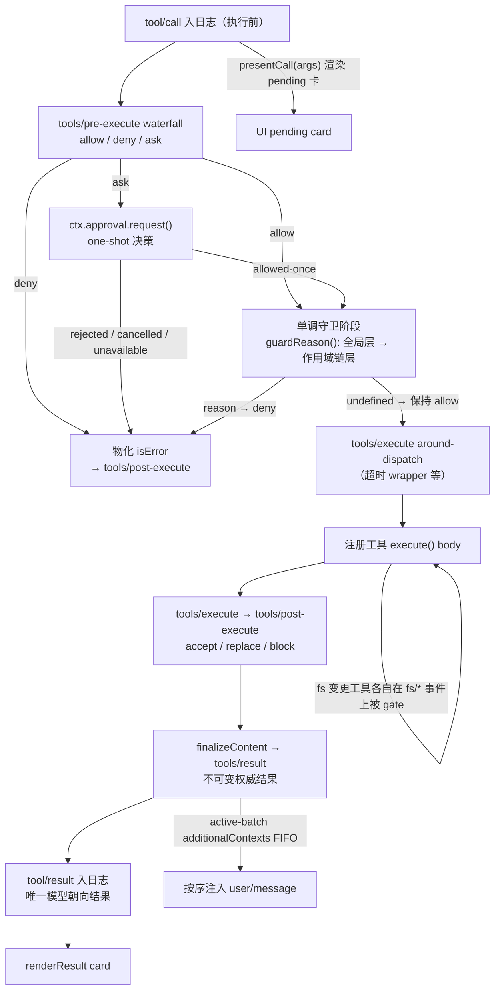
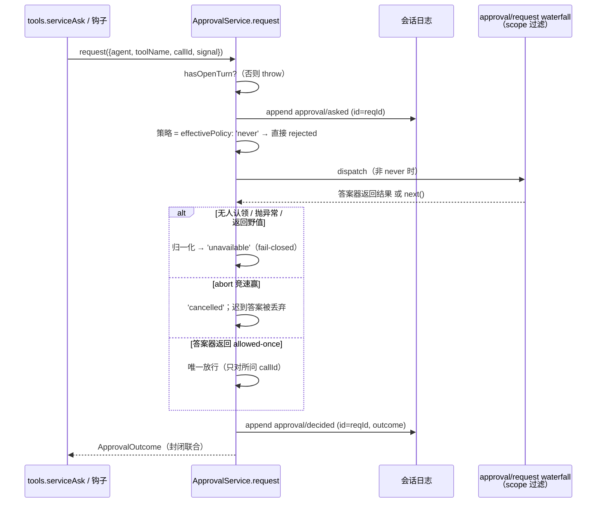
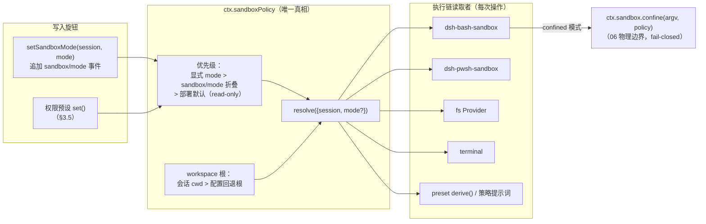
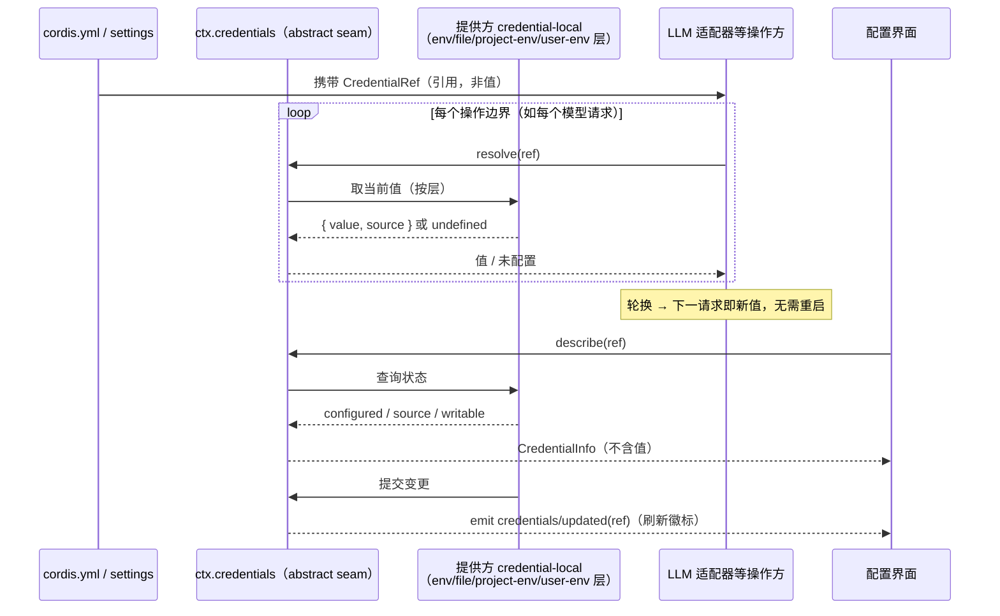
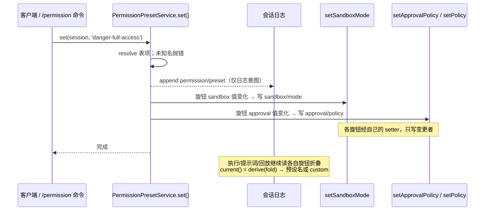
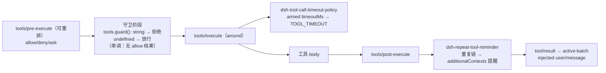

# 08 安全与治理

> 本文分析 dsh 的权限决策链路、审批缝契约、sandbox 策略归属、凭据引用模式、单调守卫、权限预设、环境脱敏与对外归属对照。安全机制全部落在「已知扩展点」与「注册即效果」之上：审批是 `approval/request` waterfall，守卫是 `tools.guard()`，策略是 `ctx.sandboxPolicy` 与会话事件的折（fold）。物理边界的用具（`ctx.sandbox`、`ctx.subprocess` 及各自的 Provider/后端）在 [06-进程与边界](06-进程与边界.md) 中定义，本文只引用其契约与 fail-closed 后果，不重新定义。
>
> **阅读模式**：每节先讲"你能感知到什么、想实现某功能该怎么做"（【你会看到】/【模型看到】/【插件作者】三镜头），再讲内部如何运作；机制描述始终回扣外部可感知的功能。

---

## 0. 本维度分析问题

先用用户视角把本维度的领地说清楚。**你作为使用者，在"把控制权交给助手"的每个瞬间经历的现象，几乎都是本维度的机制在身后工作**：

- 敏感命令弹出审批框，你点"允许这一次"或"拒绝"——§3.1/§3.2 的决策链与审批缝。
- 权限模式在 read-only / workspace-write / danger-full-access 之间切换，全新部署默认对文件只读——§3.3 的策略归属与 §3.5 的权限预设。
- 换了 API key 不用重启、配置界面永远只显示"已配置"徽标而不回显值——§3.4 的凭据引用。
- 模型反复撞墙时收到渐强提醒、声明了超时的工具到点收场——§3.6 的守卫与 guard 插件。
- 助手跑的命令继承不到你环境里的密钥变量——§3.7 的环境脱敏。

**插件作者在本维度的动手入口**：想做审批方（弹窗的另一端）→ 监听 `approval/request` 应答（§3.2）；想做不可被加载顺序绕过的强制策略 → `tools.guard()`（§3.6）；想做普通权限钩子 → `tools/pre-execute`（§3.1）；想接自有凭据库 → 实现 `ctx.credentials` 的 Provider（§3.4）；想打包发布一组权限组合 → 权限预设（§3.5）。

dsh 把"模型能做什么"约束在四条独立轴线上：谁放行（审批）、按什么围栏运行（sandbox 模式）、秘密存在哪里（凭据引用）、循环是否健康（守卫与超时）。本维度回答：

1. 一次工具调用从提出到执行，依次经过哪些可扩展决策点，各自的否决/放行语义是什么？
2. 审批缝如何保证"缺席即失败关闭"，one-shot 许可如何不可放大？
3. sandbox 模式与策略的状态归属在哪里，为什么执行摘要（executor / provider）保持无会话状态？
4. 凭据如何做到"配置只见引用、值只在 Provider"，轮换为何无需重启？
5. 守卫如何做到单调（只能拒绝、顺序无关），guard 插件如何在不动 agent-loop 的前提下干预循环？
6. 环境脱敏与对外 attribution 两条数据最小化通道，各自防的是什么泄漏？

所有结论均附 `file:line` 证据；术语先去 `00-概念总览.md`（L0）查找，新定义的八条登记在 §2。

---

## 1. 前置概念

本节全部术语定义见 [00-概念总览](00-概念总览.md)，仅按使用频率列出：

- 插件 / 上下文（`ctx`）/ 服务 / 注入（定义：见 00 §2.1）
- 事件 / Typed Event、事件分派模式、Waterfall 语义（定义：见 00 §2.1）
- 效果 / Effect、注册即效果（定义：见 00 §2.1）
- 会话 / SessionEvent、Turn、Step（定义：见 00 §2.3）
- Agent、Agent 循环、收件箱（定义：见 00 §2.3）
- 作用域 / Scope、agent.ctx、ScopeKey（定义：见 00 §2.4）
- 能力缝 / Seam 及三角色（定义：见 00 §2.5）
- 派生 / deriveMessages、模型可见 ⟺ 已入日志（定义：见 00 §2.6）
- Branded ID（定义：见 00 §2.6）
- 声明合并（定义：见 00 §2.6）
- Profile / Bundle / Patch（定义：见 00 §2.2）

---

## 2. 概念约定

本文特有的概念只有下列八条；其余术语一律引用 00-概念总览。沙箱缝、子进程缝等物理边界用具属于 06-进程与边界，此处不回炉。每个词条先给一句直观白话，再给正式定义（正式定义原文为准）。

### 2.1 审批缝（approval seam，`ctx.approval`）

**审批缝**

直观：审批弹窗背后的能力本体。问一次"允许执行这个动作吗"，答案只有四种——**允许这一次 / 拒绝 / 已取消 / 通道不可用**——且"允许"字面意义只对当前这一个动作有效，不存在"允许接下来所有"。**【你会看到】**弹窗上那两三个按钮就是这条缝的用户界面；**【模型看到】**弹窗过程本身不进入模型转写，模型看到的只是最终派生的工具结果。

正式定义：一次性（one-shot）权限决策能力，缺席或无法回答时 fail-closed 到 `unavailable`。由 `dsh-user-approval` 的服务 `ApprovalService`（`ctx.approval`）提供：一次 `ctx.approval.request(req)` 问一个问题、附一对只追加的审计事件（`approval/asked` + `approval/decided`）、返回一个封闭结果 `allowed-once | rejected | cancelled | unavailable`。`allowed-once` 只许批准所问的那一个动作（经 `callId`）。（证据：`packages/interaction/user-approval/src/index.ts:257`、`:266-275`。）

### 2.2 权限预设（permission preset）

**权限预设**

直观：界面上那个"权限档位"开关。一次选择同时拧动两个相互独立的旋钮——沙箱档位与"要不要弹审批框"。**【你会看到】**默认档（`workspace-write`）= 可写工作区 + 敏感操作询问；`danger-full-access` = 不围栏 + 永不询问（此后不再弹审批框）。

正式定义：面向用户的预设表，把两条相互独立的执行旋钮——sandbox 模式（`sandbox/mode`）与审批策略（`approval/policy`）——打包成命名选项（默认 `workspace-write` = workspace-write + ask；`danger-full-access` = danger-full-access + never）。一次 switch 写多条会话事件（`permission/preset` 选择事件 + 各旋钮自身的 setter 事件）。预设不拥有执行权：运行、提示词叙事与回放继续读取各旋钮折叠。（证据：`docs/subsystems/permission-presets.md`；`packages/interaction/permission-presets/src/index.ts:380`。）

### 2.3 凭据引用（credential reference）

**凭据引用**

直观：配置里只写"变量名"，真正的值存在别处（Provider），每次要用时现场解析一次。**【你会看到】**换 API key 改完就生效、不用重启；设置界面只显示"已配置"徽标与来源，永远拿不到值本身。

正式定义：配置只携带 `CredentialRef`（引用，即 POSIX 风格环境变量名，品牌化字符串），Provider（如 `dsh-credentials-local`）拥有实际值与存储；消费者在每次操作的边界解析一次引用——LLM 适配器每个模型请求解析一次，因此轮换后的凭据无需重启即可在下一个请求生效。（证据：`docs/subsystems/credentials.md`；`packages/credentials/credentials/src/index.ts:73`。）

### 2.4 守卫（ToolGuard / 单调守卫）

**守卫**

直观：**只会说"不"的策略**。它没有"允许"这个选项——要么保持沉默（维持原决定），要么否决；所以无论插件以什么顺序加载，一次既成的拒绝都翻不了案。

正式定义：位于工具 pre-dispatch 之后的单调策略。`ToolGuard` 返回类型刻意没有 allow 结果——返回 `undefined` 保持原决定，返回 reason 只能收窄权限——因此监听器顺序无法把一次拒绝变回放行。（证据：`docs/subsystems/tools.md:313`；`packages/core/tools/src/index.ts:704`、`:1110`。）

### 2.5 fail-closed / fail-loud

**fail-closed / fail-loud**

直观：两种"出问题时的姿态"。安全决策不可用时**默认拒绝**（宁可不说 yes）；配置错误时**当场爆炸**（绝不静默降级）。**【你会看到】**前者 = 没有审批方在场时命令直接被拒而不是放行；后者 = 配错预设时启动即报错，而不是悄悄换成别的档位。

正式定义：审批、权限、沙箱在不可用或被误配置时的两种默认行为——fail-closed 是默认拒绝（缺席的审批→`unavailable`→工具被拒；沙箱无可用后端→抛 `SandboxUnavailableError`，`docs/subsystems/sandbox.md:154`），fail-loud 是尽快显式报错（预设表命名 `custom`、混淆执行器上装预设、提醒阈值非法，都在插件加载时抛错，绝不静默回退）。判定标准：安全决策"宁可不说 yes"，配置错误"宁可当场爆炸"。（证据：`packages/core/tools/src/index.ts:1693`；`packages/interaction/permission-presets/src/index.ts:189`；`packages/guard/repeat-tool-reminder/README.md:19`。）

### 2.6 sandbox 模式与策略（sandbox mode / policy home）

**sandbox 模式与策略**

直观：把助手文件活动圈起来的**三档围栏**（只读 / 可写工作区 / 不围栏）加一个工作区根。**【你会看到】**权限模式切换改的就是它；档位只有一个权威出处，执行器每次干活时现场问一次，自己不记档位。

正式定义：文件效果围栏模式 `read-only | workspace-write | danger-full-access` 与 workspace 根。`ctx.sandboxPolicy` 是唯一的策略归属：它持有部署默认模式、回退根与每次调用时的策略解析，执行链（bash/fs/terminal）在每次操作边界调用 `resolve()`，执行器与 Provider 本身保持无会话状态。（证据：`docs/subsystems/sandbox.md:41`；`packages/sandbox/sandbox-policy/src/index.ts:135`。）

### 2.7 环境脱敏（env scrubbing）

**环境脱敏**

直观：助手起的子进程"继承不到"你的秘密——名字里带 KEY/SECRET/TOKEN/PASSWORD 的变量和全部 `DSH_*` 变量在 spawn 前就被删掉。**【你会看到】**让助手跑 `env` 之类的命令，输出里找不到 harness 自己的 API key；想给它某个秘密，唯一办法是显式传入。

正式定义：spawn 子进程前删除名称匹配 `KEY` / `SECRET` / `TOKEN` / `PASSWORD`（大小写不敏感）以及全部 `DSH_*` 的环境变量，再合并显式 `env`，防止 harness 自身凭据泄漏进子进程输出、`env` 或 spill 文件。（证据：`packages/subprocess/subprocess/src/index.ts:44`、`:60`；显式覆盖在 `packages/subprocess/subprocess-local/src/spawn.ts:37`。）

### 2.8 工具超时策略（tool-call-timeout-policy）

**工具超时策略**

直观：声明了时限的工具到点收场。**【你会看到】**卡住的工具调用最终以一条结构化超时结果结束，而不是让整轮永远挂着；模型看到超时结果后自行换路。

正式定义：`ToolDefinition.timeoutMs` 声明的每调用预算，通过 `tools/execute` 环绕 wrapper 强制执行——armed 在 `exec.signal` 上的合作 deadline（`@deepseek-ai/dsh-timeout`），超时赢时产出结构化 `TOOL_TIMEOUT` 结果。它是合作性而非硬杀：终止权属于转发 `exec.signal` 的工具与能力。（证据：`packages/guard/README.md`；`packages/guard/timeout-policy/README.md:20`。）

### 2.9 概念登记表

概念登记表声明"术语→定义所在文档"；**"直观对照"列给出该术语对应的用户/插件作者可感知概念——它是阅读锚点，不是定义。**

| 概念 | 定义所在 | 一句话 | 直观对照（可感知） |
|---|---|---|---|
| 审批缝 | 本文 §2.1 | one-shot 决策，缺席 fail-closed 到 `unavailable` | 弹窗"允许这一次/拒绝"；没有审批方在场 = 按不可用拒绝 |
| 权限预设 | 本文 §2.2 | 预设表打包两旋钮，一次 switch 写多条事件 | 一个档位开关，同时切沙箱模式与"弹不弹审批框" |
| 凭据引用 | 本文 §2.3 | 配置只带引用，Provider 拥有值，按操作解析 | 配置只写变量名；换 key 不用重启；界面只见徽标不见值 |
| 守卫 | 本文 §2.4 | pre-dispatch 后单调策略，只能拒绝不能放行 | 只会说"不"的策略：加载顺序翻不了已成的拒绝 |
| fail-closed / fail-loud | 本文 §2.5 | 不可用默认拒绝（closed）/ 误配尽快报错（loud） | 安全缺席 → 拒绝；配置错误 → 当场爆炸 |
| sandbox 模式与策略 | 本文 §2.6 | `ctx.sandboxPolicy` 是唯一策略真相 | 三档围栏（只读/可写工作区/不围栏），档位只有一个权威出处 |
| 环境脱敏 | 本文 §2.7 | spawn 前删 `*KEY*`/`*SECRET*`/`*TOKEN*`/`*PASSWORD*` | 助手跑的命令继承不到你的密钥变量 |
| 工具超时策略 | 本文 §2.8 | `tools/execute` wrapper 强制的合作超时 | 声明了时限的工具到点收场，不永远挂起 |

---

## 3. 分析正文

### 3.1 权限决策链路：pre-execute → 审批 → 守卫 → 执行

> **【你会看到】** 敏感命令弹出审批框、你点"拒绝"后卡片变红显示原因——这条链就是弹窗前后的完整决策路。一次调用的三种体感结局都从这里来：直接执行（allow 且守卫沉默）、弹出审批框（ask）、直接被拒（deny 或守卫否决）。还有一种隐形体感：某些调用根本不弹窗、也进不了管线，直接被拒——它们在扩展管线之前就被确定性拒绝（Code Mode 折叠）。
> **【模型看到】** 每个结局都以一条工具结果回到它的下一次请求：被拒的调用不是"消失"，而是携带拒绝原因的 isError 结果——且原因区分"人拒绝了""审批被取消""审批通道不可用"，它能据此把"用户说了不"与"系统缺席"区分开。
> **【插件作者】** 按诉求选站：普通权限钩子（可重排）→ `tools/pre-execute` 返回 allow/deny/ask；不可被加载顺序反悔的强制策略 → 守卫注册（见 §3.6）；审批弹窗本身 → 实现 `ctx.approval` 的答案器（见 §3.2）。

一次工具调用从模型发起（`assistant/message` 中的 tool-call 块）到落定 `tool/result`，经过一条三段式决策链。链的全部扩展点都在 `dsh-tools` 注册表内，agent-loop 不参与决策。注册表先做参数无损快照与冻结、把调用 id 品牌化为 `CallId` 并给每个调用派发不可变执行 token，然后进入可重排的 `tools/pre-execute` waterfall（`packages/core/tools/src/index.ts:1463`、`:1475`）。

`tools/pre-execute` 监听器返回 `allow | deny | ask`（`PreToolDecision`，见 `docs/subsystems/tools.md:385`）：`deny` 直接物化错误；`ask` 只要求审批缝返回 `allowed-once`，其余一律拒绝；调用 `next()` 依次让出默认放行。可重排的语义是"顺序不是策略优先级"——这正是单调守卫存在的理由（见 §3.6）。一组前置事实先于扩展管线锁定：

- 在 scope 中被 Code Mode 折叠的调用在扩展管线之前被确定性拒绝（`packages/core/tools/src/index.ts:1373`），审批与守卫不得观察、更不得批准一个注定失败的调用；未知工具名保留历史路径让策略监听器仍能看到每个名字（`:1378`）。
- `ask` 决策由 `serviceAsk()` 消费（`:1689`）：审批缝缺席（`ctx.get('approval') === undefined`）、或调用无 agent 无法路由审计，都退化为 deny，且理由区分"人拒绝了""审批被取消""审批通道不可用"（`:1713`），模型据此能把回答的"no"与缺席区分开。（用户体感：纯 headless、无界面的组合里不会有"卡住等你确认"这回事——没有审批方在场时，ask 直接按"通道不可用"拒绝，命令不跑。）
- 扩展开闸之后、body 之前运行的是守卫阶段——全局守卫层先于作用域链守卫层（`:1118`），任一返回 reason 即否决。

说明：`tools/pre-execute` 的可重排 allow 水漏为钩子、权限钩子提供了插入点；`ctx.approval` 在守卫之前解析 ask；不得重排的属主策略放进守卫注册。`tools/execute` 的环绕只允许替换 `exec.signal`（调用身份不可变，注册表在调 body 前重新融合原始调用方信号），超时/重试/指标都挂在这一环（`docs/subsystems/tools.md:628`）。`tools/post-execute` 接受 / 替换 / 阻止结果并携带 `additionalContexts`；最终 `finalizeContent` 后 `tools/result` 观察者收到冻结快照。整条链的编排图见 `docs/tool-execution-pipeline.md`。

### 3.2 审批缝契约：one-shot、answerer 是 listener、失败关闭

> **【你会看到】** 审批弹窗的一生：出现（`approval/asked` 先落日志，弹窗经 `callId` 直接挂在已流式输出的工具卡上）→ 你点"允许这一次"或"拒绝"（结果只有四种：allowed-once / rejected / cancelled / unavailable）→ 弹窗关闭、工具卡挂上结局。"允许这一次"是字面意义：只放行所问的那一个动作，下一个敏感调用还会再问。两种"没有弹窗"的体感也属本节：审批策略设为 never 时直接拒绝；没有任何审批方在场时按"通道不可用"拒绝——不是卡死等待。你点"停止"之后才回来的答案不会生效（迟到答案被丢弃）。
> **【模型看到】** 审批事件本身永不进入模型转写（log-only）；模型看到的只是最终派生的工具结果。所以"用户在弹窗上花了十秒"对模型不存在，"这个调用被拒了、为什么被拒"对模型存在。
> **【插件作者】** 想做审批方（UI/桥）：监听 `approval/request` waterfall（scope 过滤），为自己的 agent 返回结果认领请求、不认识的 agent 调 `next()` 委托。想换审批策略：`setApprovalPolicy` 是唯一写入路径。

`ApprovalService.request()` 的契约（`packages/interaction/user-approval/src/index.ts:257`）：

1. **前置要求 open turn**：审计对必须被 turn 的提交/回放边界包围，空闲态问询在追加任何事件前就抛错（`:259`，`hasOpenTurn` 在 `:127`）。这样一条夹在轮次间的散事件不会在重载时被当作崩溃尾巴静默丢弃。（用户体感：弹窗永远出现在助手正在干活的一轮中间，不会游离在轮次之外变成"幽灵弹窗"。）
2. **先落审计前半**：追加 `approval/asked`（携带新生成的 `ApprovalRequestId`、`toolName`、可选 `callId`/`reason`），然后才询问（`:266`）。
3. **策略在分派前判定**：`never` 策略在服务内部、任何 dispatch 之前决定返回 `rejected`（`:312`；`effectivePolicy` 见 `:285`）。因为监听器可以 `prepend`，一个"监听器形态的门"无法保证注册顺序无关的确定性拒绝——只有服务自身请求路径能守住文档承诺。
4. **答案器是 waterfall 监听器**：`approval/request` 按 scope 过滤分派（`this: Scoped<ApprovalService>`，`:30`）。监听器要么返回一个结果认领请求，要么调 `next()` 委托；首个回答占据唯一决策槽。UI 答案器只为它拥有的 agent 回答（ACP 桥在 `packages/acp/acp/src/index.ts:215` 对无记录 agent 直接 `next()`）。
5. **失败全部关闭**：水漏基值就是 `unavailable`；抛异常的答案器 → `unavailable`；越词汇表的野值被 `OUTCOMES` 归一化为 `unavailable`（`:325`）。任何使审计追加失败的路径都拒绝——返回一个未入日志的决定违反审计对（`docs/subsystems/approval.md` 中 `request` 的 JSDoc）。
6. **信号中止即取消**：`signal` 竞速，abort 赢则 settle 为 `cancelled`、迟到的答案被构造性丢弃（`:331`）。
7. **最后落审计后半**：追加 `approval/decided` 后返回封闭结果（`:274`）。审计事件仅日志（log-only），不进入模型转写——模型可见行为是调用方派生的工具结果加运行时上下文快照。（用户体感：导出的会话记录里，每一次弹窗与你的选择都有账目可查；模型转写里则看不到这些记录。）

说明：`allowed-once` 是唯一的放行，且许可对象就是 `ApprovalRequest` 所带的工具调用（`callId` 让 UI 把提示直接挂到已流式输出的工具卡上，`ApprovalRequest` 刻意不带参数，避免二次渲染漂移，见 `docs/subsystems/approval.md:53`）。（用户体感："允许这一次"真的只有一次——下一个敏感调用还会再弹窗，不会因为刚才点过就静默放行。）`setApprovalPolicy` 是策略覆盖的唯一写入路径（`index.ts:142`），回放只需折叠最后一个 `approval/policy` 事件（纯函数 `effectiveApprovalPolicy`，`:112`）；策略变更经 `setPolicy` 排队一条插件来源的模型可见消息并重新投影运行时快照（`:226`）。审计事件解析：`approval/asked`/`approval/decided`/`approval/policy` 通过声明合并进入 `SessionEventMap`（`:44`）。

### 3.3 sandbox 模式与策略归属：`ctx.sandboxPolicy` 是唯一真相

> **【你会看到】** 权限档位的全部体感来自这条策略归属：全新部署的助手对文件只读（read-only 是部署缺省）——写文件的尝试会被围栏拦下；切到 workspace-write 后它能改工作区内的文件；danger-full-access 则彻底绕过沙箱直接跑。助手"知道"自己被圈在哪——它的回答能准确说出当前文件策略，因为策略段落被投影进它的提示词。若沙箱后端不可用，受限档位下的命令直接报 `SandboxUnavailableError`，绝不静默裸跑。
> **【模型看到】** 保留历史后整体投影的"当前文件策略"段落（`systemPrompt.context`，order 110）——它读到的模式与执行器实际解析的模式同源，不会"以为能写、实际被拦"。
> **【插件作者】** 铁律：永远不要自己读或缓存策略。执行链在每次操作边界调 `ctx.sandboxPolicy.resolve()`；想换模式走 `setSandboxMode`（写 `sandbox/mode` 事件），不要给 Provider 或执行器塞默认值——默认与回退只存在于 `ctx.sandboxPolicy` 一处。

sandbox 模式词汇（`read-only | workspace-write | danger-full-access`）不进入本维度——它属于 06-进程与边界。本维度只关心"谁读策略、按什么优先级读、执行链为何保持无状态"。`ctx.sandboxPolicy`（`SandboxPolicyService`）是唯一策略归属（`docs/subsystems/sandbox.md:189`；`packages/sandbox/sandbox-policy/src/index.ts:91`）：

- **缺省即安全**：部署默认 `read-only`（配置 schema `:94`）；一个想要可写 agent 的部署必须显式 opt-in（`Config` 的 `mode`）。（用户体感：全新部署的助手默认改不了你的文件，除非部署时显式放宽。）
- **解析优先级**（`resolve({session, mode?})`，`:135`）：显式获批的 mode 覆盖 > 会话日志最后的 `sandbox/mode` 事件（`overrideOf`，`:149`）> 部署默认。workspace 根：会话不可变 cwd 之上，缺失时回退到构造时以文件系统语义规范化过的配置根（`:110`、`:139`）。
- **读取方各自无状态**：bash-sandbox、fs Provider、terminal 在每次操作边界调用 `resolve()`；executor/Provider 不持有会话，所以并发会话、并发消费者、以及一次获批的放宽重试可以把不同边界交给同一个 Provider 而不污染其状态（`docs/subsystems/sandbox.md:79`）。（用户体感：多个会话并行时各自的沙箱档位互不串扰，因为执行器不记"当前是谁的档位"。）
- **策略向模型可见**：sandbox-policy 插件以 `systemPrompt.context`（order 110）随保留历史后整体投影"当前文件策略"段落（`:112`），agent-loop 把它作为模型历史入日志——回放重建出执行器所解析的同一模式与根，而无需改写稳定系统提示前缀。
- **混合模式 = 绕过**：`danger-full-access` 的消费者直接生成原始 argv、根本不调 `ctx.sandbox`（`ConfinedSandboxMode = Exclude<...>`，`docs/subsystems/sandbox.md:23`）。只允许前两种模式进入 Provider；`ctx.sandbox.confine()` 无可用后端时抛 `SandboxUnavailableError`，对受限策略而言"静默无围栏直通"永远非法（`sandbox.md:154`）。（用户体感：受限档位下沙箱不可用时命令报错拒跑，绝不出现"看起来圈着、实际裸跑"。）

说明：预设 `derive()`（`packages/interaction/permission-presets/src/index.ts:309`）与策略提示词都读同一 `resolve()`，所以"模型被告知的策略"与"执行器实际执行的策略"不可能分叉。谁都不自带 defaults——默认与回退只存在于 `ctx.sandboxPolicy` 一处。

### 3.4 凭据引用模式：值与引用分离、按操作解析、UI 只见 value-free 视图

> **【你会看到】** 两件事。（1）**换 API key 不用重启**：改完凭据存储，下一个模型请求就用新值——因为每个请求边界都重新解析一次引用。（2）**配置界面永远只见徽标**："已配置/未配置"、来源、是否可写，从不回显值本身；被进程环境变量遮挡的条目显示为不可写，避免"改了却看似没生效"的错觉。
> **【模型看到】** 凭据值从不进入模型内容或会话日志；它只在操作边界被解析、进入出站请求（如模型 API 的认证头）。模型不知道 key 是什么、也不知道换过。
> **【插件作者】** 想接自有凭据库：实现 `CredentialProvider` 四操作（resolve/describe/set/unset）挂到 `ctx.credentials`。记住缝级规则：空存储值在任何地方都算缺席——空白永远无法冒充已配置的秘密。

凭据缝 `ctx.credentials` 是抽象服务（`CredentialProvider`），四操作 `resolve/describe/set/unset`（`packages/credentials/credentials/src/index.ts:60`）。一条缝级规则绑定所有 Provider：**空存储值在所有地方都是缺席**——`resolve` 跳过、`describe` 报未配置，空白永远无法冒充已配置的秘密（`:56`）。（用户体感：设置页永远不会把"留了空白"的条目显示成"已配置"。）

- **配置只带引用**：settings 段与 `cordis.yml` 条目携带 `CredentialRef`（品牌化字符串，构造时校验 shell 标识符语法，`:23`）。品牌使引用与跨包/跨进程传播的其他字符串在类型上不可互换（00 §2.6）。
- **按操作解析 = 热更新机制**：消费者绝不跨操作缓存，每次操作（LLM 适配器每个模型请求）重新 `resolve(ref)`，因此轮换后的值直接进入下一个请求，无需重启。`resolve` 返回 `{ value, source }`，`undefined` 表示未配置（`:73`）。
- **UI 只见 value-free 描述**：`describe(ref)` → `CredentialInfo { configured, source?, writable }`，配置界面据此渲染"configured 徽标 / 只读角标"，永远拿不到值（`:83`）。Provider 报告被进程环境 shadow 的引用为 `writable: false`——否则写入会"看起来成功"而解析仍返回遮挡值，缝直接拒绝这种自欺（`docs/subsystems/credentials.md:34`）。
- **变更通知**：`credentials/updated (ref)` 在已提交的 Provider 管理源变更（set/unset/外部编辑）后 emit；环境变量自然变化不可观测、永不 emit。消费者不依赖该事件（它们按操作重解析），事件只为配置界面刷新徽标而存在，监听器失败被包含（`:115`）。

说明：凭据缝的"值"永远不穿越服务接口进入配置面；同时 `credentials/updated` 的包含式转发保证一次坏监听器不能把已提交的持久变更伪装成失败。凭据还可能进入子进程：显式 `env` 是唯一合法通道（见 §3.7 的对照）。

### 3.5 权限预设：一次 switch 写多条旋钮事件

> **【你会看到】** 界面上的权限档位切换（`/permission` 命令）背后就是预设：选 `danger-full-access`，一次操作同时把沙箱档位放宽、审批策略改为 never——此后不再弹审批框；选回 `workspace-write` 则恢复"可写工作区 + 敏感操作询问"。重复选择当前档位界面毫无动静。配错时（如在不含沙箱能力的执行器上装预设）启动即报错，而不是悄悄降级。
> **【模型看到】** `permission/preset` 选择事件只入日志、不入模型转写；模型感知到的是各旋钮自己的可见后果（如策略提示词段落变化、审批行为变化）。
> **【插件作者】** 预设没有执行权——不要往预设里塞行为；运行、提示词叙事与回放读的都是各旋钮折叠。想让组合默认可控，经 config 注入预设表。

`PermissionPresetService`（`ctx.permissionPresets`，`packages/interaction/permission-presets/src/index.ts:159`）不拥有执行权，它只打包并写入两条独立旋钮。设计要点：

- **加载即 fail-loud**：预设表里的名字 `custom` 被保留给派生态，同名条目在加载时抛错（`:189`）；在无 `sandboxMode` 能力事实（不 confining）的 bash 执行器上装配本服务同样抛错（`:192`）——因为你打包的是沙箱模式，混淆执行器上装预设是配置错误，不能静默降级。新会话默认预设若与组合默认不匹配也报错（`:197`）。（用户体感：配错预设时启动当场爆炸，不会"悄悄变成别的档位"。）
- **一条事件序**：`set(session, name)`（`:375` → `apply` `:380`）先 append 仅日志的 `permission/preset` 选择事件（除非目标已是当前预设），再对**变更的**旋钮逐个调用各自 setter：`setSandboxMode`（`sandbox/mode`）与 `setApprovalPolicy`/`setPolicy`（`approval/policy`）。选择事件先于旋钮事件、同一 turn 内；重选当前预设则什么都不追加。（用户体感：重复选择当前档位，界面毫无反应。）
- **`permission/preset` 是"选了哪个"的用户意图**：两个预设可能共享同一 bundle，折叠旋钮无法区分用户选了哪个；该事件只在折叠语义需要保留"哪个"时起作用，且始终不入模型转写——模型可见后果由各旋钮消费者经其事件负责（`docs/subsystems/permission-presets.md:68`）。
- **折叠而非状态机**：`current(events)` 折叠全日志三旋钮（preset/sandbox/approval），仍匹配的表项、否则 `custom`——可派生态永不成为切换目标或事件负载（`:70`、`:304`）。`permissions` 会话投影与其同源（`applyKnobEvent`，`:113`）。

### 3.6 单调守卫：`tools.guard()` 语义与 guard 插件（循环卫生 + 工具超时）

> **【你会看到】** 两个"循环健康"体验。（1）模型反复用相同参数撞同一堵墙时，你会先看到几条同样的失败结果，然后它"醒过来"换个思路——那是 repeat-tool-reminder 在计数并注入渐强提醒。（2）一个声明了超时的工具不会永远挂着：到点后调用以结构化 `TOOL_TIMEOUT` 结果收场，模型看到后换路走。注意被拒绝的调用也计入重复——猛敲被拒调用的模型正是该被提醒的对象。
> **【模型看到】** 提醒不是替换工具结果，而是作为插件来源的 user 消息注入下一步；超时则是按时序替换后的结构化结果。两者都以数据形态回到请求，而非中断轮次。
> **【插件作者】** 三个挂点，都不碰 agent-loop：绝对不可绕过的否决 → `tools.guard()`（返回 undefined 保持原决定、返回 reason 只能收窄）；循环卫生提醒 → `tools/post-execute` 的 `additionalContexts`；超时/重试/指标 → `tools/execute` 环绕。

**单调性为何必要**：`tools/pre-execute` 是"可重排的水漏"，监听器可以 `prepend` 抢在同一决策槽；若策略逻辑也在其中，加载顺序就成了安全语义。守卫把"绝对不可被顺序反悔的否决"从水漏中分离出来：`ToolGuard` 的返回类型没有 allow 分支——`undefined` 原样放行，任何字符串都只是拒绝（`docs/subsystems/tools.md:313`）——所以监听器顺序无法把一次拒绝变回放行。`tools.guard()` 注册的守卫按"全局层 → 作用域链层、从远到近"求首个拒绝（`packages/core/tools/src/index.ts:1118`）；`agent.ctx.guard()` 使守卫只适用于该 agent。

guard 包族（`packages/guard/README.md`）是纯消费者，不在 loop 上加新行为：

- **循环卫生**：`dsh-repeat-tool-reminder` 坐在 `tools/post-execute` 上（被拒的调用也算数——猛敲被拒调用的模型正是值得打断的循环，README:28），按 `(tool 名, 参数规范化串)` 分组链，达到配置阈值时把语气渐强的提醒放进决策的 `additionalContexts`（来源 `{kind:'plugin',plugin:'repeat-tool-reminder'}`），最后经 active-batch 注入为插件来源的 `user/message`。提醒永不替换 `tool/result`、永不 veto、永远 `next()` 委托；误配置（空阈值/非整数/重复项）加载即抛（fail-loud）。（用户体感：模型连着几次用相同参数调同一个工具后，它的下一段动作会突然改变——提醒到位了。）
- **工具超时**：`dsh-tool-call-timeout-policy` 是一个 `tools/execute` 环绕 wrapper，读注册表中该工具声明的 `ToolDefinition.timeoutMs`（`ctx.tools.get(exec.name)?.timeoutMs`），在 `exec.signal` 上 armed deadline，deadline 赢时替换为结构化 `TOOL_TIMEOUT` 结果（`packages/guard/timeout-policy/README.md:20`）。它是合作超时：信号只通知，终止权在转发 `exec.signal` 的工具——声明 `timeoutMs` 即声明"与信号合作"。结果按时序替换而非按结果形态（先等 provider 的 err 化，再按 `timeoutOf(signal)` 替换）。（用户体感：卡住的调用最终有结局，不会让整轮永远转圈。）

说明：两个 guard 插件都只挂已注册的扩展点（`tools/execute`、`tools/post-execute`），不触碰 agent-loop；它们证明"安全/卫生策略"可纯粹作为消费者织入。超时 wrapper 与未来 retry/metrics wrapper 的同环组合由注册顺序决定语义（谁来包谁），README:36 明示这一契约。

### 3.7 环境脱敏与对外 attribution：两条数据最小化通道

> **【你会看到】** 本节的用户体验是"看不到"：助手跑的命令继承不到你的 `DEEPSEEK_API_KEY`、任何 `*KEY*/*SECRET*/*TOKEN*/*PASSWORD*` 与 `DSH_*` 变量——即使你在自己的 shell 里设了；想让子进程拿到某个秘密，唯一合法通道是显式传入。对外，发给模型服务商的请求只携带静态公开产品事实（`User-Agent`），夹带不了本地路径或会话 id。
> **【插件作者】** 起子进程一律走 `ctx.subprocess` 缝（脱敏在缝上，不在各调用点重复实现）；转发凭据进子进程用显式 `env`（同名条目按平台键语义合并覆盖）；不要给适配器加逐请求归属字段——AppIdentity 由 `dsh-llm` 拥有，白标部署整体替换但不能抑制。

对照两条"少泄 / 只给最小公开"通道，它们防的泄漏方向不同：

| 通道 | 面向 | 防什么 | 机制 | 证据 |
|---|---|---|---|---|
| 环境脱敏（env scrubbing） | 子进程（内） | harness 凭据随环境泄漏进子进程输出/`env`/spill 文件 | spawn 前删 `KEY/SECRET/TOKEN/PASSWORD`（i）与 `DSH_*`（i），显式 `env` 在清除后合并 | `packages/subprocess/subprocess/src/index.ts:44`、`:60`；`subprocess-local/src/spawn.ts:37`；`docs/defensive-patterns.md:29` |
| 对外归属（AppIdentity） | LLM Provider（外） | 出站请求夹带秘密/本地路径/会话 id/用户标识 | 只发静态公开产品事实，`attributionHeaders` 仅映射 `User-Agent`；无逐请求 API 可影响字段 | `docs/subsystems/llm-streaming.md:222`；`packages/llm/llm/src/attribution.ts`（07 详析） |

两者的共同不变量：**值或身份不出现在预计之外的方向**。脱敏是"不可用即给空"——连 harness 自己的 `DEEPSEEK_API_KEY` 都不许被隐式继承，刻意转发必须走显式 `env`（同名条目在 `childEnv` 中按平台键语义合并覆盖，`spawn.ts:41`）。归属相反是"必须给但要最小"——`AppIdentity` 只含 `product/version/url` 三个公开事实，白标部署可整体替换但不能抑制。AppIdentity 的具体归属（提供商中立身份由 `dsh-llm` 拥有、非各适配器、默认值强制非空）属于 [07-LLM接入层](07-LLM接入层.md)，本文仅对照其安全取向。（用户体感：让助手跑 `env`，输出里找不到 harness 自己的 API key——除非你在调用里显式转发了它。）

同一 hygiene 族的另两条（链接形路径用 `lstat+unlink` 删除而非递归跟随、spill 文件用 0700 私有目录 + 随机名 + `wx` 独享打开，`docs/defensive-patterns.md:31`）属于物理边界（06）的落地细节，此处不展开。

---

## 4. 交叉引用

| 目标 | 关系 |
|---|---|
| [00-概念总览](00-概念总览.md) | 本文全部基础术语的 L0 定义源；§2.7 概念登记表补充本维度八条 |
| [01-组合与启动](01-组合与启动.md) | profile/bundle/patch 如何装配审批、沙箱、凭据与 guard 插件；预设表经 config 注入 |
| [02-核心执行循环](02-核心执行循环.md) | 工具管线在 turn/step 中的调用点；运行时上下文快照如何携带两旋钮与策略 |
| [03-数据平面](03-数据平面.md) | `approval/asked+decided` 审计对、`sandbox/mode`、`approval/policy`、`permission/preset` 的持久化与回放折叠 |
| [04-扩展机制](04-扩展机制.md) | 声明合并追加事件词表；Scoped 过滤分发使 `approval/request` 只到归属 agent |
| [05-能力清单](05-能力清单.md) | 审批缝与凭据缝的三角色实例清单 |
| [06-进程与边界](06-进程与边界.md) | `ctx.sandbox`/`ctx.subprocess` 物理边界实现、confine 与包裹 argv、spill/临时目录细节 |
| [07-LLM接入层](07-LLM接入层.md) | AppIdentity 归属、LLM 适配器按请求解析凭据、请求头构造 |
| [09-工程质量](09-工程质量.md) | 守卫插件与审批缝的真实组合测试、包不变式、keyless 快照覆盖 |
| docs/subsystems/[approval](docs/subsystems/approval.md)·[permission-presets](docs/subsystems/permission-presets.md)·[credentials](docs/subsystems/credentials.md)·[sandbox](docs/subsystems/sandbox.md)·[tools](docs/subsystems/tools.md) | 本维度结论的正式子系统参考页 |
| docs/[tool-execution-pipeline](docs/tool-execution-pipeline.md) | 决策链全序图（含审批/守卫位置） |
| docs/[defensive-patterns](docs/defensive-patterns.md) | env 脱敏、链接形路径、正交结果等缺陷类规则 |

---

## 5. 合规自查

- [x] 前置概念全部引用 00-概念总览，未在 §1 重定义。
- [x] §2 只新增八条约定概念，登记表一行一条（含"直观对照"列）；正文无未登记自造术语；三镜头与直观描述是阅读锚点，不是新概念登记。
- [x] 覆盖全部要求主题：权限决策链路（§3.1）、审批缝契约（§3.2）、sandbox 策略归属（§3.3）、凭据引用（§3.4）、预设写多事件（§3.5）、守卫单调性与 guard 插件（§3.6）、环境脱敏与 attribution 对照（§3.7）。
- [x] 6 幅 Mermaid 图（§3.1–§3.6 各一），每幅均带说明文字。
- [x] 关键结论均附 `file:line` 或文档小节证据。
- [x] 沙箱缝/子进程缝等物理边界的用具未重新定义，只引用并指向 06。
- [x] 每个分析小节遵循"先能力后机制"模式：开头三镜头锚点（至少两镜头），机制描述以"用户体感"括注回扣。
- [x] 本文件属于 `架构分析/` 维度文档，不参与 `docs/` 的 doc-sync 与 verify-doc-budgets 门禁；本文为只读写作，未修改仓库任何其他文件。
