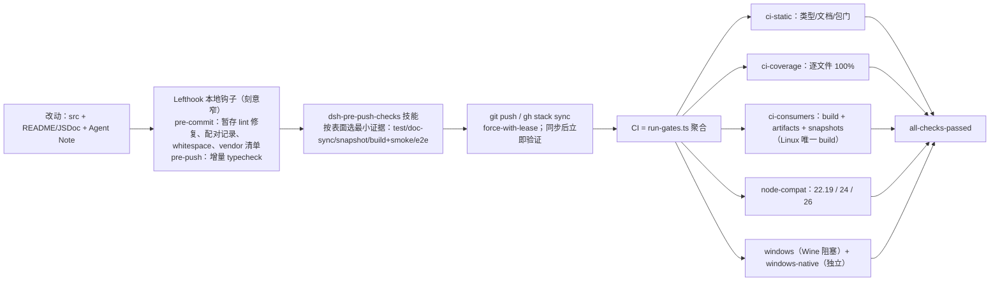
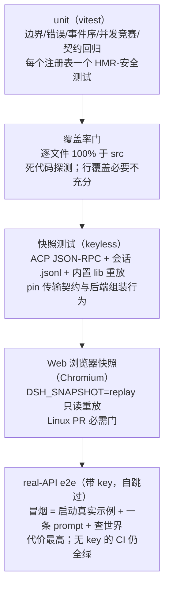
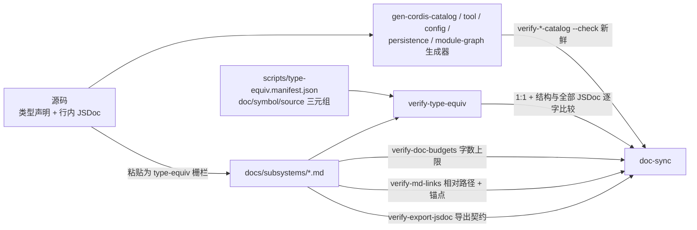
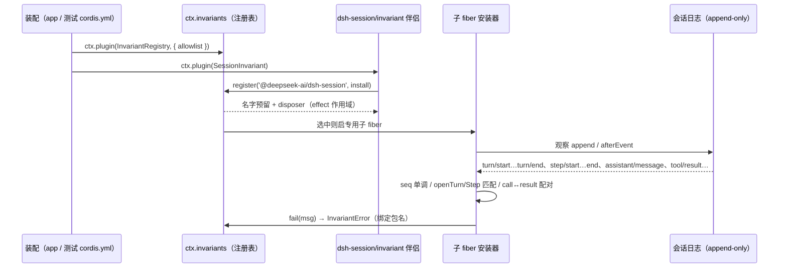
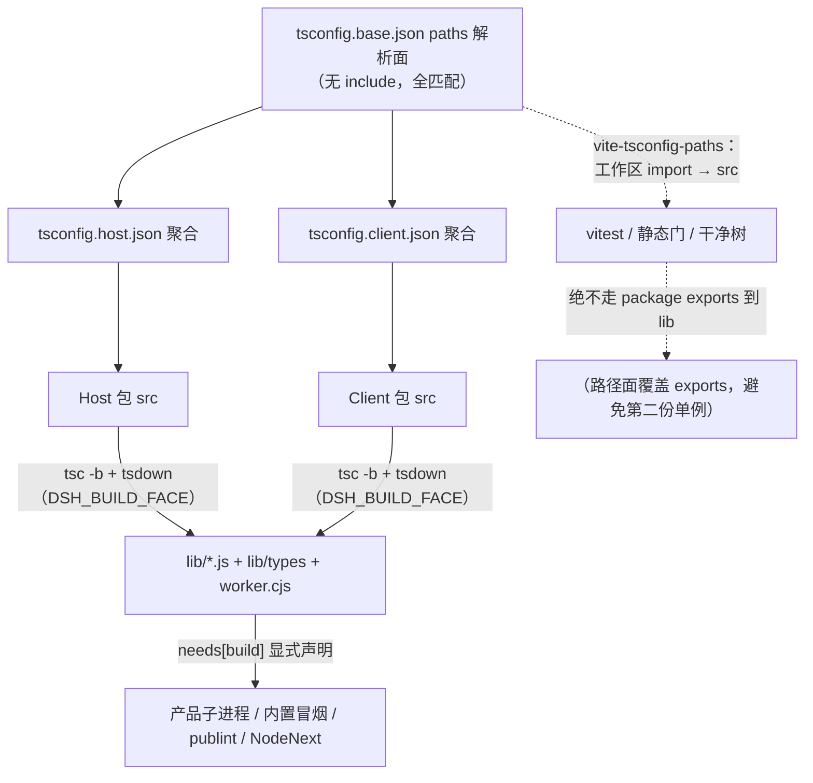
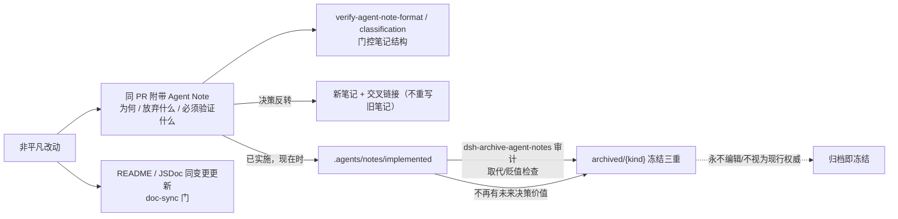

# 09 工程质量与治理

> 本文分析 dsh 如何在一个"每贡献都是插件"的仓库里保住质量：push 前的自动/手动门、测试层级金字塔、类型与文档防漂移门、运行时不变量注册、源码面/产物面分离、Agent Notes 演进与发布前姿态，以及 CI 门与 Windows 例外。所有概念沿用 [00 §2](00-概念总览.md#2-概念约定本文引入的术语)；本文仅在 [§2](#2-概念约定) 登记本维度专属的十个概念。
>
> **阅读模式**：每节先讲"你能感知到什么、想实现某功能该怎么做"（【你会看到】/【模型看到】/【插件作者】三镜头），再讲内部如何运作。本维度的机制大多不在产品界面上，而在贡献者工作流里——因此【插件作者】是本维度的第一镜头，【你会看到】讲质量结果在产品用户与贡献者身上的投影。

## 0. 本维度分析问题

先用双视角把本维度的领地说清楚。**插件作者/贡献者是本维度的第一用户**：你写的每个包要过哪些门（覆盖率逐文件 100%、导出 JSDoc 覆盖、类型等价登记）、你的测试该放哪一层、你的模型可见行为变更如何被快照审读、你的非平凡改动为什么必须同 PR 附一条 Agent Note——本文按"门从哪来→测试怎么分层→文档怎么保鲜→运行时怎么断言→两平面怎么分→治理怎么书写→CI 怎么收口"回答。**产品用户遇到的是这些门的结果**：升级版本后助手行为不漂移（keyless 快照钉住了模型可见输出，diff 必须人工审读）；文档与代码不脱节、粘贴的类型逐字一致（type-equiv 与生成目录保鲜）；不配 API key 也能跑通大部分验证（keyless 快照与自跳过 e2e）；发布产物与源码启动行为一致（built-bin 冒烟暴露 tsx 掩盖的失败）；任何非平凡设计都能追到决策记录（Agent Notes）。

质量治理要回答的问题不是"有没有测试"，而是"每条证据是否对应它声称覆盖的表面"：

1. **门从哪来**：push 前哪些检查自动跑、哪些手动选？它们各自防止哪类回归（[根 AGENTS.md](../AGENTS.md) 的 commands 与 [scripts/run-gates.ts](../scripts/run-gates.ts) 的聚合）。
2. **测试层级如何分工**：unit → 覆盖率门 → keyless 快照 → real-API e2e → 浏览器快照，各层的适用场景与成本边界（[docs/testing.md](../docs/testing.md)）。
3. **文档如何不漂移**：粘贴进文档的类型、生成的目录、字数上限与交叉链接靠哪些可执行门保鲜（`doc-sync` 聚类）。
4. **运行时不变量断言什么**：`ctx.invariants` 注册表如何让每个包检查"事件/数据关系"而非"服务存在"。
5. **两平面如何分离**：静态门与测试从 `src` 解析，built `lib/` 由产品子进程与内置冒烟消费，避免加载第二份模块单例。
6. **治理的书写单元**：Agent Note 的生命周期与发布前审查（pre-release stance）。
7. **CI 门与 Windows 例外**：聚合门、Node 兼容矩阵、以及"阻塞聚合 vs 独立原生"的双轨 Windows 信号。

## 1. 前置概念

本节全部概念的定义见 00，不在此重复。

- 插件、上下文（ctx）、服务、注入（定义：见 00 §2.1）
- 效果 / 注册即效果（定义：见 00 §2.1）
- 事件、事件分派模式（定义：见 00 §2.1，`@mode` 契约影响 `gen-cordis-catalog` 生成的目录校验）
- 会话、会话事件（定义：见 00 §2.3，快照与运行时不变量都以它为对象）
- Turn / Step、Agent 循环（定义：见 00 §2.3，`contract-regressions.spec.ts` 永久测试的目标）
- 能力缝、Service Definition / Provider / Consumer（定义：见 00 §2.5）
- 声明合并、`…Map → 派生联合` 模式（定义：见 00 §2.6，`gen-persistence-catalog` 聚合 `SessionEventMap` 合并）
- 品牌化 ID（定义：见 00 §2.6）
- Profile / Bundle / Patch（定义：见 00 §2.2，快照按 profile 组合启动真实示例）
- 派生、模型可见 ⟺ 已入日志（定义：见 00 §2.6，运行时不变量断言"请求可从日志重建"的依据）

## 2. 概念约定

本节登记本维度专属概念。仓库把每个可执行校验脚本统称"门（gate）"，这是操作命名而非架构概念；`doc-sync` 是文档门聚类，包与运行时不变量门属于共享静态聚合。每个词条先给一句直观白话，再给正式定义（正式定义原文为准）；**登记表的"直观对照"列是阅读锚点，不是定义。**

| 概念 | 定义 | 一句话 | 直观对照（贡献者可感知） |
|---|---|---|---|
| 测试层级（testing tiers） | 见 §2.1 | unit → 覆盖率门 → e2e → snapshot → web snapshot 的分层意图 | 同一个行为选哪层测试钉：越往上越像出货形态、越贵 |
| 覆盖率门（coverage gate) | 见 §2.1 | `test:coverage` 每文件 100% `packages/*/*/src`，用于发现死代码 | 变红时先想"这行是不是该删"，不是"缺个测试" |
| 快照测试（snapshot） | 见 §2.2 | keyless 重放真实示例的预期输出，diff 规范（`.jsonl`、ACP JSON-RPC、web Chromium） | 给模型可见行为拍"防漂移照片"；diff 必须人眼审 |
| doc-sync | 见 §2.3 | 文档门集合（verify-md-links、verify-doc-budgets、verify-type-equiv、verify-cordis-catalog、verify-export-jsdoc…） | 一条命令跑完所有文档门；文档与代码漂移当场红 |
| 类型等价（type-equiv） | 见 §2.4 | `verify-type-equiv` 校验文档中粘贴的类型与源码一致 | 文档里粘贴的类型与源码逐字一致；改一边忘另一边，门红 |
| 源码面 / 产物面（source/artifact plane） | 见 §2.5 | 测试与门解析工作区依赖到 `src`；gate 消费 built `lib/` 时必须声明该依赖 | 测试连源码、产品子进程连产物；混用会加载第二份模块单例 |
| 运行时不变量注册（invariant registry, `ctx.invariants`） | 见 §2.6 | 每个包引入寄存器并检查数据/事件关系 | 插件破坏事件/数据关系时，装配运行中直接抛错 |
| HMR-安全测试 | 见 §2.6 | dispose 贡献的 fiber 并断言注册被移除 | "装得上就拆得干净"的测试化：卸载后无残留 |
| 包不变量（package invariant） | 见 §2.6 | `./invariant` / invariant 方法注册的 manifest 名 | 每个包 owns `./invariant`；没有可查关系也要写明为什么 |
| Agent Note | 见 §2.7 | `.agents/notes/` 下记录决策的书写单元（为何、放弃了什么、必须验证什么） | 非平凡改动同 PR 附的"决策小传" |

### 2.1 测试层级与覆盖率门

**测试层级（testing tiers）**

直观：给"这个行为该写哪种测试"的选型表——unit 最便宜、数量最多、钉边界与错误路径；e2e 最贵、最接近出货形态；中间各层按"证据与表面匹配"取舍。

正式定义：仓库按"证据与表面匹配"把测试分为五层，各层的代价与应用场景见 §3.2：[docs/testing.md](../docs/testing.md#tiers) 定义 unit、coverage gate、real-API e2e、snapshot、web browser snapshot，相关命令登记于根 [AGENTS.md](../AGENTS.md#commands)。

**覆盖率门（coverage gate）**

直观：一条"未覆盖的行多半是死代码"的倒逼机制——逐文件 100% 变红时，第一反应是"这行能不能删"，而不是"补个测试凑数"。

正式定义：`pnpm run test:coverage` 是 CI 的门槛性运行，要求 `packages/*/*/src` 逐文件 100%（`vitest.config.ts` 的 `thresholds.perFile`，[vitest.config.ts](../vitest.config.ts:273)）。语义是"未覆盖行常常是应删除的死代码，而不是缺一个测试"（[docs/testing.md](../docs/testing.md:10)）。行覆盖必要不充分——它证明行跑过，不证明功能按出货形态工作。

### 2.2 快照测试

**快照测试（snapshot）**

直观：不用 API key 重放一个真实可运行的例子、与预期输出逐行比对——给模型可见行为拍的"防漂移照片"。改了模型看到的东西（提示词、工具 schema、事件流），diff 变红，必须人工审读后重录。

正式定义：以 keyless 方式重放"真实可运行示例"并 diff 预期输出，覆盖外部可观察面而不依赖模型 key。三类规范：ACP 自动化示例的 JSON-RPC 行流＋重新持久化的会话 `.jsonl`（[docs/testing.md](../docs/testing.md:12)）；headless 示例的 canonical-event `.jsonl`；`apps/web` 的 Chromium 浏览器渲染。快照再录制用 `test:snapshot:record`，重放输入仍有效时用 `test:snapshot:refresh`，模型可见输出的每次变更都要人工审读每个 diff。

### 2.3 doc-sync

**doc-sync**

直观：一条命令跑完所有文档门。文档与代码的任何漂移——粘贴类型过期、生成目录不新鲜、链接失效、字数超限——都会当场红。

正式定义：`pnpm run doc-sync` 是全部文档门的集合，由 [scripts/run-gates.ts](../scripts/run-gates.ts:571) 的 `docSyncLeafGates()` 展开，成员包括 `verify-md-links`、`verify-doc-budgets`、`verify-type-equiv`（type-equivalence）、`verify-cordis-catalog`、`verify-tool-catalog`、`verify-config-catalog`、`verify-persistence-catalog`、`verify-module-graph`、`verify-export-jsdoc`、`doc-typecheck`、`verify-agent-note-*` 等（[run-gates.ts](../scripts/run-gates.ts:581)）。注意边界：`verify-package-invariants`、`constraints`、`verify-dsh-package-licenses` 属于共享静态聚合 `ciSharedStaticGates`（[run-gates.ts](../scripts/run-gates.ts:245)），不是 doc-sync 叶；二者合起来才是"推前/CI 门体系"。

### 2.4 类型等价

**类型等价（type-equiv）**

直观：文档里粘贴的类型声明必须与源码逐字相同。源码改了、文档没跟上，门就红——杜绝"照着文档抄代码踩坑"。

正式定义：文档用 ` ```ts type-equiv ` 栅栏原样粘贴源码声明与其 JSDoc，并在 `scripts/type-equiv.manifest.json` 登记"文档、符号、源文件"三元组；`verify-type-equiv` 用 TypeScript parser 从源码抽取声明与 JSDoc，逐字比较结构与全部注释（[development.md](../docs/development.md#documenting-types-verbatim-ts-type-equiv)、[verify-type-equiv.ts](../scripts/verify-type-equiv.ts:199)），1:1 对应，防止粘贴漂移。

### 2.5 源码面 / 产物面

**源码面 / 产物面（source plane / artifact plane）**

直观：测试与静态门从 `src` 拿模块，产品子进程从 built `lib/` 拿；两张脸不许混——混了会加载第二份模块单例，共享状态失灵、出现诡异失败。

正式定义：静态门与测试经 `tsconfig.base.json` 的 `paths` 解析工作区 import 到 `src`，必须在干净树上通过；消费 built `lib/` 输出的门（内置冒烟、publint、NodeNext 消费校验、built-package-invariants）显式声明该依赖，`run-gates` 的 `needs[]` 强制其等待 `build`（[AGENTS.md](../AGENTS.md:116)、[development.md](../docs/development.md:78)）。

### 2.6 运行时不变量注册、HMR-安全测试、包不变量

**运行时不变量注册（invariant registry, `ctx.invariants`）**

直观：每个包自证"我承诺的事件/数据关系仍然成立"；关系被破坏时，装配进程在运行中直接抛错——宁可当场炸，不带病运行。

正式定义：`dsh-invariants` 提供可配置的注册表服务；每个工作区包发布一个 `./invariant` 伴侣，用精确 npm 包名注册。惰性选中且启用的安装器运行在专用 child fiber 里，`fail(message)` 抛出绑定包名的 `InvariantError`（[README](../packages/runtime-diagnostics/invariants/README.md:21)）。检查对象是权威事件流或可变数据关系，绝不检查"服务或方法存在"（[AGENTS.md](../AGENTS.md:103)）。

**HMR-安全测试**

直观："装得上就拆得干净"的测试化：把一个注册贡献 dispose 掉，断言监听、状态、名字预留都消失。

正式定义：每个注册表都要有一个"dispose 贡献的 fiber 并断言清理"的测试，证明卸载后状态不残留（[testing.md](../docs/testing.md:9)）；`ctx.invariants.register` 返回 effect 作用域 disposer，卸载任一侧即移除监听、trace 状态与名字预留（[README](../packages/runtime-diagnostics/invariants/README.md:21)）。

**包不变量（package invariant）**

直观：每个包自带 `./invariant` 伴侣；没有可查运行时关系的包也要用注释写明为什么没有。

正式定义：`packages/AGENTS.md` 要求"Every package owns `./invariant`"——注册 manifest 名；无合理运行时关系的包用以 `No runtime invariant:` 开头的注释解释（[packages/AGENTS.md](../packages/AGENTS.md:18)）。`verify-package-invariants`（源码规则）与 `verify-built-package-invariants`（built 消费）机械拒绝生成标记、无解释的空安装器、忽略 reporter 的非空安装器等（[README](../packages/runtime-diagnostics/invariants/README.md:50)）。

### 2.7 Agent Note

**Agent Note**

直观：非平凡改动随 PR 附的"决策小传"：为什么这么改、放弃了什么、必须验证什么。日后的读者（人与 agent）靠它理解决策链。

正式定义：`.agents/notes/` 下的决策记录单元，固定格式记录"为什么、放弃了什么、必须验证什么"。非平凡改动必须与身体同 PR 附带至少一个 Agent Note；已归档笔记冻结为历史（[AGENTS.md](../AGENTS.md:122)、[notes/README](../.agents/notes/README.md)）。`implemented/` 笔记以现在时描述已出货事实，`verify-agent-note-format`/`classification` 门门控其结构。

## 3. 分析正文

### 3.1 质量门全景：push 前自动与手动检查

> **【插件作者】** 你提交改动后的完整过门体验分五层：编辑期（导出 JSDoc 契约）→ 本地钩子（pre-commit 修暂存 lint/whitespace、pre-push 增量 typecheck——刻意窄，不跑测试）→ 手动选择（按改动表面选最小证据：test / doc-sync / snapshot / build+smoke / e2e）→ push → CI 聚合（穷尽覆盖与平台矩阵）。铁律："不重复跑已通过的检验、不默认全量套件"——CI 拥有穷尽面，本地只跑改动实际触及的最小证据。
> **【你会看到】** 贡献者视角的体感：commit 时格式问题被钩子当场修掉，不用等 CI 红了再返工；一个没写描述散文的导出、一个没登记的 type-equiv 栅栏，都会让对应门当场报红——质量债进不了库。产品用户看到的则是这一切的结果：行为不漂移、文档可信。

门站队呈"编辑期 → 本地钩子 → 手动选择 → push → CI 聚合"五层，越靠右越接近"证据与表面匹配"的承诺：CI 拥有穷尽覆盖与平台矩阵，本地只跑改动实际触及的最小证据（[AGENTS.md](../AGENTS.md:86)）。



- **编辑期契约**：`verify-export-jsdoc` 要求每个非 vendor 包导出都有描述散文，函数与公开类方法还要求逐参 `@param` 与非 void `@returns`（[verify-export-jsdoc.ts](../scripts/verify-export-jsdoc.ts:1)）；未知导出形式 fail closed，不留"未被门覆盖的导出"（[verify-export-jsdoc.ts](../scripts/verify-export-jsdoc.ts:377)）。
- **本地钩子刻意窄**：pre-commit 修暂存 lint、校验配对记录与 vendor 清单、`git diff --cached --check` 查 whitespace；pre-push 只跑增量 typecheck。钩子**不**运行测试、快照、构建或 hygiene——那个由贡献者按行为相关性手动选一次，CI 拥有穷尽面（[development.md](../docs/development.md:107)）。（用户体感：commit 时格式与 whitespace 问题被当场修掉，而不是等 CI 红了再返工。）
- **手动选择的规则**：先 `change-scope` 定基线，再按表面选证据（[SKILL](../.agents/skills/dsh-pre-push-checks/SKILL.md:27)）。不是"多跑就是好"，而是"不重复跑已通过的检验、不默认全量套件"（[AGENTS.md](../AGENTS.md:91)）。
- **聚合调度器**：`run-gates.ts` 把命名聚合展开为带 `needs[]` 依赖图的叶门，图无效（空/重复 id/环）在子进程启动前即拒（[run-gates.ts](../scripts/run-gates.ts:649)）；`check-all`、`doc-sync` 本地聚合按 4 并发封顶，避免多个构建 `ts.Program` 的文档门撑爆内存（[run-gates.ts](../scripts/run-gates.ts:136)）。

### 3.2 测试层级金字塔

> **【插件作者】** 写测试先选层：边界/错误路径/事件序/并发竞态/契约回归 → unit（vitest）；每个 `register()` 一个 HMR-安全测试；包内死代码由覆盖率门逼出；模型可见行为、传输契约、后端组装 → keyless 快照（改模型可见输出必须人工审读每个 diff）；真实 provider 行为 → real-API e2e（无 key 自跳过）；web 渲染 → Chromium 快照。断言"验世界不自报"——重新跑命令、重读文件，不信工具自报的输出。
> **【模型看到】** 快照钉住的正是模型可见输出：一个场景（`text-turn`）钉死完整 system-prompt/tool-schema——任何会改变模型读到内容的改动都会在快照 diff 里显形，必须被人看过才能合入。
> **【你会看到】** 产品用户拿到的承诺是"升级后行为不漂移"；"单元全绿、产品坏了"的事故（[postmortem 0001](../docs/postmortem/0001-acp-default-export-drops-inject.md)）由 e2e 冒烟兜住——启动真实示例、发一条 prompt、检查世界。

五层金字塔的每一层都是下一层的亲密度递减、代价递增：越往上越接近"出货形状"，越往下越便宜且数量越多。



- **unit（最底层）**：vitest 覆盖包、示例与 `scripts/**/*.spec.ts`；优先边界、错误路径、事件顺序、并发竞态与契约回归的永久测试（`packages/core/agent-loop/tests/contract-regressions.spec.ts`）；每个 `register()` 配一个 HMR-安全测试（[testing.md](../docs/testing.md:9)）。
- **覆盖率门**：CI 门槛是 `test:coverage` 而非 `test`（[AGENTS.md](../AGENTS.md:92)）。未覆盖行=死代码的信号由 `coverage-uncovered-locations.cjs` 报告精确 `path:line:col`（[vitest.config.ts](../vitest.config.ts:12)）。例外必须带原因：`pwsh-local` 在无 pwsh 的宿主上自跳过并用探针精确豁免（[testing.md](../testing.md) 准确：[docs/testing.md](../docs/testing.md:10)、[vitest.config.ts](../vitest.config.ts:71)）。
- **real-API e2e**：自跳过式（无 key 全绿），但"我们就是 DeepSeek，别吝啬真实 API 测试"——最高价值是启动真实示例、发一条 prompt、检查世界的冒烟，它们抓住"单元全绿、产品坏了"这一类 mock 漏不掉的问题（[testing.md](../docs/testing.md:17)）。断言必须验世界而非自报：e2e 重复跑命令或重读文件，绝不 probe 用户给出的输出（[testing.md](../docs/testing.md:27)）。
- **快照测试**：keyless。ACP 启动真实 `automation-server` 示例、重放录制会话、diff 归一化 JSON-RPC 与再持久化日志；headless 经未导出的 JSONL test driver 启动其显式示例组合；`apps/cli` 另外自有 `dsh --profile headless` 验收。一个场景（`text-turn`）钉死完整 system-prompt/tool-schema，其余 fixture 词元化使一次改动只搅动一行（[testing.md](../docs/testing.md:12)）。（用户体感：任何会改变助手发出的 system prompt、工具清单或事件流的改动，都会在快照 diff 里显形、必须被人眼审过——"升级后行为不漂移"就是这里来的。）
- **Web 快照**：Chromium 重放浏览器输出到 `apps/web/tests/snapshots/`，CI 强制 `DSH_SNAPSHOT=replay` 只读面，从不在 CI 写期望输出（[testing.md](../docs/testing.md:13)、[run-gates.ts](../scripts/run-gates.ts:413)）。
- **真实入口**："real entry path"指发布产物：包 `bin` 跑 built `lib/bin.js`，暴露 tsx 掩盖的失败（settle 竞态、模块解析、吞掉的加载失败）；`built-bin-smoke` 门单列了所有执行者（[testing.md](../docs/testing.md:35)、[run-gates.ts](../scripts/run-gates.ts:618)）。

### 3.3 类型与文档安全门：防止文档漂移

> **【插件作者】** 你的文档义务全部可机检：每个导出写描述散文、函数加 `@param` 与非 void `@returns`（verify-export-jsdoc，未知导出形式 fail closed）；往文档粘贴类型必须用 ` ```ts type-equiv ` 栅栏并登记 manifest 三元组（孤儿检测抓未登记的粘贴）；生成的目录不手编，`--check` 校验新鲜；相对链接必须指向真实存在的目标与锚点；字数超限先搬迁压缩、提额要在 PR 说明理由。
> **【你会看到】** 文档质量的用户投影：照着 docs 抄类型不会踩"文档与实际不符"的坑；目录页与事件词表永远新鲜；中文对页的代码块与源码同步（复用同一 type-equiv 登记）；点开的链接不会 404。

仓库这一层的策略是"可机检的链接与逐字比较，禁止自由散文式引用"：粘贴的类型、生成的目录、字数上限、相对链接各自有一个门保鲜，任何一边改动都会让对应门当场报红。



- **type-equiv 的 1:1 纪律**：`verify-type-equiv` 扫描全量 Markdown 面（含 `.agents/notes/**`、包 README），任何未被 manifest 登记的栅栏块、或登记了却没有块的条目都失败（孤儿检测），防止"悄悄新增没登记的粘贴"（[verify-type-equiv.ts](../scripts/verify-type-equiv.ts:21)）。比较忽略空白与普通注释，但保留声明结构与**每一条**原始 JSDoc；`public-api` 投影保留公开成员与原始 JSDoc 而剔除函数体（[verify-type-equiv.ts](../scripts/verify-type-equiv.ts:268)）。中文对页的字节相同栅栏块复用未加后缀玩家的 `verify-type-equiv` 条目（[development.md](../docs/development.md:163)）。（用户体感：中文文档里的代码块与英文页、与源码永远一致，不会出现"两边的类型各改各的"。）
- **生成的目录归生成器**：`gen-persistence-catalog` 从每个 `SessionEventMap` 合并与事件封套类型生成 `docs/persistence-catalog.md` 及 `packages/core/session/src/known-event-types.ts`，`--check` 校验新鲜（[gen-persistence-catalog.ts](../scripts/gen-persistence-catalog.ts:1)）。`cordis-surface` 区域在子系统中标记 `BEGIN GENERATED … do not edit`，事件 JSDoc 的 `@mode` 与 payload `@param` 是其中的契约数据（[subsystems/invariants.md](../docs/subsystems/invariants.md:61)）。
- **字数上限是护栏不是目标**：`verify-doc-budgets` 按 `scripts/doc-budgets.manifest.json` 的 `wc -w` 上限拒超限与缺失文件；变红时先搬迁、再压缩、最后才提额并在 PR 说明理由（[docs/AGENTS.md](../docs/AGENTS.md#wordcount-budgets)、[verify-doc-budgets.ts](../scripts/verify-doc-budgets.ts:1)）。
- **链接可机检**：`verify-md-links` 对相对 Markdown 链接校验目标存在且 `#fragment` 是真实 heading slug 或显式 `<a id>`（[verify-md-links.ts](../scripts/verify-md-links.ts:1)）；这同时是"跨引用用机器可检链接、拒绝裸文件名"的落实（[docs/AGENTS.md](../docs/AGENTS.md#cross-reference-with-machine-checkable-links-never-free-prose)）。
- **JSDoc 契约**：`verify-export-jsdoc` 是全包导出的描述覆盖门；插件协议槽（`Config`/`inject`/`name`）与框架继承成员在声明处持档，公开 override 新增的参数/非 void 返回仍自担文档义务（[verify-export-jsdoc.ts](../scripts/verify-export-jsdoc.ts:224)）。

### 3.4 运行时不变量机制：断言关系，而不是存在性

> **【插件作者】** 你的每个包必须 owns `./invariant`：用精确 npm 包名注册一个安装器，断言你包拥有的**权威事件/数据关系**（seq 单调、call↔result 配对、请求可从日志重建……），绝不检查"服务或方法存在"；没有合理关系就写 `No runtime invariant:` 注释解释——空伴侣是被允许的正确，无解释的空被机械拒绝。
> **【你会看到】** 运行时投影：插件破坏日志契约时，装配进程当场抛 `InvariantError`（绑定包名）拒绝继续——宁可当场炸，不带病写出损坏的会话文件、到回放时才发现。哪些包的检查运行由配置（allowlist/blocklist）决定，坏条目启动即报错。

与静态门互补的是运行时面：每个包在自己的伴随安装器里检查"权威数据/事件关系"，下述关系若被破坏，装配进程在运行中直接抛错。



- **服务语义**：`ctx.invariants.register(packageName, installer)` 为完整 npm 包名预留一个活动注册（即使过滤保持其 inactive），返回 disposer；并发同名注册被拒。启用的安装器以 `installer.inject` 声明可访问服务，同步或异步完成被 join 到注册成功之后；失败原子地释放 child fiber 与预留（[README](../packages/runtime-diagnostics/invariants/README.md:21)、[docs/subsystems/invariants.md](../docs/subsystems/invariants.md:53)）。
- **选择是配置不是魔法**：`enabled` / `package_allowlist` / `package_blocklist` 为正则源，块表优先于允许表；坏条目在启动即 fail loud，绝不静默跳过（[docs/subsystems/invariants.md](../docs/subsystems/invariants.md:23)）。标准装配只挂服务与四个核心有状态伴侣，其余包在自定义组合中按需显式添加。
- **不变量检查什么**：`dsh-session` 的伴侣逐事件校验 `seq` 严格递增、`turn/start` 不能嵌套、`step/*·assistant/*` 必须命名当前 open turn/step、`tool/call→result` 调用接收配对，并重建模型请求到日志（[invariant.ts](../packages/core/session/src/invariant.ts:56)）。可执行伴侣栅格见 README：`dsh-llm` 查流语法、`dsh-fs` 查文件事件身份、`dsh-compaction` 查持久化的压缩配对、`dsh-goal` 查可持久化的目标与轮次推进（[README](../packages/runtime-diagnostics/invariants/README.md:36)）。（用户体感：哪个包的哪条关系被破坏，错误信息直接点名，不用猜。）
- **空伴侣是被允许的正确**：纯工具、薄实现、组合包、持久化适配器详尽地写 `No runtime invariant:` 并解释为什么没有可查关系；`verify-package-invariants` 只拒绝"—无解释的空、生成标记、忽略 reporter"。这是"运行时不变量刻意不做合成断言"的机械化（[README](../packages/runtime-diagnostics/invariants/README.md:31)）。

### 3.5 TS 布局与 source/artifact plane 分离

> **【插件作者】** 两条直接约束：写测试与静态门时用工作区 import（`paths` 解析到 `src`），干净树上必须过；你的门要消费 built `lib/`（内置冒烟、publint、NodeNext、built-package-invariants）就必须在 run-gates 声明 `needs[build]`。新包只注册进恰好一个聚合（host/client），base 永不加 `include`。
> **【你会看到】** 这条纪律的用户投影是"产物与源码行为一致"：包 `bin` 跑 built `lib/bin.js` 的真实入口被 `built-bin-smoke` 单列覆盖，暴露 tsx 源码启动掩盖的失败（settle 竞态、模块解析、吞掉的加载失败）。

仓库把编译器面与解析面做成两个隔离层：静态门与测试永远从 `src` 拿模块，built `lib/` 只被"明确声明依赖它的消费方"拿。理由很具体——stale 产物会让 `lib/` 加载模块单例的第二份拷贝，破坏共享状态的同一性（[testing.md](../docs/testing.md:37)）。（贡献者体感：混用两张脸时会出现"测试里改了状态、产品里没生效"一类的幽灵失败，且极难排查——分离就是为了杜绝它。）



- **两聚合的起因**：Host 与 Client 都在相同 key 上声明合并 Cordis `Context` 接口；合为一个 `ts.Program` 即报 collision——因此必须两个聚合程序，而模块解析从不触发该冲突，一个 paths 面可以横跨两侧（[development.md](../docs/development.md:56)）。三种纪律随之而来：base 永不加 `include`；构建全仓 `ts.Program` 的门必须显式 seed `tsconfig.host.json`/`client.json` 而非根 solution；新包只注册进恰好一个聚合（[development.md](../docs/development.md:58)）。
- **构建顺序**：`tsc -b host → tsdown host → tsc -b client → tsdown client → build:web`；Typert 只在 Host tsdown 跑，生成 Host 反射与 Host-for-Client Remote 投影——因此 `typecheck` 会先跑完 Host lib 阶段（[development.md](../docs/development.md:64)）。
- **built 消费方显式化**：`run-gates` 的 `needs[]` 让 publint、NodeNext、built-package-invariants、内置冒烟、快照全部等待 `build`；快照以 `DSH_EXAMPLE_MODE=lib` 让示例/包在 `lib` 模式重启其 bin（[run-gates.ts](../scripts/run-gates.ts:520)）。CI/CD 的 `ci-consumers` 是唯一 Linux build 所有者，其余 worker 依赖它（[ci.yml](../.github/workflows/ci.yml:50)）。
- **子进程启动模式**：装 Cordis 的示例/配置子进程走共享双模启动器从 built `lib/` 跑，禁用 `--import tsx`；协议/OS fixture 不用 Cordis 则 erasable `.ts` 直接交 Node；只有"测试对象正是源码路径解析"的测试才允许选 `src` 并声明该契约（[testing.md](../docs/testing.md:41)）。

### 3.6 Agent Notes 演进与发布前审查（pre-release stance）

> **【插件作者】** 非平凡改动必须同 PR 附一条 Agent Note（为什么、放弃了什么、必须验证什么），结构被 verify-agent-note-format/classification 机械门控；决策反转 = 新笔记 + 交叉链接，绝不改写旧笔记；已出货的进 `implemented/` 用现在时描述。
> **【你会看到】** 治理的用户投影（对仓库读者）：任何非平凡设计都能在 `.agents/notes/` 追到决策链——为什么这么做、放弃了哪些替代；归档笔记冻结为历史，不会被悄悄改写。

治理的书写单元是 Agent Note：非平凡改动同 PR 必须带一条，已出货的 `implemented/` 笔记现在时、机械门验结构；决策反转靠新笔记加交叉链接，不用力改旧笔记。这形成"决策可追溯、理由单一归属"的演进链。



- **发布前姿态（pre-release stance）**：首个 tag 发布前仓库没有外部消费者，因此"偏好正确的地基而非兼容垫片"——改 rename/换包名自由、全部引用同步改；后端拒绝旧盘上格式；SQLite 用单调 `SCHEMA_VERSION`，`dsh-session` 的 `SESSION_FORMAT_VERSION` 保持 `0` 且无兼容承诺（[AGENTS.md](../AGENTS.md:5)）。这一节在首个 tagged release 时被移除。（用户体感：首个 tag 之前的版本升级可能要求重新初始化会话数据——后端拒绝旧盘上格式，这是刻意的"地基优先"姿态。）
- **笔记的元门**：`verify-agent-note-classification`、`verify-agent-note-format`、`verify-archived-agent-notes` 都在 doc-sync 叶里（[run-gates.ts](../scripts/run-gates.ts:601)）；归档笔记的链出链接被冻结、不再是目标校验对象（[verify-md-links.ts](../scripts/verify-md-links.ts:200)）。
- **发布前审查**：`change-scope` 给基线，`dsh-pre-push-checks` 按表面选证据并明确"同步前的 rewrite 一律 `--force-with-lease`，`gh stack sync` 发布重写必须立即补验"（[SKILL](../.agents/skills/dsh-pre-push-checks/SKILL.md:72)）。

### 3.7 CI 门与 Windows 例子

> **【插件作者】** push 后 PR 检查矩阵就是本节内容：node-24 static（类型/文档/包门）、node-24-coverage（逐文件 100%）、node-24-consumers（Linux 唯一 build + 快照 + web 快照）、node-compat（22.19/26 smokes）、windows（Wine 阻塞）与 windows-native（独立、不阻塞）。门清单来自 ci.yml 与 run-gates.ts 的同一份，YAML 只引用 `check:ci:*` 聚合名，避免清单二次漂移。
> **【你会看到】** PR 上各条 lane 的红绿是本节的全部界面；聚合 verdict 由单一 `all-checks-passed` 承担。"Wine 跑得过、原生跑不过"的双轨信号让 Windows 特有故障（NTFS/DACL/ConPTY/崩溃耐久性）不被聚合掩盖，同时保留自己的裸显结果。

CI 把门按 lane 分组（static / coverage / consumers），跨 Node 版本跑小兼容面，Windows 则是"两个故意不同的拓扑"：Wine 阻塞聚合、原生不阻塞。聚合 verdict 由单一 `all-checks-passed` 承担，`if: always()` 是承重墙——缺它已失败的依赖会让该 job 被 skip 而 GitHub 会把 skipped 计入通过。

| CI job | 跑什么 | 角色 |
|---|---|---|
| `node-24` static | `check:ci:static`（类型/文档/包门） | 必需 |
| `node-24-coverage` | `check:ci:coverage`（逐文件 100%） | 必需 |
| `node-24-consumers` | `check:ci:consumers`：build + artifacts + snapshot + web 快照；Linux 唯一 build | 必需 |
| `node-compat` | 22.19 / 26 上的 nodeCompat smokes（worker、zstd、source-launch、jsdom） | 必需 |
| `windows` | Wine 下 win-x64 Node 跑 workspace build + production site | 必需阻塞 |
| `windows-native` | 真实 Windows 内核跑 `check:ci:windows-complete`（含原生态覆盖率） | 独立、不阻塞 |

门都来自 [ci.yml](../.github/workflows/ci.yml) 与 [run-gates.ts](../scripts/run-gates.ts) 的同一清单，YAML 只引用 `check:ci:*` 聚合，避免清单二次漂移（[parallel-pre-push-gates 笔记](../.agents/notes/implemented/process/2026-07-06-parallel-pre-push-gates.md)）。

- **覆盖率在 CI 的形态**：instrumented 门槛跑在 v8 插桩下，heavy 套件（typert generator、脚本子进程 fixture）并行地无插桩跑——成员规则是"移除它不改变任何阈值结果"（[coverage-exempt.ts](../scripts/coverage-exempt.ts:1)）。worker 预算由 `DSH_COVERAGE_MAX_WORKERS` 在 instrumented 与 exempt 两支间拆分（[run-gates.ts](../scripts/run-gates.ts:485)）。
- **Windows 的 win32 例外**：本地与 Linux 面排除 bash 依赖包与 win32-only ACL 沙箱（[vitest.config.ts](../vitest.config.ts:21)），pwsh 侧刻意保留——PowerShell 伴随 Windows 出货，所以原生跑。`sandbox-windows-acl` 的 `runner.ts` 只作为子进程执行，其行为由 runner 套件端到端钉死（[vitest.config.ts](../vitest.config.ts:62)）。
- **Wine 阻塞聚合**：`windows` job 在 hosted Linux 上以 checksum 校验的 win-x64 Node 跑 `scripts/wine-windows-gates.sh`，工作树快照进 scratch、追加 hoisted 布局后 `--frozen-lockfile` 安装、并发跑 build 与 site（[wine-windows-gates.sh](../scripts/wine-windows-gates.sh:144)）。它无法证明 NTFS/DACL/ConPTY/崩溃耐久性，故 `windows-native` 独立存在：`dsh-windows-2025-16core` 上以原生 PowerShell 跑完整清点，主动缺席 `all-checks-passed.needs` 且不 `continue-on-error`——聚合不因它改变结论，但它保留自己的裸显结果（[ci.yml](../.github/workflows/ci.yml:909)、[native-windows 笔记](../.agents/notes/implemented/process/2026-08-08-native-windows-pull-request-ci.md:19)）。（贡献者体感：看到"Windows lane 绿、native lane 黄"不是矛盾——前者证兼容面、后者裸显原生态真相。）
- **失败兜底**：Linux/Windows 双 failover 变量可把必需 job 重定向到自托管池，master 的 `serial-linux-selfhosted` 与 `serial-windows` 热备演练持续证明其接管能力（[ci.yml](../.github/workflows/ci.yml:561)）。

## 4. 交叉引用

| 目标 | 关系 |
|---|---|
| [00-概念总览](00-概念总览.md) | L0 定义源；本文全部概念登记依据 |
| [08-安全与治理](08-安全与治理.md) | 安全门（审批缝、guard）与此处质量门的上游关系 |
| [../docs/testing.md](../docs/testing.md) | 测试层级、with-key 策略、"验世界不验自报"的权威 |
| [../docs/development.md](../docs/development.md) | TS 布局、两聚合、type-equiv 机制 |
| [../docs/AGENTS.md](../docs/AGENTS.md) | tier 分层、字数预算、slop 清单、交叉链接规则 |
| [../packages/AGENTS.md](../packages/AGENTS.md) | 包公约：types-only、invariant 登记、tests 位置 |
| [../docs/subsystems/invariants.md](../docs/subsystems/invariants.md) | `ctx.invariants` 子系统页（含生成 cordis-surface） |
| [../docs/postmortem/0001-acp-default-export-drops-inject.md](../docs/postmortem/0001-acp-default-export-drops-inject.md) | "单元绿产品坏"事故，快照/e2e 冒烟动机 |

## 5. 合规自查

- [x] §1 前置概念全部引用 00 §2.x，未重复定义。
- [x] §2 仅登记任务允许的十个概念（登记表含"直观对照"列）；其余术语（服务、插件、事件、能力缝、会话、派生、声明合并等）均引用 00。
- [x] 正文未出现未登记的新术语；"门（gate）"仅作仓库既有操作命名、在 §2 说明，未定义新架构概念；三镜头与直观描述是阅读锚点，不是新概念登记。
- [x] 正文含 6 幅 Mermaid 图，均配说明文字，覆盖：质量门全景、测试金字塔、类型/文档门、运行时不变量、source/artifact plane、Agent Notes 演进。
- [x] 覆盖全部指定主题：质量门全景、测试层级、类型与文档防漂移门、运行时不变量、TS 布局与平面分离、Agent Notes 与发布前审查（pre-release stance）、CI 门与 Windows 例外。
- [x] 证据均为仓库内文件路径 + 行号/章节，无外部链接。
- [x] 每个分析小节遵循"先能力后机制"模式：开头三镜头锚点（至少两镜头；本维度以【插件作者】为主体），机制描述以"用户体感/贡献者体感"括注回扣。
- [x] 本文件属于 `架构分析/` 维度文档，不参与 `docs/` 的 doc-sync 与 verify-doc-budgets 门禁；文档约 330 行，简体中文（行数较初版增长来自三镜头锚点与直观描述；`架构分析/` 不参与 docs 预算门禁）。
